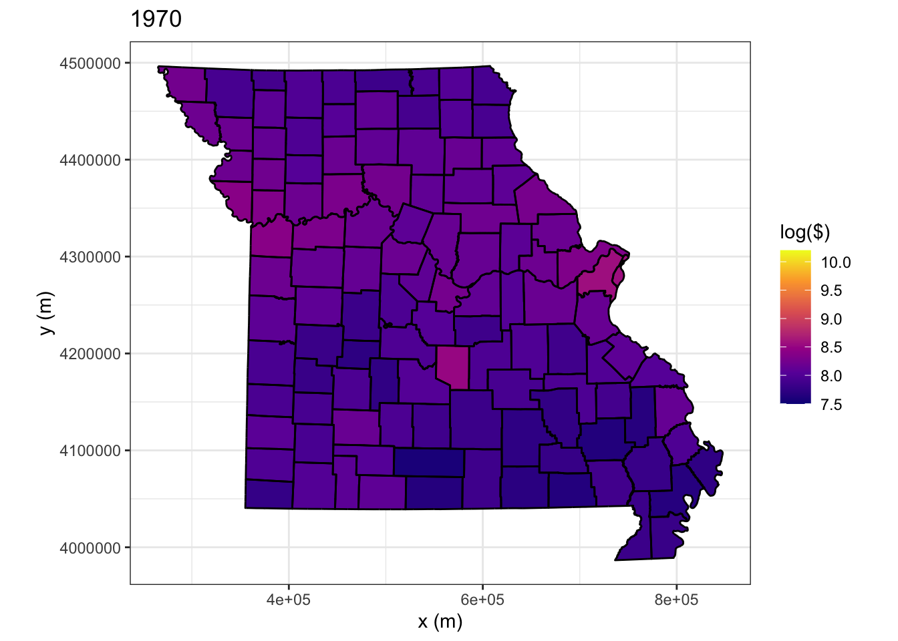

# Day 2


```r
library(tidyverse)
library(here)
library(sp)
library(spatstat)
```

## Spatial Data

All data occur at some location is space and time. For know we focus on spatial analyses and will later extend this to spatio-temporal analyses. Let $\mathcal{D}$ represent the spatial domain and let $\mathbf{s}$ be a spatial location. In general, we will let $\mathcal{A} \subset \mathcal{D}$ be a subdomain of the spatial region of $\mathbf{D}$. 


```r
knitr::include_graphics(here::here("images", "spatial-domain.jpg"))
```


## Types of spatial data

There are three primary types of spatial data that we are going to consider

### Geostatistical data
* Occur everywhere
* continuous support
* examples: temperature, precipitation


```r
data("NOAA_df_1990", package = "STRbook")
glimpse(NOAA_df_1990)
```

```
## Rows: 730,486
## Columns: 10
## $ julian <int> 726834, 726835, 726836, 726837, 726838, 726839, 726840, 726841,…
## $ year   <int> 1990, 1990, 1990, 1990, 1990, 1990, 1990, 1990, 1990, 1990, 199…
## $ month  <int> 1, 1, 1, 1, 1, 1, 1, 1, 1, 1, 1, 1, 1, 1, 1, 1, 1, 1, 1, 1, 1, …
## $ day    <int> 1, 2, 3, 4, 5, 6, 7, 8, 9, 10, 11, 12, 13, 14, 15, 16, 17, 18, …
## $ id     <dbl> 3804, 3804, 3804, 3804, 3804, 3804, 3804, 3804, 3804, 3804, 380…
## $ z      <dbl> 35, 42, 49, 59, 41, 45, 46, 42, 54, 43, 52, 38, 32, 43, 53, 55,…
## $ proc   <chr> "Tmax", "Tmax", "Tmax", "Tmax", "Tmax", "Tmax", "Tmax", "Tmax",…
## $ lat    <dbl> 39.35, 39.35, 39.35, 39.35, 39.35, 39.35, 39.35, 39.35, 39.35, …
## $ lon    <dbl> -81.43333, -81.43333, -81.43333, -81.43333, -81.43333, -81.4333…
## $ date   <date> 1990-01-01, 1990-01-02, 1990-01-03, 1990-01-04, 1990-01-05, 19…
```


```r
## Only plot the states with data
states <- map_data("state") 
states <- states %>%
    subset(!(region %in% c(
        "washington", "oregon", "california", "nevada", "idaho", "utah", 
        "arizona","montana", "wyoming", "colorado", "new mexico"))) 

## generate map
NOAA_df_1990 %>%
    subset(year == 1990 & day == 1 & proc == "Tmax") %>%   
    ggplot(aes(x = lon, y = lat, color = z)) +
    geom_point() + 
    facet_wrap(~ month, scales = "free", nrow = 4) +
    geom_polygon(data = states, aes(x = long, y = lat, group = group), 
                 inherit.aes = FALSE, fill = NA, color = "black") +
    scale_color_viridis_c(option = "inferno") +
    ggtitle("Tmax for the first day of each month in 1990")
```


### Areal data
* Occur only over discrete areas
* can be thought of as an integral of a continuous process over a subdomain $\mathcal{A} \in \mathcal{D}$
* examples: cases of a disease by counties, votes in an election by congressional district


```r
data("BEA", package = "STRbook")
glimpse(BEA)
```

```
## Rows: 116
## Columns: 5
## $ Description <chr> "Per capita personal income (dollars)", "Per capita person…
## $ NAME10      <fct> "Adair, MO", "Andrew, MO", "Atchison, MO", "Audrain, MO", …
## $ X1970       <int> 2723, 3577, 3770, 3678, 3021, 2832, 3263, 2508, 2147, 3490…
## $ X1980       <int> 7399, 7937, 5743, 8356, 7210, 7445, 8596, 6125, 5431, 9238…
## $ X1990       <int> 12755, 15059, 14748, 15198, 12873, 13530, 13195, 11854, 11…
```

```r
data("MOcounties", package = "STRbook")
glimpse(MOcounties)
```

```
## Rows: 214,279
## Columns: 53
## $ long       <dbl> 627911.9, 627921.4, 627923.0, 627947.8, 627956.5, 627994.8,…
## $ lat        <dbl> 4473554, 4473559, 4473560, 4473577, 4473583, 4473612, 44737…
## $ order      <int> 1, 2, 3, 4, 5, 6, 7, 8, 9, 10, 11, 12, 13, 14, 15, 16, 17, …
## $ hole       <lgl> FALSE, FALSE, FALSE, FALSE, FALSE, FALSE, FALSE, FALSE, FAL…
## $ piece      <fct> 1, 1, 1, 1, 1, 1, 1, 1, 1, 1, 1, 1, 1, 1, 1, 1, 1, 1, 1, 1,…
## $ id         <chr> "0", "0", "0", "0", "0", "0", "0", "0", "0", "0", "0", "0",…
## $ group      <fct> 0.1, 0.1, 0.1, 0.1, 0.1, 0.1, 0.1, 0.1, 0.1, 0.1, 0.1, 0.1,…
## $ STATEFP10  <fct> 29, 29, 29, 29, 29, 29, 29, 29, 29, 29, 29, 29, 29, 29, 29,…
## $ COUNTYFP10 <fct> 045, 045, 045, 045, 045, 045, 045, 045, 045, 045, 045, 045,…
## $ COUNTYNS10 <fct> 00758477, 00758477, 00758477, 00758477, 00758477, 00758477,…
## $ GEOID10    <fct> 29045, 29045, 29045, 29045, 29045, 29045, 29045, 29045, 290…
## $ NAME10     <fct> "Clark, MO", "Clark, MO", "Clark, MO", "Clark, MO", "Clark,…
## $ NAMELSAD10 <fct> Clark County, Clark County, Clark County, Clark County, Cla…
## $ LSAD10     <fct> 06, 06, 06, 06, 06, 06, 06, 06, 06, 06, 06, 06, 06, 06, 06,…
## $ CLASSFP10  <fct> H1, H1, H1, H1, H1, H1, H1, H1, H1, H1, H1, H1, H1, H1, H1,…
## $ MTFCC10    <fct> G4020, G4020, G4020, G4020, G4020, G4020, G4020, G4020, G40…
## $ CSAFP10    <fct> NA, NA, NA, NA, NA, NA, NA, NA, NA, NA, NA, NA, NA, NA, NA,…
## $ CBSAFP10   <fct> 22800, 22800, 22800, 22800, 22800, 22800, 22800, 22800, 228…
## $ METDIVFP10 <fct> NA, NA, NA, NA, NA, NA, NA, NA, NA, NA, NA, NA, NA, NA, NA,…
## $ FUNCSTAT10 <fct> A, A, A, A, A, A, A, A, A, A, A, A, A, A, A, A, A, A, A, A,…
## $ ALAND10    <dbl> 1307146971, 1307146971, 1307146971, 1307146971, 1307146971,…
## $ AWATER10   <dbl> 18473547, 18473547, 18473547, 18473547, 18473547, 18473547,…
## $ INTPTLAT10 <fct> +40.4072748, +40.4072748, +40.4072748, +40.4072748, +40.407…
## $ INTPTLON10 <fct> -091.7294720, -091.7294720, -091.7294720, -091.7294720, -09…
## $ AREA       <dbl> 1324937990, 1324937990, 1324937990, 1324937990, 1324937990,…
## $ PERIMETER  <dbl> 161503.6, 161503.6, 161503.6, 161503.6, 161503.6, 161503.6,…
## $ COUNTY10_  <int> 2, 2, 2, 2, 2, 2, 2, 2, 2, 2, 2, 2, 2, 2, 2, 2, 2, 2, 2, 2,…
## $ COUNTY10_I <int> 115, 115, 115, 115, 115, 115, 115, 115, 115, 115, 115, 115,…
## $ POP90      <int> 7547, 7547, 7547, 7547, 7547, 7547, 7547, 7547, 7547, 7547,…
## $ WHITE90    <int> 7528, 7528, 7528, 7528, 7528, 7528, 7528, 7528, 7528, 7528,…
## $ BLACK90    <int> 3, 3, 3, 3, 3, 3, 3, 3, 3, 3, 3, 3, 3, 3, 3, 3, 3, 3, 3, 3,…
## $ ASIANPI90  <int> 4, 4, 4, 4, 4, 4, 4, 4, 4, 4, 4, 4, 4, 4, 4, 4, 4, 4, 4, 4,…
## $ AMIND90    <int> 7, 7, 7, 7, 7, 7, 7, 7, 7, 7, 7, 7, 7, 7, 7, 7, 7, 7, 7, 7,…
## $ OTHER90    <int> 5, 5, 5, 5, 5, 5, 5, 5, 5, 5, 5, 5, 5, 5, 5, 5, 5, 5, 5, 5,…
## $ HISP90     <int> 26, 26, 26, 26, 26, 26, 26, 26, 26, 26, 26, 26, 26, 26, 26,…
## $ POP00      <int> 7416, 7416, 7416, 7416, 7416, 7416, 7416, 7416, 7416, 7416,…
## $ WHITE00    <int> 7329, 7329, 7329, 7329, 7329, 7329, 7329, 7329, 7329, 7329,…
## $ BLACK00    <int> 5, 5, 5, 5, 5, 5, 5, 5, 5, 5, 5, 5, 5, 5, 5, 5, 5, 5, 5, 5,…
## $ ASIAN00    <int> 5, 5, 5, 5, 5, 5, 5, 5, 5, 5, 5, 5, 5, 5, 5, 5, 5, 5, 5, 5,…
## $ AMIND00    <int> 15, 15, 15, 15, 15, 15, 15, 15, 15, 15, 15, 15, 15, 15, 15,…
## $ HAWNPI00   <int> 1, 1, 1, 1, 1, 1, 1, 1, 1, 1, 1, 1, 1, 1, 1, 1, 1, 1, 1, 1,…
## $ OTHER00    <int> 16, 16, 16, 16, 16, 16, 16, 16, 16, 16, 16, 16, 16, 16, 16,…
## $ MULTRA00   <int> 45, 45, 45, 45, 45, 45, 45, 45, 45, 45, 45, 45, 45, 45, 45,…
## $ HISP00     <int> 52, 52, 52, 52, 52, 52, 52, 52, 52, 52, 52, 52, 52, 52, 52,…
## $ POP10      <int> 7139, 7139, 7139, 7139, 7139, 7139, 7139, 7139, 7139, 7139,…
## $ WHITE10    <int> 7011, 7011, 7011, 7011, 7011, 7011, 7011, 7011, 7011, 7011,…
## $ BLACK10    <int> 19, 19, 19, 19, 19, 19, 19, 19, 19, 19, 19, 19, 19, 19, 19,…
## $ ASIAN10    <int> 23, 23, 23, 23, 23, 23, 23, 23, 23, 23, 23, 23, 23, 23, 23,…
## $ AMIND10    <int> 9, 9, 9, 9, 9, 9, 9, 9, 9, 9, 9, 9, 9, 9, 9, 9, 9, 9, 9, 9,…
## $ HAWNPI10   <int> 0, 0, 0, 0, 0, 0, 0, 0, 0, 0, 0, 0, 0, 0, 0, 0, 0, 0, 0, 0,…
## $ OTHER10    <int> 5, 5, 5, 5, 5, 5, 5, 5, 5, 5, 5, 5, 5, 5, 5, 5, 5, 5, 5, 5,…
## $ MULTRA10   <int> 72, 72, 72, 72, 72, 72, 72, 72, 72, 72, 72, 72, 72, 72, 72,…
## $ HISP10     <int> 42, 42, 42, 42, 42, 42, 42, 42, 42, 42, 42, 42, 42, 42, 42,…
```

```r
MOcounties <- left_join(MOcounties, BEA, by = "NAME10")
```


```r
ggplot(MOcounties) +
    geom_polygon(aes(x = long,
                     y = lat, # county boundary
                     group = NAME10, # county group
                     fill = log(X1970))) + # log of income
    geom_path(aes(x = long, y = lat, group = NAME10)) +
    scale_fill_viridis_c(limits = c(7.5, 10.2), option = "plasma", name = "log($)") +
    coord_fixed() + 
    ggtitle("1970") +
    xlab("x (m)") +
    ylab("y (m)") +
    theme_bw()
```



### Point process data
* The count and location of the data are random
* examples: tornados, lightning strikes


```r
# uncomment out this line to download the data
# load(url("http://github.com/mgimond/Spatial/raw/master/Data/ppa.RData"))
# save(starbucks, ma, pop, file = here::here("data", "ppa-starbucks.RData"))
load(here::here("data", "ppa-starbucks.RData"))
glimpse(starbucks)
```

```
## List of 5
##  $ window    :List of 4
##   ..$ type  : chr "rectangle"
##   ..$ xrange: num [1:2] 648032 917741
##   ..$ yrange: num [1:2] 4609785 4748107
##   ..$ units :List of 3
##   .. ..$ singular  : chr "unit"
##   .. ..$ plural    : chr "units"
##   .. ..$ multiplier: num 1
##   .. ..- attr(*, "class")= chr "unitname"
##   ..- attr(*, "class")= chr "owin"
##  $ n         : int 171
##  $ x         : num [1:171] 917741 911147 902987 876188 875868 ...
##  $ y         : num [1:171] 4637151 4628510 4628982 4616741 4616719 ...
##  $ markformat: chr "none"
##  - attr(*, "class")= chr "ppp"
```


```r
## uses spatstat library
## add the massachusetts polygon
Window(starbucks) <- ma
marks(starbucks) <- NULL
## plot using the plot function from spatstat
plot(starbucks)
```


