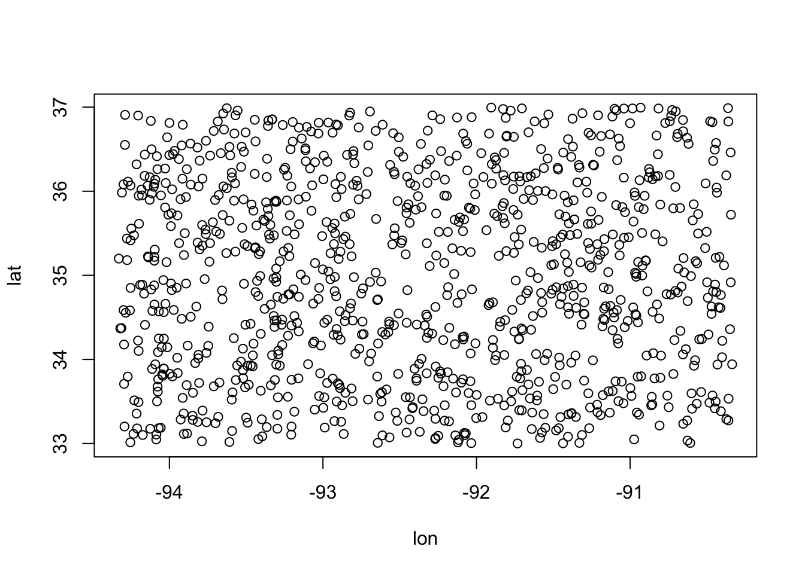
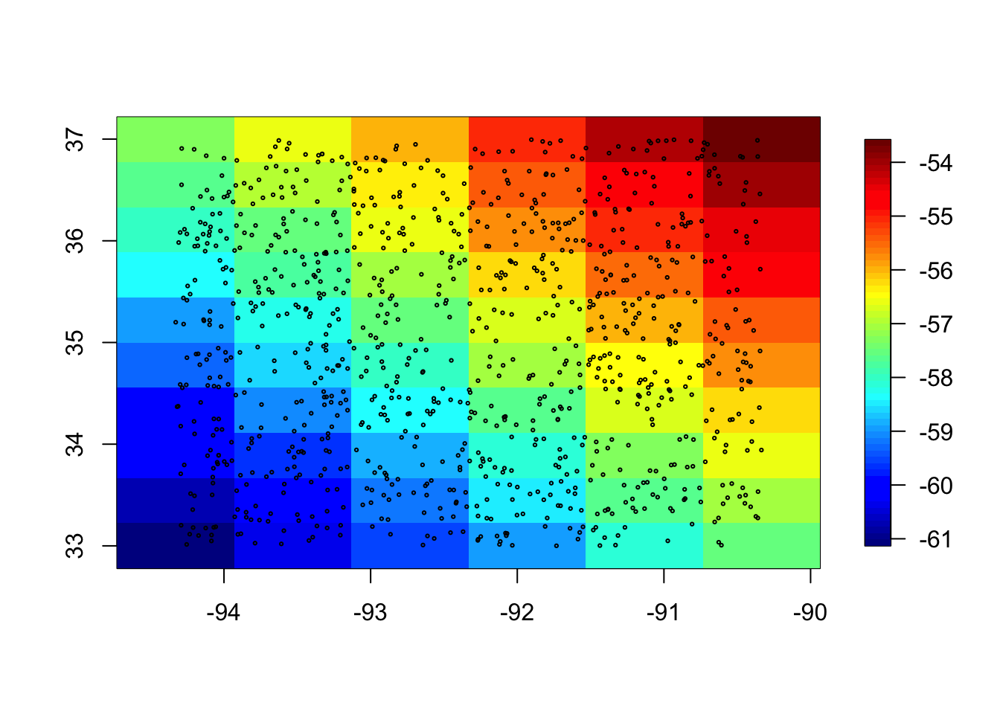
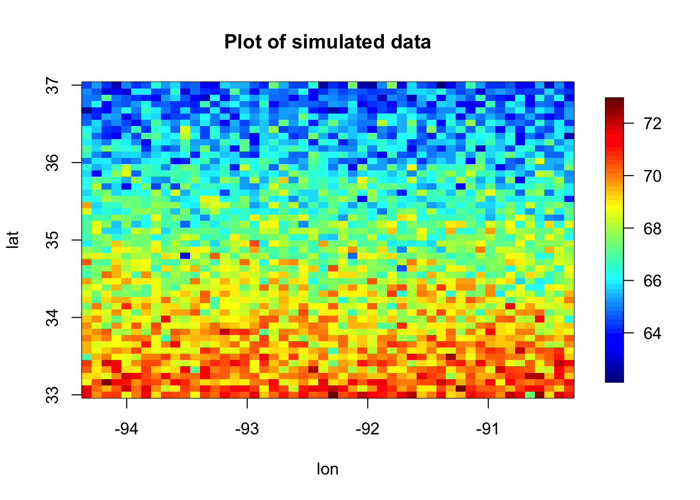
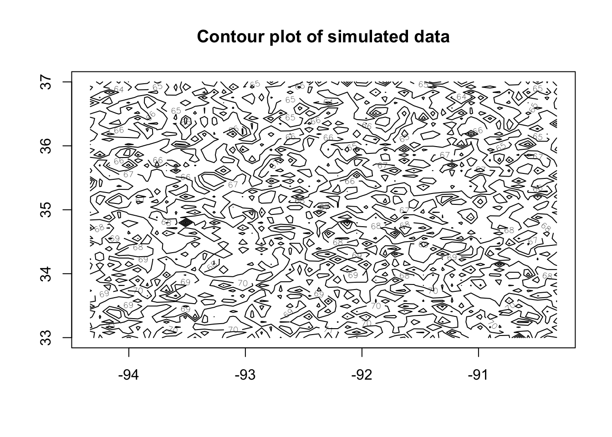
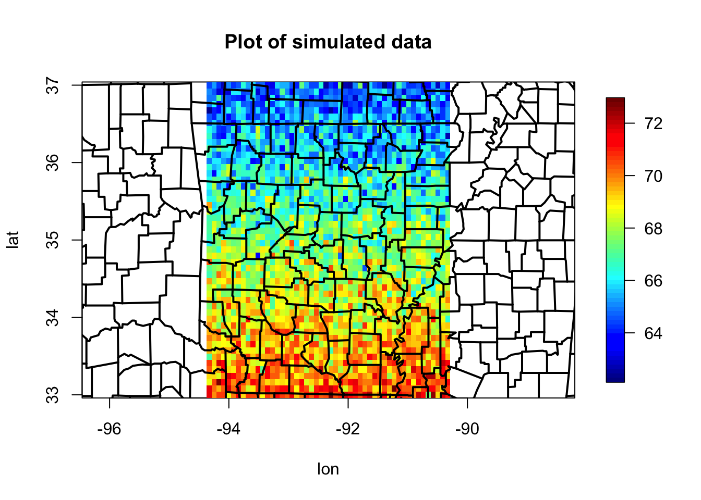

# Day 3


```r
library(tidyverse)
library(here)
library(sp)
```

## Anouncements

* Course audits

* Show gitHub page for site [https://github.com/jtipton25/STAT-5413](https://github.com/jtipton25/STAT-5413)

    * Show how to download files and data

* Example Gerrymandering

[https://uglygerry.com/](https://uglygerry.com/)


```r
library(showtext)
```

```
## Loading required package: sysfonts
```

```
## Loading required package: showtextdb
```

```r
font_add("myfont", here::here("fonts", "Gerry.otf"))
showtext_auto()

plot(cars, family = "myfont")
title(
    main = "This Font is made of \n Gerrymandered Political Districts", 
    family = "myfont", cex.main = 1.5)
```


## Files for spatial data

* Many different file types for spatial data

* Typically data are in "flat files" like comma-seperated value (CSV) files 


```r
read.csv(here("path", "to", "file.csv"))
```

* "shapefiles" which can be read using _rgdal_ or _maptools_ packages


```r
library(rgdal)
library(maptools)
```

* "NetCDF" files cane be read using _ncdf4_ or _RNetCDF_


```r
library(ncdf4)
library(RNetCDF)
```


## Textbook package

To install the data from the textbook, go to [https://spacetimewithr.org/](https://spacetimewithr.org/) and follow the link to the code.


```r
# install.packages("devtools")
library(devtools)
install_github("andrewzm/STRbook")
```

Note that this package is relatively large because it contains a decent amount of spatial data. 


```r
library(STRbook)
```


## Spatial Visualization

### Spatial visualization using _fields_

* Simulate a process with some random locations


```r
library(fields)
```

```
## Loading required package: spam
```

```
## Loading required package: dotCall64
```

```
## Loading required package: grid
```

```
## Spam version 2.7-0 (2021-06-25) is loaded.
## Type 'help( Spam)' or 'demo( spam)' for a short introduction 
## and overview of this package.
## Help for individual functions is also obtained by adding the
## suffix '.spam' to the function name, e.g. 'help( chol.spam)'.
```

```
## 
## Attaching package: 'spam'
```

```
## The following objects are masked from 'package:base':
## 
##     backsolve, forwardsolve
```

```
## Loading required package: viridis
```

```
## Loading required package: viridisLite
```

```
## 
## Try help(fields) to get started.
```

```r
## longitude and latitude of approximately the center of Arkansas
lon_lat_center <- c(-92.33, 35.00) 

n   <- 1000
## simulate some random locations
lon  <- runif(n, lon_lat_center[1] - 2, lon_lat_center[1] + 2)
lat  <- runif(n, lon_lat_center[2] - 2, lon_lat_center[2] + 2)
y   <- rnorm(n, lat + lon, 0.1)

plot(lon, lat)
```




```r
quilt.plot(lon, lat, y, nx = 30, ny = 30)
points(lon, lat, cex = .3)
```


```r
quilt.plot(lon, lat, y, nx = 6, ny = 10)
points(lon, lat, cex = .3)
```



* Simulate a process on a regular grid


```r
n <- 50^2
## simulate locations on a grid
lon  <- seq(lon_lat_center[1] - 2, lon_lat_center[1] + 2, length = sqrt(n))
lat  <- seq(lon_lat_center[2] - 2, lon_lat_center[2] + 2, length = sqrt(n))
s <- expand.grid(lon, lat)

head(lon)
```

```
## [1] -94.33000 -94.24837 -94.16673 -94.08510 -94.00347 -93.92184
```

```r
head(lat)
```

```
## [1] 33.00000 33.08163 33.16327 33.24490 33.32653 33.40816
```

```r
head(s)
```

```
##        Var1 Var2
## 1 -94.33000   33
## 2 -94.24837   33
## 3 -94.16673   33
## 4 -94.08510   33
## 5 -94.00347   33
## 6 -93.92184   33
```

```r
plot(s, cex = 0.3)
```


```r
## simulate some fake data with a north/south trend
y <- 120 - 1.5 * s[, 2] + matrix(rnorm(n), sqrt(n), sqrt(n))
image.plot(lon, lat, y, main = "Plot of simulated data")
```




```r
contour(lon, lat, y, main = "Contour plot of simulated data")
```




```r
image.plot(lon, lat, y, main = "Plot of simulated data")
contour(lon, lat, y, main = "Contour plot of simulated data", add = TRUE,
        nlevels = 10)
```


```r
## adding in maps
library(maps)
```

```
## 
## Attaching package: 'maps'
```

```
## The following object is masked from 'package:viridis':
## 
##     unemp
```

```
## The following object is masked from 'package:purrr':
## 
##     map
```

```r
maps::map("world")
```


```r
maps::map("state")
```


```r
maps::map("county")
```


```r
maps::map("county", "Arkansas")
points(s, cex = 0.3)
```


```r
state <- map.where("state", x = s[, 1], y = s[, 2])
head(state)
```

```
## [1] "texas"     "texas"     "texas"     "texas"     "louisiana" "louisiana"
```

```r
table(state)
```

```
## state
##    arkansas   louisiana mississippi    missouri       texas 
##        1903          34         180         351          32
```

```r
## subset only points in arkansas
dat <- data.frame(
    lon   = s[, 1],
    lat   = s[, 2],
    state = state
)

maps::map("county", "Arkansas")
dat %>%
    subset(state == "arkansas") %>%
    points(cex = 0.3)
```


```r
# points(subset(dat, state == "arkansas"), cex = 0.3)
```

Plot the simulated data with the county boundaries


```r
image.plot(lon, lat, y, main = "Plot of simulated data")
maps::map("county", add = TRUE, lwd = 2)
```


```r
## change the aspect ratio
image.plot(lon, lat, y, main = "Plot of simulated data", asp = 1.3)
maps::map("county", add = TRUE, lwd = 2)
```



