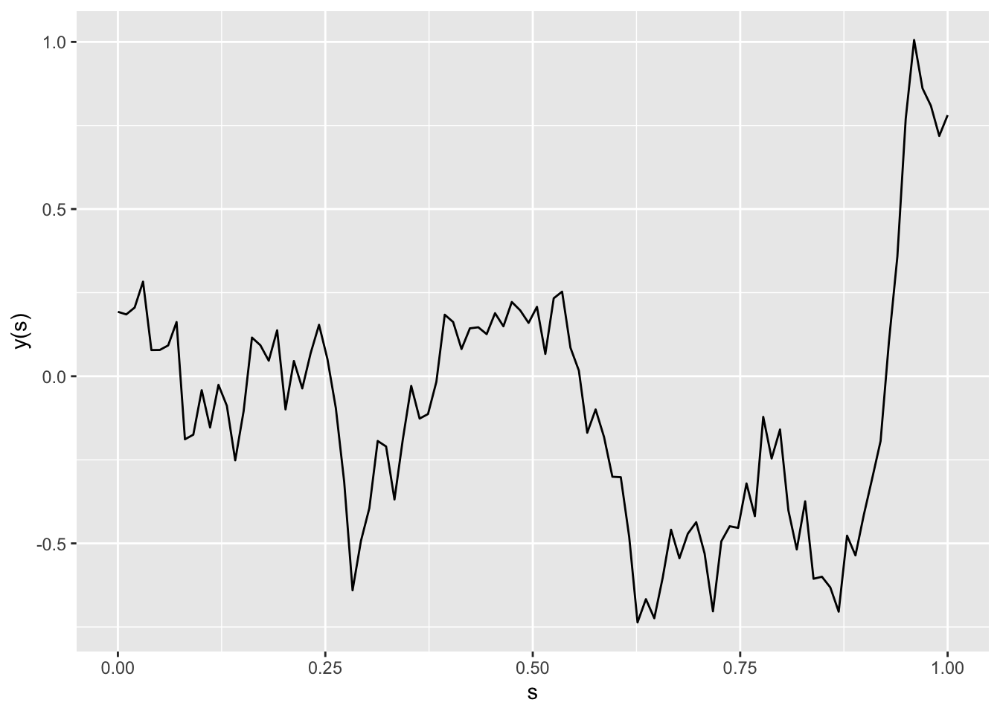
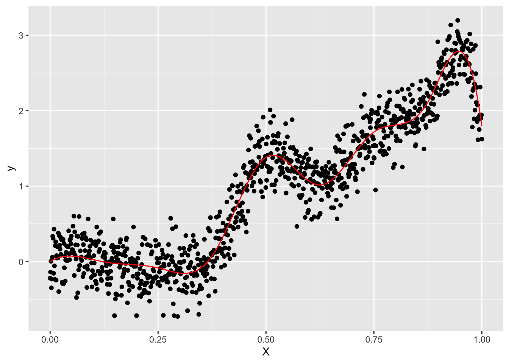
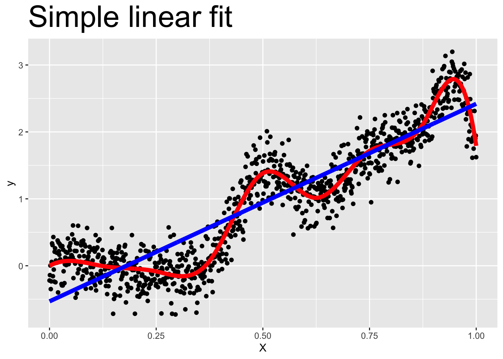
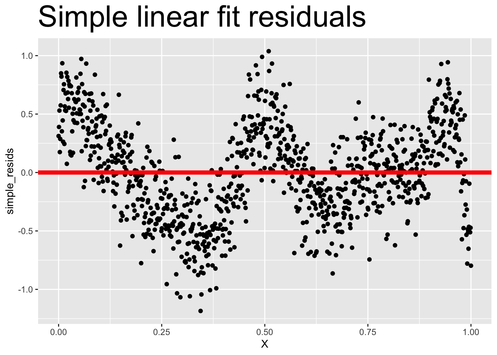
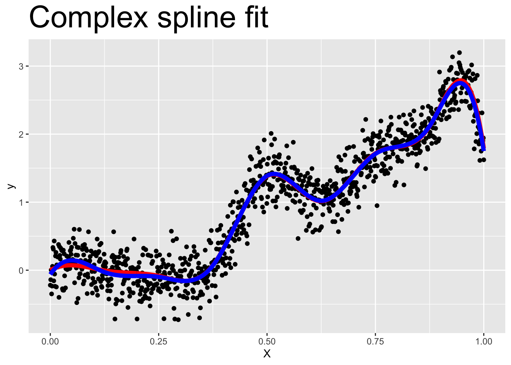
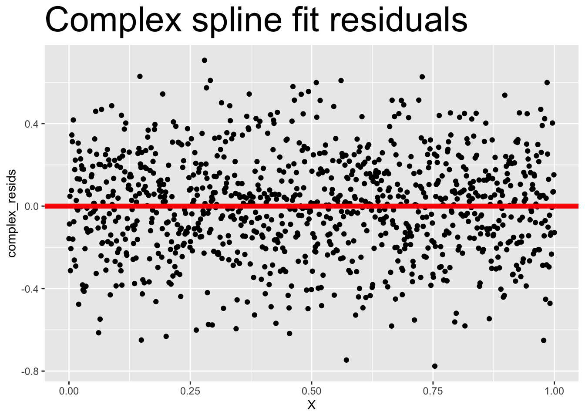

# Day 5

## Announcements 
* HW Assignment
* Another datacamp coming soon


```r
library(tidyverse)
library(fields)
library(mvnfast)
library(plotly)
library(splines)
set.seed(404)
```
## Spatial means and covariances

Let $\{ y(\mathbf{s}_i) \}$ be a set of observations of a process at locations $\{ \mathbf{s}_i \in \mathcal{D}, i = 1, \ldots, n \}$. 

* In one dimension, $y(\mathbf{s})$ is a curve


```r
n <- 100
s <- seq(0, 1, length = n)
## calculate the pairwise distance between locations
## rdist from the fields package is much faster than the dist function
D <- rdist(s, s)
Sigma <- exp( - D)
dat <- data.frame(
    s = s,
    y = c(rmvn(1, mu = rep(0, n), sigma = Sigma))
)

dat %>%
    ggplot(aes(x = s, y = y)) +
    geom_line() +
    ylab("y(s)")
```




* In two dimensions, $y(\mathbf{s})$ is a surface


```r
n <- 20^2
s <- expand.grid(
    seq(0, 1, length = sqrt(n)),
    seq(0, 1, length = sqrt(n))
)
    
## calculate the pairwise distance between locations
## rdist from the fields package is much faster than the dist function
D <- rdist(s, s)
Sigma <- exp( - D)
dat <- data.frame(
    s1 = s[, 1],
    s2 = s[, 2],
    y  = c(rmvn(1, mu = rep(0, n), sigma = Sigma))
)


plot_ly(
    z = ~matrix(dat$y, sqrt(n), sqrt(n))
) %>%
    add_surface()
```

```{=html}
<div id="htmlwidget-173926ea27c1db6c89e8" style="width:672px;height:480px;" class="plotly html-widget"></div>
<script type="application/json" data-for="htmlwidget-173926ea27c1db6c89e8">{"x":{"visdat":{"30a410b28762":["function () ","plotlyVisDat"]},"cur_data":"30a410b28762","attrs":{"30a410b28762":{"z":{},"alpha_stroke":1,"sizes":[10,100],"spans":[1,20],"type":"surface","inherit":true}},"layout":{"margin":{"b":40,"l":60,"t":25,"r":10},"scene":{"zaxis":{"title":"matrix(dat$y, sqrt(n), sqrt(n))"}},"hovermode":"closest","showlegend":false,"legend":{"yanchor":"top","y":0.5}},"source":"A","config":{"modeBarButtonsToAdd":["hoverclosest","hovercompare"],"showSendToCloud":false},"data":[{"colorbar":{"title":"matrix(dat$y, sqrt(n), sqrt(n))","ticklen":2,"len":0.5,"lenmode":"fraction","y":1,"yanchor":"top"},"colorscale":[["0","rgba(68,1,84,1)"],["0.0416666666666666","rgba(70,19,97,1)"],["0.0833333333333333","rgba(72,32,111,1)"],["0.125","rgba(71,45,122,1)"],["0.166666666666667","rgba(68,58,128,1)"],["0.208333333333333","rgba(64,70,135,1)"],["0.25","rgba(60,82,138,1)"],["0.291666666666667","rgba(56,93,140,1)"],["0.333333333333333","rgba(49,104,142,1)"],["0.375","rgba(46,114,142,1)"],["0.416666666666667","rgba(42,123,142,1)"],["0.458333333333333","rgba(38,133,141,1)"],["0.5","rgba(37,144,140,1)"],["0.541666666666667","rgba(33,154,138,1)"],["0.583333333333333","rgba(39,164,133,1)"],["0.625","rgba(47,174,127,1)"],["0.666666666666667","rgba(53,183,121,1)"],["0.708333333333333","rgba(79,191,110,1)"],["0.75","rgba(98,199,98,1)"],["0.791666666666667","rgba(119,207,85,1)"],["0.833333333333333","rgba(147,214,70,1)"],["0.875","rgba(172,220,52,1)"],["0.916666666666667","rgba(199,225,42,1)"],["0.958333333333333","rgba(226,228,40,1)"],["1","rgba(253,231,37,1)"]],"showscale":true,"z":[[0.501416864425549,0.435895701528687,0.628313783883863,0.601419906989639,0.527125611387579,0.112301284546732,0.039417800703418,-0.141329188503773,0.144822963182121,0.0991911967806825,-0.0327578176913367,-0.359899360115763,-0.0408256360960392,-0.667323758250688,-0.734767494516802,-0.38023074927526,-0.956544347469717,-0.855788524202129,-1.18955711755161,-0.988557415617179],[0.133778899740329,0.194377309144107,0.50845186448173,0.468950123280319,0.762434611776852,0.616473002882306,-0.166314207146979,0.149223369209974,0.26819300385184,0.0315000667577179,-0.0533484237772506,-0.190393826973107,-0.146638835756673,-0.795102181579004,-0.886669033769316,-1.18143537603294,-1.26815939744817,-1.10661959451609,-1.48579734975524,-1.31857874205859],[-0.202377154430921,-0.192675900911297,0.234612562697065,0.457710478567229,0.0625218103850959,0.440663425848814,0.2351468058189,0.183555515939713,0.0908309117312485,0.087924039844749,0.186087729174762,-0.0250075867171204,-0.217924214818886,-0.457269247535323,-0.649606552605636,-0.969894210537576,-1.09306384540197,-1.14195141749346,-1.11757176732988,-1.05679133535213],[-0.471002907403495,-0.691349967145552,-0.697097530718834,0.112514848821716,0.139482757765891,0.0554543145384681,-0.198868264113203,0.125388220614828,-0.393835761775508,-0.197882386293528,0.56136915354297,-0.112508626381851,-0.401641075501706,-0.517938520880625,-0.823940013294395,-1.12091451932549,-1.02713165667056,-0.826631182888008,-0.841910409674551,-1.54984932323357],[-0.763950706984163,-1.225820774775,-0.545750659141781,-0.0917669725384061,-0.0616656332558033,-0.541487481939438,-0.608113424737945,-0.0121532576720792,-0.379937387284535,-0.275117152289933,-0.156529763438442,-0.117377148425861,-0.367759655341907,-0.536254020195993,-0.379290338951281,-0.796057672955571,-0.822011943188999,-0.887741785568159,-0.657027417097065,-1.01763167370177],[-0.798115217186631,-0.143439712771957,-0.29419664568677,-0.5451227199258,-0.206681144490966,-0.686096958449856,-0.824834853392164,-0.818662210568302,-0.124494975613672,-0.890726570737812,-0.392063170646233,-0.264246486881924,-0.183924981912505,-0.501442892468276,-0.36720010850879,-0.355649030362111,-0.698058826414791,-0.934897260395495,-0.412273103910154,-0.211500149134742],[-0.501144827299452,-0.143551781401895,-0.177619118282617,-0.18688030921036,-0.259239990744858,-0.397856795537658,-0.400937245108777,-0.445657772040838,-0.181109953998177,-0.124526862564246,0.392666709934574,0.138564688125225,-0.10917735001052,-0.318463690490847,-0.368845333097744,-0.411354194748746,-0.605001484861918,-0.69276493365337,-0.59584829844197,-0.0303647377233954],[-0.632208960609581,-0.338493379673158,-0.111209179110824,-0.325964764541674,0.036399917976128,-0.504947202680517,-0.369206887877921,-0.376604729687358,-0.446566844277536,-0.351276226856326,0.0273044333679633,0.0198330786642088,-0.100470137764912,-0.205878299055047,-0.681066904160175,-0.641472475602351,-0.689936117354138,-1.00168355689688,-0.509118072164439,-0.291312059782999],[-0.960295111051469,-0.896999687316198,-0.756044427374535,-0.443501213283358,-0.579799679718357,-0.511577978672976,-0.64788009737273,-0.330775190075048,-0.36317568496346,-0.416107582815025,-0.370302451960135,-0.150888361166695,-0.141344921229453,-0.721816588992522,-0.31568877700652,-0.672449450941603,-1.37604445689561,-1.29722104268379,-0.648862131841714,-0.437896752790101],[-1.32853456827554,-1.03134776389011,-1.0511653246759,-0.800684131473944,-1.10592701377484,-0.632889322113568,-0.39065753274837,0.27527474271868,-0.13200343090194,-0.512618815794071,-0.557044820376544,-0.600283009764221,-0.66972066981869,-0.882781786132015,-0.562397377026324,-0.502232635062436,-1.07526718687346,-1.00949350230526,-1.03923542220946,-0.527572930514143],[-1.02824968846789,-1.21211941860079,-1.19477753816763,-0.777501602713316,-0.817118240190677,-1.16048353544469,-0.789509424911956,-0.521086134680191,-0.500510017753917,-0.484611841944348,-0.445948921762347,-0.773212058114292,-0.586645127199826,-0.56248306774685,-0.771815371188743,-0.888539846641985,-1.01594082678709,-1.17387828107104,-1.26659529611474,-0.493458322378082],[-0.668950991190453,-1.28062702165923,-1.19348268378045,-0.883738953778243,-1.47345431142706,-1.29789615566947,-1.04617601099074,-0.811113656873868,-0.551907299935902,0.0322352967349472,-0.482470337352642,-0.179288748874893,-0.800900309839165,-0.990176300299336,-0.708295340567447,-0.922964831631871,-0.963647317334981,-1.02058078353483,-0.889074830071325,-0.612410760903464],[-1.04875228974718,-1.22163243345006,-1.19228900219844,-1.02546075751929,-1.53593753221428,-1.30630195552372,-1.33443105881042,-0.84527582261496,-0.64739286146674,-0.657562283889777,-0.311207200449213,-1.14560367473706,-1.08844287540445,-0.594597278070922,-1.01264148438755,-1.20180173737559,-1.17095063523868,-0.854325386810569,-0.637094473704528,-0.367097395181139],[-1.16118107448635,-1.43029743729191,-1.39859524981185,-1.58455303629277,-1.72544972140308,-1.06716199955959,-1.04015455732811,-0.904607940201564,-0.578646188309272,-0.433334349585216,-0.445169055347543,-1.07402710472363,-0.913381815905734,-1.2876175194082,-1.32307177467789,-1.57155676517315,-1.62274354401458,-0.66402651127585,-0.574724476510892,-0.84540405045229],[-0.821393372344755,-1.59703105189842,-1.91364637393687,-1.90720496755768,-1.84137158222431,-1.34448750489331,-1.23801719175094,-1.04915078325098,-0.777364839194894,-0.546475125996129,-0.318260039084485,-1.13500663037329,-1.27021907222466,-0.875548762955598,-0.766679350816849,-1.08778581702045,-0.988748806906829,-0.514966304348566,-0.804384069364706,-1.04578239022411],[-1.18679344863807,-1.42296541615496,-1.94588121803795,-2.12258776771557,-1.57160160397042,-1.51095900917988,-1.1533752005967,-1.59113030125909,-0.978637585181172,-0.272756938036946,-0.638213237689997,-0.967868498459082,-1.53116904164358,-1.54664728262367,-1.61140859581918,-1.30330199374122,-0.804270680942264,-0.575515866730707,-0.403735417038006,-0.87900890893699],[-1.27927438632742,-1.46501725061535,-1.69090334919374,-1.71303198822079,-1.32546330292344,-1.44247285690441,-1.30128175493722,-1.63203929610837,-1.06270083810043,-0.259187718365259,-0.762416888851237,-1.42682220170486,-1.38104865747077,-1.48109778833101,-1.56985773473167,-1.513167168223,-1.33109345060025,-0.951184320369449,-0.720484956966187,-0.918482971506078],[-0.921397847503572,-1.23435916825674,-1.12527262049609,-1.07823449844753,-1.17253179039788,-1.24514543874772,-1.39962875113254,-1.38136673664197,-1.66858895017743,-0.759242459417587,-0.807262768908263,-1.41495110231754,-1.32255950495988,-1.46508361344791,-1.24742401134537,-0.93550401159575,-1.32232841506921,-1.20471924153544,-0.987958925887488,-1.18211288041871],[-0.991143633524427,-0.30298895681385,-0.63308722388831,-0.922043368186724,-1.04227012820007,-1.02796989194588,-1.62741424818935,-1.69208435953628,-1.32596122557025,-1.22851009804541,-1.15488751593009,-1.076349483084,-1.54518636449072,-1.1780789438744,-1.13519038758067,-1.03877887696317,-1.07704468547697,-0.839962496660709,-1.06330411232881,-1.2400140693856],[-0.987711248523153,-0.865583576403865,-0.547850109228496,-1.10813251236337,-1.00383211770861,-0.987109562801653,-1.65686895584211,-1.66565673634244,-1.53867289629176,-1.04130115317857,-1.24488592900142,-1.1754612493966,-1.09212221975952,-1.23521862046824,-1.15046177421778,-1.28755337574019,-1.22544016641019,-1.30021296372613,-1.22227821815701,-0.930559695187954]],"type":"surface","frame":null}],"highlight":{"on":"plotly_click","persistent":false,"dynamic":false,"selectize":false,"opacityDim":0.2,"selected":{"opacity":1},"debounce":0},"shinyEvents":["plotly_hover","plotly_click","plotly_selected","plotly_relayout","plotly_brushed","plotly_brushing","plotly_clickannotation","plotly_doubleclick","plotly_deselect","plotly_afterplot","plotly_sunburstclick"],"base_url":"https://plot.ly"},"evals":[],"jsHooks":[]}</script>
```

### Gaussian processes
 
* A [Gaussian process](https://en.wikipedia.org/wiki/Gaussian_process) is an infinite-dimensional function (the function is defined for inginitely many locations $\mathbf{s} \in \mathcal{D}$) with the property that the finite-dimensional vector $\mathbf{y}(\mathbf{s}) = (y(\mathbf{s}_1), \ldots, y(\mathbf{s}_n) )'$ at any finite subset of locations $\mathbf{s}_1, \ldots, \mathbf{s}_n \in \mathcal{D}$ has a multivariate Gaussian distribution. (A good book is available free online here: [http://www.gaussianprocess.org/gpml/](http://www.gaussianprocess.org/gpml/))

#### Mean and covariance

* A univariate normal distribution is fully characterized by a mean $\mu$ and a variance $\sigma^2$.

* A multivariate normal distribution is fully characeterized by a mean vector $\boldsymbol{\mu}$ and a covariance matrix $\boldsymbol{\Sigma}$. 

    * The mean is an $n$-dimensional vector with 
    
    \begin{align*}
    E\left( y(\mathbf{s}) \right) = \boldsymbol{\mu}(\mathbf{s}) = \begin{pmatrix} \mu(\mathbf{s}_1) \\ \vdots \\ \mu(\mathbf{s}_n) \end{pmatrix}
    \end{align*}
    
    * The covariance matrix is an $n \times n$ matrix with

    \begin{align*}
    \operatorname{Cov} \left( y(\mathbf{s}) \right) & = \begin{bmatrix}
    \operatorname{Var} \left( y(\mathbf{s}_1) \right) & \operatorname{Cov} \left( y(\mathbf{s}_1), y(\mathbf{s}_2) \right) & \cdots & \operatorname{Cov} \left( y(\mathbf{s}_1), y(\mathbf{s}_n) \right) \\
    \operatorname{Cov} \left( y(\mathbf{s}_2), y(\mathbf{s}_1) \right) & \operatorname{Var} \left( y(\mathbf{s}_2) \right) & \cdots & \operatorname{Cov} \left( y(\mathbf{s}_2), y(\mathbf{s}_n) \right) \\
    \vdots & \vdots & \ddots & \vdots \\
    \operatorname{Cov} \left( y(\mathbf{s}_n), y(\mathbf{s}_1) \right) &    \operatorname{Cov} \left( y(\mathbf{s}_n), y(\mathbf{s}_2) \right) & \cdots & \operatorname{Var} \left( y(\mathbf{s}_n) \right)  \\
    \end{bmatrix}
    \end{align*}
    

* Recall that the multivariate normal pdf is 

\begin{align*}
[\mathbf{y} | \boldsymbol{\mu}, \boldsymbol{\Sigma}] & = (2 \pi)^{-\frac{n}{2}} |\boldsymbol{\Sigma}|^{-\frac{1}{2}} e^{-\frac{1}{2} \left( \mathbf{y} - \boldsymbol{\mu} \right)' \boldsymbol{\Sigma}^{-1} \left( \mathbf{y} - \boldsymbol{\mu} \right)}
\end{align*}

* Define the precision matrix $\boldsymbol{\Omega} = \boldsymbol{\Sigma}^{-1}$. Then, the multivariate normal pdf can be written as

\begin{align*}
[\mathbf{y} | \boldsymbol{\mu}, \boldsymbol{\Omega}] & = (2 \pi)^{-\frac{n}{2}} |\boldsymbol{\Omega}|^{\frac{1}{2}} e^{-\frac{1}{2} \left( \mathbf{y} - \boldsymbol{\mu} \right)' \boldsymbol{\Omega} \left( \mathbf{y} - \boldsymbol{\mu} \right)}
\end{align*}    
    

#### Mean and covariance **functions**

* A Gaussian process is fully characterized by a mean function $E\left( y(\mathbf{s}) \right) = \mu(\mathbf{s})$ that maps $\mathcal{R}^d \rightarrow \mathcal{R}^1$ (for a $d$-dimensional location $\mathbf{s}$ -- typically $d=2$) and a covariance function $\operatorname{Cov} \left( y(\mathbf{s}_i), y(\mathbf{s}_j) \right) = C(\mathbf{s}, \mathbf{s}')$.

    * This means that once you know the mean function $\mu(\mathbf{s})$ and the covariance function $C(\mathbf{s}, \mathbf{s}')$ you have full knowledge of the distribution
    
    * Note: this is different than a multivariate normal distribution as this is an infinite-dimensional function -- cannot be represented with a vector and/or matrix.
    
* Any finite realization of a GP has the pdf

\begin{align*}
[\mathbf{y} | \boldsymbol{\mu}, \boldsymbol{\Sigma}] & = (2 \pi)^{-\frac{n}{2}} |\boldsymbol{\Sigma}|^{-\frac{1}{2}} e^{-\frac{1}{2} \left( \mathbf{y} - \boldsymbol{\mu} \right)' \boldsymbol{\Sigma}^{-1} \left( \mathbf{y} - \boldsymbol{\mu} \right)}
\end{align*}

where $\boldsymbol{\mu}$ is determined by the function $\mu(\cdot)$ and
$\boldsymbol{\Sigma}$ is determined by the function $C(\cdot, \cdot)$.

#### The Gaussian process mean function

* There are many possible valid choices for the mean function $\mu(\mathbf{s})$ (almost any possible function is allowed).

    * Constant function: $\mu(\mathbf{s}) \equiv \beta_0$
    
    * Spatial covariates: $\mu(\mathbf{s}) \equiv \mathbf{X}(\mathbf{s}) \boldsymbol{\beta} = \beta_0 + \sum_{j=1}^p x_j(\mathbf{s}) \beta_j$
        
        * Examples: elevation, distance to water, latitude
        
    * Linear spatial trends: $\mu(\mathbf{s}_i) \equiv \beta_0 + \beta_1 s_{i1} + \beta_2 s_{i2}$
    
    * Higher-order spatial trends: $\mu(\mathbf{s}_i) \equiv \sum_{j=1}^p f_j(\mathbf{s}) \beta_j$ where $f_j(\mathbf{s})$ is some function of location $\mathbf{s}$ (i.e., B-splines, Fourier bases, wavelets, etc.)
    
* How to choose:

    * AIC / BIC / cross-validation 
    
#### Example    


```r
n <- 1000
X <- seq(0, 1, length = n)
X_bs <- bs(X, df = 10)
beta <- rnorm(ncol(X_bs))
y <- X * 2 + X_bs %*% beta + rnorm(n, 0, 0.25)

dat <- data.frame(X = X, y = y, mu = X * 2 + X_bs %*% beta)
dat %>%
    ggplot(aes(x = X, y = y)) +
    geom_point() +
    geom_line(aes(x = X, y = mu), color = "red")
```




* A simple mean structure can leave behind a strong residual covariance structure


```r
dat$simple <- predict(lm(y ~ X))
dat$simple_resids <- resid(lm(y ~ X))

dat %>%
    ggplot(aes(x = X, y = y)) +
    geom_point() +
    geom_line(aes(x = X, y = mu), color = "red", lwd = 2) +
    geom_line(aes(x = X, y = simple), color = "blue", lwd = 2) +
    ggtitle("Simple linear fit") + 
    theme(plot.title = element_text(size = 30))

dat %>%
    ggplot(aes(x = X, y = simple_resids)) +
    geom_point() +
    geom_hline(yintercept = 0, color = "red", lwd = 2) +
    ggtitle("Simple linear fit residuals") + 
    theme(plot.title = element_text(size = 30))
```



* A complex mean structure can lead to independent residuals


```r
dat$complex <- predict(lm(y ~ X + X_bs))
dat$complex_resids <- resid(lm(y ~ X + X_bs))

dat %>%
    ggplot(aes(x = X, y = y)) +
    geom_point() +
    geom_line(aes(x = X, y = mu), color = "red", lwd = 2) +
    geom_line(aes(x = X, y = complex), color = "blue", lwd = 2) +
    ggtitle("Complex spline fit") + 
    theme(plot.title = element_text(size = 30))

dat %>%
    ggplot(aes(x = X, y = complex_resids)) +
    geom_point() +
    geom_hline(yintercept = 0, color = "red", lwd = 2) +
    ggtitle("Complex spline fit residuals") + 
    theme(plot.title = element_text(size = 30))
```



* How do you interpret this residual correlation?

    * Missing covariates that have a spatial pattern

        * For example, what if you are modeling temperature in a mountainous region and don't include elevation as a covariate?

    * Advection/diffusion processes 
        * Example: the wind blowing, the spread of disease
        
#### Gaussian Process Covariance Functions

* Unlike the mean functions, only specific covariance functions are valid.

* The covaraince function at a finite subset of $n$ points is called the covariance matrix.

* For a covariance matrix to be from a valid covariance function, the covariance matrix $\boldsymbol{\Sigma}$ must be **symmetric** and **positive-definite**.

    * A matrix $\boldsymbol{\Sigma}$ is symmetric if $\boldsymbol{\Sigma}' = \boldsymbol{\Sigma}$
    
    * A matrix $\boldsymbol{\Sigma}$ is positive definite iff and only if
    
    \begin{align*}
    \boldsymbol{\Sigma} \mbox{ is positive definite } &  \iff \\
    \mathbf{z}' \boldsymbol{\Sigma} \mathbf{z} \geq 0 \hspace{1em} \forall \mathbf{z} \in \mathcal{R}^n & \iff \\
    \mbox{all eigenvalues of } \boldsymbol{\Sigma} \mbox{ are strictly positive} & \iff \\
    |\boldsymbol{\Sigma}| > 0
    \end{align*}
    
* Therefore, the covariance fuction $C(\mathbf{s}_i, \mathbf{s}_j)$ is a valid covariance function if the $n \times n$ covariance matrix at any finite collection of $n$ locations $\mathbf{s}_1, \ldots, \mathbf{s}_n$ has the properties

    * **symmetry:** $C(\mathbf{s}_i, \mathbf{s}_j) = C(\mathbf{s}_j, \mathbf{s}_i) \hspace{1em} \forall \mathbf{s}_i, \mathbf{s}_j$ 
    
    * **positive definite:** $\sum_{i=1}^n \sum_{j=1}^n z_i z_j C(\mathbf{s}_i, \mathbf{s}_j) > 0 \hspace{1em} \forall n, \mathbf{s}_1, \ldots, \mathbf{s}_n, \mbox{ and } z_1, \ldots, z_n \in \mathcal{R}$ 

    * proving that these properties hold is **hard** -- Often rely on spectral methods (showing the eigenvalues of the function are all strictly positive).
    


