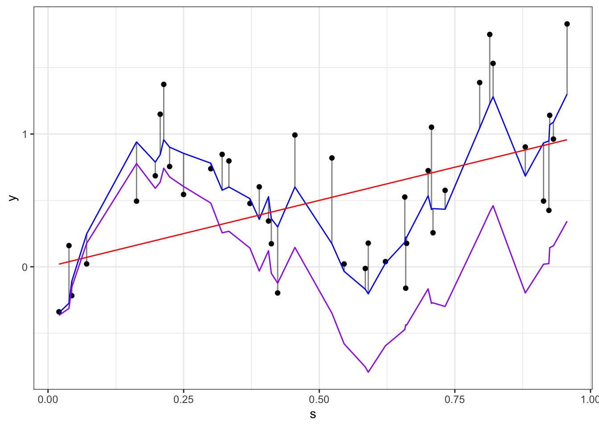

# Day 6

## Announcements

* Assigned reading: [Model Selection for Geostatistical Models](https://github.com/jtipton25/STAT-5413/blob/master/readings/MODEL%20SELECTION%20FOR%20GEOSTATISTICAL%20MODELS.pdf)


```r
library(tidyverse)
library(fields)
library(mvnfast)
library(gstat)
library(sp)
```

## Gaussian process assumptions

* To fit a Gaussian process, we have to make assumptions

    * Why? -- The mean and covariance functions are infinite dimensional but we only observe a finite vector $\mathbf{y} = (y(\mathbf{s}_1), \ldots, y(\mathbf{s}_1))'$ so we cannot fully specify the model
   
* **Stationarity**
    
    * Strict stationarity: the probability density function is invariant to shifts
        * $[y(\mathbf{s}_1), \ldots, y(\mathbf{s}_n)] = [y(\mathbf{s}_1 + \mathbf{h}), \ldots, y(\mathbf{s}_n + \mathbf{h})] \hspace{1em} \forall \mathbf{s}_1, \ldots, \mathbf{s}_n \in \mathcal{D} \mbox{ and } \mathbf{h}$ (such that all points shifted by the vector $\mathbf{h}$ are also in $\mathcal{D}$)
    
    * Weak stationarity: mean and covariance function are stationary
        * $E\left( y(\mathbf{s}) \right) = E\left( y(\mathbf{s} + \mathbf{h}) \right) = \mu \hspace{1em} \forall \mathbf{h}$ 
        * $C\left( y(\mathbf{s}), y(\mathbf{s} + \mathbf{h}) \right) = C\left( y(\mathbf{0}), y(\mathbf{h}) \right) = C(\mathbf{h}) \hspace{1em} \forall \mathbf{s}, \mathbf{h}$ 
        * This implies $C\left( y(\mathbf{s}_i), y(\mathbf{s}_j) \right) = C(\mathbf{s}_i - \mathbf{s}_j) = C(\mathbf{d}_{ij})$ where $\mathbf{d}_{ij} = \mathbf{s}_i - \mathbf{s}_j$ is the difference vector between location $\mathbf{s}_i$ and location $\mathbf{s}_j$
        
    * Intrinsic stationarity (weakest form)
        * $Var\left( y(\mathbf{s} + h) - y(\mathbf{s}) \right)$ depends only on $\mathbf{h}$.
        * Note: intrinsic stationarity doesn't imply weak stationarity.
            * Example: Brownian motion is intrisically stationary but is not weakly stationary.
            

```r
knitr::include_graphics(here::here("images", "covariance-shift.jpg"))
```


* Can you think of a process that is not stationary?

<!-- ```{r} -->
<!-- knitr::include_graphics(here::here("images", "stationarity.jpeg")) -->
<!-- ``` -->

* Note: for Gaussian processes, a weak stationarity implies strong stationarity.         
    
* **Isotropy**
    * A covariance function is isotropic if it is invariant to direction and rotation.
    * $C\left( y(\mathbf{s}_i), y(\mathbf{s}_j) \right)  = C(d_{ij})$ where $d_{ij} = \|\mathbf{s}_i - \mathbf{s}_j\|$ is the distance (typically Euclidean) between $\mathbf{s}_i$ and $\mathbf{s}_j$
        * Can you think of examples where other distances (not Euclidean) might be better?
    * A covariance function that is not isotropic is called **anisotropic**
    
**Insert drawing here**

* Can you think of a process that is anisotropic?

## Recall Hierachical modeling

### Data Model

\begin{align*}
y(\mathbf{s}) & = z(\mathbf{s}) + \varepsilon(\mathbf{s})  \\
(\#eq:data)
\varepsilon(\mathbf{s}) \stackrel{iid}{\sim} N(0, \sigma^2)
\end{align*}

* $y(\mathbf{s})$ is the observation at site $\mathbf{s}$
    
* $z(\mathbf{s})$ is the process of interest at site $\mathbf{s}$

* $\varepsilon(\mathbf{s}) \sim N(0, \sigma^2)$ is the measurement error
    * Commonly called the **nugget**
    * Geostatistics came from mining
    * Microsite-variability
    * What is a process that would have a small nugget?
    * What is a process that would have a large nugget?
    
* $z(\mathbf{s})$ is the process of interest at site $\mathbf{s}$


* Process Model (using Gaussian process)

\begin{align*}
z(\mathbf{s}) & = \mu(\mathbf{s}) + \eta(\mathbf{s}) 
(\#eq:process)
\end{align*}

* $\mu(\mathbf{s})$ is the GP mean function

* $\boldsymbol{\eta} = (\eta(\mathbf{s}_1), \ldots, \eta(\mathbf{s}_n))' \sim N(\mathbf{0}, \boldsymbol{\Sigma})$

* $Cov(\eta(\mathbf{s}_i), \eta(\mathbf{s}_j)) = \tau^2 C(d_{ij})$

    * $C(d_ij)$ is a correlation function
    
    * $\tau^2$ is often called the **partial sill** parameter


```r
set.seed(101)
n <- 40
s <- runif(n)
## mean function
mu <- s
## covariance function -- this is positive definite
Sigma <- 2 * exp( - rdist(s) / 2)

## generate the spatially (1-d) correlated process
## rmvn returns a matrix -- use c() to coerce to a vector
eta <- c(rmvn(1, rep(0, n), Sigma))            
z <- mu + eta
epsilon <- rnorm(n, 0, 0.25)
y <- z + epsilon

dat <- data.frame(
    s = s,
    y = y,
    z = z,
    mu = mu, 
    eta = eta, 
    epsilon = epsilon
)

dat %>% 
    ggplot(aes(x = s, y = y)) +
    geom_point() +
    geom_segment(aes(xend = s, yend = z), alpha = 0.5) +
    geom_line(aes(x = s, y = z), color = "blue") +
    geom_line(aes(x = s, y = mu), color = "red") +
    geom_line(aes(x = s, y = eta), color = "purple") +
    theme_bw()
```




A quick check if Sigma meets the conditions of a symmetric positive-definite matrix


```r
## check is Sigma is symmetric
all.equal(Sigma, t(Sigma))
```

```
## [1] TRUE
```

```r
## check is Sigma is posivitive definite
Sigma_eigen <- eigen(Sigma)
## check that all eigenvalues are positive
Sigma_eigen$values
```

```
##  [1] 68.614998226  6.469640157  1.846887044  1.013225060  0.526987113
##  [6]  0.350879290  0.221671629  0.170657210  0.116756563  0.076631073
## [11]  0.067533590  0.058658782  0.053014720  0.043488483  0.037433411
## [16]  0.036668397  0.032544320  0.030261646  0.027404563  0.023218999
## [21]  0.021154516  0.021154380  0.017782847  0.016717572  0.014563450
## [26]  0.013423514  0.010922956  0.009497946  0.008886870  0.008231217
## [31]  0.007208472  0.005444425  0.005026785  0.004599434  0.004534839
## [36]  0.004238142  0.003219602  0.002366398  0.001348648  0.001117710
```

```r
all(Sigma_eigen$values > 0)
```

```
## [1] TRUE
```

* Variance decomposition

Combining the equations \@ref(eq:data) and \@ref(eq:process)

\begin{align*}
y(\mathbf{s}) & = \mu(\mathbf{s}) + \eta(\mathbf{s}) + \varepsilon(\mathbf{s}) 
\end{align*}

we can have

\begin{align*}
Var \left( y(\mathbf{s}) \right) & = Var \left( \mu(\mathbf{s}) + \eta(\mathbf{s}) + \varepsilon(\mathbf{s}) \right) \\
& = Var \left( \mu(\mathbf{s}) \right) + Var \left( \eta(\mathbf{s}) \right) + Var \left( \varepsilon(\mathbf{s}) \right) + \\
& \hspace{2em} 2 Cov \left( \mu(\mathbf{s}), \varepsilon(\mathbf{s}) \right) + 
2 Cov \left( \mu(\mathbf{s}), \eta(\mathbf{s}) \right) +
2 Cov \left( \eta(\mathbf{s}), \varepsilon(\mathbf{s}) \right) \\
& = 0 + Var \left( \eta(\mathbf{s}) \right) + Var \left( \varepsilon(\mathbf{s}) \right)  + 0 + 0 + 0 \\
& = \tau^2 + \sigma^2
\end{align*}

* the total variance is the **sill** $\tau^2 + \sigma^2$


