# Day 11

## Announcements

## Example spatial analysis


```r
library(tidyverse)
library(fields)
library(geoR)
```

```
## Warning in fun(libname, pkgname): no display name and no $DISPLAY environment
## variable
```

```r
library(STRbook)
library(maps)
library(nlme)
```

## Spatial model fitting

We will use the _NOAA_df_1990_ _data.frame_ from the _STRbook_ package. We will 


```r
data("NOAA_df_1990")
## add a factor variable for left_join
NOAA_df_1990$id_factor <- factor(NOAA_df_1990$id)
dat <- NOAA_df_1990 %>%
    subset(year == 1990 & month == 7 & proc == "Tmax") %>%
    group_by(id_factor) %>% 
    summarize(mean_Tmax = mean(z)) #

## add back in the lat/lon variables
dat <- NOAA_df_1990 %>%
    subset(year == 1990 & month == 7 & proc == "Tmax" & day == 1) %>%
    left_join(dat, by = "id_factor") 
```

We can plot the data


```r
states <- map_data("state")

dat %>%
    ggplot(aes(x = lon, y = lat, color = mean_Tmax)) +
    geom_point() +
    geom_polygon(data = states, aes(x = long, y = lat, group = group), 
                          colour = "black", fill = NA) +
    scale_color_viridis_c(option = "plasma") +
    ggtitle("Average July max Temperature in 1990")
```

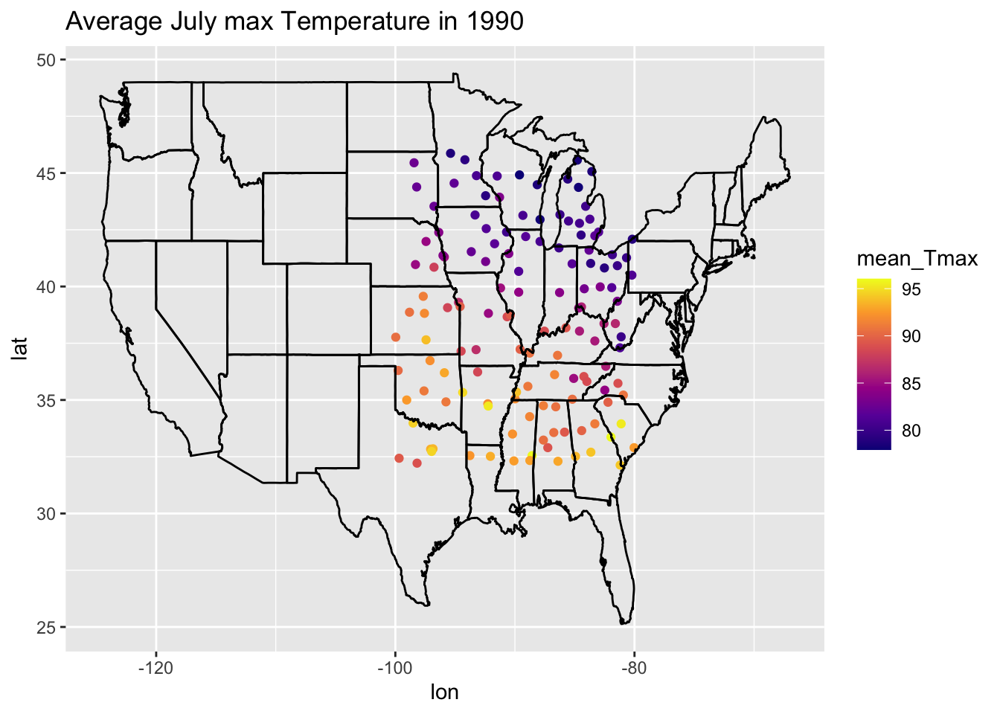

Subset to just the region of interest


```r
states <- map_data("state")

dat %>%
    ggplot(aes(x = lon, y = lat, color = mean_Tmax)) +
    geom_point() +
    scale_color_viridis_c(option = "plasma") +
    ggtitle("Average July max Temperature in 1990") +
    geom_polygon(data = states, aes(x = long, y = lat, group = group), 
                 colour = "black", fill = NA, inherit.aes = FALSE) +
  coord_fixed(xlim = range(dat$lon), ylim = range(dat$lat), ratio = 1.3)
```

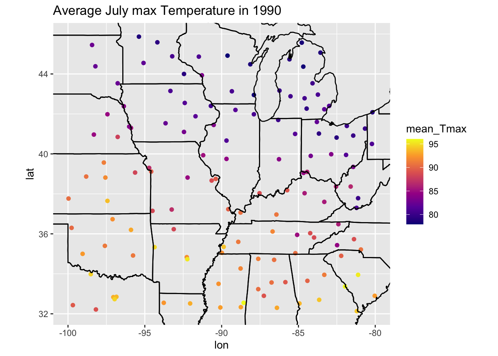


```r
dat %>%
    ggplot(aes(x = mean_Tmax)) +
    geom_histogram() +
    ggtitle("Average July max Temperature in 1990")
```

```
## `stat_bin()` using `bins = 30`. Pick better value with `binwidth`.
```

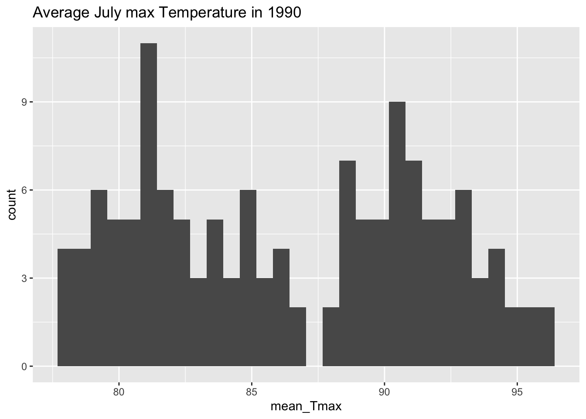

* The histogram looks non-normal. Is this a problem?
    * No. What matters are the residuals
    

```r
hist(resid(lm(dat$mean_Tmax ~ dat$lat)))
```

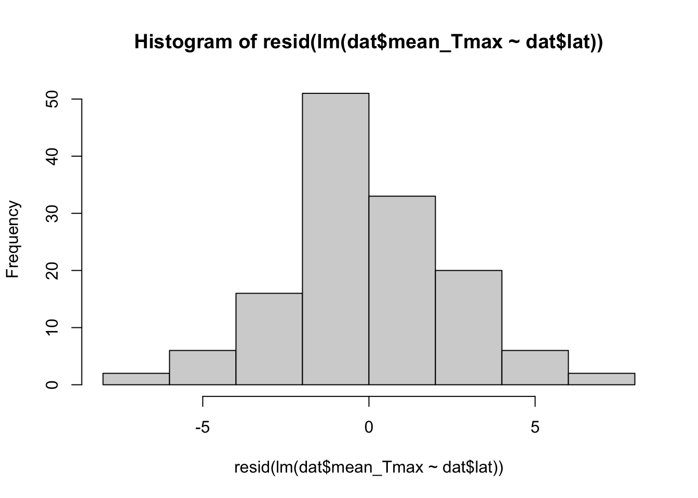


### Fit the maximum likelihood estimate using the _geoR_ package

* Fit the maximum likelihood estimate using an intercept only model
) using the _geoR_ package


```r
fit <- geoR::likfit(
    data         = dat$mean_Tmax,
    coords       = cbind(dat$lat, dat$lon),
    cov.model    = "exponential",
    ini.cov.pars = c(var(dat$mean_Tmax), 1) 
)
```

```
## kappa not used for the exponential correlation function
## ---------------------------------------------------------------
## likfit: likelihood maximisation using the function optim.
## likfit: Use control() to pass additional
##          arguments for the maximisation function.
##         For further details see documentation for optim.
## likfit: It is highly advisable to run this function several
##         times with different initial values for the parameters.
## likfit: WARNING: This step can be time demanding!
## ---------------------------------------------------------------
## likfit: end of numerical maximisation.
```

```r
summary(fit)
```

```
## Summary of the parameter estimation
## -----------------------------------
## Estimation method: maximum likelihood 
## 
## Parameters of the mean component (trend):
##    beta 
## 85.4817 
## 
## Parameters of the spatial component:
##    correlation function: exponential
##       (estimated) variance parameter sigmasq (partial sill) =  62.9
##       (estimated) cor. fct. parameter phi (range parameter)  =  44.6
##    anisotropy parameters:
##       (fixed) anisotropy angle = 0  ( 0 degrees )
##       (fixed) anisotropy ratio = 1
## 
## Parameter of the error component:
##       (estimated) nugget =  1.256
## 
## Transformation parameter:
##       (fixed) Box-Cox parameter = 1 (no transformation)
## 
## Practical Range with cor=0.05 for asymptotic range: 133.6098
## 
## Maximised Likelihood:
##    log.L n.params      AIC      BIC 
## "-287.3"      "4"  "582.5"  "594.2" 
## 
## non spatial model:
##    log.L n.params      AIC      BIC 
## "-418.5"      "2"    "841"  "846.8" 
## 
## Call:
## geoR::likfit(coords = cbind(dat$lat, dat$lon), data = dat$mean_Tmax, 
##     ini.cov.pars = c(var(dat$mean_Tmax), 1), cov.model = "exponential")
```

```r
AIC(fit)
```

```
## [1] 582.5471
```

```r
fit$BIC
```

```
## [1] 594.1977
```

* Plot the estimated spatial correlation function

Model: $\mathbf{y} \sim N(\mu \mathbf{1}, \sigma^2 \mathbf{I} + \tau^2 \mathbf{R}(\phi))$


```r
sigma2 <- fit$nugget
tau2   <- fit$sigmasq
phi    <- fit$phi


d   <- seq(0, 150, length.out = 1000)
cov <- ifelse(d == 0, sigma2, 0) + tau2 * exp( -  d / phi)
cor <- cov / cov[1]
data.frame(
    d   = d[-1], 
    cov = cov[-1]
) %>%
    ggplot(aes(x = d, y = cov)) +
    geom_line() +
    geom_point(data = data.frame(d_nugget = d[1], cov_nugget = cov[1]), 
               aes(x = d_nugget, y = cov_nugget), inherit.aes = FALSE) +
    ggtitle("Estimated covariance function") +
    ylim(c(0, max(cov)))
```

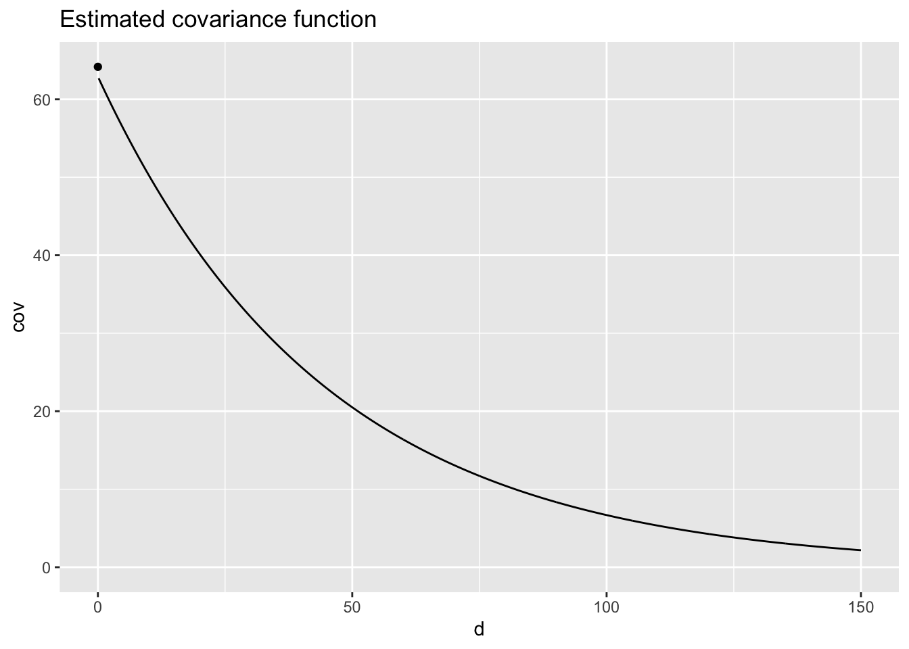

```r
data.frame(
    d   = d[-1], 
    cor = cor[-1]
) %>%
    ggplot(aes(x = d, y = cor)) +
    geom_line() +
    geom_point(data = data.frame(d_nugget = d[1], cor_nugget = cor[1]), 
               aes(x = d_nugget, y = cor_nugget), inherit.aes = FALSE) +
    ggtitle("Estimated correlation function") + 
    ylim(c(0, max(cor)))
```


* Fit the model with coefficients


```r
fit_coef <- geoR::likfit(
    data         = dat$mean_Tmax,
    trend        = ~ dat$lat + dat$lon,
    coords       = cbind(dat$lat, dat$lon),
    cov.model    = "exponential",
    ini.cov.pars = c(var(dat$mean_Tmax), 1) 
)
```

```
## kappa not used for the exponential correlation function
## ---------------------------------------------------------------
## likfit: likelihood maximisation using the function optim.
## likfit: Use control() to pass additional
##          arguments for the maximisation function.
##         For further details see documentation for optim.
## likfit: It is highly advisable to run this function several
##         times with different initial values for the parameters.
## likfit: WARNING: This step can be time demanding!
## ---------------------------------------------------------------
## likfit: end of numerical maximisation.
```

```r
summary(fit_coef)
```

```
## Summary of the parameter estimation
## -----------------------------------
## Estimation method: maximum likelihood 
## 
## Parameters of the mean component (trend):
##    beta0    beta1    beta2 
## 112.7297  -1.0856  -0.1737 
## 
## Parameters of the spatial component:
##    correlation function: exponential
##       (estimated) variance parameter sigmasq (partial sill) =  3.674
##       (estimated) cor. fct. parameter phi (range parameter)  =  2.003
##    anisotropy parameters:
##       (fixed) anisotropy angle = 0  ( 0 degrees )
##       (fixed) anisotropy ratio = 1
## 
## Parameter of the error component:
##       (estimated) nugget =  1.146
## 
## Transformation parameter:
##       (fixed) Box-Cox parameter = 1 (no transformation)
## 
## Practical Range with cor=0.05 for asymptotic range: 6.00029
## 
## Maximised Likelihood:
##    log.L n.params      AIC      BIC 
## "-278.4"      "6"  "568.7"  "586.2" 
## 
## non spatial model:
##    log.L n.params      AIC      BIC 
## "-293.4"      "4"  "594.9"  "606.5" 
## 
## Call:
## geoR::likfit(coords = cbind(dat$lat, dat$lon), data = dat$mean_Tmax, 
##     trend = ~dat$lat + dat$lon, ini.cov.pars = c(var(dat$mean_Tmax), 
##         1), cov.model = "exponential")
```

```r
## look at the AIC
AIC(fit)
```

```
## [1] 582.5471
```

```r
AIC(fit_coef)
```

```
## [1] 568.7446
```

```r
## look at the BIC
fit$BIC
```

```
## [1] 594.1977
```

```r
fit_coef$BIC
```

```
## [1] 586.2206
```

* Which model is better fitting the data?

* Plot the estimated spatial correlation function

Model: $\mathbf{y} \sim N(\mu \mathbf{1}, \sigma^2 \mathbf{I} + \tau^2 \mathbf{R}(\phi))$


```r
sigma2 <- fit_coef$nugget
tau2   <- fit_coef$sigmasq
phi    <- fit_coef$phi


d   <- seq(0, 150, length.out = 1000)
cov <- ifelse(d == 0, sigma2, 0) + tau2 * exp( -  d / phi)
cor <- cov / cov[1]
data.frame(
    d   = d[-1], 
    cov = cov[-1]
) %>%
    ggplot(aes(x = d, y = cov)) +
    geom_line() +
    geom_point(data = data.frame(d_nugget = d[1], cov_nugget = cov[1]), 
               aes(x = d_nugget, y = cov_nugget), inherit.aes = FALSE) +
    ggtitle("Estimated covariance function") +
    ylim(c(0, max(cov)))
```


```r
data.frame(
    d   = d[-1], 
    cor = cor[-1]
) %>%
    ggplot(aes(x = d, y = cor)) +
    geom_line() +
    geom_point(data = data.frame(d_nugget = d[1], cor_nugget = cor[1]), 
               aes(x = d_nugget, y = cor_nugget), inherit.aes = FALSE) +
    ggtitle("Estimated correlation function") + 
    ylim(c(0, max(cor)))
```

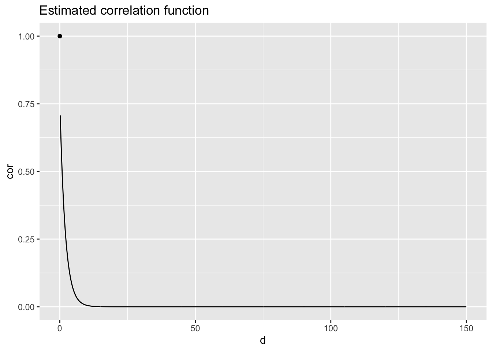


* Other models are available -- see _?cov.model_ for details

#### Spatial predictions using _geoR_


```r
pred_locations <- expand.grid(
  seq(min(dat$lat), max(dat$lat), length.out = 100),
  seq(min(dat$lon), max(dat$lon), length.out = 100)
)
names(pred_locations) <- c("lat", "lon")
pred_locations <- data.frame(pred_locations)
preds <- krige.conv(
  data = dat$mean_Tmax,
  coords       = cbind(dat$lat, dat$lon),
  locations    = cbind(pred_locations$lat, pred_locations$lon),
  krige = krige.control(
    cov.model    = "exponential",
    beta         = fit_coef$beta,
    cov.pars     = fit_coef$cov.pars,
    nugget       = fit_coef$nugget
  )
)
```

```
## krige.conv: model with constant mean
## krige.conv: Kriging performed using global neighbourhood
```

```r
dat_pred <- data.frame(
  preds = preds$predict,
  var   = preds$krige.var,
  lat   = pred_locations$lat,
  lon   = pred_locations$lon
) 
```


```r
ggplot(dat_pred, aes(x = lon, y = lat, fill = preds)) +
  geom_raster() +
  geom_polygon(data = states, aes(x = long, y = lat, group = group), 
               colour = "black", fill = NA) +
  scale_fill_viridis_c(option = "plasma") +
  ggtitle("Predicted Average July max Temperature in 1990") +
  coord_fixed(xlim = range(dat$lon), ylim = range(dat$lat), ratio = 1.3)

ggplot(dat_pred, aes(x = lon, y = lat, fill = var)) +
  geom_raster() +
  geom_polygon(data = states, aes(x = long, y = lat, group = group), 
               colour = "black", fill = NA) +
  scale_fill_viridis_c(option = "plasma") +
  ggtitle("Average July max Temperature prediction Variance in 1990")  +
  coord_fixed(xlim = range(dat$lon), ylim = range(dat$lat), ratio = 1.3)
```

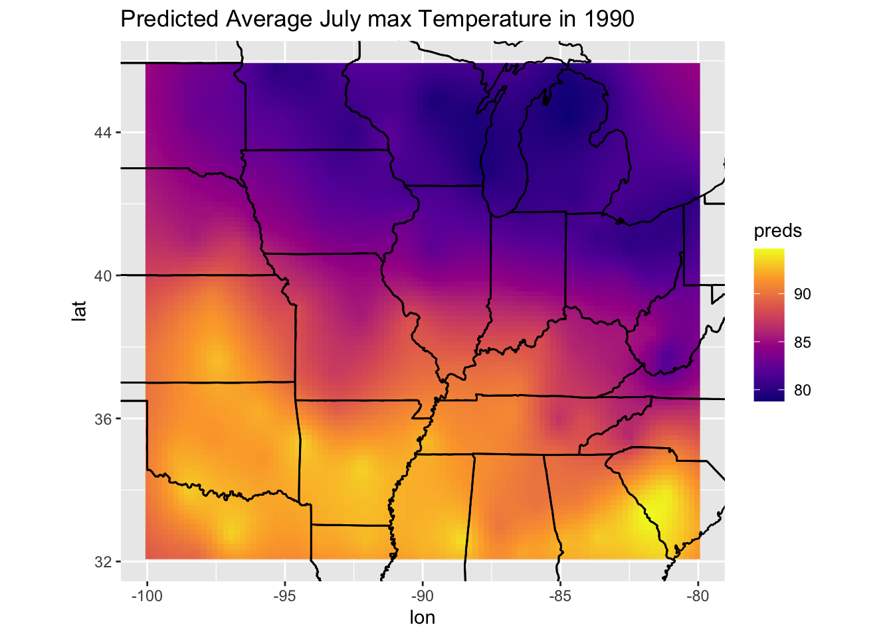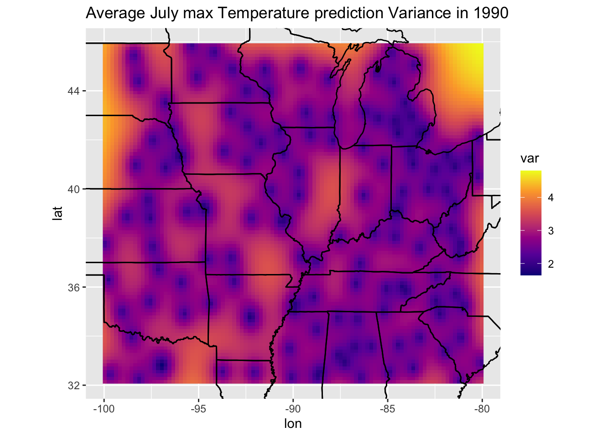

* What explains the "patchiness" of the variance estimates?


```r
ggplot(dat_pred, aes(x = lon, y = lat, fill = var)) +
  geom_raster() +
  geom_polygon(data = states, aes(x = long, y = lat, group = group), 
               colour = "black", fill = NA) +
  scale_fill_viridis_c(option = "plasma") +
  ggtitle("Average July max Temperature prediction Variance in 1990") +
  geom_point(data = dat, aes(x = lon, y = lat), inherit.aes = FALSE,
             color = "white", size = 0.6) +
  coord_fixed(xlim = range(dat$lon), ylim = range(dat$lat), ratio = 1.3)
```


### Fitting a spatial model using the _nlme_ package


```r
fit <- gls(
  mean_Tmax ~ 1,
  data = dat, 
  correlation = corExp(form = ~ lat + lon, nugget = TRUE), 
  method = "ML"
)
summary(fit)
```

```
## Generalized least squares fit by maximum likelihood
##   Model: mean_Tmax ~ 1 
##   Data: dat 
##        AIC      BIC    logLik
##   582.5471 594.1977 -287.2735
## 
## Correlation Structure: Exponential spatial correlation
##  Formula: ~lat + lon 
##  Parameter estimate(s):
##       range      nugget 
## 44.86528018  0.01945057 
## 
## Coefficients:
##               Value Std.Error  t-value p-value
## (Intercept) 85.4799  6.919885 12.35279       0
## 
## Standardized residuals:
##         Min          Q1         Med          Q3         Max 
## -0.93914480 -0.50646918  0.06875849  0.68012613  1.31357929 
## 
## Residual standard error: 8.033285 
## Degrees of freedom: 136 total; 135 residual
```

```r
summary(fit)$AIC
```

```
## [1] 582.5471
```

```r
summary(fit)$BIC
```

```
## [1] 594.1977
```

* Plot the estimated covariance/correaltion function

Note: the _gls_ function partitions the variance using a single overall variance $\sigma^2_{gls}$ and a proportion constant $\rho \in (0, 1)$ so that our nugget $\sigma^2 = \rho * \sigma^2_{gls}$ and our partial sill $\tau^2 = (1 - \rho) * \sigma^2_{gls}$.


```r
## extract the model parameters from the gls fit
phi    <- exp(fit$model[1]$corStruct[1])
rho    <- 1 / (1 + exp(-fit$model[1]$corStruct[2])) 

sigma2 <- fit$sigma^2 * (rho)
tau2   <- fit$sigma^2 * (1-rho)


d   <- seq(0, 150, length.out = 1000)
cov <- ifelse(d == 0, sigma2, 0) + tau2 * exp( -  d / phi)
cor <- cov / cov[1]
data.frame(
    d   = d[-1], 
    cov = cov[-1]
) %>%
    ggplot(aes(x = d, y = cov)) +
    geom_line() +
    geom_point(data = data.frame(d_nugget = d[1], cov_nugget = cov[1]), 
               aes(x = d_nugget, y = cov_nugget), inherit.aes = FALSE) +
    ggtitle("Estimated covariance function") +
    ylim(c(0, max(cov)))
```


```r
data.frame(
    d   = d[-1], 
    cor = cor[-1]
) %>%
    ggplot(aes(x = d, y = cor)) +
    geom_line() +
    geom_point(data = data.frame(d_nugget = d[1], cor_nugget = cor[1]), 
               aes(x = d_nugget, y = cor_nugget), inherit.aes = FALSE) +
    ggtitle("Estimated correlation function") + 
    ylim(c(0, max(cor)))
```

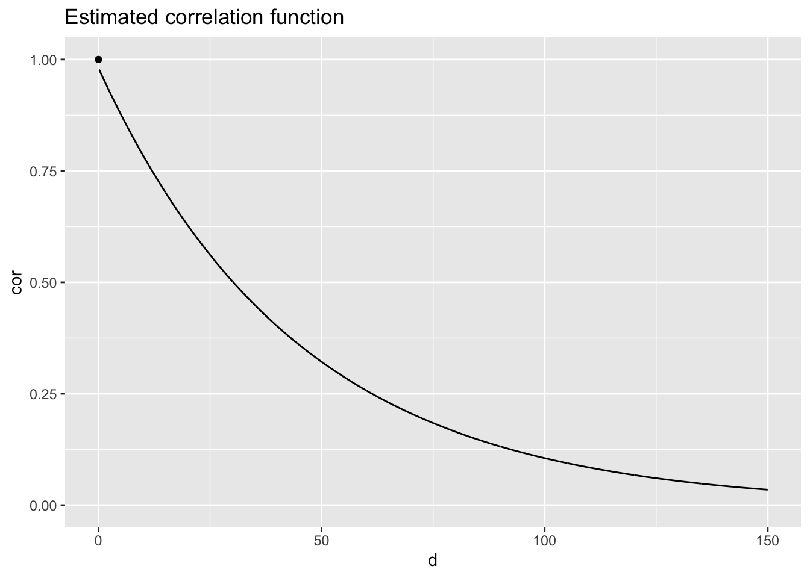


We can also fit this model using covariates


```r
fit_coef <- gls(
  mean_Tmax ~ lat + lon,
  data = dat, 
  correlation = corExp(form = ~ lat + lon, nugget = TRUE), 
  method = "ML"
)
summary(fit_coef)
```

```
## Generalized least squares fit by maximum likelihood
##   Model: mean_Tmax ~ lat + lon 
##   Data: dat 
##        AIC      BIC    logLik
##   568.7446 586.2206 -278.3723
## 
## Correlation Structure: Exponential spatial correlation
##  Formula: ~lat + lon 
##  Parameter estimate(s):
##     range    nugget 
## 2.0029357 0.2377618 
## 
## Coefficients:
##                 Value Std.Error    t-value p-value
## (Intercept) 112.72965  7.533049  14.964679  0.0000
## lat          -1.08557  0.097936 -11.084439  0.0000
## lon          -0.17370  0.073610  -2.359685  0.0197
## 
##  Correlation: 
##     (Intr) lat   
## lat -0.472       
## lon  0.863  0.033
## 
## Standardized residuals:
##           Min            Q1           Med            Q3           Max 
## -2.6610668315 -0.5356554805  0.0003439733  0.5456241209  2.4992950620 
## 
## Residual standard error: 2.195568 
## Degrees of freedom: 136 total; 133 residual
```

```r
summary(fit)$AIC
```

```
## [1] 582.5471
```

```r
summary(fit_coef)$AIC
```

```
## [1] 568.7446
```

```r
summary(fit)$BIC
```

```
## [1] 594.1977
```

```r
summary(fit_coef)$BIC
```

```
## [1] 586.2206
```

* Plot the estimated covariance/correaltion function

Note: the _gls_ function partitions the variance using a single overall variance $\sigma^2_{gls}$ and a proportion constant $\rho \in (0, 1)$ so that our nugget $sigma^2 = \rho * \sigma^2_{gls}$ and our partial sill $\tau^2 = (1 - \rho) * \sigma^2_{gls}$.


```r
## extract the model parameters from the gls fit
phi    <- exp(fit_coef$model[1]$corStruct[1])
rho    <- 1 / (1 + exp(-fit_coef$model[1]$corStruct[2])) 

sigma2 <- fit_coef$sigma^2 * (rho)
tau2   <- fit_coef$sigma^2 * (1-rho)


d   <- seq(0, 150, length.out = 1000)
cov <- ifelse(d == 0, sigma2, 0) + tau2 * exp( -  d / phi)
cor <- cov / cov[1]
data.frame(
    d   = d[-1], 
    cov = cov[-1]
) %>%
    ggplot(aes(x = d, y = cov)) +
    geom_line() +
    geom_point(data = data.frame(d_nugget = d[1], cov_nugget = cov[1]), 
               aes(x = d_nugget, y = cov_nugget), inherit.aes = FALSE) +
    ggtitle("Estimated covariance function") +
    ylim(c(0, max(cov)))
```

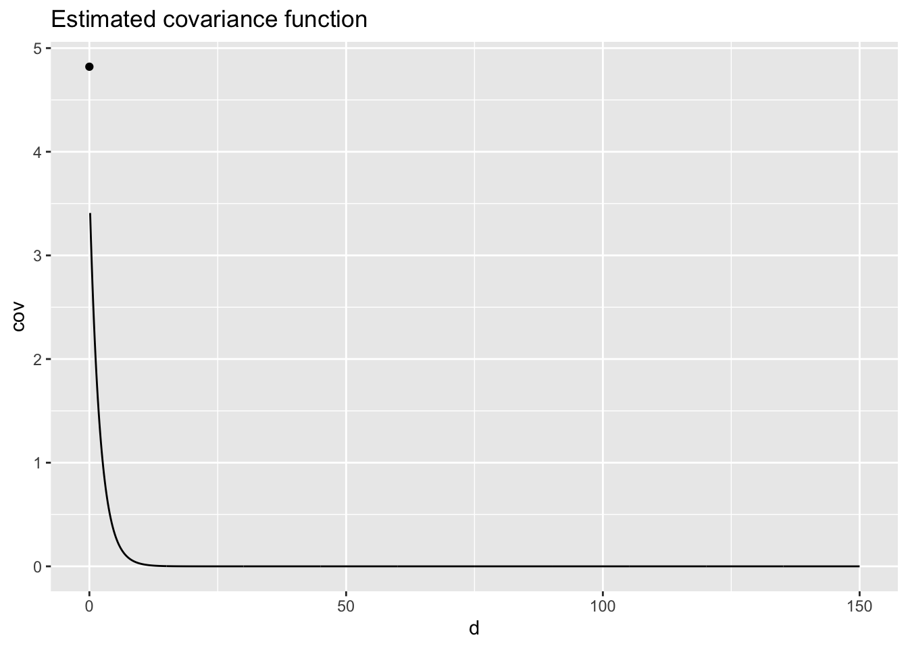

```r
data.frame(
    d   = d[-1], 
    cor = cor[-1]
) %>%
    ggplot(aes(x = d, y = cor)) +
    geom_line() +
    geom_point(data = data.frame(d_nugget = d[1], cor_nugget = cor[1]), 
               aes(x = d_nugget, y = cor_nugget), inherit.aes = FALSE) +
    ggtitle("Estimated correlation function") + 
    ylim(c(0, max(cor)))
```


* Other correlation structures avaiable with _?corClasses_

#### Spatial predictions using _nlme_


```r
pred_locations <- expand.grid(
  seq(min(dat$lat), max(dat$lat), length.out = 100),
  seq(min(dat$lon), max(dat$lon), length.out = 100)
)
names(pred_locations) <- c("lat", "lon")
pred_locations <- data.frame(pred_locations)

preds <- predict(
  fit_coef, 
  newdata = pred_locations
)

dat_pred <- data.frame(
  preds = preds,
  lat   = pred_locations$lat,
  lon   = pred_locations$lon
) 

ggplot(dat_pred, aes(x = lon, y = lat, fill = preds)) +
  geom_raster() +
  geom_polygon(data = states, aes(x = long, y = lat, group = group), 
               colour = "black", fill = NA) +
  scale_fill_viridis_c(option = "plasma") +
  ggtitle("Predicted Average July max Temperature in 1990") +
  coord_fixed(xlim = range(dat$lon), ylim = range(dat$lat), ratio = 1.3)
```

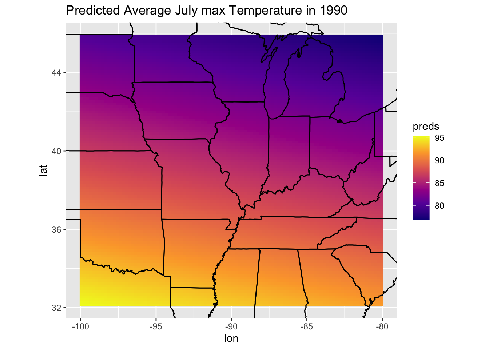


### model fitting with _autokrige_ function


```r
library(automap)
```

```
## Loading required package: sp
```

```r
dat_points <- SpatialPointsDataFrame(
  coords = cbind(dat$lon, dat$lat),
  data  = data.frame(
    mean_Tmax = dat$mean_Tmax,
    lat = dat$lat,
    lon = dat$lon
  )
)
pred_points <- SpatialPointsDataFrame(
  coords = cbind(dat_pred$lon, dat_pred$lat),
  data  = data.frame(
    lat = dat_pred$lat,
    lon = dat_pred$lon
  )
)
  
fit <- autoKrige(
  mean_Tmax ~ 1,
  input_data = dat_points, 
  new_data = pred_points
)
```

```
## [using ordinary kriging]
```

```r
summary(fit)
```

```
## krige_output:
## Object of class SpatialPointsDataFrame
## Coordinates:
##                 min       max
## coords.x1 -99.96667 -80.03333
## coords.x2  32.13334  45.86666
## Is projected: NA 
## proj4string : [NA]
## Number of points: 10000
## Data attributes:
##    var1.pred        var1.var       var1.stdev   
##  Min.   :77.04   Min.   :2.232   Min.   :1.494  
##  1st Qu.:81.52   1st Qu.:2.377   1st Qu.:1.542  
##  Median :86.38   Median :2.457   Median :1.567  
##  Mean   :86.25   Mean   :2.563   Mean   :1.597  
##  3rd Qu.:91.15   3rd Qu.:2.576   3rd Qu.:1.605  
##  Max.   :94.87   Max.   :7.222   Max.   :2.687  
## 
## exp_var:
##      np      dist     gamma dir.hor dir.ver   id
## 1    14 0.2688453  1.572135       0       0 var1
## 2     9 0.6657668  4.651058       0       0 var1
## 3    39 0.9188058  2.466461       0       0 var1
## 4    56 1.1530422  2.600844       0       0 var1
## 5   295 1.6981353  4.445251       0       0 var1
## 6   382 2.5763905  5.503639       0       0 var1
## 7   706 3.6004969  8.450781       0       0 var1
## 8   852 4.8837648 13.155866       0       0 var1
## 9   900 6.1662408 18.812370       0       0 var1
## 10 1255 7.6319285 27.499139       0       0 var1
## 
## var_model:
##   model        psill    range kappa
## 1   Nug 1.920220e+00     0.00   0.0
## 2   Ste 3.894906e+06 17317.93   0.9
## Sums of squares betw. var. model and sample var.[1] 221.0082
```


```r
plot(fit)
```

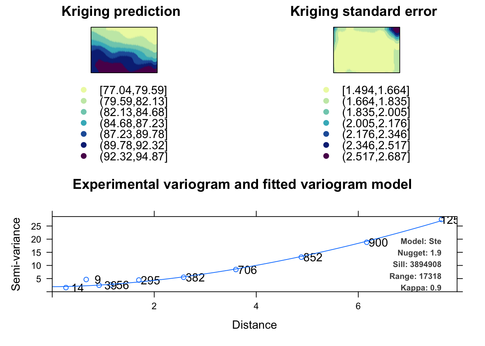


```r
fit_coef <- autoKrige(
  mean_Tmax ~ lat + lon,
  input_data = dat_points, 
  new_data = pred_points
)
```

```
## [using universal kriging]
```

```r
summary(fit_coef)
```

```
## krige_output:
## Object of class SpatialPointsDataFrame
## Coordinates:
##                 min       max
## coords.x1 -99.96667 -80.03333
## coords.x2  32.13334  45.86666
## Is projected: NA 
## proj4string : [NA]
## Number of points: 10000
## Data attributes:
##    var1.pred        var1.var       var1.stdev   
##  Min.   :76.63   Min.   :1.481   Min.   :1.217  
##  1st Qu.:81.51   1st Qu.:2.654   1st Qu.:1.629  
##  Median :86.23   Median :2.891   Median :1.700  
##  Mean   :86.20   Mean   :2.944   Mean   :1.710  
##  3rd Qu.:91.02   3rd Qu.:3.190   3rd Qu.:1.786  
##  Max.   :94.78   Max.   :5.210   Max.   :2.283  
## 
## exp_var:
##      np      dist    gamma dir.hor dir.ver   id
## 1    14 0.2688453 1.644463       0       0 var1
## 2     9 0.6657668 4.865208       0       0 var1
## 3    39 0.9188058 1.703131       0       0 var1
## 4    56 1.1530422 2.407162       0       0 var1
## 5   295 1.6981353 3.509443       0       0 var1
## 6   382 2.5763905 3.328727       0       0 var1
## 7   706 3.6004969 4.193811       0       0 var1
## 8   852 4.8837648 4.488593       0       0 var1
## 9   900 6.1662408 4.472937       0       0 var1
## 10 1255 7.6319285 4.216233       0       0 var1
## 
## var_model:
##   model     psill    range kappa
## 1   Nug 0.7733065 0.000000   0.0
## 2   Ste 3.8560971 2.887739   0.3
## Sums of squares betw. var. model and sample var.[1] 197.6886
```


```r
plot(fit_coef)
```

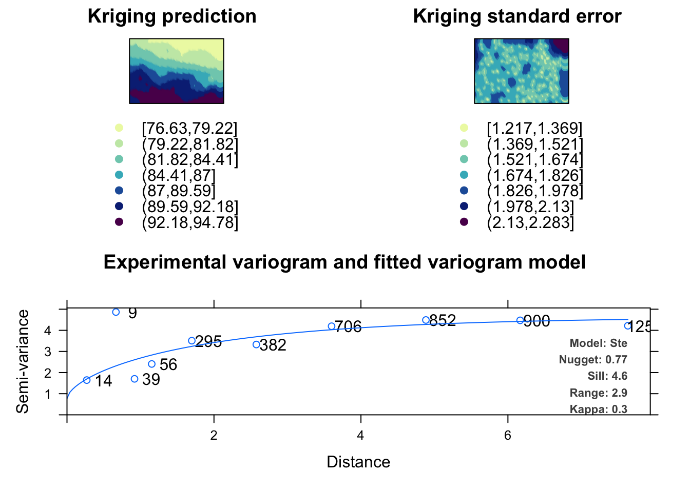


```r
dat_pred <- data.frame(
  preds = fit_coef$krige_output@data$var1.pred,
  var   = fit_coef$krige_output@data$var1.var,
  lat   = pred_locations$lat,
  lon   = pred_locations$lon
) 
ggplot(dat_pred, aes(x = lon, y = lat, fill = preds)) +
  geom_raster() +
  geom_polygon(data = states, aes(x = long, y = lat, group = group), 
               colour = "black", fill = NA) +
  scale_fill_viridis_c(option = "plasma") +
  ggtitle("Predicted Average July max Temperature in 1990") +
  coord_fixed(xlim = range(dat$lon), ylim = range(dat$lat), ratio = 1.3)


ggplot(dat_pred, aes(x = lon, y = lat, fill = var)) +
  geom_raster() +
  geom_polygon(data = states, aes(x = long, y = lat, group = group), 
               colour = "black", fill = NA) +
  scale_fill_viridis_c(option = "plasma") +
  ggtitle("Average July max Temperature prediction Variance in 1990")  +
  coord_fixed(xlim = range(dat$lon), ylim = range(dat$lat), ratio = 1.3)
```

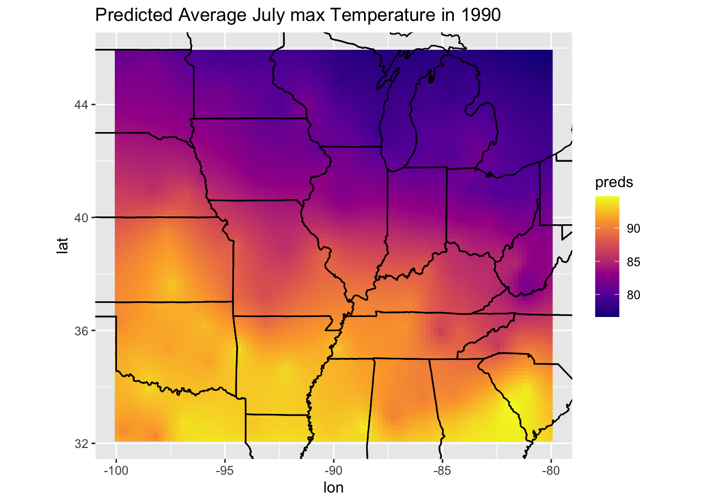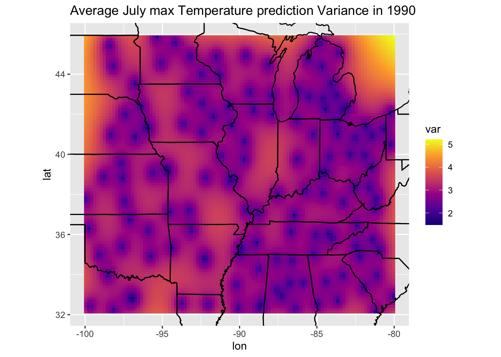


## Kriging

* Given a set of $n$ locations $\mathbf{s}_{obs} = \{ \mathbf{s}_1, \ldots, \mathbf{s}_n \}$, the goal is often to make a prediction at a set of $n_0$ new locations $\mathbf{s}_{unobs} = \{\mathbf{s}_{unobs_1}, \ldots, \mathbf{s}_{unobs_{n_0}} \}$.

* Out of date terms (but still commonly used)
    * Ordinary Kriging -- Kriging using a constant mean function
    * Universal Kriging -- Kriging with an estimated polynomial mean function
    * Not really a useful distinction -- now, all Kriging is universal Kriging    

* [Kriging](https://en.wikipedia.org/wiki/Kriging) is named after Danie G. Krige who did early work on spatial interpolation.


* For now, assume $E(y(\mathbf{s})) = 0 \hspace{1em} \forall \mathbf{s}$ 

* Because our model is a Gaussian process, the joint distribution of the process  $\mathbf{y}_{unobs} = (y(\mathbf{s}_{unobs_1}), \ldots, y(\mathbf{s}_{{unobs_{n_0}}}))'$ at the unobserved locations and the process $\mathbf{y}_{obs} = (y(\mathbf{s}_1), \ldots, y(\mathbf{s}_n))'$ at the observed locations is 

\begin{align*}
\begin{pmatrix} \mathbf{y}_{unobs} \\ \dots \\ \mathbf{y}_{obs} \end{pmatrix} & \sim \operatorname{N} \left( \begin{pmatrix} \mathbf{0}_{unobs} \\ \dots \\ \mathbf{0}_{obs} \end{pmatrix} ,
\begin{pmatrix} \Sigma_{unobs} & \vdots & \boldsymbol{\Sigma}_{unobs,obs} \\ \dots \\ \boldsymbol{\Sigma}_{obs, unobs} & \vdots & \boldsymbol{\Sigma}_{obs} \end{pmatrix}
\right),
\end{align*}

where $\boldsymbol{\Sigma}_{unobs} = \{ Cov \left( y(\mathbf{s}_{unobs_i}),  y(\mathbf{s}_{unobs_j}) \right) \}_{i,j=1}^{n_0}$ is the $n_{unobs} \times n_{unobs}$ covariance matrix that represents the covariance function evaluated at the unobserved locations, $\boldsymbol{\Sigma}_{unobs,obs} = \boldsymbol{\Sigma}_{obs,unobs}' = \{ Cov \left( y(\mathbf{s}_{unobs_i}),  y(\mathbf{s}_{j}) \right) \}_{i=1,\ldots, n_0; j=1, \ldots, n}$ is the $n_{unobs} \times n$ cross-covariance matrix that represents the covariance function evaluated between the unobserved and observed locations, and $\boldsymbol{\Sigma}_{obs} = \{ Cov \left( y(\mathbf{s}_{i}),  y(\mathbf{s}_{j}) \right) \}_{i,j=1}^{n}$ is the $n \times n$ covariance matrix that represents the covariance function evaluated at the observed locations.

* Using the properties of [conditional multivariate normal distributions](https://en.wikipedia.org/wiki/Multivariate_normal_distribution#Conditional_distributions), we have the conditional distribution

$$
\begin{align}
\mathbf{y}_{unobs} | \mathbf{y}_{obs} & \sim \operatorname{N} \left( \boldsymbol{\Sigma}_{unobs,obs} \boldsymbol{\Sigma}_{obs}^{-1} \mathbf{y}_{obs}, \boldsymbol{\Sigma}_{unobs,unobs} - \boldsymbol{\Sigma}_{unobs,obs} \boldsymbol{\Sigma}_{obs}^{-1} \boldsymbol{\Sigma}_{obs,unobs} \right)
\end{align}
$$

* Can plug in the MLE estimate $\boldsymbol{\Sigma}(\hat{\boldsymbol{\theta}})$ to get the estimated distribution (not accounting for parameter uncertainty).

* The Kriging approach gets the same solution by not assuming normality and solving for the best linear unbiased predictor (BLUP)

We generate the predictive maps from the example above using this formula


```r
fit <- geoR::likfit(
    data         = dat$mean_Tmax,
    coords       = cbind(dat$lat, dat$lon),
    cov.model    = "exponential",
    ini.cov.pars = c(var(dat$mean_Tmax), 1) 
)
```

```
## kappa not used for the exponential correlation function
## ---------------------------------------------------------------
## likfit: likelihood maximisation using the function optim.
## likfit: Use control() to pass additional
##          arguments for the maximisation function.
##         For further details see documentation for optim.
## likfit: It is highly advisable to run this function several
##         times with different initial values for the parameters.
## likfit: WARNING: This step can be time demanding!
## ---------------------------------------------------------------
## likfit: end of numerical maximisation.
```


```r
sigma2 <- fit$nugget
tau2   <- fit$sigmasq
phi    <- fit$phi

## prediction locations
pred_locations <- expand.grid(
  seq(min(dat$lat), max(dat$lat), length.out = 100),
  seq(min(dat$lon), max(dat$lon), length.out = 100)
)
names(pred_locations) <- c("lat", "lon")
```


```r
## calculate pairwise distance matrices -- be careful with large data
locs        <- cbind(dat$lat, dat$lon)
D           <- rdist(locs)
D_unobs     <- rdist(pred_locations)
D_unobs_obs <- rdist(pred_locations, locs)

Cov           <- diag(nrow(dat)) * sigma2 + tau2 * exp( - D / phi)
Cov_unobs     <- diag(nrow(pred_locations)) * sigma2 + tau2 * exp( - D_unobs / phi)
Cov_unobs_obs <- tau2 * exp( - D_unobs_obs / phi)

Cov_inv <- solve(Cov)
Cov_inv <- chol2inv(chol(Cov))

## Kriging mean -- note we subtract the mean to get mean 0 then add it back in
pred_mean <- Cov_unobs_obs %*% Cov_inv %*% (dat$mean_Tmax - mean(dat$mean_Tmax)) + mean(dat$mean_Tmax)

pred_mean_fast <- Cov_unobs_obs %*% (Cov_inv %*% (dat$mean_Tmax - mean(dat$mean_Tmax))) + mean(dat$mean_Tmax)

## Kriging variance
pred_var      <- diag(Cov_unobs - Cov_unobs_obs %*% Cov_inv %*% t(Cov_unobs_obs))
pred_var_fast <- diag(Cov_unobs) - rowSums((Cov_unobs_obs %*% Cov_inv) * Cov_unobs_obs)

system.time(diag(Cov_unobs_obs %*% Cov_inv %*% t(Cov_unobs_obs)))
```

```
##    user  system elapsed 
##  10.453   0.302  11.250
```

```r
system.time(rowSums((Cov_unobs_obs %*% Cov_inv) * Cov_unobs_obs))
```

```
##    user  system elapsed 
##   0.156   0.001   0.158
```

```r
all.equal(pred_var, pred_var_fast)
```

```
## [1] TRUE
```


```r
dat_pred <- data.frame(
  preds = pred_mean,
  var   = pred_var,
  lat   = pred_locations$lat,
  lon   = pred_locations$lon
) 

ggplot(dat_pred, aes(x = lon, y = lat, fill = preds)) +
  geom_raster() +
  geom_polygon(data = states, aes(x = long, y = lat, group = group), 
               colour = "black", fill = NA) +
  scale_fill_viridis_c(option = "plasma") +
  ggtitle("Predicted Average July max Temperature in 1990") +
  coord_fixed(xlim = range(dat$lon), ylim = range(dat$lat), ratio = 1.3)

ggplot(dat_pred, aes(x = lon, y = lat, fill = var)) +
  geom_raster() +
  geom_polygon(data = states, aes(x = long, y = lat, group = group), 
               colour = "black", fill = NA) +
  scale_fill_viridis_c(option = "plasma") +
  ggtitle("Average July max Temperature prediction variance in 1990")  +
  coord_fixed(xlim = range(dat$lon), ylim = range(dat$lat), ratio = 1.3)
```

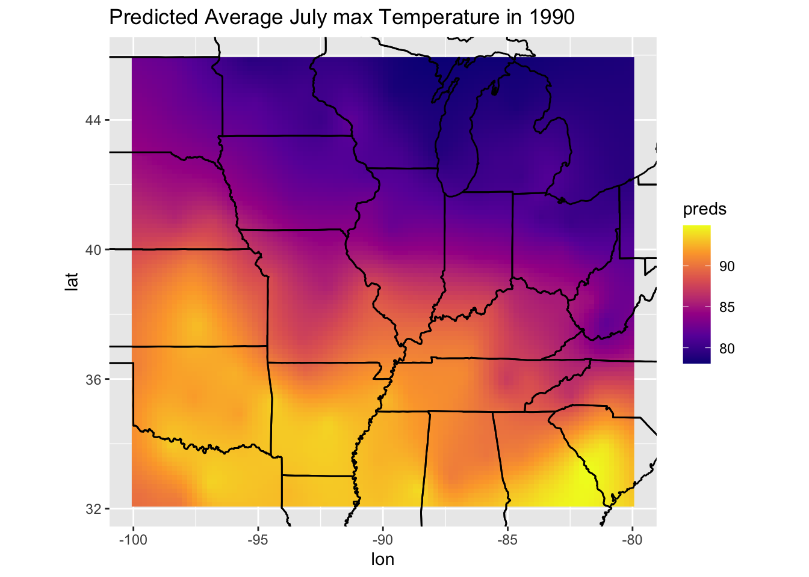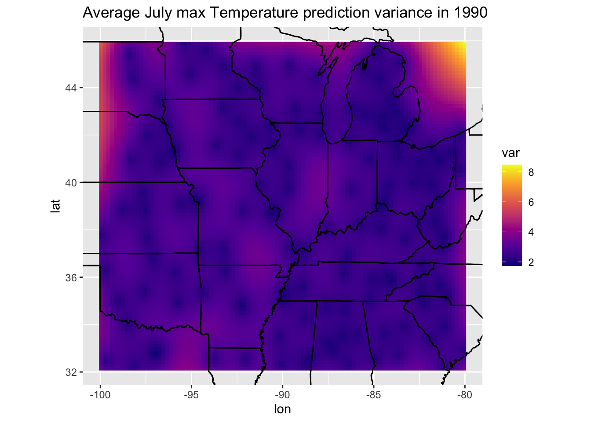


### Kriging Equations with mean $\mu = 0$


* **Assumptions -- BLUP**
    * We will assume we are wanting predictions at a single site $\mathbf{s}_0$
    * Without loss of generality, assume that $E(y(\mathbf{s})) = 0$ -- can always subtract the mean and add it back in (see code above)
    * $Cov(\mathbf{y}) = \boldsymbol{\Sigma}$ is the covariance of the data
    * $Cov(y(\mathbf{s}_0), y(\mathbf{s}_i)) = \boldsymbol{\Sigma}_{0i}$
    * The optimal prediction at unobserved location $\mathbf{s}_0$ is a **linear combination of the observed sites** $\Rightarrow$ $\hat{y}(\mathbf{s}_0) = \sum_{i=1}^n w_i y(\mathbf{s}_i)$ for a set of unknown weights $w_i$
    * The optimal predictor is **unbiased** $\Rightarrow$ $E(\hat{y}(\mathbf{s}_0)) = 0$

Therefore, unbiasedness implies that $E(\hat{y}(\mathbf{s}_0)) = \sum_{i=1}^n w_i E(y(\mathbf{s}_i)) = \sum_{i=1}^n w_i 0 = 0$. Because $\mu = 0$, this is trivially easy and we only need to minimize the variance to have the BLUP.

The MSE is 

$$
\begin{align*}
MSE & = E((\hat{y}(\mathbf{s}_0) - y(\mathbf{s}_0))^2) \\
& = E(\hat{y}(\mathbf{s}_0)^2 - 2 \hat{y}(\mathbf{s}_0) y(\mathbf{s}_0) + y(\mathbf{s}_0)^2) \\
& = E(\hat{y}(\mathbf{s}_0)^2) - 2 E(\hat{y}(\mathbf{s}_0) y(\mathbf{s}_0)) + E(y(\mathbf{s}_0)^2) 
\end{align*}
$$

Because $\mu = 0$, we have $E(\hat{y}(\mathbf{s}_0)^2) = Var(\hat{y}(\mathbf{s}_0))$, $E(y(\mathbf{s}_0)^2) = Var(y(\mathbf{s}_0))$, and $E(\hat{y}(\mathbf{s}_0)y(\mathbf{s}_0)) = Cov(\hat{y}(\mathbf{s}_0), y(\mathbf{s}_0))$. Thus, the MSE is 

\begin{align*}
MSE & = E(\hat{y}(\mathbf{s}_0)^2) - 2 E(\hat{y}(\mathbf{s}_0) y(\mathbf{s}_0)) + E(y(\mathbf{s}_0)^2) \\
& = Var(\hat{y}(\mathbf{s}_0)) - 2 Cov(\hat{y}(\mathbf{s}_0), y(\mathbf{s}_0)) + Var(y(\mathbf{s}_0)) \\
& Var \left( \sum_{i=1}^n w_i y(\mathbf{s}_i) \right) - 2 Cov( \sum_{i=1}^n w_i y(\mathbf{s}_i), y(\mathbf{s}_0)) + \Sigma_0 \\
& = \sum_{i=1}^n \sum_{j=1}^n w_i w_j \Sigma_{ij} - 2 \sum_{i=1}^n w_i \Sigma_{0i}
 + \Sigma_{00} \\
& = \mathbf{w}' \boldsymbol{\Sigma} \mathbf{w} - 2 \mathbf{w}' \boldsymbol{\Sigma}_{0} + \Sigma_{00}
\end{align*}
  
To minimize the MSE, we take a derivative with respect to the Kriging weights $\mathbf{w}$ and solve the equation when set equal to 0


\begin{align*}
\frac{\partial}{\partial \mathbf{w}} MSE & = \frac{\partial}{\partial \mathbf{w}} \mathbf{w}' \boldsymbol{\Sigma} \mathbf{w} - 2 \mathbf{w}' \boldsymbol{\Sigma}_{0} + \Sigma_{00} \\
& = 2 \boldsymbol{\Sigma} \mathbf{w} - 2 \boldsymbol{\Sigma}_{0}
\end{align*}

which has solution $\mathbf{w} = \boldsymbol{\Sigma}^{-1} \boldsymbol{\Sigma}_0$. 


### Kriging Equations with unknown mean

First, we assume the mean as the form $\mu(\mathbf{s}) = \mathbf{X}(\mathbf{s}) \boldsymbol{\beta}$ and can the regression coefficents can be estimated from the MLE (take derivative of the log-likelhood and set equal to 0 -- [generalized least squares](https://en.wikipedia.org/wiki/Generalized_least_squares)) as $\hat{\boldsymbol{\beta}} = (\mathbf{X}' \boldsymbol{\Sigma}^{-1} \mathbf{X})^{-1} \mathbf{X}' \boldsymbol{\Sigma}^{-1} \mathbf{y}$. We also assume that the covariate value $\mathbf{x}(\mathbf{s}_0)$ at the prediction location is known 

The Kriging estimate is 

$$
\begin{align*}
\hat{y}(\mathbf{s}_0) = \hat{\mu}(\mathbf{s}_0) + \boldsymbol{\Sigma}_0 \boldsymbol{\Sigma}^{-1} (y(\mathbf{s}) - \hat{\mu}(\mathbf{s})).
\end{align*}
$$

which has variance 

$$
\begin{align*}
Var(\hat{y}(\mathbf{s}_0)) = \boldsymbol{\Sigma}_{00} - \boldsymbol{\Sigma}_0 \boldsymbol{\Sigma}^{-1} \boldsymbol{\Sigma}_0,
\end{align*}
$$

Where $\boldsymbol{\Sigma}_{00}$ is the unconditional variance of the process at location $\mathbf{s}_0$. From this equation, we see that the Kriging variance is smaller than the unconditional variance.

We generate the predictive maps from the example above using the Universal Kriging formula


```r
fit_coef <- geoR::likfit(
    data         = dat$mean_Tmax,
    trend        = ~ dat$lat + dat$lon,
    coords       = cbind(dat$lat, dat$lon),
    cov.model    = "exponential",
    ini.cov.pars = c(var(dat$mean_Tmax), 1) 
)
```

```
## kappa not used for the exponential correlation function
## ---------------------------------------------------------------
## likfit: likelihood maximisation using the function optim.
## likfit: Use control() to pass additional
##          arguments for the maximisation function.
##         For further details see documentation for optim.
## likfit: It is highly advisable to run this function several
##         times with different initial values for the parameters.
## likfit: WARNING: This step can be time demanding!
## ---------------------------------------------------------------
## likfit: end of numerical maximisation.
```


```r
sigma2 <- fit_coef$nugget
tau2   <- fit_coef$sigmasq
phi    <- fit_coef$phi
beta   <- fit_coef$beta

## prediction locations
pred_locations <- expand.grid(
  seq(min(dat$lat), max(dat$lat), length.out = 100),
  seq(min(dat$lon), max(dat$lon), length.out = 100)
)
names(pred_locations) <- c("lat", "lon")
```


```r
## calculate pairwise distance matrices -- be careful with large data
locs        <- cbind(dat$lat, dat$lon)
D           <- rdist(locs)
D_unobs     <- rdist(pred_locations)
D_unobs_obs <- rdist(pred_locations, locs)

Cov           <- diag(nrow(dat)) * sigma2 + tau2 * exp( - D / phi)
Cov_unobs     <- diag(nrow(pred_locations)) * sigma2 + tau2 * exp( - D_unobs / phi)
Cov_unobs_obs <- tau2 * exp( - D_unobs_obs / phi)

Cov_inv <- solve(Cov)

## Kriging mean -- note we subtract the mean to get mean 0 then add it back in
pred_mean <- Cov_unobs_obs %*% Cov_inv %*% (dat$mean_Tmax - cbind(1, locs) %*% beta) + as.matrix(cbind(1, pred_locations)) %*% beta

## Kriging variance -- fast form
pred_var <- diag(Cov_unobs) - rowSums((Cov_unobs_obs %*% Cov_inv) * Cov_unobs_obs)
```


```r
dat_pred <- data.frame(
  preds = pred_mean,
  var   = pred_var,
  lat   = pred_locations$lat,
  lon   = pred_locations$lon
) 

ggplot(dat_pred, aes(x = lon, y = lat, fill = preds)) +
  geom_raster() +
  geom_polygon(data = states, aes(x = long, y = lat, group = group), 
               colour = "black", fill = NA) +
  scale_fill_viridis_c(option = "plasma") +
  ggtitle("Predicted Average July max Temperature in 1990") +
  coord_fixed(xlim = range(dat$lon), ylim = range(dat$lat), ratio = 1.3)

ggplot(dat_pred, aes(x = lon, y = lat, fill = var)) +
  geom_raster() +
  geom_polygon(data = states, aes(x = long, y = lat, group = group), 
               colour = "black", fill = NA) +
  scale_fill_viridis_c(option = "plasma") +
  ggtitle("Average July max Temperature prediction variance in 1990")  +
  coord_fixed(xlim = range(dat$lon), ylim = range(dat$lat), ratio = 1.3)
```

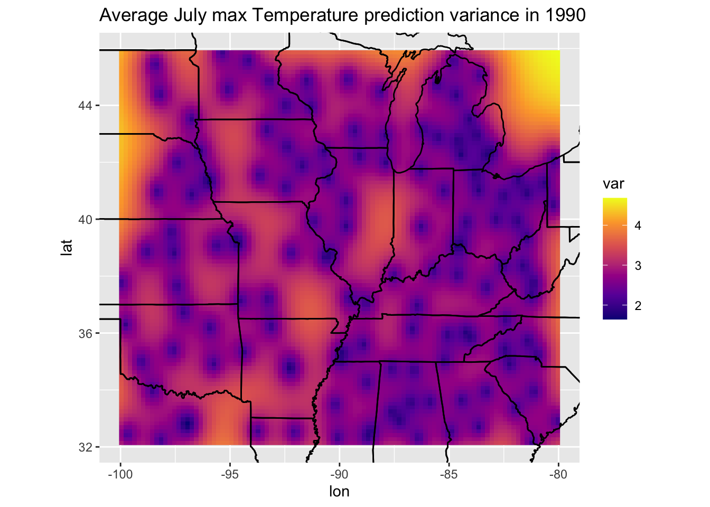
