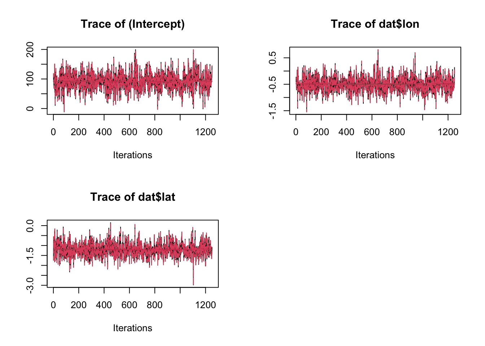
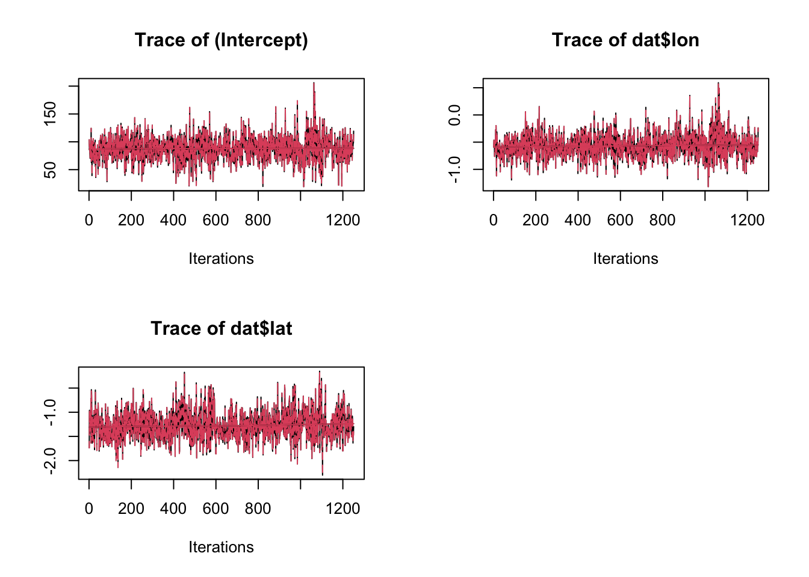
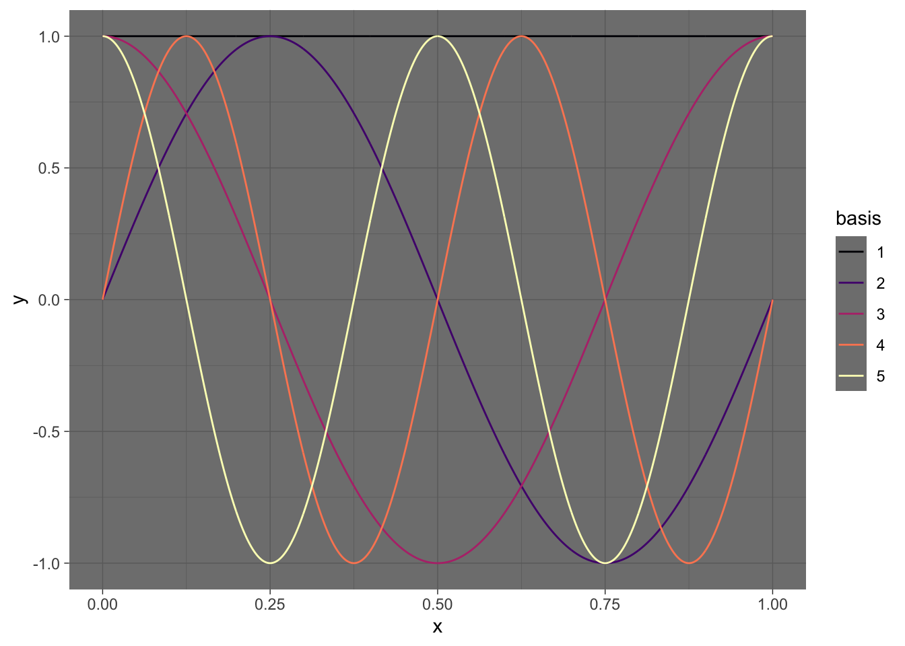
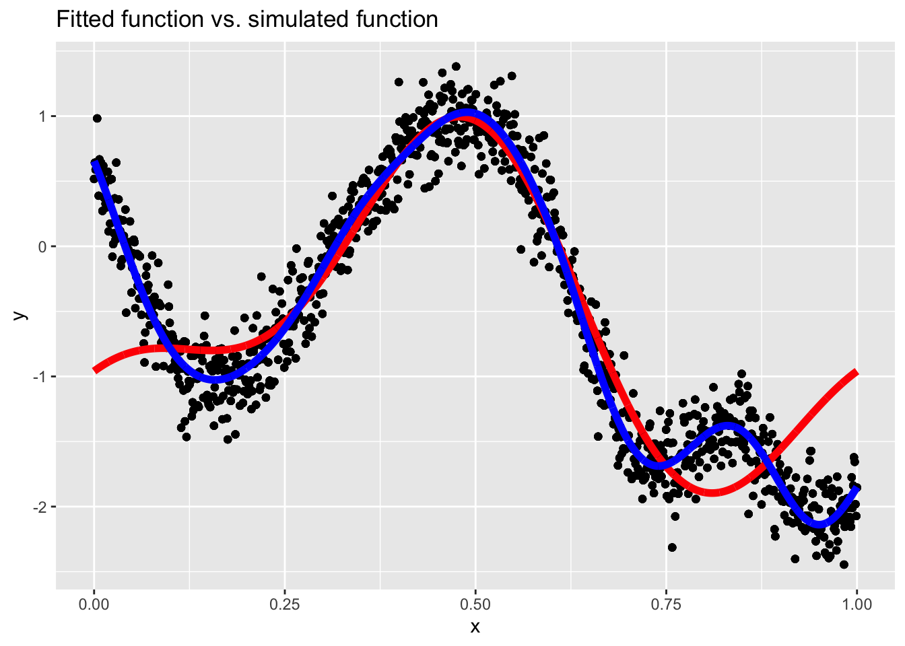
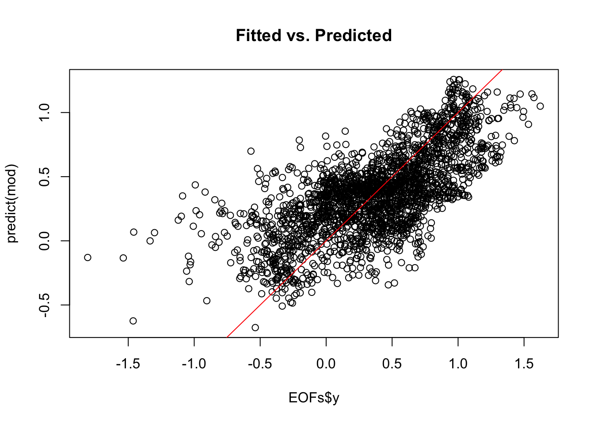
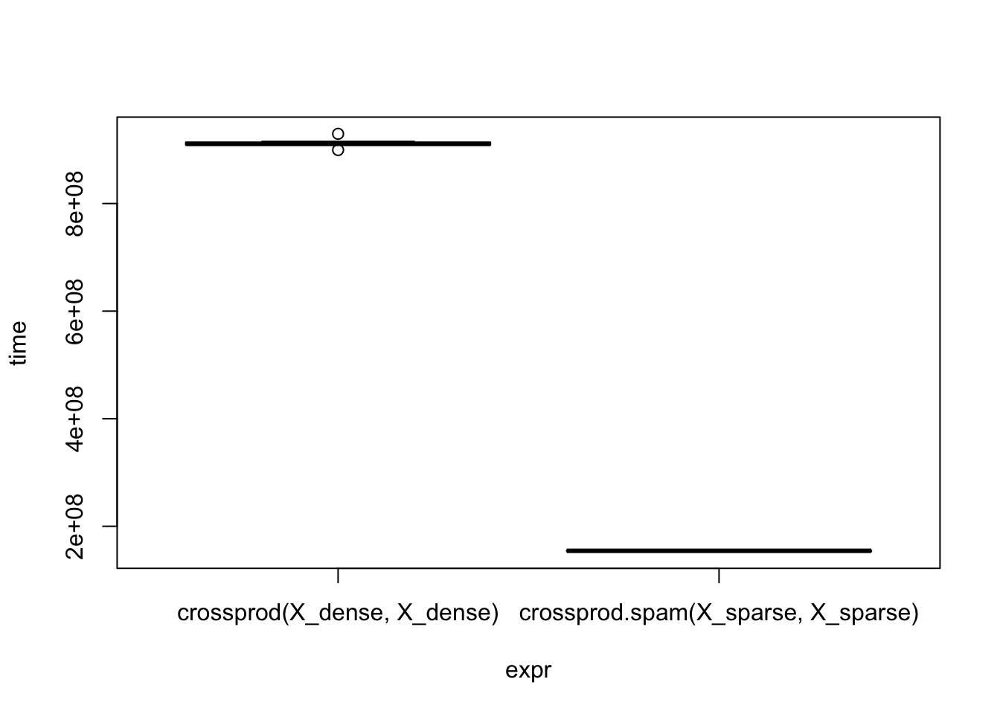

# Day 20


```r
library(tidyverse)
library(STRbook)
library(fields)
library(mvnfast)
library(fda)
library(spBayes)
library(coda)
library(mgcv)
library(glmnet)
library(microbenchmark)
```


```
## Registering fonts with R
```

```
## Scanning ttf files in /Library/Fonts/, /System/Library/Fonts ...
```

```
## Extracting .afm files from .ttf files...
```

```
## /System/Library/Fonts/Supplemental/Arial Unicode.ttf
```

```
## Warning in system2(ttf2pt1, c(args, shQuote(ttfiles[i]),
## shQuote(tmpfiles[i])), : running command ''/Users/runner/Library/Application
## Support/renv/cache/v5/R-4.1/x86_64-apple-darwin17.0/Rttf2pt1/1.3.9/
## da6ab407fa2e5e498ac980f92798cfed/Rttf2pt1/exec//ttf2pt1' -a -GfAe '/
## System/Library/Fonts/Supplemental/Arial Unicode.ttf' '/var/folders/
## 24/8k48jl6d249_n_qfxwsl6xvm0000gn/T//RtmpMIF4wT/fonts/Arial Unicode' 2>&1' had
## status 139
```

```
##  : No FontName. Skipping.
## /System/Library/Fonts/Apple Braille Outline 6 Dot.ttf
```

```
## Warning in system2(ttf2pt1, c(args, shQuote(ttfiles[i]),
## shQuote(tmpfiles[i])), : running command ''/Users/runner/Library/Application
## Support/renv/cache/v5/R-4.1/x86_64-apple-darwin17.0/Rttf2pt1/1.3.9/
## da6ab407fa2e5e498ac980f92798cfed/Rttf2pt1/exec//ttf2pt1' -a -GfAe '/
## System/Library/Fonts/Apple Braille Outline 6 Dot.ttf' '/var/folders/
## 24/8k48jl6d249_n_qfxwsl6xvm0000gn/T//RtmpMIF4wT/fonts/Apple Braille Outline 6
## Dot' 2>&1' had status 139
```

```
##  : No FontName. Skipping.
## /System/Library/Fonts/Apple Braille Outline 8 Dot.ttf
```

```
## Warning in system2(ttf2pt1, c(args, shQuote(ttfiles[i]),
## shQuote(tmpfiles[i])), : running command ''/Users/runner/Library/Application
## Support/renv/cache/v5/R-4.1/x86_64-apple-darwin17.0/Rttf2pt1/1.3.9/
## da6ab407fa2e5e498ac980f92798cfed/Rttf2pt1/exec//ttf2pt1' -a -GfAe '/
## System/Library/Fonts/Apple Braille Outline 8 Dot.ttf' '/var/folders/
## 24/8k48jl6d249_n_qfxwsl6xvm0000gn/T//RtmpMIF4wT/fonts/Apple Braille Outline 8
## Dot' 2>&1' had status 139
```

```
##  : No FontName. Skipping.
## /System/Library/Fonts/Apple Braille Pinpoint 6 Dot.ttf
```

```
## Warning in system2(ttf2pt1, c(args, shQuote(ttfiles[i]),
## shQuote(tmpfiles[i])), : running command ''/Users/runner/Library/Application
## Support/renv/cache/v5/R-4.1/x86_64-apple-darwin17.0/Rttf2pt1/1.3.9/
## da6ab407fa2e5e498ac980f92798cfed/Rttf2pt1/exec//ttf2pt1' -a -GfAe '/
## System/Library/Fonts/Apple Braille Pinpoint 6 Dot.ttf' '/var/folders/
## 24/8k48jl6d249_n_qfxwsl6xvm0000gn/T//RtmpMIF4wT/fonts/Apple Braille Pinpoint 6
## Dot' 2>&1' had status 139
```

```
##  : No FontName. Skipping.
## /System/Library/Fonts/Apple Braille Pinpoint 8 Dot.ttf
```

```
## Warning in system2(ttf2pt1, c(args, shQuote(ttfiles[i]),
## shQuote(tmpfiles[i])), : running command ''/Users/runner/Library/Application
## Support/renv/cache/v5/R-4.1/x86_64-apple-darwin17.0/Rttf2pt1/1.3.9/
## da6ab407fa2e5e498ac980f92798cfed/Rttf2pt1/exec//ttf2pt1' -a -GfAe '/
## System/Library/Fonts/Apple Braille Pinpoint 8 Dot.ttf' '/var/folders/
## 24/8k48jl6d249_n_qfxwsl6xvm0000gn/T//RtmpMIF4wT/fonts/Apple Braille Pinpoint 8
## Dot' 2>&1' had status 139
```

```
##  : No FontName. Skipping.
## /System/Library/Fonts/Apple Braille.ttf
```

```
## Warning in system2(ttf2pt1, c(args, shQuote(ttfiles[i]),
## shQuote(tmpfiles[i])), : running command ''/Users/runner/Library/
## Application Support/renv/cache/v5/R-4.1/x86_64-apple-darwin17.0/
## Rttf2pt1/1.3.9/da6ab407fa2e5e498ac980f92798cfed/Rttf2pt1/exec//ttf2pt1'
## -a -GfAe '/System/Library/Fonts/Apple Braille.ttf' '/var/folders/
## 24/8k48jl6d249_n_qfxwsl6xvm0000gn/T//RtmpMIF4wT/fonts/Apple Braille' 2>&1' had
## status 139
```

```
##  : No FontName. Skipping.
## /System/Library/Fonts/Apple Symbols.ttf
```

```
## Warning in system2(ttf2pt1, c(args, shQuote(ttfiles[i]),
## shQuote(tmpfiles[i])), : running command ''/Users/runner/Library/
## Application Support/renv/cache/v5/R-4.1/x86_64-apple-darwin17.0/
## Rttf2pt1/1.3.9/da6ab407fa2e5e498ac980f92798cfed/Rttf2pt1/exec//ttf2pt1'
## -a -GfAe '/System/Library/Fonts/Apple Symbols.ttf' '/var/folders/
## 24/8k48jl6d249_n_qfxwsl6xvm0000gn/T//RtmpMIF4wT/fonts/Apple Symbols' 2>&1' had
## status 1
```

```
##  : No FontName. Skipping.
## /System/Library/Fonts/Keyboard.ttf
```

```
## Warning in system2(ttf2pt1, c(args, shQuote(ttfiles[i]),
## shQuote(tmpfiles[i])), : running command ''/Users/runner/Library/Application
## Support/renv/cache/v5/R-4.1/x86_64-apple-darwin17.0/Rttf2pt1/1.3.9/
## da6ab407fa2e5e498ac980f92798cfed/Rttf2pt1/exec//ttf2pt1' -a -GfAe '/System/
## Library/Fonts/Keyboard.ttf' '/var/folders/24/8k48jl6d249_n_qfxwsl6xvm0000gn/T//
## RtmpMIF4wT/fonts/Keyboard' 2>&1' had status 139
```

```
##  : No FontName. Skipping.
## /System/Library/Fonts/NewYork.ttf
```

```
## Warning in system2(ttf2pt1, c(args, shQuote(ttfiles[i]),
## shQuote(tmpfiles[i])), : running command ''/Users/runner/Library/Application
## Support/renv/cache/v5/R-4.1/x86_64-apple-darwin17.0/Rttf2pt1/1.3.9/
## da6ab407fa2e5e498ac980f92798cfed/Rttf2pt1/exec//ttf2pt1' -a -GfAe '/System/
## Library/Fonts/NewYork.ttf' '/var/folders/24/8k48jl6d249_n_qfxwsl6xvm0000gn/T//
## RtmpMIF4wT/fonts/NewYork' 2>&1' had status 139
```

```
##  : No FontName. Skipping.
## /System/Library/Fonts/NewYorkItalic.ttf
```

```
## Warning in system2(ttf2pt1, c(args, shQuote(ttfiles[i]),
## shQuote(tmpfiles[i])), : running command ''/Users/runner/Library/
## Application Support/renv/cache/v5/R-4.1/x86_64-apple-darwin17.0/
## Rttf2pt1/1.3.9/da6ab407fa2e5e498ac980f92798cfed/Rttf2pt1/exec//ttf2pt1'
## -a -GfAe '/System/Library/Fonts/NewYorkItalic.ttf' '/var/folders/
## 24/8k48jl6d249_n_qfxwsl6xvm0000gn/T//RtmpMIF4wT/fonts/NewYorkItalic' 2>&1' had
## status 139
```

```
##  : No FontName. Skipping.
## /System/Library/Fonts/SFCompact.ttf
```

```
## Warning in system2(ttf2pt1, c(args, shQuote(ttfiles[i]),
## shQuote(tmpfiles[i])), : running command ''/Users/runner/Library/Application
## Support/renv/cache/v5/R-4.1/x86_64-apple-darwin17.0/Rttf2pt1/1.3.9/
## da6ab407fa2e5e498ac980f92798cfed/Rttf2pt1/exec//ttf2pt1' -a -GfAe '/System/
## Library/Fonts/SFCompact.ttf' '/var/folders/24/8k48jl6d249_n_qfxwsl6xvm0000gn/T//
## RtmpMIF4wT/fonts/SFCompact' 2>&1' had status 139
```

```
##  : No FontName. Skipping.
## /System/Library/Fonts/SFCompactItalic.ttf
```

```
## Warning in system2(ttf2pt1, c(args, shQuote(ttfiles[i]),
## shQuote(tmpfiles[i])), : running command ''/Users/runner/Library/
## Application Support/renv/cache/v5/R-4.1/x86_64-apple-darwin17.0/
## Rttf2pt1/1.3.9/da6ab407fa2e5e498ac980f92798cfed/Rttf2pt1/exec//ttf2pt1'
## -a -GfAe '/System/Library/Fonts/SFCompactItalic.ttf' '/var/folders/
## 24/8k48jl6d249_n_qfxwsl6xvm0000gn/T//RtmpMIF4wT/fonts/SFCompactItalic' 2>&1' had
## status 139
```

```
##  : No FontName. Skipping.
## /System/Library/Fonts/SFCompactRounded.ttf
```

```
## Warning in system2(ttf2pt1, c(args, shQuote(ttfiles[i]),
## shQuote(tmpfiles[i])), : running command ''/Users/runner/Library/
## Application Support/renv/cache/v5/R-4.1/x86_64-apple-darwin17.0/
## Rttf2pt1/1.3.9/da6ab407fa2e5e498ac980f92798cfed/Rttf2pt1/exec//ttf2pt1'
## -a -GfAe '/System/Library/Fonts/SFCompactRounded.ttf' '/var/folders/
## 24/8k48jl6d249_n_qfxwsl6xvm0000gn/T//RtmpMIF4wT/fonts/SFCompactRounded' 2>&1'
## had status 139
```

```
##  : No FontName. Skipping.
## /System/Library/Fonts/SFNS.ttf
```

```
## Warning in system2(ttf2pt1, c(args, shQuote(ttfiles[i]),
## shQuote(tmpfiles[i])), : running command ''/Users/runner/Library/Application
## Support/renv/cache/v5/R-4.1/x86_64-apple-darwin17.0/Rttf2pt1/1.3.9/
## da6ab407fa2e5e498ac980f92798cfed/Rttf2pt1/exec//ttf2pt1' -a -GfAe '/System/
## Library/Fonts/SFNS.ttf' '/var/folders/24/8k48jl6d249_n_qfxwsl6xvm0000gn/T//
## RtmpMIF4wT/fonts/SFNS' 2>&1' had status 139
```

```
##  : No FontName. Skipping.
## /System/Library/Fonts/SFNSItalic.ttf
```

```
## Warning in system2(ttf2pt1, c(args, shQuote(ttfiles[i]),
## shQuote(tmpfiles[i])), : running command ''/Users/runner/Library/Application
## Support/renv/cache/v5/R-4.1/x86_64-apple-darwin17.0/Rttf2pt1/1.3.9/
## da6ab407fa2e5e498ac980f92798cfed/Rttf2pt1/exec//ttf2pt1' -a -GfAe '/System/
## Library/Fonts/SFNSItalic.ttf' '/var/folders/24/8k48jl6d249_n_qfxwsl6xvm0000gn/
## T//RtmpMIF4wT/fonts/SFNSItalic' 2>&1' had status 139
```

```
##  : No FontName. Skipping.
## /System/Library/Fonts/SFNSMono.ttf
```

```
## Warning in system2(ttf2pt1, c(args, shQuote(ttfiles[i]),
## shQuote(tmpfiles[i])), : running command ''/Users/runner/Library/Application
## Support/renv/cache/v5/R-4.1/x86_64-apple-darwin17.0/Rttf2pt1/1.3.9/
## da6ab407fa2e5e498ac980f92798cfed/Rttf2pt1/exec//ttf2pt1' -a -GfAe '/System/
## Library/Fonts/SFNSMono.ttf' '/var/folders/24/8k48jl6d249_n_qfxwsl6xvm0000gn/T//
## RtmpMIF4wT/fonts/SFNSMono' 2>&1' had status 139
```

```
##  : No FontName. Skipping.
## /System/Library/Fonts/SFNSMonoItalic.ttf
```

```
## Warning in system2(ttf2pt1, c(args, shQuote(ttfiles[i]),
## shQuote(tmpfiles[i])), : running command ''/Users/runner/Library/
## Application Support/renv/cache/v5/R-4.1/x86_64-apple-darwin17.0/
## Rttf2pt1/1.3.9/da6ab407fa2e5e498ac980f92798cfed/Rttf2pt1/exec//ttf2pt1'
## -a -GfAe '/System/Library/Fonts/SFNSMonoItalic.ttf' '/var/folders/
## 24/8k48jl6d249_n_qfxwsl6xvm0000gn/T//RtmpMIF4wT/fonts/SFNSMonoItalic' 2>&1' had
## status 139
```

```
##  : No FontName. Skipping.
## /System/Library/Fonts/SFNSRounded.ttf
```

```
## Warning in system2(ttf2pt1, c(args, shQuote(ttfiles[i]),
## shQuote(tmpfiles[i])), : running command ''/Users/runner/Library/Application
## Support/renv/cache/v5/R-4.1/x86_64-apple-darwin17.0/Rttf2pt1/1.3.9/
## da6ab407fa2e5e498ac980f92798cfed/Rttf2pt1/exec//ttf2pt1' -a -GfAe '/System/
## Library/Fonts/SFNSRounded.ttf' '/var/folders/24/8k48jl6d249_n_qfxwsl6xvm0000gn/
## T//RtmpMIF4wT/fonts/SFNSRounded' 2>&1' had status 139
```

```
##  : No FontName. Skipping.
## /System/Library/Fonts/Supplemental/Academy Engraved LET Fonts.ttf
```

```
## Warning in system2(ttf2pt1, c(args, shQuote(ttfiles[i]),
## shQuote(tmpfiles[i])), : running command ''/Users/runner/Library/Application
## Support/renv/cache/v5/R-4.1/x86_64-apple-darwin17.0/Rttf2pt1/1.3.9/
## da6ab407fa2e5e498ac980f92798cfed/Rttf2pt1/exec//ttf2pt1' -a -GfAe '/System/
## Library/Fonts/Supplemental/Academy Engraved LET Fonts.ttf' '/var/folders/
## 24/8k48jl6d249_n_qfxwsl6xvm0000gn/T//RtmpMIF4wT/fonts/Academy Engraved LET
## Fonts' 2>&1' had status 139
```

```
##  : No FontName. Skipping.
## /System/Library/Fonts/Supplemental/Andale Mono.ttf
```

```
## Warning in system2(ttf2pt1, c(args, shQuote(ttfiles[i]),
## shQuote(tmpfiles[i])), : running command ''/Users/runner/Library/Application
## Support/renv/cache/v5/R-4.1/x86_64-apple-darwin17.0/Rttf2pt1/1.3.9/
## da6ab407fa2e5e498ac980f92798cfed/Rttf2pt1/exec//ttf2pt1' -a -GfAe '/
## System/Library/Fonts/Supplemental/Andale Mono.ttf' '/var/folders/
## 24/8k48jl6d249_n_qfxwsl6xvm0000gn/T//RtmpMIF4wT/fonts/Andale Mono' 2>&1' had
## status 139
```

```
##  : No FontName. Skipping.
## /System/Library/Fonts/Supplemental/Apple Chancery.ttf
```

```
## Warning in system2(ttf2pt1, c(args, shQuote(ttfiles[i]),
## shQuote(tmpfiles[i])), : running command ''/Users/runner/Library/Application
## Support/renv/cache/v5/R-4.1/x86_64-apple-darwin17.0/Rttf2pt1/1.3.9/
## da6ab407fa2e5e498ac980f92798cfed/Rttf2pt1/exec//ttf2pt1' -a -GfAe '/
## System/Library/Fonts/Supplemental/Apple Chancery.ttf' '/var/folders/
## 24/8k48jl6d249_n_qfxwsl6xvm0000gn/T//RtmpMIF4wT/fonts/Apple Chancery' 2>&1' had
## status 139
```

```
##  : No FontName. Skipping.
## /System/Library/Fonts/Supplemental/AppleGothic.ttf
```

```
## Warning in system2(ttf2pt1, c(args, shQuote(ttfiles[i]),
## shQuote(tmpfiles[i])), : running command ''/Users/runner/Library/Application
## Support/renv/cache/v5/R-4.1/x86_64-apple-darwin17.0/Rttf2pt1/1.3.9/
## da6ab407fa2e5e498ac980f92798cfed/Rttf2pt1/exec//ttf2pt1' -a -GfAe '/
## System/Library/Fonts/Supplemental/AppleGothic.ttf' '/var/folders/
## 24/8k48jl6d249_n_qfxwsl6xvm0000gn/T//RtmpMIF4wT/fonts/AppleGothic' 2>&1' had
## status 139
```

```
##  : No FontName. Skipping.
## /System/Library/Fonts/Supplemental/AppleMyungjo.ttf
```

```
## Warning in system2(ttf2pt1, c(args, shQuote(ttfiles[i]),
## shQuote(tmpfiles[i])), : running command ''/Users/runner/Library/Application
## Support/renv/cache/v5/R-4.1/x86_64-apple-darwin17.0/Rttf2pt1/1.3.9/
## da6ab407fa2e5e498ac980f92798cfed/Rttf2pt1/exec//ttf2pt1' -a -GfAe '/
## System/Library/Fonts/Supplemental/AppleMyungjo.ttf' '/var/folders/
## 24/8k48jl6d249_n_qfxwsl6xvm0000gn/T//RtmpMIF4wT/fonts/AppleMyungjo' 2>&1' had
## status 139
```

```
##  : No FontName. Skipping.
## /System/Library/Fonts/Supplemental/Arial Black.ttf
```

```
## Warning in system2(ttf2pt1, c(args, shQuote(ttfiles[i]),
## shQuote(tmpfiles[i])), : running command ''/Users/runner/Library/Application
## Support/renv/cache/v5/R-4.1/x86_64-apple-darwin17.0/Rttf2pt1/1.3.9/
## da6ab407fa2e5e498ac980f92798cfed/Rttf2pt1/exec//ttf2pt1' -a -GfAe '/
## System/Library/Fonts/Supplemental/Arial Black.ttf' '/var/folders/
## 24/8k48jl6d249_n_qfxwsl6xvm0000gn/T//RtmpMIF4wT/fonts/Arial Black' 2>&1' had
## status 139
```

```
##  : No FontName. Skipping.
## /System/Library/Fonts/Supplemental/Arial Bold Italic.ttf
```

```
## Warning in system2(ttf2pt1, c(args, shQuote(ttfiles[i]),
## shQuote(tmpfiles[i])), : running command ''/Users/runner/Library/Application
## Support/renv/cache/v5/R-4.1/x86_64-apple-darwin17.0/Rttf2pt1/1.3.9/
## da6ab407fa2e5e498ac980f92798cfed/Rttf2pt1/exec//ttf2pt1' -a -GfAe '/
## System/Library/Fonts/Supplemental/Arial Bold Italic.ttf' '/var/folders/
## 24/8k48jl6d249_n_qfxwsl6xvm0000gn/T//RtmpMIF4wT/fonts/Arial Bold Italic' 2>&1'
## had status 139
```

```
##  : No FontName. Skipping.
## /System/Library/Fonts/Supplemental/Arial Bold.ttf
```

```
## Warning in system2(ttf2pt1, c(args, shQuote(ttfiles[i]),
## shQuote(tmpfiles[i])), : running command ''/Users/runner/Library/
## Application Support/renv/cache/v5/R-4.1/x86_64-apple-darwin17.0/
## Rttf2pt1/1.3.9/da6ab407fa2e5e498ac980f92798cfed/Rttf2pt1/exec//ttf2pt1' -a
## -GfAe '/System/Library/Fonts/Supplemental/Arial Bold.ttf' '/var/folders/
## 24/8k48jl6d249_n_qfxwsl6xvm0000gn/T//RtmpMIF4wT/fonts/Arial Bold' 2>&1' had
## status 139
```

```
##  : No FontName. Skipping.
## /System/Library/Fonts/Supplemental/Arial Italic.ttf
```

```
## Warning in system2(ttf2pt1, c(args, shQuote(ttfiles[i]),
## shQuote(tmpfiles[i])), : running command ''/Users/runner/Library/Application
## Support/renv/cache/v5/R-4.1/x86_64-apple-darwin17.0/Rttf2pt1/1.3.9/
## da6ab407fa2e5e498ac980f92798cfed/Rttf2pt1/exec//ttf2pt1' -a -GfAe '/
## System/Library/Fonts/Supplemental/Arial Italic.ttf' '/var/folders/
## 24/8k48jl6d249_n_qfxwsl6xvm0000gn/T//RtmpMIF4wT/fonts/Arial Italic' 2>&1' had
## status 139
```

```
##  : No FontName. Skipping.
## /System/Library/Fonts/Supplemental/Arial Narrow Bold Italic.ttf
```

```
## Warning in system2(ttf2pt1, c(args, shQuote(ttfiles[i]),
## shQuote(tmpfiles[i])), : running command ''/Users/runner/Library/Application
## Support/renv/cache/v5/R-4.1/x86_64-apple-darwin17.0/Rttf2pt1/1.3.9/
## da6ab407fa2e5e498ac980f92798cfed/Rttf2pt1/exec//ttf2pt1' -a -GfAe '/System/
## Library/Fonts/Supplemental/Arial Narrow Bold Italic.ttf' '/var/folders/
## 24/8k48jl6d249_n_qfxwsl6xvm0000gn/T//RtmpMIF4wT/fonts/Arial Narrow Bold Italic'
## 2>&1' had status 139
```

```
##  : No FontName. Skipping.
## /System/Library/Fonts/Supplemental/Arial Narrow Bold.ttf
```

```
## Warning in system2(ttf2pt1, c(args, shQuote(ttfiles[i]),
## shQuote(tmpfiles[i])), : running command ''/Users/runner/Library/Application
## Support/renv/cache/v5/R-4.1/x86_64-apple-darwin17.0/Rttf2pt1/1.3.9/
## da6ab407fa2e5e498ac980f92798cfed/Rttf2pt1/exec//ttf2pt1' -a -GfAe '/
## System/Library/Fonts/Supplemental/Arial Narrow Bold.ttf' '/var/folders/
## 24/8k48jl6d249_n_qfxwsl6xvm0000gn/T//RtmpMIF4wT/fonts/Arial Narrow Bold' 2>&1'
## had status 139
```

```
##  : No FontName. Skipping.
## /System/Library/Fonts/Supplemental/Arial Narrow Italic.ttf
```

```
## Warning in system2(ttf2pt1, c(args, shQuote(ttfiles[i]),
## shQuote(tmpfiles[i])), : running command ''/Users/runner/Library/Application
## Support/renv/cache/v5/R-4.1/x86_64-apple-darwin17.0/Rttf2pt1/1.3.9/
## da6ab407fa2e5e498ac980f92798cfed/Rttf2pt1/exec//ttf2pt1' -a -GfAe '/
## System/Library/Fonts/Supplemental/Arial Narrow Italic.ttf' '/var/folders/
## 24/8k48jl6d249_n_qfxwsl6xvm0000gn/T//RtmpMIF4wT/fonts/Arial Narrow Italic' 2>&1'
## had status 139
```

```
##  : No FontName. Skipping.
## /System/Library/Fonts/Supplemental/Arial Narrow.ttf
```

```
## Warning in system2(ttf2pt1, c(args, shQuote(ttfiles[i]),
## shQuote(tmpfiles[i])), : running command ''/Users/runner/Library/Application
## Support/renv/cache/v5/R-4.1/x86_64-apple-darwin17.0/Rttf2pt1/1.3.9/
## da6ab407fa2e5e498ac980f92798cfed/Rttf2pt1/exec//ttf2pt1' -a -GfAe '/
## System/Library/Fonts/Supplemental/Arial Narrow.ttf' '/var/folders/
## 24/8k48jl6d249_n_qfxwsl6xvm0000gn/T//RtmpMIF4wT/fonts/Arial Narrow' 2>&1' had
## status 139
```

```
##  : No FontName. Skipping.
## /System/Library/Fonts/Supplemental/Arial Rounded Bold.ttf
```

```
## Warning in system2(ttf2pt1, c(args, shQuote(ttfiles[i]),
## shQuote(tmpfiles[i])), : running command ''/Users/runner/Library/Application
## Support/renv/cache/v5/R-4.1/x86_64-apple-darwin17.0/Rttf2pt1/1.3.9/
## da6ab407fa2e5e498ac980f92798cfed/Rttf2pt1/exec//ttf2pt1' -a -GfAe '/
## System/Library/Fonts/Supplemental/Arial Rounded Bold.ttf' '/var/folders/
## 24/8k48jl6d249_n_qfxwsl6xvm0000gn/T//RtmpMIF4wT/fonts/Arial Rounded Bold' 2>&1'
## had status 139
```

```
##  : No FontName. Skipping.
## /System/Library/Fonts/Supplemental/Arial Unicode.ttf
```

```
## Warning in system2(ttf2pt1, c(args, shQuote(ttfiles[i]),
## shQuote(tmpfiles[i])), : running command ''/Users/runner/Library/Application
## Support/renv/cache/v5/R-4.1/x86_64-apple-darwin17.0/Rttf2pt1/1.3.9/
## da6ab407fa2e5e498ac980f92798cfed/Rttf2pt1/exec//ttf2pt1' -a -GfAe '/
## System/Library/Fonts/Supplemental/Arial Unicode.ttf' '/var/folders/
## 24/8k48jl6d249_n_qfxwsl6xvm0000gn/T//RtmpMIF4wT/fonts/Arial Unicode' 2>&1' had
## status 139
```

```
##  : No FontName. Skipping.
## /System/Library/Fonts/Supplemental/Arial.ttf
```

```
## Warning in system2(ttf2pt1, c(args, shQuote(ttfiles[i]),
## shQuote(tmpfiles[i])), : running command ''/Users/runner/Library/
## Application Support/renv/cache/v5/R-4.1/x86_64-apple-darwin17.0/
## Rttf2pt1/1.3.9/da6ab407fa2e5e498ac980f92798cfed/Rttf2pt1/exec//ttf2pt1'
## -a -GfAe '/System/Library/Fonts/Supplemental/Arial.ttf' '/var/folders/
## 24/8k48jl6d249_n_qfxwsl6xvm0000gn/T//RtmpMIF4wT/fonts/Arial' 2>&1' had status
## 139
```

```
##  : No FontName. Skipping.
## /System/Library/Fonts/Supplemental/Ayuthaya.ttf
```

```
## Warning in system2(ttf2pt1, c(args, shQuote(ttfiles[i]),
## shQuote(tmpfiles[i])), : running command ''/Users/runner/Library/
## Application Support/renv/cache/v5/R-4.1/x86_64-apple-darwin17.0/
## Rttf2pt1/1.3.9/da6ab407fa2e5e498ac980f92798cfed/Rttf2pt1/exec//ttf2pt1'
## -a -GfAe '/System/Library/Fonts/Supplemental/Ayuthaya.ttf' '/var/folders/
## 24/8k48jl6d249_n_qfxwsl6xvm0000gn/T//RtmpMIF4wT/fonts/Ayuthaya' 2>&1' had status
## 139
```

```
##  : No FontName. Skipping.
## /System/Library/Fonts/Supplemental/BigCaslon.ttf
```

```
## Warning in system2(ttf2pt1, c(args, shQuote(ttfiles[i]),
## shQuote(tmpfiles[i])), : running command ''/Users/runner/Library/
## Application Support/renv/cache/v5/R-4.1/x86_64-apple-darwin17.0/
## Rttf2pt1/1.3.9/da6ab407fa2e5e498ac980f92798cfed/Rttf2pt1/exec//ttf2pt1'
## -a -GfAe '/System/Library/Fonts/Supplemental/BigCaslon.ttf' '/var/folders/
## 24/8k48jl6d249_n_qfxwsl6xvm0000gn/T//RtmpMIF4wT/fonts/BigCaslon' 2>&1' had
## status 139
```

```
##  : No FontName. Skipping.
## /System/Library/Fonts/Supplemental/Bodoni 72 Smallcaps Book.ttf
```

```
## Warning in system2(ttf2pt1, c(args, shQuote(ttfiles[i]),
## shQuote(tmpfiles[i])), : running command ''/Users/runner/Library/Application
## Support/renv/cache/v5/R-4.1/x86_64-apple-darwin17.0/Rttf2pt1/1.3.9/
## da6ab407fa2e5e498ac980f92798cfed/Rttf2pt1/exec//ttf2pt1' -a -GfAe '/System/
## Library/Fonts/Supplemental/Bodoni 72 Smallcaps Book.ttf' '/var/folders/
## 24/8k48jl6d249_n_qfxwsl6xvm0000gn/T//RtmpMIF4wT/fonts/Bodoni 72 Smallcaps Book'
## 2>&1' had status 139
```

```
##  : No FontName. Skipping.
## /System/Library/Fonts/Supplemental/Bodoni Ornaments.ttf
```

```
## Warning in system2(ttf2pt1, c(args, shQuote(ttfiles[i]),
## shQuote(tmpfiles[i])), : running command ''/Users/runner/Library/Application
## Support/renv/cache/v5/R-4.1/x86_64-apple-darwin17.0/Rttf2pt1/1.3.9/
## da6ab407fa2e5e498ac980f92798cfed/Rttf2pt1/exec//ttf2pt1' -a -GfAe '/
## System/Library/Fonts/Supplemental/Bodoni Ornaments.ttf' '/var/folders/
## 24/8k48jl6d249_n_qfxwsl6xvm0000gn/T//RtmpMIF4wT/fonts/Bodoni Ornaments' 2>&1'
## had status 139
```

```
##  : No FontName. Skipping.
## /System/Library/Fonts/Supplemental/Bradley Hand Bold.ttf
```

```
## Warning in system2(ttf2pt1, c(args, shQuote(ttfiles[i]),
## shQuote(tmpfiles[i])), : running command ''/Users/runner/Library/Application
## Support/renv/cache/v5/R-4.1/x86_64-apple-darwin17.0/Rttf2pt1/1.3.9/
## da6ab407fa2e5e498ac980f92798cfed/Rttf2pt1/exec//ttf2pt1' -a -GfAe '/
## System/Library/Fonts/Supplemental/Bradley Hand Bold.ttf' '/var/folders/
## 24/8k48jl6d249_n_qfxwsl6xvm0000gn/T//RtmpMIF4wT/fonts/Bradley Hand Bold' 2>&1'
## had status 139
```

```
##  : No FontName. Skipping.
## /System/Library/Fonts/Supplemental/Brush Script.ttf
```

```
## Warning in system2(ttf2pt1, c(args, shQuote(ttfiles[i]),
## shQuote(tmpfiles[i])), : running command ''/Users/runner/Library/Application
## Support/renv/cache/v5/R-4.1/x86_64-apple-darwin17.0/Rttf2pt1/1.3.9/
## da6ab407fa2e5e498ac980f92798cfed/Rttf2pt1/exec//ttf2pt1' -a -GfAe '/
## System/Library/Fonts/Supplemental/Brush Script.ttf' '/var/folders/
## 24/8k48jl6d249_n_qfxwsl6xvm0000gn/T//RtmpMIF4wT/fonts/Brush Script' 2>&1' had
## status 139
```

```
##  : No FontName. Skipping.
## /System/Library/Fonts/Supplemental/Chalkduster.ttf
```

```
## Warning in system2(ttf2pt1, c(args, shQuote(ttfiles[i]),
## shQuote(tmpfiles[i])), : running command ''/Users/runner/Library/Application
## Support/renv/cache/v5/R-4.1/x86_64-apple-darwin17.0/Rttf2pt1/1.3.9/
## da6ab407fa2e5e498ac980f92798cfed/Rttf2pt1/exec//ttf2pt1' -a -GfAe '/
## System/Library/Fonts/Supplemental/Chalkduster.ttf' '/var/folders/
## 24/8k48jl6d249_n_qfxwsl6xvm0000gn/T//RtmpMIF4wT/fonts/Chalkduster' 2>&1' had
## status 139
```

```
##  : No FontName. Skipping.
## /System/Library/Fonts/Supplemental/Comic Sans MS Bold.ttf
```

```
## Warning in system2(ttf2pt1, c(args, shQuote(ttfiles[i]),
## shQuote(tmpfiles[i])), : running command ''/Users/runner/Library/Application
## Support/renv/cache/v5/R-4.1/x86_64-apple-darwin17.0/Rttf2pt1/1.3.9/
## da6ab407fa2e5e498ac980f92798cfed/Rttf2pt1/exec//ttf2pt1' -a -GfAe '/
## System/Library/Fonts/Supplemental/Comic Sans MS Bold.ttf' '/var/folders/
## 24/8k48jl6d249_n_qfxwsl6xvm0000gn/T//RtmpMIF4wT/fonts/Comic Sans MS Bold' 2>&1'
## had status 139
```

```
##  : No FontName. Skipping.
## /System/Library/Fonts/Supplemental/Comic Sans MS.ttf
```

```
## Warning in system2(ttf2pt1, c(args, shQuote(ttfiles[i]),
## shQuote(tmpfiles[i])), : running command ''/Users/runner/Library/Application
## Support/renv/cache/v5/R-4.1/x86_64-apple-darwin17.0/Rttf2pt1/1.3.9/
## da6ab407fa2e5e498ac980f92798cfed/Rttf2pt1/exec//ttf2pt1' -a -GfAe '/
## System/Library/Fonts/Supplemental/Comic Sans MS.ttf' '/var/folders/
## 24/8k48jl6d249_n_qfxwsl6xvm0000gn/T//RtmpMIF4wT/fonts/Comic Sans MS' 2>&1' had
## status 139
```

```
##  : No FontName. Skipping.
## /System/Library/Fonts/Supplemental/Courier New Bold Italic.ttf
```

```
## Warning in system2(ttf2pt1, c(args, shQuote(ttfiles[i]),
## shQuote(tmpfiles[i])), : running command ''/Users/runner/Library/Application
## Support/renv/cache/v5/R-4.1/x86_64-apple-darwin17.0/Rttf2pt1/1.3.9/
## da6ab407fa2e5e498ac980f92798cfed/Rttf2pt1/exec//ttf2pt1' -a -GfAe '/System/
## Library/Fonts/Supplemental/Courier New Bold Italic.ttf' '/var/folders/
## 24/8k48jl6d249_n_qfxwsl6xvm0000gn/T//RtmpMIF4wT/fonts/Courier New Bold Italic'
## 2>&1' had status 139
```

```
##  : No FontName. Skipping.
## /System/Library/Fonts/Supplemental/Courier New Bold.ttf
```

```
## Warning in system2(ttf2pt1, c(args, shQuote(ttfiles[i]),
## shQuote(tmpfiles[i])), : running command ''/Users/runner/Library/Application
## Support/renv/cache/v5/R-4.1/x86_64-apple-darwin17.0/Rttf2pt1/1.3.9/
## da6ab407fa2e5e498ac980f92798cfed/Rttf2pt1/exec//ttf2pt1' -a -GfAe '/
## System/Library/Fonts/Supplemental/Courier New Bold.ttf' '/var/folders/
## 24/8k48jl6d249_n_qfxwsl6xvm0000gn/T//RtmpMIF4wT/fonts/Courier New Bold' 2>&1'
## had status 139
```

```
##  : No FontName. Skipping.
## /System/Library/Fonts/Supplemental/Courier New Italic.ttf
```

```
## Warning in system2(ttf2pt1, c(args, shQuote(ttfiles[i]),
## shQuote(tmpfiles[i])), : running command ''/Users/runner/Library/Application
## Support/renv/cache/v5/R-4.1/x86_64-apple-darwin17.0/Rttf2pt1/1.3.9/
## da6ab407fa2e5e498ac980f92798cfed/Rttf2pt1/exec//ttf2pt1' -a -GfAe '/
## System/Library/Fonts/Supplemental/Courier New Italic.ttf' '/var/folders/
## 24/8k48jl6d249_n_qfxwsl6xvm0000gn/T//RtmpMIF4wT/fonts/Courier New Italic' 2>&1'
## had status 139
```

```
##  : No FontName. Skipping.
## /System/Library/Fonts/Supplemental/Courier New.ttf
```

```
## Warning in system2(ttf2pt1, c(args, shQuote(ttfiles[i]),
## shQuote(tmpfiles[i])), : running command ''/Users/runner/Library/Application
## Support/renv/cache/v5/R-4.1/x86_64-apple-darwin17.0/Rttf2pt1/1.3.9/
## da6ab407fa2e5e498ac980f92798cfed/Rttf2pt1/exec//ttf2pt1' -a -GfAe '/
## System/Library/Fonts/Supplemental/Courier New.ttf' '/var/folders/
## 24/8k48jl6d249_n_qfxwsl6xvm0000gn/T//RtmpMIF4wT/fonts/Courier New' 2>&1' had
## status 139
```

```
##  : No FontName. Skipping.
## /System/Library/Fonts/Supplemental/DIN Alternate Bold.ttf
```

```
## Warning in system2(ttf2pt1, c(args, shQuote(ttfiles[i]),
## shQuote(tmpfiles[i])), : running command ''/Users/runner/Library/Application
## Support/renv/cache/v5/R-4.1/x86_64-apple-darwin17.0/Rttf2pt1/1.3.9/
## da6ab407fa2e5e498ac980f92798cfed/Rttf2pt1/exec//ttf2pt1' -a -GfAe '/
## System/Library/Fonts/Supplemental/DIN Alternate Bold.ttf' '/var/folders/
## 24/8k48jl6d249_n_qfxwsl6xvm0000gn/T//RtmpMIF4wT/fonts/DIN Alternate Bold' 2>&1'
## had status 139
```

```
##  : No FontName. Skipping.
## /System/Library/Fonts/Supplemental/DIN Condensed Bold.ttf
```

```
## Warning in system2(ttf2pt1, c(args, shQuote(ttfiles[i]),
## shQuote(tmpfiles[i])), : running command ''/Users/runner/Library/Application
## Support/renv/cache/v5/R-4.1/x86_64-apple-darwin17.0/Rttf2pt1/1.3.9/
## da6ab407fa2e5e498ac980f92798cfed/Rttf2pt1/exec//ttf2pt1' -a -GfAe '/
## System/Library/Fonts/Supplemental/DIN Condensed Bold.ttf' '/var/folders/
## 24/8k48jl6d249_n_qfxwsl6xvm0000gn/T//RtmpMIF4wT/fonts/DIN Condensed Bold' 2>&1'
## had status 139
```

```
##  : No FontName. Skipping.
## /System/Library/Fonts/Supplemental/Diwan Thuluth.ttf
```

```
## Warning in system2(ttf2pt1, c(args, shQuote(ttfiles[i]),
## shQuote(tmpfiles[i])), : running command ''/Users/runner/Library/Application
## Support/renv/cache/v5/R-4.1/x86_64-apple-darwin17.0/Rttf2pt1/1.3.9/
## da6ab407fa2e5e498ac980f92798cfed/Rttf2pt1/exec//ttf2pt1' -a -GfAe '/
## System/Library/Fonts/Supplemental/Diwan Thuluth.ttf' '/var/folders/
## 24/8k48jl6d249_n_qfxwsl6xvm0000gn/T//RtmpMIF4wT/fonts/Diwan Thuluth' 2>&1' had
## status 139
```

```
##  : No FontName. Skipping.
## /System/Library/Fonts/Supplemental/Farisi.ttf
```

```
## Warning in system2(ttf2pt1, c(args, shQuote(ttfiles[i]),
## shQuote(tmpfiles[i])), : running command ''/Users/runner/Library/
## Application Support/renv/cache/v5/R-4.1/x86_64-apple-darwin17.0/
## Rttf2pt1/1.3.9/da6ab407fa2e5e498ac980f92798cfed/Rttf2pt1/exec//ttf2pt1'
## -a -GfAe '/System/Library/Fonts/Supplemental/Farisi.ttf' '/var/folders/
## 24/8k48jl6d249_n_qfxwsl6xvm0000gn/T//RtmpMIF4wT/fonts/Farisi' 2>&1' had status
## 139
```

```
##  : No FontName. Skipping.
## /System/Library/Fonts/Supplemental/Georgia Bold Italic.ttf
```

```
## Warning in system2(ttf2pt1, c(args, shQuote(ttfiles[i]),
## shQuote(tmpfiles[i])), : running command ''/Users/runner/Library/Application
## Support/renv/cache/v5/R-4.1/x86_64-apple-darwin17.0/Rttf2pt1/1.3.9/
## da6ab407fa2e5e498ac980f92798cfed/Rttf2pt1/exec//ttf2pt1' -a -GfAe '/
## System/Library/Fonts/Supplemental/Georgia Bold Italic.ttf' '/var/folders/
## 24/8k48jl6d249_n_qfxwsl6xvm0000gn/T//RtmpMIF4wT/fonts/Georgia Bold Italic' 2>&1'
## had status 139
```

```
##  : No FontName. Skipping.
## /System/Library/Fonts/Supplemental/Georgia Bold.ttf
```

```
## Warning in system2(ttf2pt1, c(args, shQuote(ttfiles[i]),
## shQuote(tmpfiles[i])), : running command ''/Users/runner/Library/Application
## Support/renv/cache/v5/R-4.1/x86_64-apple-darwin17.0/Rttf2pt1/1.3.9/
## da6ab407fa2e5e498ac980f92798cfed/Rttf2pt1/exec//ttf2pt1' -a -GfAe '/
## System/Library/Fonts/Supplemental/Georgia Bold.ttf' '/var/folders/
## 24/8k48jl6d249_n_qfxwsl6xvm0000gn/T//RtmpMIF4wT/fonts/Georgia Bold' 2>&1' had
## status 139
```

```
##  : No FontName. Skipping.
## /System/Library/Fonts/Supplemental/Georgia Italic.ttf
```

```
## Warning in system2(ttf2pt1, c(args, shQuote(ttfiles[i]),
## shQuote(tmpfiles[i])), : running command ''/Users/runner/Library/Application
## Support/renv/cache/v5/R-4.1/x86_64-apple-darwin17.0/Rttf2pt1/1.3.9/
## da6ab407fa2e5e498ac980f92798cfed/Rttf2pt1/exec//ttf2pt1' -a -GfAe '/
## System/Library/Fonts/Supplemental/Georgia Italic.ttf' '/var/folders/
## 24/8k48jl6d249_n_qfxwsl6xvm0000gn/T//RtmpMIF4wT/fonts/Georgia Italic' 2>&1' had
## status 139
```

```
##  : No FontName. Skipping.
## /System/Library/Fonts/Supplemental/Georgia.ttf
```

```
## Warning in system2(ttf2pt1, c(args, shQuote(ttfiles[i]),
## shQuote(tmpfiles[i])), : running command ''/Users/runner/Library/
## Application Support/renv/cache/v5/R-4.1/x86_64-apple-darwin17.0/
## Rttf2pt1/1.3.9/da6ab407fa2e5e498ac980f92798cfed/Rttf2pt1/exec//ttf2pt1'
## -a -GfAe '/System/Library/Fonts/Supplemental/Georgia.ttf' '/var/folders/
## 24/8k48jl6d249_n_qfxwsl6xvm0000gn/T//RtmpMIF4wT/fonts/Georgia' 2>&1' had status
## 139
```

```
##  : No FontName. Skipping.
## /System/Library/Fonts/Supplemental/Gurmukhi.ttf
```

```
## Warning in system2(ttf2pt1, c(args, shQuote(ttfiles[i]),
## shQuote(tmpfiles[i])), : running command ''/Users/runner/Library/
## Application Support/renv/cache/v5/R-4.1/x86_64-apple-darwin17.0/
## Rttf2pt1/1.3.9/da6ab407fa2e5e498ac980f92798cfed/Rttf2pt1/exec//ttf2pt1'
## -a -GfAe '/System/Library/Fonts/Supplemental/Gurmukhi.ttf' '/var/folders/
## 24/8k48jl6d249_n_qfxwsl6xvm0000gn/T//RtmpMIF4wT/fonts/Gurmukhi' 2>&1' had status
## 139
```

```
##  : No FontName. Skipping.
## /System/Library/Fonts/Supplemental/Herculanum.ttf
```

```
## Warning in system2(ttf2pt1, c(args, shQuote(ttfiles[i]),
## shQuote(tmpfiles[i])), : running command ''/Users/runner/Library/
## Application Support/renv/cache/v5/R-4.1/x86_64-apple-darwin17.0/
## Rttf2pt1/1.3.9/da6ab407fa2e5e498ac980f92798cfed/Rttf2pt1/exec//ttf2pt1' -a
## -GfAe '/System/Library/Fonts/Supplemental/Herculanum.ttf' '/var/folders/
## 24/8k48jl6d249_n_qfxwsl6xvm0000gn/T//RtmpMIF4wT/fonts/Herculanum' 2>&1' had
## status 139
```

```
##  : No FontName. Skipping.
## /System/Library/Fonts/Supplemental/Hoefler Text Ornaments.ttf
```

```
## Warning in system2(ttf2pt1, c(args, shQuote(ttfiles[i]),
## shQuote(tmpfiles[i])), : running command ''/Users/runner/Library/Application
## Support/renv/cache/v5/R-4.1/x86_64-apple-darwin17.0/Rttf2pt1/1.3.9/
## da6ab407fa2e5e498ac980f92798cfed/Rttf2pt1/exec//ttf2pt1' -a -GfAe '/System/
## Library/Fonts/Supplemental/Hoefler Text Ornaments.ttf' '/var/folders/
## 24/8k48jl6d249_n_qfxwsl6xvm0000gn/T//RtmpMIF4wT/fonts/Hoefler Text Ornaments'
## 2>&1' had status 139
```

```
##  : No FontName. Skipping.
## /System/Library/Fonts/Supplemental/Impact.ttf
```

```
## Warning in system2(ttf2pt1, c(args, shQuote(ttfiles[i]),
## shQuote(tmpfiles[i])), : running command ''/Users/runner/Library/
## Application Support/renv/cache/v5/R-4.1/x86_64-apple-darwin17.0/
## Rttf2pt1/1.3.9/da6ab407fa2e5e498ac980f92798cfed/Rttf2pt1/exec//ttf2pt1'
## -a -GfAe '/System/Library/Fonts/Supplemental/Impact.ttf' '/var/folders/
## 24/8k48jl6d249_n_qfxwsl6xvm0000gn/T//RtmpMIF4wT/fonts/Impact' 2>&1' had status
## 139
```

```
##  : No FontName. Skipping.
## /System/Library/Fonts/Supplemental/Khmer Sangam MN.ttf
```

```
## Warning in system2(ttf2pt1, c(args, shQuote(ttfiles[i]),
## shQuote(tmpfiles[i])), : running command ''/Users/runner/Library/Application
## Support/renv/cache/v5/R-4.1/x86_64-apple-darwin17.0/Rttf2pt1/1.3.9/
## da6ab407fa2e5e498ac980f92798cfed/Rttf2pt1/exec//ttf2pt1' -a -GfAe '/
## System/Library/Fonts/Supplemental/Khmer Sangam MN.ttf' '/var/folders/
## 24/8k48jl6d249_n_qfxwsl6xvm0000gn/T//RtmpMIF4wT/fonts/Khmer Sangam MN' 2>&1' had
## status 139
```

```
##  : No FontName. Skipping.
## /System/Library/Fonts/Supplemental/Kokonor.ttf
```

```
## Warning in system2(ttf2pt1, c(args, shQuote(ttfiles[i]),
## shQuote(tmpfiles[i])), : running command ''/Users/runner/Library/
## Application Support/renv/cache/v5/R-4.1/x86_64-apple-darwin17.0/
## Rttf2pt1/1.3.9/da6ab407fa2e5e498ac980f92798cfed/Rttf2pt1/exec//ttf2pt1'
## -a -GfAe '/System/Library/Fonts/Supplemental/Kokonor.ttf' '/var/folders/
## 24/8k48jl6d249_n_qfxwsl6xvm0000gn/T//RtmpMIF4wT/fonts/Kokonor' 2>&1' had status
## 139
```

```
##  : No FontName. Skipping.
## /System/Library/Fonts/Supplemental/Krungthep.ttf
```

```
## Warning in system2(ttf2pt1, c(args, shQuote(ttfiles[i]),
## shQuote(tmpfiles[i])), : running command ''/Users/runner/Library/
## Application Support/renv/cache/v5/R-4.1/x86_64-apple-darwin17.0/
## Rttf2pt1/1.3.9/da6ab407fa2e5e498ac980f92798cfed/Rttf2pt1/exec//ttf2pt1'
## -a -GfAe '/System/Library/Fonts/Supplemental/Krungthep.ttf' '/var/folders/
## 24/8k48jl6d249_n_qfxwsl6xvm0000gn/T//RtmpMIF4wT/fonts/Krungthep' 2>&1' had
## status 139
```

```
##  : No FontName. Skipping.
## /System/Library/Fonts/Supplemental/Lao Sangam MN.ttf
```

```
## Warning in system2(ttf2pt1, c(args, shQuote(ttfiles[i]),
## shQuote(tmpfiles[i])), : running command ''/Users/runner/Library/Application
## Support/renv/cache/v5/R-4.1/x86_64-apple-darwin17.0/Rttf2pt1/1.3.9/
## da6ab407fa2e5e498ac980f92798cfed/Rttf2pt1/exec//ttf2pt1' -a -GfAe '/
## System/Library/Fonts/Supplemental/Lao Sangam MN.ttf' '/var/folders/
## 24/8k48jl6d249_n_qfxwsl6xvm0000gn/T//RtmpMIF4wT/fonts/Lao Sangam MN' 2>&1' had
## status 139
```

```
##  : No FontName. Skipping.
## /System/Library/Fonts/Supplemental/Luminari.ttf
```

```
## Warning in system2(ttf2pt1, c(args, shQuote(ttfiles[i]),
## shQuote(tmpfiles[i])), : running command ''/Users/runner/Library/
## Application Support/renv/cache/v5/R-4.1/x86_64-apple-darwin17.0/
## Rttf2pt1/1.3.9/da6ab407fa2e5e498ac980f92798cfed/Rttf2pt1/exec//ttf2pt1'
## -a -GfAe '/System/Library/Fonts/Supplemental/Luminari.ttf' '/var/folders/
## 24/8k48jl6d249_n_qfxwsl6xvm0000gn/T//RtmpMIF4wT/fonts/Luminari' 2>&1' had status
## 139
```

```
##  : No FontName. Skipping.
## /System/Library/Fonts/Supplemental/Microsoft Sans Serif.ttf
```

```
## Warning in system2(ttf2pt1, c(args, shQuote(ttfiles[i]),
## shQuote(tmpfiles[i])), : running command ''/Users/runner/Library/Application
## Support/renv/cache/v5/R-4.1/x86_64-apple-darwin17.0/Rttf2pt1/1.3.9/
## da6ab407fa2e5e498ac980f92798cfed/Rttf2pt1/exec//ttf2pt1' -a -GfAe '/
## System/Library/Fonts/Supplemental/Microsoft Sans Serif.ttf' '/var/folders/
## 24/8k48jl6d249_n_qfxwsl6xvm0000gn/T//RtmpMIF4wT/fonts/Microsoft Sans Serif'
## 2>&1' had status 139
```

```
##  : No FontName. Skipping.
## /System/Library/Fonts/Supplemental/Mishafi Gold.ttf
```

```
## Warning in system2(ttf2pt1, c(args, shQuote(ttfiles[i]),
## shQuote(tmpfiles[i])), : running command ''/Users/runner/Library/Application
## Support/renv/cache/v5/R-4.1/x86_64-apple-darwin17.0/Rttf2pt1/1.3.9/
## da6ab407fa2e5e498ac980f92798cfed/Rttf2pt1/exec//ttf2pt1' -a -GfAe '/
## System/Library/Fonts/Supplemental/Mishafi Gold.ttf' '/var/folders/
## 24/8k48jl6d249_n_qfxwsl6xvm0000gn/T//RtmpMIF4wT/fonts/Mishafi Gold' 2>&1' had
## status 139
```

```
##  : No FontName. Skipping.
## /System/Library/Fonts/Supplemental/Mishafi.ttf
```

```
## Warning in system2(ttf2pt1, c(args, shQuote(ttfiles[i]),
## shQuote(tmpfiles[i])), : running command ''/Users/runner/Library/
## Application Support/renv/cache/v5/R-4.1/x86_64-apple-darwin17.0/
## Rttf2pt1/1.3.9/da6ab407fa2e5e498ac980f92798cfed/Rttf2pt1/exec//ttf2pt1'
## -a -GfAe '/System/Library/Fonts/Supplemental/Mishafi.ttf' '/var/folders/
## 24/8k48jl6d249_n_qfxwsl6xvm0000gn/T//RtmpMIF4wT/fonts/Mishafi' 2>&1' had status
## 139
```

```
##  : No FontName. Skipping.
## /System/Library/Fonts/Supplemental/NISC18030.ttf
```

```
## Warning in system2(ttf2pt1, c(args, shQuote(ttfiles[i]),
## shQuote(tmpfiles[i])), : running command ''/Users/runner/Library/
## Application Support/renv/cache/v5/R-4.1/x86_64-apple-darwin17.0/
## Rttf2pt1/1.3.9/da6ab407fa2e5e498ac980f92798cfed/Rttf2pt1/exec//ttf2pt1'
## -a -GfAe '/System/Library/Fonts/Supplemental/NISC18030.ttf' '/var/folders/
## 24/8k48jl6d249_n_qfxwsl6xvm0000gn/T//RtmpMIF4wT/fonts/NISC18030' 2>&1' had
## status 1
```

```
##  : No FontName. Skipping.
## /System/Library/Fonts/Supplemental/NotoSansAdlam-Regular.ttf
```

```
## Warning in system2(ttf2pt1, c(args, shQuote(ttfiles[i]),
## shQuote(tmpfiles[i])), : running command ''/Users/runner/Library/Application
## Support/renv/cache/v5/R-4.1/x86_64-apple-darwin17.0/Rttf2pt1/1.3.9/
## da6ab407fa2e5e498ac980f92798cfed/Rttf2pt1/exec//ttf2pt1' -a -GfAe '/
## System/Library/Fonts/Supplemental/NotoSansAdlam-Regular.ttf' '/var/folders/
## 24/8k48jl6d249_n_qfxwsl6xvm0000gn/T//RtmpMIF4wT/fonts/NotoSansAdlam-Regular'
## 2>&1' had status 139
```

```
##  : No FontName. Skipping.
## /System/Library/Fonts/Supplemental/NotoSansAvestan-Regular.ttf
```

```
## Warning in system2(ttf2pt1, c(args, shQuote(ttfiles[i]),
## shQuote(tmpfiles[i])), : running command ''/Users/runner/Library/Application
## Support/renv/cache/v5/R-4.1/x86_64-apple-darwin17.0/Rttf2pt1/1.3.9/
## da6ab407fa2e5e498ac980f92798cfed/Rttf2pt1/exec//ttf2pt1' -a -GfAe '/System/
## Library/Fonts/Supplemental/NotoSansAvestan-Regular.ttf' '/var/folders/
## 24/8k48jl6d249_n_qfxwsl6xvm0000gn/T//RtmpMIF4wT/fonts/NotoSansAvestan-Regular'
## 2>&1' had status 139
```

```
##  : No FontName. Skipping.
## /System/Library/Fonts/Supplemental/NotoSansBamum-Regular.ttf
```

```
## Warning in system2(ttf2pt1, c(args, shQuote(ttfiles[i]),
## shQuote(tmpfiles[i])), : running command ''/Users/runner/Library/Application
## Support/renv/cache/v5/R-4.1/x86_64-apple-darwin17.0/Rttf2pt1/1.3.9/
## da6ab407fa2e5e498ac980f92798cfed/Rttf2pt1/exec//ttf2pt1' -a -GfAe '/
## System/Library/Fonts/Supplemental/NotoSansBamum-Regular.ttf' '/var/folders/
## 24/8k48jl6d249_n_qfxwsl6xvm0000gn/T//RtmpMIF4wT/fonts/NotoSansBamum-Regular'
## 2>&1' had status 139
```

```
##  : No FontName. Skipping.
## /System/Library/Fonts/Supplemental/NotoSansBassaVah-Regular.ttf
```

```
## Warning in system2(ttf2pt1, c(args, shQuote(ttfiles[i]),
## shQuote(tmpfiles[i])), : running command ''/Users/runner/Library/Application
## Support/renv/cache/v5/R-4.1/x86_64-apple-darwin17.0/Rttf2pt1/1.3.9/
## da6ab407fa2e5e498ac980f92798cfed/Rttf2pt1/exec//ttf2pt1' -a -GfAe '/System/
## Library/Fonts/Supplemental/NotoSansBassaVah-Regular.ttf' '/var/folders/
## 24/8k48jl6d249_n_qfxwsl6xvm0000gn/T//RtmpMIF4wT/fonts/NotoSansBassaVah-Regular'
## 2>&1' had status 139
```

```
##  : No FontName. Skipping.
## /System/Library/Fonts/Supplemental/NotoSansBatak-Regular.ttf
```

```
## Warning in system2(ttf2pt1, c(args, shQuote(ttfiles[i]),
## shQuote(tmpfiles[i])), : running command ''/Users/runner/Library/Application
## Support/renv/cache/v5/R-4.1/x86_64-apple-darwin17.0/Rttf2pt1/1.3.9/
## da6ab407fa2e5e498ac980f92798cfed/Rttf2pt1/exec//ttf2pt1' -a -GfAe '/
## System/Library/Fonts/Supplemental/NotoSansBatak-Regular.ttf' '/var/folders/
## 24/8k48jl6d249_n_qfxwsl6xvm0000gn/T//RtmpMIF4wT/fonts/NotoSansBatak-Regular'
## 2>&1' had status 139
```

```
##  : No FontName. Skipping.
## /System/Library/Fonts/Supplemental/NotoSansBhaiksuki-Regular.ttf
```

```
## Warning in system2(ttf2pt1, c(args, shQuote(ttfiles[i]),
## shQuote(tmpfiles[i])), : running command ''/Users/runner/Library/Application
## Support/renv/cache/v5/R-4.1/x86_64-apple-darwin17.0/Rttf2pt1/1.3.9/
## da6ab407fa2e5e498ac980f92798cfed/Rttf2pt1/exec//ttf2pt1' -a -GfAe '/System/
## Library/Fonts/Supplemental/NotoSansBhaiksuki-Regular.ttf' '/var/folders/
## 24/8k48jl6d249_n_qfxwsl6xvm0000gn/T//RtmpMIF4wT/fonts/NotoSansBhaiksuki-Regular'
## 2>&1' had status 139
```

```
##  : No FontName. Skipping.
## /System/Library/Fonts/Supplemental/NotoSansBrahmi-Regular.ttf
```

```
## Warning in system2(ttf2pt1, c(args, shQuote(ttfiles[i]),
## shQuote(tmpfiles[i])), : running command ''/Users/runner/Library/Application
## Support/renv/cache/v5/R-4.1/x86_64-apple-darwin17.0/Rttf2pt1/1.3.9/
## da6ab407fa2e5e498ac980f92798cfed/Rttf2pt1/exec//ttf2pt1' -a -GfAe '/System/
## Library/Fonts/Supplemental/NotoSansBrahmi-Regular.ttf' '/var/folders/
## 24/8k48jl6d249_n_qfxwsl6xvm0000gn/T//RtmpMIF4wT/fonts/NotoSansBrahmi-Regular'
## 2>&1' had status 139
```

```
##  : No FontName. Skipping.
## /System/Library/Fonts/Supplemental/NotoSansBuginese-Regular.ttf
```

```
## Warning in system2(ttf2pt1, c(args, shQuote(ttfiles[i]),
## shQuote(tmpfiles[i])), : running command ''/Users/runner/Library/Application
## Support/renv/cache/v5/R-4.1/x86_64-apple-darwin17.0/Rttf2pt1/1.3.9/
## da6ab407fa2e5e498ac980f92798cfed/Rttf2pt1/exec//ttf2pt1' -a -GfAe '/System/
## Library/Fonts/Supplemental/NotoSansBuginese-Regular.ttf' '/var/folders/
## 24/8k48jl6d249_n_qfxwsl6xvm0000gn/T//RtmpMIF4wT/fonts/NotoSansBuginese-Regular'
## 2>&1' had status 139
```

```
##  : No FontName. Skipping.
## /System/Library/Fonts/Supplemental/NotoSansBuhid-Regular.ttf
```

```
## Warning in system2(ttf2pt1, c(args, shQuote(ttfiles[i]),
## shQuote(tmpfiles[i])), : running command ''/Users/runner/Library/Application
## Support/renv/cache/v5/R-4.1/x86_64-apple-darwin17.0/Rttf2pt1/1.3.9/
## da6ab407fa2e5e498ac980f92798cfed/Rttf2pt1/exec//ttf2pt1' -a -GfAe '/
## System/Library/Fonts/Supplemental/NotoSansBuhid-Regular.ttf' '/var/folders/
## 24/8k48jl6d249_n_qfxwsl6xvm0000gn/T//RtmpMIF4wT/fonts/NotoSansBuhid-Regular'
## 2>&1' had status 139
```

```
##  : No FontName. Skipping.
## /System/Library/Fonts/Supplemental/NotoSansCarian-Regular.ttf
```

```
## Warning in system2(ttf2pt1, c(args, shQuote(ttfiles[i]),
## shQuote(tmpfiles[i])), : running command ''/Users/runner/Library/Application
## Support/renv/cache/v5/R-4.1/x86_64-apple-darwin17.0/Rttf2pt1/1.3.9/
## da6ab407fa2e5e498ac980f92798cfed/Rttf2pt1/exec//ttf2pt1' -a -GfAe '/System/
## Library/Fonts/Supplemental/NotoSansCarian-Regular.ttf' '/var/folders/
## 24/8k48jl6d249_n_qfxwsl6xvm0000gn/T//RtmpMIF4wT/fonts/NotoSansCarian-Regular'
## 2>&1' had status 139
```

```
##  : No FontName. Skipping.
## /System/Library/Fonts/Supplemental/NotoSansCaucasianAlbanian-Regular.ttf
```

```
## Warning in system2(ttf2pt1, c(args, shQuote(ttfiles[i]),
## shQuote(tmpfiles[i])), : running command ''/Users/runner/Library/Application
## Support/renv/cache/v5/R-4.1/x86_64-apple-darwin17.0/Rttf2pt1/1.3.9/
## da6ab407fa2e5e498ac980f92798cfed/Rttf2pt1/exec//ttf2pt1' -a -GfAe '/System/
## Library/Fonts/Supplemental/NotoSansCaucasianAlbanian-Regular.ttf' '/var/folders/
## 24/8k48jl6d249_n_qfxwsl6xvm0000gn/T//RtmpMIF4wT/fonts/NotoSansCaucasianAlbanian-
## Regular' 2>&1' had status 139
```

```
##  : No FontName. Skipping.
## /System/Library/Fonts/Supplemental/NotoSansChakma-Regular.ttf
```

```
## Warning in system2(ttf2pt1, c(args, shQuote(ttfiles[i]),
## shQuote(tmpfiles[i])), : running command ''/Users/runner/Library/Application
## Support/renv/cache/v5/R-4.1/x86_64-apple-darwin17.0/Rttf2pt1/1.3.9/
## da6ab407fa2e5e498ac980f92798cfed/Rttf2pt1/exec//ttf2pt1' -a -GfAe '/System/
## Library/Fonts/Supplemental/NotoSansChakma-Regular.ttf' '/var/folders/
## 24/8k48jl6d249_n_qfxwsl6xvm0000gn/T//RtmpMIF4wT/fonts/NotoSansChakma-Regular'
## 2>&1' had status 139
```

```
##  : No FontName. Skipping.
## /System/Library/Fonts/Supplemental/NotoSansCham-Regular.ttf
```

```
## Warning in system2(ttf2pt1, c(args, shQuote(ttfiles[i]),
## shQuote(tmpfiles[i])), : running command ''/Users/runner/Library/Application
## Support/renv/cache/v5/R-4.1/x86_64-apple-darwin17.0/Rttf2pt1/1.3.9/
## da6ab407fa2e5e498ac980f92798cfed/Rttf2pt1/exec//ttf2pt1' -a -GfAe '/
## System/Library/Fonts/Supplemental/NotoSansCham-Regular.ttf' '/var/folders/
## 24/8k48jl6d249_n_qfxwsl6xvm0000gn/T//RtmpMIF4wT/fonts/NotoSansCham-Regular'
## 2>&1' had status 139
```

```
##  : No FontName. Skipping.
## /System/Library/Fonts/Supplemental/NotoSansCoptic-Regular.ttf
```

```
## Warning in system2(ttf2pt1, c(args, shQuote(ttfiles[i]),
## shQuote(tmpfiles[i])), : running command ''/Users/runner/Library/Application
## Support/renv/cache/v5/R-4.1/x86_64-apple-darwin17.0/Rttf2pt1/1.3.9/
## da6ab407fa2e5e498ac980f92798cfed/Rttf2pt1/exec//ttf2pt1' -a -GfAe '/System/
## Library/Fonts/Supplemental/NotoSansCoptic-Regular.ttf' '/var/folders/
## 24/8k48jl6d249_n_qfxwsl6xvm0000gn/T//RtmpMIF4wT/fonts/NotoSansCoptic-Regular'
## 2>&1' had status 139
```

```
##  : No FontName. Skipping.
## /System/Library/Fonts/Supplemental/NotoSansCuneiform-Regular.ttf
```

```
## Warning in system2(ttf2pt1, c(args, shQuote(ttfiles[i]),
## shQuote(tmpfiles[i])), : running command ''/Users/runner/Library/Application
## Support/renv/cache/v5/R-4.1/x86_64-apple-darwin17.0/Rttf2pt1/1.3.9/
## da6ab407fa2e5e498ac980f92798cfed/Rttf2pt1/exec//ttf2pt1' -a -GfAe '/System/
## Library/Fonts/Supplemental/NotoSansCuneiform-Regular.ttf' '/var/folders/
## 24/8k48jl6d249_n_qfxwsl6xvm0000gn/T//RtmpMIF4wT/fonts/NotoSansCuneiform-Regular'
## 2>&1' had status 139
```

```
##  : No FontName. Skipping.
## /System/Library/Fonts/Supplemental/NotoSansCypriot-Regular.ttf
```

```
## Warning in system2(ttf2pt1, c(args, shQuote(ttfiles[i]),
## shQuote(tmpfiles[i])), : running command ''/Users/runner/Library/Application
## Support/renv/cache/v5/R-4.1/x86_64-apple-darwin17.0/Rttf2pt1/1.3.9/
## da6ab407fa2e5e498ac980f92798cfed/Rttf2pt1/exec//ttf2pt1' -a -GfAe '/System/
## Library/Fonts/Supplemental/NotoSansCypriot-Regular.ttf' '/var/folders/
## 24/8k48jl6d249_n_qfxwsl6xvm0000gn/T//RtmpMIF4wT/fonts/NotoSansCypriot-Regular'
## 2>&1' had status 139
```

```
##  : No FontName. Skipping.
## /System/Library/Fonts/Supplemental/NotoSansDuployan-Regular.ttf
```

```
## Warning in system2(ttf2pt1, c(args, shQuote(ttfiles[i]),
## shQuote(tmpfiles[i])), : running command ''/Users/runner/Library/Application
## Support/renv/cache/v5/R-4.1/x86_64-apple-darwin17.0/Rttf2pt1/1.3.9/
## da6ab407fa2e5e498ac980f92798cfed/Rttf2pt1/exec//ttf2pt1' -a -GfAe '/System/
## Library/Fonts/Supplemental/NotoSansDuployan-Regular.ttf' '/var/folders/
## 24/8k48jl6d249_n_qfxwsl6xvm0000gn/T//RtmpMIF4wT/fonts/NotoSansDuployan-Regular'
## 2>&1' had status 139
```

```
##  : No FontName. Skipping.
## /System/Library/Fonts/Supplemental/NotoSansEgyptianHieroglyphs-Regular.ttf
```

```
## Warning in system2(ttf2pt1, c(args, shQuote(ttfiles[i]),
## shQuote(tmpfiles[i])), : running command ''/Users/runner/Library/Application
## Support/renv/cache/v5/R-4.1/x86_64-apple-darwin17.0/Rttf2pt1/1.3.9/
## da6ab407fa2e5e498ac980f92798cfed/Rttf2pt1/exec//ttf2pt1' -a -GfAe '/System/
## Library/Fonts/Supplemental/NotoSansEgyptianHieroglyphs-Regular.ttf' '/
## var/folders/24/8k48jl6d249_n_qfxwsl6xvm0000gn/T//RtmpMIF4wT/fonts/
## NotoSansEgyptianHieroglyphs-Regular' 2>&1' had status 139
```

```
##  : No FontName. Skipping.
## /System/Library/Fonts/Supplemental/NotoSansElbasan-Regular.ttf
```

```
## Warning in system2(ttf2pt1, c(args, shQuote(ttfiles[i]),
## shQuote(tmpfiles[i])), : running command ''/Users/runner/Library/Application
## Support/renv/cache/v5/R-4.1/x86_64-apple-darwin17.0/Rttf2pt1/1.3.9/
## da6ab407fa2e5e498ac980f92798cfed/Rttf2pt1/exec//ttf2pt1' -a -GfAe '/System/
## Library/Fonts/Supplemental/NotoSansElbasan-Regular.ttf' '/var/folders/
## 24/8k48jl6d249_n_qfxwsl6xvm0000gn/T//RtmpMIF4wT/fonts/NotoSansElbasan-Regular'
## 2>&1' had status 139
```

```
##  : No FontName. Skipping.
## /System/Library/Fonts/Supplemental/NotoSansGlagolitic-Regular.ttf
```

```
## Warning in system2(ttf2pt1, c(args, shQuote(ttfiles[i]),
## shQuote(tmpfiles[i])), : running command ''/Users/runner/Library/Application
## Support/renv/cache/v5/R-4.1/x86_64-apple-darwin17.0/Rttf2pt1/1.3.9/
## da6ab407fa2e5e498ac980f92798cfed/Rttf2pt1/exec//ttf2pt1' -a -GfAe '/System/
## Library/Fonts/Supplemental/NotoSansGlagolitic-Regular.ttf' '/var/folders/
## 24/8k48jl6d249_n_qfxwsl6xvm0000gn/T//RtmpMIF4wT/fonts/NotoSansGlagolitic-
## Regular' 2>&1' had status 139
```

```
##  : No FontName. Skipping.
## /System/Library/Fonts/Supplemental/NotoSansGothic-Regular.ttf
```

```
## Warning in system2(ttf2pt1, c(args, shQuote(ttfiles[i]),
## shQuote(tmpfiles[i])), : running command ''/Users/runner/Library/Application
## Support/renv/cache/v5/R-4.1/x86_64-apple-darwin17.0/Rttf2pt1/1.3.9/
## da6ab407fa2e5e498ac980f92798cfed/Rttf2pt1/exec//ttf2pt1' -a -GfAe '/System/
## Library/Fonts/Supplemental/NotoSansGothic-Regular.ttf' '/var/folders/
## 24/8k48jl6d249_n_qfxwsl6xvm0000gn/T//RtmpMIF4wT/fonts/NotoSansGothic-Regular'
## 2>&1' had status 139
```

```
##  : No FontName. Skipping.
## /System/Library/Fonts/Supplemental/NotoSansHanifiRohingya-Regular.ttf
```

```
## Warning in system2(ttf2pt1, c(args, shQuote(ttfiles[i]),
## shQuote(tmpfiles[i])), : running command ''/Users/runner/Library/Application
## Support/renv/cache/v5/R-4.1/x86_64-apple-darwin17.0/Rttf2pt1/1.3.9/
## da6ab407fa2e5e498ac980f92798cfed/Rttf2pt1/exec//ttf2pt1' -a -GfAe '/System/
## Library/Fonts/Supplemental/NotoSansHanifiRohingya-Regular.ttf' '/var/folders/
## 24/8k48jl6d249_n_qfxwsl6xvm0000gn/T//RtmpMIF4wT/fonts/NotoSansHanifiRohingya-
## Regular' 2>&1' had status 139
```

```
##  : No FontName. Skipping.
## /System/Library/Fonts/Supplemental/NotoSansHanunoo-Regular.ttf
```

```
## Warning in system2(ttf2pt1, c(args, shQuote(ttfiles[i]),
## shQuote(tmpfiles[i])), : running command ''/Users/runner/Library/Application
## Support/renv/cache/v5/R-4.1/x86_64-apple-darwin17.0/Rttf2pt1/1.3.9/
## da6ab407fa2e5e498ac980f92798cfed/Rttf2pt1/exec//ttf2pt1' -a -GfAe '/System/
## Library/Fonts/Supplemental/NotoSansHanunoo-Regular.ttf' '/var/folders/
## 24/8k48jl6d249_n_qfxwsl6xvm0000gn/T//RtmpMIF4wT/fonts/NotoSansHanunoo-Regular'
## 2>&1' had status 139
```

```
##  : No FontName. Skipping.
## /System/Library/Fonts/Supplemental/NotoSansHatran-Regular.ttf
```

```
## Warning in system2(ttf2pt1, c(args, shQuote(ttfiles[i]),
## shQuote(tmpfiles[i])), : running command ''/Users/runner/Library/Application
## Support/renv/cache/v5/R-4.1/x86_64-apple-darwin17.0/Rttf2pt1/1.3.9/
## da6ab407fa2e5e498ac980f92798cfed/Rttf2pt1/exec//ttf2pt1' -a -GfAe '/System/
## Library/Fonts/Supplemental/NotoSansHatran-Regular.ttf' '/var/folders/
## 24/8k48jl6d249_n_qfxwsl6xvm0000gn/T//RtmpMIF4wT/fonts/NotoSansHatran-Regular'
## 2>&1' had status 139
```

```
##  : No FontName. Skipping.
## /System/Library/Fonts/Supplemental/NotoSansImperialAramaic-Regular.ttf
```

```
## Warning in system2(ttf2pt1, c(args, shQuote(ttfiles[i]),
## shQuote(tmpfiles[i])), : running command ''/Users/runner/Library/Application
## Support/renv/cache/v5/R-4.1/x86_64-apple-darwin17.0/Rttf2pt1/1.3.9/
## da6ab407fa2e5e498ac980f92798cfed/Rttf2pt1/exec//ttf2pt1' -a -GfAe '/System/
## Library/Fonts/Supplemental/NotoSansImperialAramaic-Regular.ttf' '/var/folders/
## 24/8k48jl6d249_n_qfxwsl6xvm0000gn/T//RtmpMIF4wT/fonts/NotoSansImperialAramaic-
## Regular' 2>&1' had status 139
```

```
##  : No FontName. Skipping.
## /System/Library/Fonts/Supplemental/NotoSansInscriptionalPahlavi-Regular.ttf
```

```
## Warning in system2(ttf2pt1, c(args, shQuote(ttfiles[i]),
## shQuote(tmpfiles[i])), : running command ''/Users/runner/Library/Application
## Support/renv/cache/v5/R-4.1/x86_64-apple-darwin17.0/Rttf2pt1/1.3.9/
## da6ab407fa2e5e498ac980f92798cfed/Rttf2pt1/exec//ttf2pt1' -a -GfAe '/System/
## Library/Fonts/Supplemental/NotoSansInscriptionalPahlavi-Regular.ttf' '/
## var/folders/24/8k48jl6d249_n_qfxwsl6xvm0000gn/T//RtmpMIF4wT/fonts/
## NotoSansInscriptionalPahlavi-Regular' 2>&1' had status 139
```

```
##  : No FontName. Skipping.
## /System/Library/Fonts/Supplemental/NotoSansInscriptionalParthian-Regular.ttf
```

```
## Warning in system2(ttf2pt1, c(args, shQuote(ttfiles[i]),
## shQuote(tmpfiles[i])), : running command ''/Users/runner/Library/Application
## Support/renv/cache/v5/R-4.1/x86_64-apple-darwin17.0/Rttf2pt1/1.3.9/
## da6ab407fa2e5e498ac980f92798cfed/Rttf2pt1/exec//ttf2pt1' -a -GfAe '/System/
## Library/Fonts/Supplemental/NotoSansInscriptionalParthian-Regular.ttf' '/
## var/folders/24/8k48jl6d249_n_qfxwsl6xvm0000gn/T//RtmpMIF4wT/fonts/
## NotoSansInscriptionalParthian-Regular' 2>&1' had status 139
```

```
##  : No FontName. Skipping.
## /System/Library/Fonts/Supplemental/NotoSansKaithi-Regular.ttf
```

```
## Warning in system2(ttf2pt1, c(args, shQuote(ttfiles[i]),
## shQuote(tmpfiles[i])), : running command ''/Users/runner/Library/Application
## Support/renv/cache/v5/R-4.1/x86_64-apple-darwin17.0/Rttf2pt1/1.3.9/
## da6ab407fa2e5e498ac980f92798cfed/Rttf2pt1/exec//ttf2pt1' -a -GfAe '/System/
## Library/Fonts/Supplemental/NotoSansKaithi-Regular.ttf' '/var/folders/
## 24/8k48jl6d249_n_qfxwsl6xvm0000gn/T//RtmpMIF4wT/fonts/NotoSansKaithi-Regular'
## 2>&1' had status 139
```

```
##  : No FontName. Skipping.
## /System/Library/Fonts/Supplemental/NotoSansKayahLi-Regular.ttf
```

```
## Warning in system2(ttf2pt1, c(args, shQuote(ttfiles[i]),
## shQuote(tmpfiles[i])), : running command ''/Users/runner/Library/Application
## Support/renv/cache/v5/R-4.1/x86_64-apple-darwin17.0/Rttf2pt1/1.3.9/
## da6ab407fa2e5e498ac980f92798cfed/Rttf2pt1/exec//ttf2pt1' -a -GfAe '/System/
## Library/Fonts/Supplemental/NotoSansKayahLi-Regular.ttf' '/var/folders/
## 24/8k48jl6d249_n_qfxwsl6xvm0000gn/T//RtmpMIF4wT/fonts/NotoSansKayahLi-Regular'
## 2>&1' had status 139
```

```
##  : No FontName. Skipping.
## /System/Library/Fonts/Supplemental/NotoSansKharoshthi-Regular.ttf
```

```
## Warning in system2(ttf2pt1, c(args, shQuote(ttfiles[i]),
## shQuote(tmpfiles[i])), : running command ''/Users/runner/Library/Application
## Support/renv/cache/v5/R-4.1/x86_64-apple-darwin17.0/Rttf2pt1/1.3.9/
## da6ab407fa2e5e498ac980f92798cfed/Rttf2pt1/exec//ttf2pt1' -a -GfAe '/System/
## Library/Fonts/Supplemental/NotoSansKharoshthi-Regular.ttf' '/var/folders/
## 24/8k48jl6d249_n_qfxwsl6xvm0000gn/T//RtmpMIF4wT/fonts/NotoSansKharoshthi-
## Regular' 2>&1' had status 139
```

```
##  : No FontName. Skipping.
## /System/Library/Fonts/Supplemental/NotoSansKhojki-Regular.ttf
```

```
## Warning in system2(ttf2pt1, c(args, shQuote(ttfiles[i]),
## shQuote(tmpfiles[i])), : running command ''/Users/runner/Library/Application
## Support/renv/cache/v5/R-4.1/x86_64-apple-darwin17.0/Rttf2pt1/1.3.9/
## da6ab407fa2e5e498ac980f92798cfed/Rttf2pt1/exec//ttf2pt1' -a -GfAe '/System/
## Library/Fonts/Supplemental/NotoSansKhojki-Regular.ttf' '/var/folders/
## 24/8k48jl6d249_n_qfxwsl6xvm0000gn/T//RtmpMIF4wT/fonts/NotoSansKhojki-Regular'
## 2>&1' had status 139
```

```
##  : No FontName. Skipping.
## /System/Library/Fonts/Supplemental/NotoSansKhudawadi-Regular.ttf
```

```
## Warning in system2(ttf2pt1, c(args, shQuote(ttfiles[i]),
## shQuote(tmpfiles[i])), : running command ''/Users/runner/Library/Application
## Support/renv/cache/v5/R-4.1/x86_64-apple-darwin17.0/Rttf2pt1/1.3.9/
## da6ab407fa2e5e498ac980f92798cfed/Rttf2pt1/exec//ttf2pt1' -a -GfAe '/System/
## Library/Fonts/Supplemental/NotoSansKhudawadi-Regular.ttf' '/var/folders/
## 24/8k48jl6d249_n_qfxwsl6xvm0000gn/T//RtmpMIF4wT/fonts/NotoSansKhudawadi-Regular'
## 2>&1' had status 139
```

```
##  : No FontName. Skipping.
## /System/Library/Fonts/Supplemental/NotoSansLepcha-Regular.ttf
```

```
## Warning in system2(ttf2pt1, c(args, shQuote(ttfiles[i]),
## shQuote(tmpfiles[i])), : running command ''/Users/runner/Library/Application
## Support/renv/cache/v5/R-4.1/x86_64-apple-darwin17.0/Rttf2pt1/1.3.9/
## da6ab407fa2e5e498ac980f92798cfed/Rttf2pt1/exec//ttf2pt1' -a -GfAe '/System/
## Library/Fonts/Supplemental/NotoSansLepcha-Regular.ttf' '/var/folders/
## 24/8k48jl6d249_n_qfxwsl6xvm0000gn/T//RtmpMIF4wT/fonts/NotoSansLepcha-Regular'
## 2>&1' had status 139
```

```
##  : No FontName. Skipping.
## /System/Library/Fonts/Supplemental/NotoSansLimbu-Regular.ttf
```

```
## Warning in system2(ttf2pt1, c(args, shQuote(ttfiles[i]),
## shQuote(tmpfiles[i])), : running command ''/Users/runner/Library/Application
## Support/renv/cache/v5/R-4.1/x86_64-apple-darwin17.0/Rttf2pt1/1.3.9/
## da6ab407fa2e5e498ac980f92798cfed/Rttf2pt1/exec//ttf2pt1' -a -GfAe '/
## System/Library/Fonts/Supplemental/NotoSansLimbu-Regular.ttf' '/var/folders/
## 24/8k48jl6d249_n_qfxwsl6xvm0000gn/T//RtmpMIF4wT/fonts/NotoSansLimbu-Regular'
## 2>&1' had status 139
```

```
##  : No FontName. Skipping.
## /System/Library/Fonts/Supplemental/NotoSansLinearA-Regular.ttf
```

```
## Warning in system2(ttf2pt1, c(args, shQuote(ttfiles[i]),
## shQuote(tmpfiles[i])), : running command ''/Users/runner/Library/Application
## Support/renv/cache/v5/R-4.1/x86_64-apple-darwin17.0/Rttf2pt1/1.3.9/
## da6ab407fa2e5e498ac980f92798cfed/Rttf2pt1/exec//ttf2pt1' -a -GfAe '/System/
## Library/Fonts/Supplemental/NotoSansLinearA-Regular.ttf' '/var/folders/
## 24/8k48jl6d249_n_qfxwsl6xvm0000gn/T//RtmpMIF4wT/fonts/NotoSansLinearA-Regular'
## 2>&1' had status 139
```

```
##  : No FontName. Skipping.
## /System/Library/Fonts/Supplemental/NotoSansLinearB-Regular.ttf
```

```
## Warning in system2(ttf2pt1, c(args, shQuote(ttfiles[i]),
## shQuote(tmpfiles[i])), : running command ''/Users/runner/Library/Application
## Support/renv/cache/v5/R-4.1/x86_64-apple-darwin17.0/Rttf2pt1/1.3.9/
## da6ab407fa2e5e498ac980f92798cfed/Rttf2pt1/exec//ttf2pt1' -a -GfAe '/System/
## Library/Fonts/Supplemental/NotoSansLinearB-Regular.ttf' '/var/folders/
## 24/8k48jl6d249_n_qfxwsl6xvm0000gn/T//RtmpMIF4wT/fonts/NotoSansLinearB-Regular'
## 2>&1' had status 139
```

```
##  : No FontName. Skipping.
## /System/Library/Fonts/Supplemental/NotoSansLisu-Regular.ttf
```

```
## Warning in system2(ttf2pt1, c(args, shQuote(ttfiles[i]),
## shQuote(tmpfiles[i])), : running command ''/Users/runner/Library/Application
## Support/renv/cache/v5/R-4.1/x86_64-apple-darwin17.0/Rttf2pt1/1.3.9/
## da6ab407fa2e5e498ac980f92798cfed/Rttf2pt1/exec//ttf2pt1' -a -GfAe '/
## System/Library/Fonts/Supplemental/NotoSansLisu-Regular.ttf' '/var/folders/
## 24/8k48jl6d249_n_qfxwsl6xvm0000gn/T//RtmpMIF4wT/fonts/NotoSansLisu-Regular'
## 2>&1' had status 139
```

```
##  : No FontName. Skipping.
## /System/Library/Fonts/Supplemental/NotoSansLycian-Regular.ttf
```

```
## Warning in system2(ttf2pt1, c(args, shQuote(ttfiles[i]),
## shQuote(tmpfiles[i])), : running command ''/Users/runner/Library/Application
## Support/renv/cache/v5/R-4.1/x86_64-apple-darwin17.0/Rttf2pt1/1.3.9/
## da6ab407fa2e5e498ac980f92798cfed/Rttf2pt1/exec//ttf2pt1' -a -GfAe '/System/
## Library/Fonts/Supplemental/NotoSansLycian-Regular.ttf' '/var/folders/
## 24/8k48jl6d249_n_qfxwsl6xvm0000gn/T//RtmpMIF4wT/fonts/NotoSansLycian-Regular'
## 2>&1' had status 139
```

```
##  : No FontName. Skipping.
## /System/Library/Fonts/Supplemental/NotoSansLydian-Regular.ttf
```

```
## Warning in system2(ttf2pt1, c(args, shQuote(ttfiles[i]),
## shQuote(tmpfiles[i])), : running command ''/Users/runner/Library/Application
## Support/renv/cache/v5/R-4.1/x86_64-apple-darwin17.0/Rttf2pt1/1.3.9/
## da6ab407fa2e5e498ac980f92798cfed/Rttf2pt1/exec//ttf2pt1' -a -GfAe '/System/
## Library/Fonts/Supplemental/NotoSansLydian-Regular.ttf' '/var/folders/
## 24/8k48jl6d249_n_qfxwsl6xvm0000gn/T//RtmpMIF4wT/fonts/NotoSansLydian-Regular'
## 2>&1' had status 139
```

```
##  : No FontName. Skipping.
## /System/Library/Fonts/Supplemental/NotoSansMahajani-Regular.ttf
```

```
## Warning in system2(ttf2pt1, c(args, shQuote(ttfiles[i]),
## shQuote(tmpfiles[i])), : running command ''/Users/runner/Library/Application
## Support/renv/cache/v5/R-4.1/x86_64-apple-darwin17.0/Rttf2pt1/1.3.9/
## da6ab407fa2e5e498ac980f92798cfed/Rttf2pt1/exec//ttf2pt1' -a -GfAe '/System/
## Library/Fonts/Supplemental/NotoSansMahajani-Regular.ttf' '/var/folders/
## 24/8k48jl6d249_n_qfxwsl6xvm0000gn/T//RtmpMIF4wT/fonts/NotoSansMahajani-Regular'
## 2>&1' had status 139
```

```
##  : No FontName. Skipping.
## /System/Library/Fonts/Supplemental/NotoSansMandaic-Regular.ttf
```

```
## Warning in system2(ttf2pt1, c(args, shQuote(ttfiles[i]),
## shQuote(tmpfiles[i])), : running command ''/Users/runner/Library/Application
## Support/renv/cache/v5/R-4.1/x86_64-apple-darwin17.0/Rttf2pt1/1.3.9/
## da6ab407fa2e5e498ac980f92798cfed/Rttf2pt1/exec//ttf2pt1' -a -GfAe '/System/
## Library/Fonts/Supplemental/NotoSansMandaic-Regular.ttf' '/var/folders/
## 24/8k48jl6d249_n_qfxwsl6xvm0000gn/T//RtmpMIF4wT/fonts/NotoSansMandaic-Regular'
## 2>&1' had status 139
```

```
##  : No FontName. Skipping.
## /System/Library/Fonts/Supplemental/NotoSansManichaean-Regular.ttf
```

```
## Warning in system2(ttf2pt1, c(args, shQuote(ttfiles[i]),
## shQuote(tmpfiles[i])), : running command ''/Users/runner/Library/Application
## Support/renv/cache/v5/R-4.1/x86_64-apple-darwin17.0/Rttf2pt1/1.3.9/
## da6ab407fa2e5e498ac980f92798cfed/Rttf2pt1/exec//ttf2pt1' -a -GfAe '/System/
## Library/Fonts/Supplemental/NotoSansManichaean-Regular.ttf' '/var/folders/
## 24/8k48jl6d249_n_qfxwsl6xvm0000gn/T//RtmpMIF4wT/fonts/NotoSansManichaean-
## Regular' 2>&1' had status 139
```

```
##  : No FontName. Skipping.
## /System/Library/Fonts/Supplemental/NotoSansMarchen-Regular.ttf
```

```
## Warning in system2(ttf2pt1, c(args, shQuote(ttfiles[i]),
## shQuote(tmpfiles[i])), : running command ''/Users/runner/Library/Application
## Support/renv/cache/v5/R-4.1/x86_64-apple-darwin17.0/Rttf2pt1/1.3.9/
## da6ab407fa2e5e498ac980f92798cfed/Rttf2pt1/exec//ttf2pt1' -a -GfAe '/System/
## Library/Fonts/Supplemental/NotoSansMarchen-Regular.ttf' '/var/folders/
## 24/8k48jl6d249_n_qfxwsl6xvm0000gn/T//RtmpMIF4wT/fonts/NotoSansMarchen-Regular'
## 2>&1' had status 139
```

```
##  : No FontName. Skipping.
## /System/Library/Fonts/Supplemental/NotoSansMeeteiMayek-Regular.ttf
```

```
## Warning in system2(ttf2pt1, c(args, shQuote(ttfiles[i]),
## shQuote(tmpfiles[i])), : running command ''/Users/runner/Library/Application
## Support/renv/cache/v5/R-4.1/x86_64-apple-darwin17.0/Rttf2pt1/1.3.9/
## da6ab407fa2e5e498ac980f92798cfed/Rttf2pt1/exec//ttf2pt1' -a -GfAe '/System/
## Library/Fonts/Supplemental/NotoSansMeeteiMayek-Regular.ttf' '/var/folders/
## 24/8k48jl6d249_n_qfxwsl6xvm0000gn/T//RtmpMIF4wT/fonts/NotoSansMeeteiMayek-
## Regular' 2>&1' had status 139
```

```
##  : No FontName. Skipping.
## /System/Library/Fonts/Supplemental/NotoSansMendeKikakui-Regular.ttf
```

```
## Warning in system2(ttf2pt1, c(args, shQuote(ttfiles[i]),
## shQuote(tmpfiles[i])), : running command ''/Users/runner/Library/Application
## Support/renv/cache/v5/R-4.1/x86_64-apple-darwin17.0/Rttf2pt1/1.3.9/
## da6ab407fa2e5e498ac980f92798cfed/Rttf2pt1/exec//ttf2pt1' -a -GfAe '/System/
## Library/Fonts/Supplemental/NotoSansMendeKikakui-Regular.ttf' '/var/folders/
## 24/8k48jl6d249_n_qfxwsl6xvm0000gn/T//RtmpMIF4wT/fonts/NotoSansMendeKikakui-
## Regular' 2>&1' had status 139
```

```
##  : No FontName. Skipping.
## /System/Library/Fonts/Supplemental/NotoSansMeroitic-Regular.ttf
```

```
## Warning in system2(ttf2pt1, c(args, shQuote(ttfiles[i]),
## shQuote(tmpfiles[i])), : running command ''/Users/runner/Library/Application
## Support/renv/cache/v5/R-4.1/x86_64-apple-darwin17.0/Rttf2pt1/1.3.9/
## da6ab407fa2e5e498ac980f92798cfed/Rttf2pt1/exec//ttf2pt1' -a -GfAe '/System/
## Library/Fonts/Supplemental/NotoSansMeroitic-Regular.ttf' '/var/folders/
## 24/8k48jl6d249_n_qfxwsl6xvm0000gn/T//RtmpMIF4wT/fonts/NotoSansMeroitic-Regular'
## 2>&1' had status 139
```

```
##  : No FontName. Skipping.
## /System/Library/Fonts/Supplemental/NotoSansMiao-Regular.ttf
```

```
## Warning in system2(ttf2pt1, c(args, shQuote(ttfiles[i]),
## shQuote(tmpfiles[i])), : running command ''/Users/runner/Library/Application
## Support/renv/cache/v5/R-4.1/x86_64-apple-darwin17.0/Rttf2pt1/1.3.9/
## da6ab407fa2e5e498ac980f92798cfed/Rttf2pt1/exec//ttf2pt1' -a -GfAe '/
## System/Library/Fonts/Supplemental/NotoSansMiao-Regular.ttf' '/var/folders/
## 24/8k48jl6d249_n_qfxwsl6xvm0000gn/T//RtmpMIF4wT/fonts/NotoSansMiao-Regular'
## 2>&1' had status 139
```

```
##  : No FontName. Skipping.
## /System/Library/Fonts/Supplemental/NotoSansModi-Regular.ttf
```

```
## Warning in system2(ttf2pt1, c(args, shQuote(ttfiles[i]),
## shQuote(tmpfiles[i])), : running command ''/Users/runner/Library/Application
## Support/renv/cache/v5/R-4.1/x86_64-apple-darwin17.0/Rttf2pt1/1.3.9/
## da6ab407fa2e5e498ac980f92798cfed/Rttf2pt1/exec//ttf2pt1' -a -GfAe '/
## System/Library/Fonts/Supplemental/NotoSansModi-Regular.ttf' '/var/folders/
## 24/8k48jl6d249_n_qfxwsl6xvm0000gn/T//RtmpMIF4wT/fonts/NotoSansModi-Regular'
## 2>&1' had status 139
```

```
##  : No FontName. Skipping.
## /System/Library/Fonts/Supplemental/NotoSansMongolian-Regular.ttf
```

```
## Warning in system2(ttf2pt1, c(args, shQuote(ttfiles[i]),
## shQuote(tmpfiles[i])), : running command ''/Users/runner/Library/Application
## Support/renv/cache/v5/R-4.1/x86_64-apple-darwin17.0/Rttf2pt1/1.3.9/
## da6ab407fa2e5e498ac980f92798cfed/Rttf2pt1/exec//ttf2pt1' -a -GfAe '/System/
## Library/Fonts/Supplemental/NotoSansMongolian-Regular.ttf' '/var/folders/
## 24/8k48jl6d249_n_qfxwsl6xvm0000gn/T//RtmpMIF4wT/fonts/NotoSansMongolian-Regular'
## 2>&1' had status 139
```

```
##  : No FontName. Skipping.
## /System/Library/Fonts/Supplemental/NotoSansMro-Regular.ttf
```

```
## Warning in system2(ttf2pt1, c(args, shQuote(ttfiles[i]),
## shQuote(tmpfiles[i])), : running command ''/Users/runner/Library/Application
## Support/renv/cache/v5/R-4.1/x86_64-apple-darwin17.0/Rttf2pt1/1.3.9/
## da6ab407fa2e5e498ac980f92798cfed/Rttf2pt1/exec//ttf2pt1' -a -GfAe '/
## System/Library/Fonts/Supplemental/NotoSansMro-Regular.ttf' '/var/folders/
## 24/8k48jl6d249_n_qfxwsl6xvm0000gn/T//RtmpMIF4wT/fonts/NotoSansMro-Regular' 2>&1'
## had status 139
```

```
##  : No FontName. Skipping.
## /System/Library/Fonts/Supplemental/NotoSansMultani-Regular.ttf
```

```
## Warning in system2(ttf2pt1, c(args, shQuote(ttfiles[i]),
## shQuote(tmpfiles[i])), : running command ''/Users/runner/Library/Application
## Support/renv/cache/v5/R-4.1/x86_64-apple-darwin17.0/Rttf2pt1/1.3.9/
## da6ab407fa2e5e498ac980f92798cfed/Rttf2pt1/exec//ttf2pt1' -a -GfAe '/System/
## Library/Fonts/Supplemental/NotoSansMultani-Regular.ttf' '/var/folders/
## 24/8k48jl6d249_n_qfxwsl6xvm0000gn/T//RtmpMIF4wT/fonts/NotoSansMultani-Regular'
## 2>&1' had status 139
```

```
##  : No FontName. Skipping.
## /System/Library/Fonts/Supplemental/NotoSansNabataean-Regular.ttf
```

```
## Warning in system2(ttf2pt1, c(args, shQuote(ttfiles[i]),
## shQuote(tmpfiles[i])), : running command ''/Users/runner/Library/Application
## Support/renv/cache/v5/R-4.1/x86_64-apple-darwin17.0/Rttf2pt1/1.3.9/
## da6ab407fa2e5e498ac980f92798cfed/Rttf2pt1/exec//ttf2pt1' -a -GfAe '/System/
## Library/Fonts/Supplemental/NotoSansNabataean-Regular.ttf' '/var/folders/
## 24/8k48jl6d249_n_qfxwsl6xvm0000gn/T//RtmpMIF4wT/fonts/NotoSansNabataean-Regular'
## 2>&1' had status 139
```

```
##  : No FontName. Skipping.
## /System/Library/Fonts/Supplemental/NotoSansNewa-Regular.ttf
```

```
## Warning in system2(ttf2pt1, c(args, shQuote(ttfiles[i]),
## shQuote(tmpfiles[i])), : running command ''/Users/runner/Library/Application
## Support/renv/cache/v5/R-4.1/x86_64-apple-darwin17.0/Rttf2pt1/1.3.9/
## da6ab407fa2e5e498ac980f92798cfed/Rttf2pt1/exec//ttf2pt1' -a -GfAe '/
## System/Library/Fonts/Supplemental/NotoSansNewa-Regular.ttf' '/var/folders/
## 24/8k48jl6d249_n_qfxwsl6xvm0000gn/T//RtmpMIF4wT/fonts/NotoSansNewa-Regular'
## 2>&1' had status 139
```

```
##  : No FontName. Skipping.
## /System/Library/Fonts/Supplemental/NotoSansNewTaiLue-Regular.ttf
```

```
## Warning in system2(ttf2pt1, c(args, shQuote(ttfiles[i]),
## shQuote(tmpfiles[i])), : running command ''/Users/runner/Library/Application
## Support/renv/cache/v5/R-4.1/x86_64-apple-darwin17.0/Rttf2pt1/1.3.9/
## da6ab407fa2e5e498ac980f92798cfed/Rttf2pt1/exec//ttf2pt1' -a -GfAe '/System/
## Library/Fonts/Supplemental/NotoSansNewTaiLue-Regular.ttf' '/var/folders/
## 24/8k48jl6d249_n_qfxwsl6xvm0000gn/T//RtmpMIF4wT/fonts/NotoSansNewTaiLue-Regular'
## 2>&1' had status 139
```

```
##  : No FontName. Skipping.
## /System/Library/Fonts/Supplemental/NotoSansNKo-Regular.ttf
```

```
## Warning in system2(ttf2pt1, c(args, shQuote(ttfiles[i]),
## shQuote(tmpfiles[i])), : running command ''/Users/runner/Library/Application
## Support/renv/cache/v5/R-4.1/x86_64-apple-darwin17.0/Rttf2pt1/1.3.9/
## da6ab407fa2e5e498ac980f92798cfed/Rttf2pt1/exec//ttf2pt1' -a -GfAe '/
## System/Library/Fonts/Supplemental/NotoSansNKo-Regular.ttf' '/var/folders/
## 24/8k48jl6d249_n_qfxwsl6xvm0000gn/T//RtmpMIF4wT/fonts/NotoSansNKo-Regular' 2>&1'
## had status 139
```

```
##  : No FontName. Skipping.
## /System/Library/Fonts/Supplemental/NotoSansOgham-Regular.ttf
```

```
## Warning in system2(ttf2pt1, c(args, shQuote(ttfiles[i]),
## shQuote(tmpfiles[i])), : running command ''/Users/runner/Library/Application
## Support/renv/cache/v5/R-4.1/x86_64-apple-darwin17.0/Rttf2pt1/1.3.9/
## da6ab407fa2e5e498ac980f92798cfed/Rttf2pt1/exec//ttf2pt1' -a -GfAe '/
## System/Library/Fonts/Supplemental/NotoSansOgham-Regular.ttf' '/var/folders/
## 24/8k48jl6d249_n_qfxwsl6xvm0000gn/T//RtmpMIF4wT/fonts/NotoSansOgham-Regular'
## 2>&1' had status 139
```

```
##  : No FontName. Skipping.
## /System/Library/Fonts/Supplemental/NotoSansOlChiki-Regular.ttf
```

```
## Warning in system2(ttf2pt1, c(args, shQuote(ttfiles[i]),
## shQuote(tmpfiles[i])), : running command ''/Users/runner/Library/Application
## Support/renv/cache/v5/R-4.1/x86_64-apple-darwin17.0/Rttf2pt1/1.3.9/
## da6ab407fa2e5e498ac980f92798cfed/Rttf2pt1/exec//ttf2pt1' -a -GfAe '/System/
## Library/Fonts/Supplemental/NotoSansOlChiki-Regular.ttf' '/var/folders/
## 24/8k48jl6d249_n_qfxwsl6xvm0000gn/T//RtmpMIF4wT/fonts/NotoSansOlChiki-Regular'
## 2>&1' had status 139
```

```
##  : No FontName. Skipping.
## /System/Library/Fonts/Supplemental/NotoSansOldHungarian-Regular.ttf
```

```
## Warning in system2(ttf2pt1, c(args, shQuote(ttfiles[i]),
## shQuote(tmpfiles[i])), : running command ''/Users/runner/Library/Application
## Support/renv/cache/v5/R-4.1/x86_64-apple-darwin17.0/Rttf2pt1/1.3.9/
## da6ab407fa2e5e498ac980f92798cfed/Rttf2pt1/exec//ttf2pt1' -a -GfAe '/System/
## Library/Fonts/Supplemental/NotoSansOldHungarian-Regular.ttf' '/var/folders/
## 24/8k48jl6d249_n_qfxwsl6xvm0000gn/T//RtmpMIF4wT/fonts/NotoSansOldHungarian-
## Regular' 2>&1' had status 139
```

```
##  : No FontName. Skipping.
## /System/Library/Fonts/Supplemental/NotoSansOldItalic-Regular.ttf
```

```
## Warning in system2(ttf2pt1, c(args, shQuote(ttfiles[i]),
## shQuote(tmpfiles[i])), : running command ''/Users/runner/Library/Application
## Support/renv/cache/v5/R-4.1/x86_64-apple-darwin17.0/Rttf2pt1/1.3.9/
## da6ab407fa2e5e498ac980f92798cfed/Rttf2pt1/exec//ttf2pt1' -a -GfAe '/System/
## Library/Fonts/Supplemental/NotoSansOldItalic-Regular.ttf' '/var/folders/
## 24/8k48jl6d249_n_qfxwsl6xvm0000gn/T//RtmpMIF4wT/fonts/NotoSansOldItalic-Regular'
## 2>&1' had status 139
```

```
##  : No FontName. Skipping.
## /System/Library/Fonts/Supplemental/NotoSansOldNorthArabian-Regular.ttf
```

```
## Warning in system2(ttf2pt1, c(args, shQuote(ttfiles[i]),
## shQuote(tmpfiles[i])), : running command ''/Users/runner/Library/Application
## Support/renv/cache/v5/R-4.1/x86_64-apple-darwin17.0/Rttf2pt1/1.3.9/
## da6ab407fa2e5e498ac980f92798cfed/Rttf2pt1/exec//ttf2pt1' -a -GfAe '/System/
## Library/Fonts/Supplemental/NotoSansOldNorthArabian-Regular.ttf' '/var/folders/
## 24/8k48jl6d249_n_qfxwsl6xvm0000gn/T//RtmpMIF4wT/fonts/NotoSansOldNorthArabian-
## Regular' 2>&1' had status 139
```

```
##  : No FontName. Skipping.
## /System/Library/Fonts/Supplemental/NotoSansOldPermic-Regular.ttf
```

```
## Warning in system2(ttf2pt1, c(args, shQuote(ttfiles[i]),
## shQuote(tmpfiles[i])), : running command ''/Users/runner/Library/Application
## Support/renv/cache/v5/R-4.1/x86_64-apple-darwin17.0/Rttf2pt1/1.3.9/
## da6ab407fa2e5e498ac980f92798cfed/Rttf2pt1/exec//ttf2pt1' -a -GfAe '/System/
## Library/Fonts/Supplemental/NotoSansOldPermic-Regular.ttf' '/var/folders/
## 24/8k48jl6d249_n_qfxwsl6xvm0000gn/T//RtmpMIF4wT/fonts/NotoSansOldPermic-Regular'
## 2>&1' had status 139
```

```
##  : No FontName. Skipping.
## /System/Library/Fonts/Supplemental/NotoSansOldPersian-Regular.ttf
```

```
## Warning in system2(ttf2pt1, c(args, shQuote(ttfiles[i]),
## shQuote(tmpfiles[i])), : running command ''/Users/runner/Library/Application
## Support/renv/cache/v5/R-4.1/x86_64-apple-darwin17.0/Rttf2pt1/1.3.9/
## da6ab407fa2e5e498ac980f92798cfed/Rttf2pt1/exec//ttf2pt1' -a -GfAe '/System/
## Library/Fonts/Supplemental/NotoSansOldPersian-Regular.ttf' '/var/folders/
## 24/8k48jl6d249_n_qfxwsl6xvm0000gn/T//RtmpMIF4wT/fonts/NotoSansOldPersian-
## Regular' 2>&1' had status 139
```

```
##  : No FontName. Skipping.
## /System/Library/Fonts/Supplemental/NotoSansOldSouthArabian-Regular.ttf
```

```
## Warning in system2(ttf2pt1, c(args, shQuote(ttfiles[i]),
## shQuote(tmpfiles[i])), : running command ''/Users/runner/Library/Application
## Support/renv/cache/v5/R-4.1/x86_64-apple-darwin17.0/Rttf2pt1/1.3.9/
## da6ab407fa2e5e498ac980f92798cfed/Rttf2pt1/exec//ttf2pt1' -a -GfAe '/System/
## Library/Fonts/Supplemental/NotoSansOldSouthArabian-Regular.ttf' '/var/folders/
## 24/8k48jl6d249_n_qfxwsl6xvm0000gn/T//RtmpMIF4wT/fonts/NotoSansOldSouthArabian-
## Regular' 2>&1' had status 139
```

```
##  : No FontName. Skipping.
## /System/Library/Fonts/Supplemental/NotoSansOldTurkic-Regular.ttf
```

```
## Warning in system2(ttf2pt1, c(args, shQuote(ttfiles[i]),
## shQuote(tmpfiles[i])), : running command ''/Users/runner/Library/Application
## Support/renv/cache/v5/R-4.1/x86_64-apple-darwin17.0/Rttf2pt1/1.3.9/
## da6ab407fa2e5e498ac980f92798cfed/Rttf2pt1/exec//ttf2pt1' -a -GfAe '/System/
## Library/Fonts/Supplemental/NotoSansOldTurkic-Regular.ttf' '/var/folders/
## 24/8k48jl6d249_n_qfxwsl6xvm0000gn/T//RtmpMIF4wT/fonts/NotoSansOldTurkic-Regular'
## 2>&1' had status 139
```

```
##  : No FontName. Skipping.
## /System/Library/Fonts/Supplemental/NotoSansOsage-Regular.ttf
```

```
## Warning in system2(ttf2pt1, c(args, shQuote(ttfiles[i]),
## shQuote(tmpfiles[i])), : running command ''/Users/runner/Library/Application
## Support/renv/cache/v5/R-4.1/x86_64-apple-darwin17.0/Rttf2pt1/1.3.9/
## da6ab407fa2e5e498ac980f92798cfed/Rttf2pt1/exec//ttf2pt1' -a -GfAe '/
## System/Library/Fonts/Supplemental/NotoSansOsage-Regular.ttf' '/var/folders/
## 24/8k48jl6d249_n_qfxwsl6xvm0000gn/T//RtmpMIF4wT/fonts/NotoSansOsage-Regular'
## 2>&1' had status 139
```

```
##  : No FontName. Skipping.
## /System/Library/Fonts/Supplemental/NotoSansOsmanya-Regular.ttf
```

```
## Warning in system2(ttf2pt1, c(args, shQuote(ttfiles[i]),
## shQuote(tmpfiles[i])), : running command ''/Users/runner/Library/Application
## Support/renv/cache/v5/R-4.1/x86_64-apple-darwin17.0/Rttf2pt1/1.3.9/
## da6ab407fa2e5e498ac980f92798cfed/Rttf2pt1/exec//ttf2pt1' -a -GfAe '/System/
## Library/Fonts/Supplemental/NotoSansOsmanya-Regular.ttf' '/var/folders/
## 24/8k48jl6d249_n_qfxwsl6xvm0000gn/T//RtmpMIF4wT/fonts/NotoSansOsmanya-Regular'
## 2>&1' had status 139
```

```
##  : No FontName. Skipping.
## /System/Library/Fonts/Supplemental/NotoSansPahawhHmong-Regular.ttf
```

```
## Warning in system2(ttf2pt1, c(args, shQuote(ttfiles[i]),
## shQuote(tmpfiles[i])), : running command ''/Users/runner/Library/Application
## Support/renv/cache/v5/R-4.1/x86_64-apple-darwin17.0/Rttf2pt1/1.3.9/
## da6ab407fa2e5e498ac980f92798cfed/Rttf2pt1/exec//ttf2pt1' -a -GfAe '/System/
## Library/Fonts/Supplemental/NotoSansPahawhHmong-Regular.ttf' '/var/folders/
## 24/8k48jl6d249_n_qfxwsl6xvm0000gn/T//RtmpMIF4wT/fonts/NotoSansPahawhHmong-
## Regular' 2>&1' had status 139
```

```
##  : No FontName. Skipping.
## /System/Library/Fonts/Supplemental/NotoSansPalmyrene-Regular.ttf
```

```
## Warning in system2(ttf2pt1, c(args, shQuote(ttfiles[i]),
## shQuote(tmpfiles[i])), : running command ''/Users/runner/Library/Application
## Support/renv/cache/v5/R-4.1/x86_64-apple-darwin17.0/Rttf2pt1/1.3.9/
## da6ab407fa2e5e498ac980f92798cfed/Rttf2pt1/exec//ttf2pt1' -a -GfAe '/System/
## Library/Fonts/Supplemental/NotoSansPalmyrene-Regular.ttf' '/var/folders/
## 24/8k48jl6d249_n_qfxwsl6xvm0000gn/T//RtmpMIF4wT/fonts/NotoSansPalmyrene-Regular'
## 2>&1' had status 139
```

```
##  : No FontName. Skipping.
## /System/Library/Fonts/Supplemental/NotoSansPauCinHau-Regular.ttf
```

```
## Warning in system2(ttf2pt1, c(args, shQuote(ttfiles[i]),
## shQuote(tmpfiles[i])), : running command ''/Users/runner/Library/Application
## Support/renv/cache/v5/R-4.1/x86_64-apple-darwin17.0/Rttf2pt1/1.3.9/
## da6ab407fa2e5e498ac980f92798cfed/Rttf2pt1/exec//ttf2pt1' -a -GfAe '/System/
## Library/Fonts/Supplemental/NotoSansPauCinHau-Regular.ttf' '/var/folders/
## 24/8k48jl6d249_n_qfxwsl6xvm0000gn/T//RtmpMIF4wT/fonts/NotoSansPauCinHau-Regular'
## 2>&1' had status 139
```

```
##  : No FontName. Skipping.
## /System/Library/Fonts/Supplemental/NotoSansPhagsPa-Regular.ttf
```

```
## Warning in system2(ttf2pt1, c(args, shQuote(ttfiles[i]),
## shQuote(tmpfiles[i])), : running command ''/Users/runner/Library/Application
## Support/renv/cache/v5/R-4.1/x86_64-apple-darwin17.0/Rttf2pt1/1.3.9/
## da6ab407fa2e5e498ac980f92798cfed/Rttf2pt1/exec//ttf2pt1' -a -GfAe '/System/
## Library/Fonts/Supplemental/NotoSansPhagsPa-Regular.ttf' '/var/folders/
## 24/8k48jl6d249_n_qfxwsl6xvm0000gn/T//RtmpMIF4wT/fonts/NotoSansPhagsPa-Regular'
## 2>&1' had status 139
```

```
##  : No FontName. Skipping.
## /System/Library/Fonts/Supplemental/NotoSansPhoenician-Regular.ttf
```

```
## Warning in system2(ttf2pt1, c(args, shQuote(ttfiles[i]),
## shQuote(tmpfiles[i])), : running command ''/Users/runner/Library/Application
## Support/renv/cache/v5/R-4.1/x86_64-apple-darwin17.0/Rttf2pt1/1.3.9/
## da6ab407fa2e5e498ac980f92798cfed/Rttf2pt1/exec//ttf2pt1' -a -GfAe '/System/
## Library/Fonts/Supplemental/NotoSansPhoenician-Regular.ttf' '/var/folders/
## 24/8k48jl6d249_n_qfxwsl6xvm0000gn/T//RtmpMIF4wT/fonts/NotoSansPhoenician-
## Regular' 2>&1' had status 139
```

```
##  : No FontName. Skipping.
## /System/Library/Fonts/Supplemental/NotoSansPsalterPahlavi-Regular.ttf
```

```
## Warning in system2(ttf2pt1, c(args, shQuote(ttfiles[i]),
## shQuote(tmpfiles[i])), : running command ''/Users/runner/Library/Application
## Support/renv/cache/v5/R-4.1/x86_64-apple-darwin17.0/Rttf2pt1/1.3.9/
## da6ab407fa2e5e498ac980f92798cfed/Rttf2pt1/exec//ttf2pt1' -a -GfAe '/System/
## Library/Fonts/Supplemental/NotoSansPsalterPahlavi-Regular.ttf' '/var/folders/
## 24/8k48jl6d249_n_qfxwsl6xvm0000gn/T//RtmpMIF4wT/fonts/NotoSansPsalterPahlavi-
## Regular' 2>&1' had status 139
```

```
##  : No FontName. Skipping.
## /System/Library/Fonts/Supplemental/NotoSansRejang-Regular.ttf
```

```
## Warning in system2(ttf2pt1, c(args, shQuote(ttfiles[i]),
## shQuote(tmpfiles[i])), : running command ''/Users/runner/Library/Application
## Support/renv/cache/v5/R-4.1/x86_64-apple-darwin17.0/Rttf2pt1/1.3.9/
## da6ab407fa2e5e498ac980f92798cfed/Rttf2pt1/exec//ttf2pt1' -a -GfAe '/System/
## Library/Fonts/Supplemental/NotoSansRejang-Regular.ttf' '/var/folders/
## 24/8k48jl6d249_n_qfxwsl6xvm0000gn/T//RtmpMIF4wT/fonts/NotoSansRejang-Regular'
## 2>&1' had status 139
```

```
##  : No FontName. Skipping.
## /System/Library/Fonts/Supplemental/NotoSansRunic-Regular.ttf
```

```
## Warning in system2(ttf2pt1, c(args, shQuote(ttfiles[i]),
## shQuote(tmpfiles[i])), : running command ''/Users/runner/Library/Application
## Support/renv/cache/v5/R-4.1/x86_64-apple-darwin17.0/Rttf2pt1/1.3.9/
## da6ab407fa2e5e498ac980f92798cfed/Rttf2pt1/exec//ttf2pt1' -a -GfAe '/
## System/Library/Fonts/Supplemental/NotoSansRunic-Regular.ttf' '/var/folders/
## 24/8k48jl6d249_n_qfxwsl6xvm0000gn/T//RtmpMIF4wT/fonts/NotoSansRunic-Regular'
## 2>&1' had status 139
```

```
##  : No FontName. Skipping.
## /System/Library/Fonts/Supplemental/NotoSansSamaritan-Regular.ttf
```

```
## Warning in system2(ttf2pt1, c(args, shQuote(ttfiles[i]),
## shQuote(tmpfiles[i])), : running command ''/Users/runner/Library/Application
## Support/renv/cache/v5/R-4.1/x86_64-apple-darwin17.0/Rttf2pt1/1.3.9/
## da6ab407fa2e5e498ac980f92798cfed/Rttf2pt1/exec//ttf2pt1' -a -GfAe '/System/
## Library/Fonts/Supplemental/NotoSansSamaritan-Regular.ttf' '/var/folders/
## 24/8k48jl6d249_n_qfxwsl6xvm0000gn/T//RtmpMIF4wT/fonts/NotoSansSamaritan-Regular'
## 2>&1' had status 139
```

```
##  : No FontName. Skipping.
## /System/Library/Fonts/Supplemental/NotoSansSaurashtra-Regular.ttf
```

```
## Warning in system2(ttf2pt1, c(args, shQuote(ttfiles[i]),
## shQuote(tmpfiles[i])), : running command ''/Users/runner/Library/Application
## Support/renv/cache/v5/R-4.1/x86_64-apple-darwin17.0/Rttf2pt1/1.3.9/
## da6ab407fa2e5e498ac980f92798cfed/Rttf2pt1/exec//ttf2pt1' -a -GfAe '/System/
## Library/Fonts/Supplemental/NotoSansSaurashtra-Regular.ttf' '/var/folders/
## 24/8k48jl6d249_n_qfxwsl6xvm0000gn/T//RtmpMIF4wT/fonts/NotoSansSaurashtra-
## Regular' 2>&1' had status 139
```

```
##  : No FontName. Skipping.
## /System/Library/Fonts/Supplemental/NotoSansSharada-Regular.ttf
```

```
## Warning in system2(ttf2pt1, c(args, shQuote(ttfiles[i]),
## shQuote(tmpfiles[i])), : running command ''/Users/runner/Library/Application
## Support/renv/cache/v5/R-4.1/x86_64-apple-darwin17.0/Rttf2pt1/1.3.9/
## da6ab407fa2e5e498ac980f92798cfed/Rttf2pt1/exec//ttf2pt1' -a -GfAe '/System/
## Library/Fonts/Supplemental/NotoSansSharada-Regular.ttf' '/var/folders/
## 24/8k48jl6d249_n_qfxwsl6xvm0000gn/T//RtmpMIF4wT/fonts/NotoSansSharada-Regular'
## 2>&1' had status 139
```

```
##  : No FontName. Skipping.
## /System/Library/Fonts/Supplemental/NotoSansShavian-Regular.ttf
```

```
## Warning in system2(ttf2pt1, c(args, shQuote(ttfiles[i]),
## shQuote(tmpfiles[i])), : running command ''/Users/runner/Library/Application
## Support/renv/cache/v5/R-4.1/x86_64-apple-darwin17.0/Rttf2pt1/1.3.9/
## da6ab407fa2e5e498ac980f92798cfed/Rttf2pt1/exec//ttf2pt1' -a -GfAe '/System/
## Library/Fonts/Supplemental/NotoSansShavian-Regular.ttf' '/var/folders/
## 24/8k48jl6d249_n_qfxwsl6xvm0000gn/T//RtmpMIF4wT/fonts/NotoSansShavian-Regular'
## 2>&1' had status 139
```

```
##  : No FontName. Skipping.
## /System/Library/Fonts/Supplemental/NotoSansSiddham-Regular.ttf
```

```
## Warning in system2(ttf2pt1, c(args, shQuote(ttfiles[i]),
## shQuote(tmpfiles[i])), : running command ''/Users/runner/Library/Application
## Support/renv/cache/v5/R-4.1/x86_64-apple-darwin17.0/Rttf2pt1/1.3.9/
## da6ab407fa2e5e498ac980f92798cfed/Rttf2pt1/exec//ttf2pt1' -a -GfAe '/System/
## Library/Fonts/Supplemental/NotoSansSiddham-Regular.ttf' '/var/folders/
## 24/8k48jl6d249_n_qfxwsl6xvm0000gn/T//RtmpMIF4wT/fonts/NotoSansSiddham-Regular'
## 2>&1' had status 139
```

```
##  : No FontName. Skipping.
## /System/Library/Fonts/Supplemental/NotoSansSoraSompeng-Regular.ttf
```

```
## Warning in system2(ttf2pt1, c(args, shQuote(ttfiles[i]),
## shQuote(tmpfiles[i])), : running command ''/Users/runner/Library/Application
## Support/renv/cache/v5/R-4.1/x86_64-apple-darwin17.0/Rttf2pt1/1.3.9/
## da6ab407fa2e5e498ac980f92798cfed/Rttf2pt1/exec//ttf2pt1' -a -GfAe '/System/
## Library/Fonts/Supplemental/NotoSansSoraSompeng-Regular.ttf' '/var/folders/
## 24/8k48jl6d249_n_qfxwsl6xvm0000gn/T//RtmpMIF4wT/fonts/NotoSansSoraSompeng-
## Regular' 2>&1' had status 139
```

```
##  : No FontName. Skipping.
## /System/Library/Fonts/Supplemental/NotoSansSundanese-Regular.ttf
```

```
## Warning in system2(ttf2pt1, c(args, shQuote(ttfiles[i]),
## shQuote(tmpfiles[i])), : running command ''/Users/runner/Library/Application
## Support/renv/cache/v5/R-4.1/x86_64-apple-darwin17.0/Rttf2pt1/1.3.9/
## da6ab407fa2e5e498ac980f92798cfed/Rttf2pt1/exec//ttf2pt1' -a -GfAe '/System/
## Library/Fonts/Supplemental/NotoSansSundanese-Regular.ttf' '/var/folders/
## 24/8k48jl6d249_n_qfxwsl6xvm0000gn/T//RtmpMIF4wT/fonts/NotoSansSundanese-Regular'
## 2>&1' had status 139
```

```
##  : No FontName. Skipping.
## /System/Library/Fonts/Supplemental/NotoSansSylotiNagri-Regular.ttf
```

```
## Warning in system2(ttf2pt1, c(args, shQuote(ttfiles[i]),
## shQuote(tmpfiles[i])), : running command ''/Users/runner/Library/Application
## Support/renv/cache/v5/R-4.1/x86_64-apple-darwin17.0/Rttf2pt1/1.3.9/
## da6ab407fa2e5e498ac980f92798cfed/Rttf2pt1/exec//ttf2pt1' -a -GfAe '/System/
## Library/Fonts/Supplemental/NotoSansSylotiNagri-Regular.ttf' '/var/folders/
## 24/8k48jl6d249_n_qfxwsl6xvm0000gn/T//RtmpMIF4wT/fonts/NotoSansSylotiNagri-
## Regular' 2>&1' had status 139
```

```
##  : No FontName. Skipping.
## /System/Library/Fonts/Supplemental/NotoSansSyriac-Regular.ttf
```

```
## Warning in system2(ttf2pt1, c(args, shQuote(ttfiles[i]),
## shQuote(tmpfiles[i])), : running command ''/Users/runner/Library/Application
## Support/renv/cache/v5/R-4.1/x86_64-apple-darwin17.0/Rttf2pt1/1.3.9/
## da6ab407fa2e5e498ac980f92798cfed/Rttf2pt1/exec//ttf2pt1' -a -GfAe '/System/
## Library/Fonts/Supplemental/NotoSansSyriac-Regular.ttf' '/var/folders/
## 24/8k48jl6d249_n_qfxwsl6xvm0000gn/T//RtmpMIF4wT/fonts/NotoSansSyriac-Regular'
## 2>&1' had status 139
```

```
##  : No FontName. Skipping.
## /System/Library/Fonts/Supplemental/NotoSansTagalog-Regular.ttf
```

```
## Warning in system2(ttf2pt1, c(args, shQuote(ttfiles[i]),
## shQuote(tmpfiles[i])), : running command ''/Users/runner/Library/Application
## Support/renv/cache/v5/R-4.1/x86_64-apple-darwin17.0/Rttf2pt1/1.3.9/
## da6ab407fa2e5e498ac980f92798cfed/Rttf2pt1/exec//ttf2pt1' -a -GfAe '/System/
## Library/Fonts/Supplemental/NotoSansTagalog-Regular.ttf' '/var/folders/
## 24/8k48jl6d249_n_qfxwsl6xvm0000gn/T//RtmpMIF4wT/fonts/NotoSansTagalog-Regular'
## 2>&1' had status 139
```

```
##  : No FontName. Skipping.
## /System/Library/Fonts/Supplemental/NotoSansTagbanwa-Regular.ttf
```

```
## Warning in system2(ttf2pt1, c(args, shQuote(ttfiles[i]),
## shQuote(tmpfiles[i])), : running command ''/Users/runner/Library/Application
## Support/renv/cache/v5/R-4.1/x86_64-apple-darwin17.0/Rttf2pt1/1.3.9/
## da6ab407fa2e5e498ac980f92798cfed/Rttf2pt1/exec//ttf2pt1' -a -GfAe '/System/
## Library/Fonts/Supplemental/NotoSansTagbanwa-Regular.ttf' '/var/folders/
## 24/8k48jl6d249_n_qfxwsl6xvm0000gn/T//RtmpMIF4wT/fonts/NotoSansTagbanwa-Regular'
## 2>&1' had status 139
```

```
##  : No FontName. Skipping.
## /System/Library/Fonts/Supplemental/NotoSansTaiLe-Regular.ttf
```

```
## Warning in system2(ttf2pt1, c(args, shQuote(ttfiles[i]),
## shQuote(tmpfiles[i])), : running command ''/Users/runner/Library/Application
## Support/renv/cache/v5/R-4.1/x86_64-apple-darwin17.0/Rttf2pt1/1.3.9/
## da6ab407fa2e5e498ac980f92798cfed/Rttf2pt1/exec//ttf2pt1' -a -GfAe '/
## System/Library/Fonts/Supplemental/NotoSansTaiLe-Regular.ttf' '/var/folders/
## 24/8k48jl6d249_n_qfxwsl6xvm0000gn/T//RtmpMIF4wT/fonts/NotoSansTaiLe-Regular'
## 2>&1' had status 139
```

```
##  : No FontName. Skipping.
## /System/Library/Fonts/Supplemental/NotoSansTaiTham-Regular.ttf
```

```
## Warning in system2(ttf2pt1, c(args, shQuote(ttfiles[i]),
## shQuote(tmpfiles[i])), : running command ''/Users/runner/Library/Application
## Support/renv/cache/v5/R-4.1/x86_64-apple-darwin17.0/Rttf2pt1/1.3.9/
## da6ab407fa2e5e498ac980f92798cfed/Rttf2pt1/exec//ttf2pt1' -a -GfAe '/System/
## Library/Fonts/Supplemental/NotoSansTaiTham-Regular.ttf' '/var/folders/
## 24/8k48jl6d249_n_qfxwsl6xvm0000gn/T//RtmpMIF4wT/fonts/NotoSansTaiTham-Regular'
## 2>&1' had status 139
```

```
##  : No FontName. Skipping.
## /System/Library/Fonts/Supplemental/NotoSansTaiViet-Regular.ttf
```

```
## Warning in system2(ttf2pt1, c(args, shQuote(ttfiles[i]),
## shQuote(tmpfiles[i])), : running command ''/Users/runner/Library/Application
## Support/renv/cache/v5/R-4.1/x86_64-apple-darwin17.0/Rttf2pt1/1.3.9/
## da6ab407fa2e5e498ac980f92798cfed/Rttf2pt1/exec//ttf2pt1' -a -GfAe '/System/
## Library/Fonts/Supplemental/NotoSansTaiViet-Regular.ttf' '/var/folders/
## 24/8k48jl6d249_n_qfxwsl6xvm0000gn/T//RtmpMIF4wT/fonts/NotoSansTaiViet-Regular'
## 2>&1' had status 139
```

```
##  : No FontName. Skipping.
## /System/Library/Fonts/Supplemental/NotoSansTakri-Regular.ttf
```

```
## Warning in system2(ttf2pt1, c(args, shQuote(ttfiles[i]),
## shQuote(tmpfiles[i])), : running command ''/Users/runner/Library/Application
## Support/renv/cache/v5/R-4.1/x86_64-apple-darwin17.0/Rttf2pt1/1.3.9/
## da6ab407fa2e5e498ac980f92798cfed/Rttf2pt1/exec//ttf2pt1' -a -GfAe '/
## System/Library/Fonts/Supplemental/NotoSansTakri-Regular.ttf' '/var/folders/
## 24/8k48jl6d249_n_qfxwsl6xvm0000gn/T//RtmpMIF4wT/fonts/NotoSansTakri-Regular'
## 2>&1' had status 139
```

```
##  : No FontName. Skipping.
## /System/Library/Fonts/Supplemental/NotoSansThaana-Regular.ttf
```

```
## Warning in system2(ttf2pt1, c(args, shQuote(ttfiles[i]),
## shQuote(tmpfiles[i])), : running command ''/Users/runner/Library/Application
## Support/renv/cache/v5/R-4.1/x86_64-apple-darwin17.0/Rttf2pt1/1.3.9/
## da6ab407fa2e5e498ac980f92798cfed/Rttf2pt1/exec//ttf2pt1' -a -GfAe '/System/
## Library/Fonts/Supplemental/NotoSansThaana-Regular.ttf' '/var/folders/
## 24/8k48jl6d249_n_qfxwsl6xvm0000gn/T//RtmpMIF4wT/fonts/NotoSansThaana-Regular'
## 2>&1' had status 139
```

```
##  : No FontName. Skipping.
## /System/Library/Fonts/Supplemental/NotoSansTifinagh-Regular.ttf
```

```
## Warning in system2(ttf2pt1, c(args, shQuote(ttfiles[i]),
## shQuote(tmpfiles[i])), : running command ''/Users/runner/Library/Application
## Support/renv/cache/v5/R-4.1/x86_64-apple-darwin17.0/Rttf2pt1/1.3.9/
## da6ab407fa2e5e498ac980f92798cfed/Rttf2pt1/exec//ttf2pt1' -a -GfAe '/System/
## Library/Fonts/Supplemental/NotoSansTifinagh-Regular.ttf' '/var/folders/
## 24/8k48jl6d249_n_qfxwsl6xvm0000gn/T//RtmpMIF4wT/fonts/NotoSansTifinagh-Regular'
## 2>&1' had status 139
```

```
##  : No FontName. Skipping.
## /System/Library/Fonts/Supplemental/NotoSansTirhuta-Regular.ttf
```

```
## Warning in system2(ttf2pt1, c(args, shQuote(ttfiles[i]),
## shQuote(tmpfiles[i])), : running command ''/Users/runner/Library/Application
## Support/renv/cache/v5/R-4.1/x86_64-apple-darwin17.0/Rttf2pt1/1.3.9/
## da6ab407fa2e5e498ac980f92798cfed/Rttf2pt1/exec//ttf2pt1' -a -GfAe '/System/
## Library/Fonts/Supplemental/NotoSansTirhuta-Regular.ttf' '/var/folders/
## 24/8k48jl6d249_n_qfxwsl6xvm0000gn/T//RtmpMIF4wT/fonts/NotoSansTirhuta-Regular'
## 2>&1' had status 139
```

```
##  : No FontName. Skipping.
## /System/Library/Fonts/Supplemental/NotoSansUgaritic-Regular.ttf
```

```
## Warning in system2(ttf2pt1, c(args, shQuote(ttfiles[i]),
## shQuote(tmpfiles[i])), : running command ''/Users/runner/Library/Application
## Support/renv/cache/v5/R-4.1/x86_64-apple-darwin17.0/Rttf2pt1/1.3.9/
## da6ab407fa2e5e498ac980f92798cfed/Rttf2pt1/exec//ttf2pt1' -a -GfAe '/System/
## Library/Fonts/Supplemental/NotoSansUgaritic-Regular.ttf' '/var/folders/
## 24/8k48jl6d249_n_qfxwsl6xvm0000gn/T//RtmpMIF4wT/fonts/NotoSansUgaritic-Regular'
## 2>&1' had status 139
```

```
##  : No FontName. Skipping.
## /System/Library/Fonts/Supplemental/NotoSansVai-Regular.ttf
```

```
## Warning in system2(ttf2pt1, c(args, shQuote(ttfiles[i]),
## shQuote(tmpfiles[i])), : running command ''/Users/runner/Library/Application
## Support/renv/cache/v5/R-4.1/x86_64-apple-darwin17.0/Rttf2pt1/1.3.9/
## da6ab407fa2e5e498ac980f92798cfed/Rttf2pt1/exec//ttf2pt1' -a -GfAe '/
## System/Library/Fonts/Supplemental/NotoSansVai-Regular.ttf' '/var/folders/
## 24/8k48jl6d249_n_qfxwsl6xvm0000gn/T//RtmpMIF4wT/fonts/NotoSansVai-Regular' 2>&1'
## had status 139
```

```
##  : No FontName. Skipping.
## /System/Library/Fonts/Supplemental/NotoSansWancho-Regular.ttf
```

```
## Warning in system2(ttf2pt1, c(args, shQuote(ttfiles[i]),
## shQuote(tmpfiles[i])), : running command ''/Users/runner/Library/Application
## Support/renv/cache/v5/R-4.1/x86_64-apple-darwin17.0/Rttf2pt1/1.3.9/
## da6ab407fa2e5e498ac980f92798cfed/Rttf2pt1/exec//ttf2pt1' -a -GfAe '/System/
## Library/Fonts/Supplemental/NotoSansWancho-Regular.ttf' '/var/folders/
## 24/8k48jl6d249_n_qfxwsl6xvm0000gn/T//RtmpMIF4wT/fonts/NotoSansWancho-Regular'
## 2>&1' had status 139
```

```
##  : No FontName. Skipping.
## /System/Library/Fonts/Supplemental/NotoSansWarangCiti-Regular.ttf
```

```
## Warning in system2(ttf2pt1, c(args, shQuote(ttfiles[i]),
## shQuote(tmpfiles[i])), : running command ''/Users/runner/Library/Application
## Support/renv/cache/v5/R-4.1/x86_64-apple-darwin17.0/Rttf2pt1/1.3.9/
## da6ab407fa2e5e498ac980f92798cfed/Rttf2pt1/exec//ttf2pt1' -a -GfAe '/System/
## Library/Fonts/Supplemental/NotoSansWarangCiti-Regular.ttf' '/var/folders/
## 24/8k48jl6d249_n_qfxwsl6xvm0000gn/T//RtmpMIF4wT/fonts/NotoSansWarangCiti-
## Regular' 2>&1' had status 139
```

```
##  : No FontName. Skipping.
## /System/Library/Fonts/Supplemental/NotoSansYi-Regular.ttf
```

```
## Warning in system2(ttf2pt1, c(args, shQuote(ttfiles[i]),
## shQuote(tmpfiles[i])), : running command ''/Users/runner/Library/Application
## Support/renv/cache/v5/R-4.1/x86_64-apple-darwin17.0/Rttf2pt1/1.3.9/
## da6ab407fa2e5e498ac980f92798cfed/Rttf2pt1/exec//ttf2pt1' -a -GfAe '/
## System/Library/Fonts/Supplemental/NotoSansYi-Regular.ttf' '/var/folders/
## 24/8k48jl6d249_n_qfxwsl6xvm0000gn/T//RtmpMIF4wT/fonts/NotoSansYi-Regular' 2>&1'
## had status 139
```

```
##  : No FontName. Skipping.
## /System/Library/Fonts/Supplemental/NotoSerifAhom-Regular.ttf
```

```
## Warning in system2(ttf2pt1, c(args, shQuote(ttfiles[i]),
## shQuote(tmpfiles[i])), : running command ''/Users/runner/Library/Application
## Support/renv/cache/v5/R-4.1/x86_64-apple-darwin17.0/Rttf2pt1/1.3.9/
## da6ab407fa2e5e498ac980f92798cfed/Rttf2pt1/exec//ttf2pt1' -a -GfAe '/
## System/Library/Fonts/Supplemental/NotoSerifAhom-Regular.ttf' '/var/folders/
## 24/8k48jl6d249_n_qfxwsl6xvm0000gn/T//RtmpMIF4wT/fonts/NotoSerifAhom-Regular'
## 2>&1' had status 139
```

```
##  : No FontName. Skipping.
## /System/Library/Fonts/Supplemental/NotoSerifBalinese-Regular.ttf
```

```
## Warning in system2(ttf2pt1, c(args, shQuote(ttfiles[i]),
## shQuote(tmpfiles[i])), : running command ''/Users/runner/Library/Application
## Support/renv/cache/v5/R-4.1/x86_64-apple-darwin17.0/Rttf2pt1/1.3.9/
## da6ab407fa2e5e498ac980f92798cfed/Rttf2pt1/exec//ttf2pt1' -a -GfAe '/System/
## Library/Fonts/Supplemental/NotoSerifBalinese-Regular.ttf' '/var/folders/
## 24/8k48jl6d249_n_qfxwsl6xvm0000gn/T//RtmpMIF4wT/fonts/NotoSerifBalinese-Regular'
## 2>&1' had status 139
```

```
##  : No FontName. Skipping.
## /System/Library/Fonts/Supplemental/PartyLET-plain.ttf
```

```
## Warning in system2(ttf2pt1, c(args, shQuote(ttfiles[i]),
## shQuote(tmpfiles[i])), : running command ''/Users/runner/Library/Application
## Support/renv/cache/v5/R-4.1/x86_64-apple-darwin17.0/Rttf2pt1/1.3.9/
## da6ab407fa2e5e498ac980f92798cfed/Rttf2pt1/exec//ttf2pt1' -a -GfAe '/
## System/Library/Fonts/Supplemental/PartyLET-plain.ttf' '/var/folders/
## 24/8k48jl6d249_n_qfxwsl6xvm0000gn/T//RtmpMIF4wT/fonts/PartyLET-plain' 2>&1' had
## status 139
```

```
##  : No FontName. Skipping.
## /System/Library/Fonts/Supplemental/PlantagenetCherokee.ttf
```

```
## Warning in system2(ttf2pt1, c(args, shQuote(ttfiles[i]),
## shQuote(tmpfiles[i])), : running command ''/Users/runner/Library/Application
## Support/renv/cache/v5/R-4.1/x86_64-apple-darwin17.0/Rttf2pt1/1.3.9/
## da6ab407fa2e5e498ac980f92798cfed/Rttf2pt1/exec//ttf2pt1' -a -GfAe '/
## System/Library/Fonts/Supplemental/PlantagenetCherokee.ttf' '/var/folders/
## 24/8k48jl6d249_n_qfxwsl6xvm0000gn/T//RtmpMIF4wT/fonts/PlantagenetCherokee' 2>&1'
## had status 139
```

```
##  : No FontName. Skipping.
## /System/Library/Fonts/Supplemental/Sathu.ttf
```

```
## Warning in system2(ttf2pt1, c(args, shQuote(ttfiles[i]),
## shQuote(tmpfiles[i])), : running command ''/Users/runner/Library/
## Application Support/renv/cache/v5/R-4.1/x86_64-apple-darwin17.0/
## Rttf2pt1/1.3.9/da6ab407fa2e5e498ac980f92798cfed/Rttf2pt1/exec//ttf2pt1'
## -a -GfAe '/System/Library/Fonts/Supplemental/Sathu.ttf' '/var/folders/
## 24/8k48jl6d249_n_qfxwsl6xvm0000gn/T//RtmpMIF4wT/fonts/Sathu' 2>&1' had status
## 139
```

```
##  : No FontName. Skipping.
## /System/Library/Fonts/Supplemental/Silom.ttf
```

```
## Warning in system2(ttf2pt1, c(args, shQuote(ttfiles[i]),
## shQuote(tmpfiles[i])), : running command ''/Users/runner/Library/
## Application Support/renv/cache/v5/R-4.1/x86_64-apple-darwin17.0/
## Rttf2pt1/1.3.9/da6ab407fa2e5e498ac980f92798cfed/Rttf2pt1/exec//ttf2pt1'
## -a -GfAe '/System/Library/Fonts/Supplemental/Silom.ttf' '/var/folders/
## 24/8k48jl6d249_n_qfxwsl6xvm0000gn/T//RtmpMIF4wT/fonts/Silom' 2>&1' had status
## 139
```

```
##  : No FontName. Skipping.
## /System/Library/Fonts/Supplemental/Skia.ttf
```

```
## Warning in system2(ttf2pt1, c(args, shQuote(ttfiles[i]),
## shQuote(tmpfiles[i])), : running command ''/Users/runner/Library/
## Application Support/renv/cache/v5/R-4.1/x86_64-apple-darwin17.0/
## Rttf2pt1/1.3.9/da6ab407fa2e5e498ac980f92798cfed/Rttf2pt1/exec//ttf2pt1'
## -a -GfAe '/System/Library/Fonts/Supplemental/Skia.ttf' '/var/folders/
## 24/8k48jl6d249_n_qfxwsl6xvm0000gn/T//RtmpMIF4wT/fonts/Skia' 2>&1' had status 139
```

```
##  : No FontName. Skipping.
## /System/Library/Fonts/Supplemental/Tahoma Bold.ttf
```

```
## Warning in system2(ttf2pt1, c(args, shQuote(ttfiles[i]),
## shQuote(tmpfiles[i])), : running command ''/Users/runner/Library/Application
## Support/renv/cache/v5/R-4.1/x86_64-apple-darwin17.0/Rttf2pt1/1.3.9/
## da6ab407fa2e5e498ac980f92798cfed/Rttf2pt1/exec//ttf2pt1' -a -GfAe '/
## System/Library/Fonts/Supplemental/Tahoma Bold.ttf' '/var/folders/
## 24/8k48jl6d249_n_qfxwsl6xvm0000gn/T//RtmpMIF4wT/fonts/Tahoma Bold' 2>&1' had
## status 139
```

```
##  : No FontName. Skipping.
## /System/Library/Fonts/Supplemental/Tahoma.ttf
```

```
## Warning in system2(ttf2pt1, c(args, shQuote(ttfiles[i]),
## shQuote(tmpfiles[i])), : running command ''/Users/runner/Library/
## Application Support/renv/cache/v5/R-4.1/x86_64-apple-darwin17.0/
## Rttf2pt1/1.3.9/da6ab407fa2e5e498ac980f92798cfed/Rttf2pt1/exec//ttf2pt1'
## -a -GfAe '/System/Library/Fonts/Supplemental/Tahoma.ttf' '/var/folders/
## 24/8k48jl6d249_n_qfxwsl6xvm0000gn/T//RtmpMIF4wT/fonts/Tahoma' 2>&1' had status
## 139
```

```
##  : No FontName. Skipping.
## /System/Library/Fonts/Supplemental/Times New Roman Bold Italic.ttf
```

```
## Warning in system2(ttf2pt1, c(args, shQuote(ttfiles[i]),
## shQuote(tmpfiles[i])), : running command ''/Users/runner/Library/Application
## Support/renv/cache/v5/R-4.1/x86_64-apple-darwin17.0/Rttf2pt1/1.3.9/
## da6ab407fa2e5e498ac980f92798cfed/Rttf2pt1/exec//ttf2pt1' -a -GfAe '/System/
## Library/Fonts/Supplemental/Times New Roman Bold Italic.ttf' '/var/folders/
## 24/8k48jl6d249_n_qfxwsl6xvm0000gn/T//RtmpMIF4wT/fonts/Times New Roman Bold
## Italic' 2>&1' had status 139
```

```
##  : No FontName. Skipping.
## /System/Library/Fonts/Supplemental/Times New Roman Bold.ttf
```

```
## Warning in system2(ttf2pt1, c(args, shQuote(ttfiles[i]),
## shQuote(tmpfiles[i])), : running command ''/Users/runner/Library/Application
## Support/renv/cache/v5/R-4.1/x86_64-apple-darwin17.0/Rttf2pt1/1.3.9/
## da6ab407fa2e5e498ac980f92798cfed/Rttf2pt1/exec//ttf2pt1' -a -GfAe '/
## System/Library/Fonts/Supplemental/Times New Roman Bold.ttf' '/var/folders/
## 24/8k48jl6d249_n_qfxwsl6xvm0000gn/T//RtmpMIF4wT/fonts/Times New Roman Bold'
## 2>&1' had status 139
```

```
##  : No FontName. Skipping.
## /System/Library/Fonts/Supplemental/Times New Roman Italic.ttf
```

```
## Warning in system2(ttf2pt1, c(args, shQuote(ttfiles[i]),
## shQuote(tmpfiles[i])), : running command ''/Users/runner/Library/Application
## Support/renv/cache/v5/R-4.1/x86_64-apple-darwin17.0/Rttf2pt1/1.3.9/
## da6ab407fa2e5e498ac980f92798cfed/Rttf2pt1/exec//ttf2pt1' -a -GfAe '/System/
## Library/Fonts/Supplemental/Times New Roman Italic.ttf' '/var/folders/
## 24/8k48jl6d249_n_qfxwsl6xvm0000gn/T//RtmpMIF4wT/fonts/Times New Roman Italic'
## 2>&1' had status 139
```

```
##  : No FontName. Skipping.
## /System/Library/Fonts/Supplemental/Times New Roman.ttf
```

```
## Warning in system2(ttf2pt1, c(args, shQuote(ttfiles[i]),
## shQuote(tmpfiles[i])), : running command ''/Users/runner/Library/Application
## Support/renv/cache/v5/R-4.1/x86_64-apple-darwin17.0/Rttf2pt1/1.3.9/
## da6ab407fa2e5e498ac980f92798cfed/Rttf2pt1/exec//ttf2pt1' -a -GfAe '/
## System/Library/Fonts/Supplemental/Times New Roman.ttf' '/var/folders/
## 24/8k48jl6d249_n_qfxwsl6xvm0000gn/T//RtmpMIF4wT/fonts/Times New Roman' 2>&1' had
## status 139
```

```
##  : No FontName. Skipping.
## /System/Library/Fonts/Supplemental/Trattatello.ttf
```

```
## Warning in system2(ttf2pt1, c(args, shQuote(ttfiles[i]),
## shQuote(tmpfiles[i])), : running command ''/Users/runner/Library/Application
## Support/renv/cache/v5/R-4.1/x86_64-apple-darwin17.0/Rttf2pt1/1.3.9/
## da6ab407fa2e5e498ac980f92798cfed/Rttf2pt1/exec//ttf2pt1' -a -GfAe '/
## System/Library/Fonts/Supplemental/Trattatello.ttf' '/var/folders/
## 24/8k48jl6d249_n_qfxwsl6xvm0000gn/T//RtmpMIF4wT/fonts/Trattatello' 2>&1' had
## status 139
```

```
##  : No FontName. Skipping.
## /System/Library/Fonts/Supplemental/Trebuchet MS Bold Italic.ttf
```

```
## Warning in system2(ttf2pt1, c(args, shQuote(ttfiles[i]),
## shQuote(tmpfiles[i])), : running command ''/Users/runner/Library/Application
## Support/renv/cache/v5/R-4.1/x86_64-apple-darwin17.0/Rttf2pt1/1.3.9/
## da6ab407fa2e5e498ac980f92798cfed/Rttf2pt1/exec//ttf2pt1' -a -GfAe '/System/
## Library/Fonts/Supplemental/Trebuchet MS Bold Italic.ttf' '/var/folders/
## 24/8k48jl6d249_n_qfxwsl6xvm0000gn/T//RtmpMIF4wT/fonts/Trebuchet MS Bold Italic'
## 2>&1' had status 139
```

```
##  : No FontName. Skipping.
## /System/Library/Fonts/Supplemental/Trebuchet MS Bold.ttf
```

```
## Warning in system2(ttf2pt1, c(args, shQuote(ttfiles[i]),
## shQuote(tmpfiles[i])), : running command ''/Users/runner/Library/Application
## Support/renv/cache/v5/R-4.1/x86_64-apple-darwin17.0/Rttf2pt1/1.3.9/
## da6ab407fa2e5e498ac980f92798cfed/Rttf2pt1/exec//ttf2pt1' -a -GfAe '/
## System/Library/Fonts/Supplemental/Trebuchet MS Bold.ttf' '/var/folders/
## 24/8k48jl6d249_n_qfxwsl6xvm0000gn/T//RtmpMIF4wT/fonts/Trebuchet MS Bold' 2>&1'
## had status 139
```

```
##  : No FontName. Skipping.
## /System/Library/Fonts/Supplemental/Trebuchet MS Italic.ttf
```

```
## Warning in system2(ttf2pt1, c(args, shQuote(ttfiles[i]),
## shQuote(tmpfiles[i])), : running command ''/Users/runner/Library/Application
## Support/renv/cache/v5/R-4.1/x86_64-apple-darwin17.0/Rttf2pt1/1.3.9/
## da6ab407fa2e5e498ac980f92798cfed/Rttf2pt1/exec//ttf2pt1' -a -GfAe '/
## System/Library/Fonts/Supplemental/Trebuchet MS Italic.ttf' '/var/folders/
## 24/8k48jl6d249_n_qfxwsl6xvm0000gn/T//RtmpMIF4wT/fonts/Trebuchet MS Italic' 2>&1'
## had status 139
```

```
##  : No FontName. Skipping.
## /System/Library/Fonts/Supplemental/Trebuchet MS.ttf
```

```
## Warning in system2(ttf2pt1, c(args, shQuote(ttfiles[i]),
## shQuote(tmpfiles[i])), : running command ''/Users/runner/Library/Application
## Support/renv/cache/v5/R-4.1/x86_64-apple-darwin17.0/Rttf2pt1/1.3.9/
## da6ab407fa2e5e498ac980f92798cfed/Rttf2pt1/exec//ttf2pt1' -a -GfAe '/
## System/Library/Fonts/Supplemental/Trebuchet MS.ttf' '/var/folders/
## 24/8k48jl6d249_n_qfxwsl6xvm0000gn/T//RtmpMIF4wT/fonts/Trebuchet MS' 2>&1' had
## status 139
```

```
##  : No FontName. Skipping.
## /System/Library/Fonts/Supplemental/Verdana Bold Italic.ttf
```

```
## Warning in system2(ttf2pt1, c(args, shQuote(ttfiles[i]),
## shQuote(tmpfiles[i])), : running command ''/Users/runner/Library/Application
## Support/renv/cache/v5/R-4.1/x86_64-apple-darwin17.0/Rttf2pt1/1.3.9/
## da6ab407fa2e5e498ac980f92798cfed/Rttf2pt1/exec//ttf2pt1' -a -GfAe '/
## System/Library/Fonts/Supplemental/Verdana Bold Italic.ttf' '/var/folders/
## 24/8k48jl6d249_n_qfxwsl6xvm0000gn/T//RtmpMIF4wT/fonts/Verdana Bold Italic' 2>&1'
## had status 139
```

```
##  : No FontName. Skipping.
## /System/Library/Fonts/Supplemental/Verdana Bold.ttf
```

```
## Warning in system2(ttf2pt1, c(args, shQuote(ttfiles[i]),
## shQuote(tmpfiles[i])), : running command ''/Users/runner/Library/Application
## Support/renv/cache/v5/R-4.1/x86_64-apple-darwin17.0/Rttf2pt1/1.3.9/
## da6ab407fa2e5e498ac980f92798cfed/Rttf2pt1/exec//ttf2pt1' -a -GfAe '/
## System/Library/Fonts/Supplemental/Verdana Bold.ttf' '/var/folders/
## 24/8k48jl6d249_n_qfxwsl6xvm0000gn/T//RtmpMIF4wT/fonts/Verdana Bold' 2>&1' had
## status 139
```

```
##  : No FontName. Skipping.
## /System/Library/Fonts/Supplemental/Verdana Italic.ttf
```

```
## Warning in system2(ttf2pt1, c(args, shQuote(ttfiles[i]),
## shQuote(tmpfiles[i])), : running command ''/Users/runner/Library/Application
## Support/renv/cache/v5/R-4.1/x86_64-apple-darwin17.0/Rttf2pt1/1.3.9/
## da6ab407fa2e5e498ac980f92798cfed/Rttf2pt1/exec//ttf2pt1' -a -GfAe '/
## System/Library/Fonts/Supplemental/Verdana Italic.ttf' '/var/folders/
## 24/8k48jl6d249_n_qfxwsl6xvm0000gn/T//RtmpMIF4wT/fonts/Verdana Italic' 2>&1' had
## status 139
```

```
##  : No FontName. Skipping.
## /System/Library/Fonts/Supplemental/Verdana.ttf
```

```
## Warning in system2(ttf2pt1, c(args, shQuote(ttfiles[i]),
## shQuote(tmpfiles[i])), : running command ''/Users/runner/Library/
## Application Support/renv/cache/v5/R-4.1/x86_64-apple-darwin17.0/
## Rttf2pt1/1.3.9/da6ab407fa2e5e498ac980f92798cfed/Rttf2pt1/exec//ttf2pt1'
## -a -GfAe '/System/Library/Fonts/Supplemental/Verdana.ttf' '/var/folders/
## 24/8k48jl6d249_n_qfxwsl6xvm0000gn/T//RtmpMIF4wT/fonts/Verdana' 2>&1' had status
## 139
```

```
##  : No FontName. Skipping.
## /System/Library/Fonts/Supplemental/Webdings.ttf
```

```
## Warning in system2(ttf2pt1, c(args, shQuote(ttfiles[i]),
## shQuote(tmpfiles[i])), : running command ''/Users/runner/Library/
## Application Support/renv/cache/v5/R-4.1/x86_64-apple-darwin17.0/
## Rttf2pt1/1.3.9/da6ab407fa2e5e498ac980f92798cfed/Rttf2pt1/exec//ttf2pt1'
## -a -GfAe '/System/Library/Fonts/Supplemental/Webdings.ttf' '/var/folders/
## 24/8k48jl6d249_n_qfxwsl6xvm0000gn/T//RtmpMIF4wT/fonts/Webdings' 2>&1' had status
## 139
```

```
##  : No FontName. Skipping.
## /System/Library/Fonts/Supplemental/Wingdings 2.ttf
```

```
## Warning in system2(ttf2pt1, c(args, shQuote(ttfiles[i]),
## shQuote(tmpfiles[i])), : running command ''/Users/runner/Library/Application
## Support/renv/cache/v5/R-4.1/x86_64-apple-darwin17.0/Rttf2pt1/1.3.9/
## da6ab407fa2e5e498ac980f92798cfed/Rttf2pt1/exec//ttf2pt1' -a -GfAe '/
## System/Library/Fonts/Supplemental/Wingdings 2.ttf' '/var/folders/
## 24/8k48jl6d249_n_qfxwsl6xvm0000gn/T//RtmpMIF4wT/fonts/Wingdings 2' 2>&1' had
## status 139
```

```
##  : No FontName. Skipping.
## /System/Library/Fonts/Supplemental/Wingdings 3.ttf
```

```
## Warning in system2(ttf2pt1, c(args, shQuote(ttfiles[i]),
## shQuote(tmpfiles[i])), : running command ''/Users/runner/Library/Application
## Support/renv/cache/v5/R-4.1/x86_64-apple-darwin17.0/Rttf2pt1/1.3.9/
## da6ab407fa2e5e498ac980f92798cfed/Rttf2pt1/exec//ttf2pt1' -a -GfAe '/
## System/Library/Fonts/Supplemental/Wingdings 3.ttf' '/var/folders/
## 24/8k48jl6d249_n_qfxwsl6xvm0000gn/T//RtmpMIF4wT/fonts/Wingdings 3' 2>&1' had
## status 139
```

```
##  : No FontName. Skipping.
## /System/Library/Fonts/Supplemental/Wingdings.ttf
```

```
## Warning in system2(ttf2pt1, c(args, shQuote(ttfiles[i]),
## shQuote(tmpfiles[i])), : running command ''/Users/runner/Library/
## Application Support/renv/cache/v5/R-4.1/x86_64-apple-darwin17.0/
## Rttf2pt1/1.3.9/da6ab407fa2e5e498ac980f92798cfed/Rttf2pt1/exec//ttf2pt1'
## -a -GfAe '/System/Library/Fonts/Supplemental/Wingdings.ttf' '/var/folders/
## 24/8k48jl6d249_n_qfxwsl6xvm0000gn/T//RtmpMIF4wT/fonts/Wingdings' 2>&1' had
## status 139
```

```
##  : No FontName. Skipping.
## /System/Library/Fonts/Supplemental/Zapfino.ttf
```

```
## Warning in system2(ttf2pt1, c(args, shQuote(ttfiles[i]),
## shQuote(tmpfiles[i])), : running command ''/Users/runner/Library/
## Application Support/renv/cache/v5/R-4.1/x86_64-apple-darwin17.0/
## Rttf2pt1/1.3.9/da6ab407fa2e5e498ac980f92798cfed/Rttf2pt1/exec//ttf2pt1'
## -a -GfAe '/System/Library/Fonts/Supplemental/Zapfino.ttf' '/var/folders/
## 24/8k48jl6d249_n_qfxwsl6xvm0000gn/T//RtmpMIF4wT/fonts/Zapfino' 2>&1' had status
## 139
```

```
##  : No FontName. Skipping.
## /System/Library/Fonts/Symbol.ttf
```

```
## Warning in system2(ttf2pt1, c(args, shQuote(ttfiles[i]),
## shQuote(tmpfiles[i])), : running command ''/Users/runner/Library/Application
## Support/renv/cache/v5/R-4.1/x86_64-apple-darwin17.0/Rttf2pt1/1.3.9/
## da6ab407fa2e5e498ac980f92798cfed/Rttf2pt1/exec//ttf2pt1' -a -GfAe '/System/
## Library/Fonts/Symbol.ttf' '/var/folders/24/8k48jl6d249_n_qfxwsl6xvm0000gn/T//
## RtmpMIF4wT/fonts/Symbol' 2>&1' had status 139
```

```
##  : No FontName. Skipping.
## /System/Library/Fonts/ZapfDingbats.ttf
```

```
## Warning in system2(ttf2pt1, c(args, shQuote(ttfiles[i]),
## shQuote(tmpfiles[i])), : running command ''/Users/runner/Library/Application
## Support/renv/cache/v5/R-4.1/x86_64-apple-darwin17.0/Rttf2pt1/1.3.9/
## da6ab407fa2e5e498ac980f92798cfed/Rttf2pt1/exec//ttf2pt1' -a -GfAe '/System/
## Library/Fonts/ZapfDingbats.ttf' '/var/folders/24/8k48jl6d249_n_qfxwsl6xvm0000gn/
## T//RtmpMIF4wT/fonts/ZapfDingbats' 2>&1' had status 139
```

```
##  : No FontName. Skipping.
## Found FontName for 0 fonts.
## Scanning afm files in /Users/runner/Library/Application Support/renv/cache/v5/R-4.1/x86_64-apple-darwin17.0/extrafontdb/1.0/a861555ddec7451c653b40e713166c6f/extrafontdb/metrics
```

## Announcements


## spBayes example

Fitting a spatial model using the `NOAA_df_1990` data.frame from the `STRbook` package. We will focus on the average max temperature for July 1990.


```r
data("NOAA_df_1990")
## add a factor variable for left_join
NOAA_df_1990$id_factor <- factor(NOAA_df_1990$id)
dat <- NOAA_df_1990 %>%
    subset(year == 1990 & month == 7 & proc == "Tmax") %>%
    group_by(id_factor) %>% 
    summarize(mean_Tmax = mean(z)) #

## add back in the lat/lon variables
dat <- NOAA_df_1990 %>%
    subset(year == 1990 & month == 7 & proc == "Tmax" & day == 1) %>%
    left_join(dat, by = "id_factor") 
```

First we fit the `spBayes` model using an exponential covariance function.


```r
set.seed(2022)

n.samples <- 5000

starting <- list(phi = 3/100, sigma.sq = 2, tau.sq = 2)
tuning <- list(phi = 2.5, sigma.sq = 0.1, tau.sq = 0.1)
p <- 3 ## use lat and lon as predictors (plus an intercept)
coords <- as.matrix(cbind(dat$lon, dat$lat))
max_dist <- max(rdist(coords))
priors <- list(
    beta.Norm   = list(rep(0, p), diag(1e+06, p)),
    phi.Unif    = c(0.01, 100),
    sigma.sq.IG = c(2, 2), 
    tau.sq.IG   = c(2, 2)
)
cov.model <- "exponential"

fit_e <- spLM(
    dat$z ~ dat$lon + dat$lat,
    coords    = coords,
    starting  = starting,
    tuning    = tuning, 
    priors    = priors, 
    cov.model = cov.model, 
    n.samples = n.samples,
    n.report  = 1000
)
```

```
## ----------------------------------------
## 	General model description
## ----------------------------------------
## Model fit with 136 observations.
## 
## Number of covariates 3 (including intercept if specified).
## 
## Using the exponential spatial correlation model.
## 
## Number of MCMC samples 5000.
## 
## Priors and hyperpriors:
## 	beta normal:
## 	mu:	0.000	0.000	0.000	
## 	cov:
## 	1000000.000	0.000	0.000	
## 	0.000	1000000.000	0.000	
## 	0.000	0.000	1000000.000	
## 
## 	sigma.sq IG hyperpriors shape=2.00000 and scale=2.00000
## 	tau.sq IG hyperpriors shape=2.00000 and scale=2.00000
## 	phi Unif hyperpriors a=0.01000 and b=100.00000
## -------------------------------------------------
## 		Sampling
## -------------------------------------------------
## Sampled: 1000 of 5000, 20.00%
## Report interval Metrop. Acceptance rate: 11.00%
## Overall Metrop. Acceptance rate: 11.00%
## -------------------------------------------------
## Sampled: 2000 of 5000, 40.00%
## Report interval Metrop. Acceptance rate: 11.00%
## Overall Metrop. Acceptance rate: 11.00%
## -------------------------------------------------
## Sampled: 3000 of 5000, 60.00%
## Report interval Metrop. Acceptance rate: 9.20%
## Overall Metrop. Acceptance rate: 10.40%
## -------------------------------------------------
## Sampled: 4000 of 5000, 80.00%
## Report interval Metrop. Acceptance rate: 10.20%
## Overall Metrop. Acceptance rate: 10.35%
## -------------------------------------------------
## Sampled: 5000 of 5000, 100.00%
## Report interval Metrop. Acceptance rate: 9.00%
## Overall Metrop. Acceptance rate: 10.08%
## -------------------------------------------------
```

The above fits the model. However, sometimes it is hard to "tune" the model to get the desired Metropolis acceptance rate. `spLM` has an option for adaptive MCMC tuning. To enable this option, we add an `amcmc` option. We are also going to change to a Matern covarince function in the next code as well.


```r
set.seed(2022)

n.samples    <- 5000
batch.length <- 50
n.batch      <- n.samples / batch.length

## must add in values for the smoothness paramter nu
starting <- list(phi = 3/100, sigma.sq = 2, tau.sq = 2, nu = 1)
tuning <- list(phi = 2.5, sigma.sq = 0.1, tau.sq = 0.1, nu = 0.1)
p <- 3 ## use lat and lon as predictors (plus an intercept)
coords <- as.matrix(cbind(dat$lon, dat$lat))
max_dist <- max(rdist(coords))
priors <- list(
    beta.Norm   = list(rep(0, p), diag(1e+06, p)),
    phi.Unif    = c(0.01, 100),
    nu.Unif     = c(0.01, 100),
    sigma.sq.IG = c(2, 2), 
    tau.sq.IG   = c(2, 2)
)
cov.model <- "matern"

fit_m <- spLM(
    dat$z ~ dat$lon + dat$lat,
    coords    = coords,
    starting  = starting,
    tuning    = tuning, 
    priors    = priors, 
    cov.model = cov.model, 
    n.samples = n.samples,
    amcmc     = list(
        n.batch = n.batch, 
        batch.length = batch.length,
        accept.rate = 0.44
    ),
    n.report  = 10 ## report every 10 adaptive batches
)
```

```
## ----------------------------------------
## 	General model description
## ----------------------------------------
## Model fit with 136 observations.
## 
## Number of covariates 3 (including intercept if specified).
## 
## Using the matern spatial correlation model.
## 
## Using adaptive MCMC.
## 
## 	Number of batches 100.
## 	Batch length 50.
## 	Target acceptance rate 0.44000.
## 
## Priors and hyperpriors:
## 	beta normal:
## 	mu:	0.000	0.000	0.000	
## 	cov:
## 	1000000.000	0.000	0.000	
## 	0.000	1000000.000	0.000	
## 	0.000	0.000	1000000.000	
## 
## 	sigma.sq IG hyperpriors shape=2.00000 and scale=2.00000
## 	tau.sq IG hyperpriors shape=2.00000 and scale=2.00000
## 	phi Unif hyperpriors a=0.01000 and b=100.00000
## 	nu Unif hyperpriors a=0.01000 and b=100.00000
## -------------------------------------------------
## 		Sampling
## -------------------------------------------------
## Batch: 10 of 100, 10.00%
## 	parameter	acceptance	tuning
## 	sigma.sq	54.0		0.34257
## 	tau.sq		68.0		0.34949
## 	phi		28.0		1.43067
## 	nu		36.0		0.29192
## -------------------------------------------------
## Batch: 20 of 100, 20.00%
## 	parameter	acceptance	tuning
## 	sigma.sq	52.0		0.36375
## 	tau.sq		44.0		0.37859
## 	phi		16.0		1.29453
## 	nu		48.0		0.28613
## -------------------------------------------------
## Batch: 30 of 100, 30.00%
## 	parameter	acceptance	tuning
## 	sigma.sq	54.0		0.39404
## 	tau.sq		50.0		0.41013
## 	phi		10.0		1.17134
## 	nu		52.0		0.28047
## -------------------------------------------------
## Batch: 40 of 100, 40.00%
## 	parameter	acceptance	tuning
## 	sigma.sq	56.0		0.39404
## 	tau.sq		58.0		0.43549
## 	phi		22.0		1.05987
## 	nu		46.0		0.29192
## -------------------------------------------------
## Batch: 50 of 100, 50.00%
## 	parameter	acceptance	tuning
## 	sigma.sq	42.0		0.37859
## 	tau.sq		60.0		0.48129
## 	phi		16.0		0.95901
## 	nu		36.0		0.27492
## -------------------------------------------------
## Batch: 60 of 100, 60.00%
## 	parameter	acceptance	tuning
## 	sigma.sq	36.0		0.36375
## 	tau.sq		58.0		0.53190
## 	phi		20.0		0.86775
## 	nu		38.0		0.25378
## -------------------------------------------------
## Batch: 70 of 100, 70.00%
## 	parameter	acceptance	tuning
## 	sigma.sq	44.0		0.37110
## 	tau.sq		48.0		0.55361
## 	phi		22.0		0.78517
## 	nu		54.0		0.24875
## -------------------------------------------------
## Batch: 80 of 100, 80.00%
## 	parameter	acceptance	tuning
## 	sigma.sq	60.0		0.39404
## 	tau.sq		52.0		0.58784
## 	phi		18.0		0.71045
## 	nu		36.0		0.24383
## -------------------------------------------------
## Batch: 90 of 100, 90.00%
## 	parameter	acceptance	tuning
## 	sigma.sq	36.0		0.39404
## 	tau.sq		52.0		0.58784
## 	phi		28.0		0.64284
## 	nu		42.0		0.23427
## -------------------------------------------------
## Batch: 100 of 100, 100.00%
## 	parameter	acceptance	tuning
## 	sigma.sq	58.0		0.38624
## 	tau.sq		54.0		0.61184
## 	phi		26.0		0.58167
## 	nu		50.0		0.22508
## -------------------------------------------------
```

```r
## can update the initial tuning parameters given the adapted values
```


```r
set.seed(2022)

tuning <- list(phi = 0.5, sigma.sq = 0.38, tau.sq = 0.6, nu = 0.3)
fit_m <- spLM(
    dat$z ~ dat$lon + dat$lat,
    coords    = coords,
    starting  = starting,
    tuning    = tuning, 
    priors    = priors, 
    cov.model = cov.model, 
    n.samples = n.samples,
    amcmc     = list(
        n.batch = n.batch, 
        batch.length = batch.length,
        accept.rate = 0.44
    ),
    n.report  = 10 ## report every 10 adaptive batches
)
```

```
## ----------------------------------------
## 	General model description
## ----------------------------------------
## Model fit with 136 observations.
## 
## Number of covariates 3 (including intercept if specified).
## 
## Using the matern spatial correlation model.
## 
## Using adaptive MCMC.
## 
## 	Number of batches 100.
## 	Batch length 50.
## 	Target acceptance rate 0.44000.
## 
## Priors and hyperpriors:
## 	beta normal:
## 	mu:	0.000	0.000	0.000	
## 	cov:
## 	1000000.000	0.000	0.000	
## 	0.000	1000000.000	0.000	
## 	0.000	0.000	1000000.000	
## 
## 	sigma.sq IG hyperpriors shape=2.00000 and scale=2.00000
## 	tau.sq IG hyperpriors shape=2.00000 and scale=2.00000
## 	phi Unif hyperpriors a=0.01000 and b=100.00000
## 	nu Unif hyperpriors a=0.01000 and b=100.00000
## -------------------------------------------------
## 		Sampling
## -------------------------------------------------
## Batch: 10 of 100, 10.00%
## 	parameter	acceptance	tuning
## 	sigma.sq	34.0		0.56905
## 	tau.sq		46.0		0.72949
## 	phi		56.0		0.65274
## 	nu		24.0		0.49560
## -------------------------------------------------
## Batch: 20 of 100, 20.00%
## 	parameter	acceptance	tuning
## 	sigma.sq	32.0		0.51490
## 	tau.sq		28.0		0.72949
## 	phi		30.0		0.59063
## 	nu		36.0		0.44844
## -------------------------------------------------
## Batch: 30 of 100, 30.00%
## 	parameter	acceptance	tuning
## 	sigma.sq	50.0		0.49471
## 	tau.sq		40.0		0.71504
## 	phi		22.0		0.53442
## 	nu		34.0		0.40576
## -------------------------------------------------
## Batch: 40 of 100, 40.00%
## 	parameter	acceptance	tuning
## 	sigma.sq	48.0		0.47531
## 	tau.sq		50.0		0.71504
## 	phi		24.0		0.48356
## 	nu		28.0		0.36715
## -------------------------------------------------
## Batch: 50 of 100, 50.00%
## 	parameter	acceptance	tuning
## 	sigma.sq	42.0		0.43008
## 	tau.sq		50.0		0.77460
## 	phi		28.0		0.44638
## 	nu		28.0		0.33221
## -------------------------------------------------
## Batch: 60 of 100, 60.00%
## 	parameter	acceptance	tuning
## 	sigma.sq	38.0		0.41321
## 	tau.sq		46.0		0.71504
## 	phi		36.0		0.40391
## 	nu		32.0		0.30667
## -------------------------------------------------
## Batch: 70 of 100, 70.00%
## 	parameter	acceptance	tuning
## 	sigma.sq	42.0		0.40503
## 	tau.sq		42.0		0.67340
## 	phi		44.0		0.36547
## 	nu		40.0		0.28881
## -------------------------------------------------
## Batch: 80 of 100, 80.00%
## 	parameter	acceptance	tuning
## 	sigma.sq	52.0		0.41321
## 	tau.sq		52.0		0.68701
## 	phi		30.0		0.33737
## 	nu		36.0		0.27199
## -------------------------------------------------
## Batch: 90 of 100, 90.00%
## 	parameter	acceptance	tuning
## 	sigma.sq	38.0		0.38915
## 	tau.sq		60.0		0.67340
## 	phi		48.0		0.31772
## 	nu		36.0		0.25615
## -------------------------------------------------
## Batch: 100 of 100, 100.00%
## 	parameter	acceptance	tuning
## 	sigma.sq	54.0		0.38144
## 	tau.sq		44.0		0.66007
## 	phi		42.0		0.29922
## 	nu		48.0		0.24611
## -------------------------------------------------
```

```r
## can update the initial tuning parameters given the adapted values
```


To get the fitted parameters, we can recover these with composition sampling.


```r
set.seed(2022)

## discard the first half of the samples as burn-in
burn.in <- 0.5 * n.samples
## trace plots for the exponential model
fit_e <- spRecover(fit_e, start = burn.in, thin = 2, verbose = FALSE)
theta.samps <- mcmc.list(fit_e$p.theta.samples, fit_e$p.theta.samples)
plot(theta.samps, density = FALSE)
```


```r
beta.samps <- mcmc.list(fit_e$p.beta.recover.samples, fit_e$p.beta.recover.samples)  
plot(beta.samps, density = FALSE)
```




```r
set.seed(2022)

## trace plots for the matern model
fit_m <- spRecover(fit_m, start = burn.in, thin = 2, verbose = FALSE)
theta.samps <- mcmc.list(fit_m$p.theta.samples, fit_m$p.theta.samples)
plot(theta.samps, density = FALSE)
```


```r
beta.samps <- mcmc.list(fit_m$p.beta.recover.samples, fit_m$p.beta.recover.samples)  
plot(beta.samps, density = FALSE)
```



```r
round(summary(theta.samps)$quantiles, 3)
```

```
##            2.5%    25%    50%    75%  97.5%
## sigma.sq 14.886 20.102 24.518 31.869 51.329
## tau.sq    0.560  1.070  1.493  1.981  3.126
## phi       0.151  0.346  0.507  0.713  1.389
## nu        0.532  0.857  1.115  1.508  3.532
```


```r
## recover the spatial random effects
fit_e_w <- fit_e$p.w.recover.samples
fit_m_w <- fit_m$p.w.recover.samples

## recover the spatial random effects (eta's in our class notation)
w.samps <- cbind(fit_e_w, fit_m_w)
w.summary <- apply(w.samps, 1, function(x) {
    quantile(x, prob = c(0.025, 0.5, 0.975))
})
```

Next we can genereate predictions for the exponential model


```r
set.seed(2022)

states <- map_data("state")

pred_coords <- as.data.frame(
    expand.grid(
        seq(min(dat$lon), max(dat$lon), length = 100), 
        seq(min(dat$lat), max(dat$lat), length = 100)
    )
)
colnames(pred_coords) <- c("lon", "lat")

## predict using the tuned Matern fit
preds <- spPredict(
    fit_e, 
    start = burn.in, 
    thin = 10, 
    pred.coords = cbind(pred_coords$lon, pred_coords$lat), 
    pred.covars = cbind(1, pred_coords$lon, pred_coords$lat)
)
```

```
## ----------------------------------------
## 	General model description
## ----------------------------------------
## Model fit with 136 observations.
## 
## Prediction at 10000 locations.
## 
## Number of covariates 3 (including intercept if specified).
## 
## Using the exponential spatial correlation model.
## 
## -------------------------------------------------
## 		Sampling
## -------------------------------------------------
## Sampled: 100 of 251, 39.44%
## Sampled: 200 of 251, 79.28%
```

```r
## Calculate the prediction means and variances
pred_coords$pred_e_mean <- apply(preds$p.y.predictive.samples, 1, mean)
pred_coords$pred_e_var <- apply(preds$p.y.predictive.samples, 1, var)

## calculate 95% credible intervals for the predictions
pred.summary <- apply(preds$p.y.predictive.samples, 1, function(x) {
    quantile(x, prob = c(0.025, 0.5, 0.975))
})
```


```r
# not sure why this plot keeps failing...
ggplot(data = pred_coords, aes(x = lon, y = lat, fill = pred_e_ean)) +
    geom_raster() +
    geom_polygon(data = states, aes(x = long, y = lat, group = group), 
                 colour = "black", fill = NA) +
    scale_fill_viridis_c(option = "plasma") +
  ggtitle("Predicted Average July max Temperature in 1990")  +
  coord_fixed(xlim = range(dat$lon), ylim = range(dat$lat), ratio = 1.3)


ggplot(data = pred_coords, aes(x = lon, y = lat, fill = pred_e_var)) +
    geom_raster() +
    geom_polygon(data = states, aes(x = long, y = lat, group = group), 
                 colour = "black", fill = NA) +
    scale_fill_viridis_c(option = "plasma") +
  ggtitle("Average July max Temperature prediction variance in 1990")  +
  coord_fixed(xlim = range(dat$lon), ylim = range(dat$lat), ratio = 1.3)
```

Then we can genereate predictions for the exponential model


```r
set.seed(2022)

states <- map_data("state")

pred_coords <- as.data.frame(
    expand.grid(
        seq(min(dat$lon), max(dat$lon), length = 100), 
        seq(min(dat$lat), max(dat$lat), length = 100)
    )
)
colnames(pred_coords) <- c("lon", "lat")

## predict using the tuned Matern fit
preds <- spPredict(
    fit_m, 
    start = burn.in, 
    thin = 10, 
    pred.coords = cbind(pred_coords$lon, pred_coords$lat), 
    pred.covars = cbind(1, pred_coords$lon, pred_coords$lat)
)
```

```
## ----------------------------------------
## 	General model description
## ----------------------------------------
## Model fit with 136 observations.
## 
## Prediction at 10000 locations.
## 
## Number of covariates 3 (including intercept if specified).
## 
## Using the matern spatial correlation model.
## 
## -------------------------------------------------
## 		Sampling
## -------------------------------------------------
## Sampled: 100 of 251, 39.44%
## Sampled: 200 of 251, 79.28%
```

```r
## Calculate the prediction means and variances
pred_coords$pred_m_mean <- apply(preds$p.y.predictive.samples, 1, mean)
pred_coords$pred_m_var <- apply(preds$p.y.predictive.samples, 1, var)

## calculate 95% credible intervals for the predictions
pred.summary <- apply(preds$p.y.predictive.samples, 1, function(x) {
    quantile(x, prob = c(0.025, 0.5, 0.975))
})
```


```r
# not sure why this plot keeps failing...
ggplot(data = pred_coords, aes(x = lon, y = lat, fill = pred_m_mean)) +
    geom_raster() +
    geom_polygon(data = states, aes(x = long, y = lat, group = group), 
                 colour = "black", fill = NA) +
    scale_fill_viridis_c(option = "plasma") +
  ggtitle("Predicted Average July max Temperature in 1990")  +
  coord_fixed(xlim = range(dat$lon), ylim = range(dat$lat), ratio = 1.3)


ggplot(data = pred_coords, aes(x = lon, y = lat, fill = pred_m_var)) +
    geom_raster() +
    geom_polygon(data = states, aes(x = long, y = lat, group = group), 
                 colour = "black", fill = NA) +
    scale_fill_viridis_c(option = "plasma") +
  ggtitle("Average July max Temperature prediction variance in 1990")  +
  coord_fixed(xlim = range(dat$lon), ylim = range(dat$lat), ratio = 1.3)
```

Note these variances are higher than the MLE estimates (potentially by a lot -- link to MLE fits day 11)


## Global vs. Local Basis function

* simulate some data


```r
set.seed(44)
n <- 1000
sigma <- 0.2
x <- seq(0, 1, length.out = n)
Sigma <- exp( - rdist(x)^2 / 0.02)

## Gaussian covariance with a small amount of "error"
mu <- c(rmvn(1, rep(0, n), Sigma + 1e-10 * diag(n))) 
y <- mu + rnorm(n, 0, sigma)
dat <- data.frame(
    x  = x,
    y  = y, 
    mu = mu
)
ggplot(data = dat, aes(x = x, y = mu)) +
    geom_line(color = "red") +
    geom_point(aes(x = x, y = y))
```


### An example global basis: Fourier Basis


```r
make_fourier_basis <- function(x, num_freq) {
    # if (!is.integer(num_freq)) {
    #     stop("num_freq must be an odd integer")
    # }
    # if (num_freq %% 2 == 0) {
    #     stop("num_freq must be an odd integer")
    # }
    
    X_fourier <- cbind(
        1, 
        do.call(
            cbind, 
            sapply(
                1:((num_freq - 1) / 2), function(i) { 
                    cbind(sin(2 * i * pi * x), cos(2 * i * pi * x))
                }, 
            simplify = FALSE
            )
        )
    )
    
return(X_fourier)
}

X_fourier <- make_fourier_basis(x, num_freq = 5)
dat <- data.frame(
    x         = x, 
    y         = y,
    mu        = mu,
    X_fourier = c(X_fourier),
    basis     = factor(rep(1:ncol(X_fourier), each = n))
)

ggplot(data = dat, aes(x = x, y = y)) +
    # geom_point() +
    geom_line(aes(x = x, y = X_fourier, group = basis, color = basis)) +
    scale_color_viridis_d(option = "magma") +
    theme_dark()
```




```r
## fit a model using the Fourier basis
fit <- lm(y ~ X_fourier - 1)
```


```r
## plot the basis with fitted coefficients
dat$fitted_basis <- c(
    sapply(1:ncol(X_fourier), function(i) X_fourier[, i] * fit$coefficients[i])
)

ggplot(data = dat, aes(x = x, y = y)) +
    geom_point() +
    geom_line(aes(x = x, y = fitted_basis, color = basis, group = basis)) +
    ggtitle("Weighted Fourier Basis functions")
```


```r
## calculate the fitted function -- the sum of the bases
dat$mu_hat <- apply(sapply(1:ncol(X_fourier), function(i) X_fourier[, i] * fit$coefficients[i]), 1, sum)

ggplot(data = dat, aes(x = x, y = y)) +
    geom_point() +
    geom_line(aes(x = x, y = mu_hat), color = "red", lwd  = 2) +
    geom_line(aes(x = x, y = mu), color = "blue", lwd = 2) +
    ggtitle("Fitted function vs. simulated function")
```



- The Fourier basis is global


```r
## only a small percentage of these values are zero
mean(X_fourier == 0)
```

```
## [1] 4e-04
```

## example local basis

- B-splines are piecewise polynomial functions

- degrees of freedom are the number of functions

    - More degrees of freedom -- more "wiggly" fit -- potential for overfitting
    

```r
## B-splines
X_bs <- bs(x, intercept = TRUE, df = 6)
dat <- data.frame(
    x     = x, 
    y     = y,
    mu    = mu,
    X_bs  = c(X_bs),
    basis = factor(rep(1:ncol(X_bs), each = n))
)
```


```r
ggplot(data = dat, aes(x = x, y = y)) +
    # geom_point() +
    geom_line(aes(x = x, y = X_bs, group = basis, color = basis)) +
    scale_color_viridis_d(option = "magma") +
    theme_dark()
```


```r
## fit a model using the B-spline basis
fit <- lm(y ~ X_bs - 1)
```


```r
## plot the basis with fitted coefficients
dat$fitted_basis <- c(
    sapply(1:ncol(X_bs), function(i) X_bs[, i] * fit$coefficients[i])
)

ggplot(data = dat, aes(x = x, y = y)) +
    geom_point() +
    geom_line(aes(x = x, y = fitted_basis, color = basis, group = basis)) +
    ggtitle("Weighted B-spline Basis functions")
```


```r
## calculate the fitted function -- the sum of the bases
dat$mu_hat <- apply(sapply(1:ncol(X_bs), function(i) X_bs[, i] * fit$coefficients[i]), 1, sum)

ggplot(data = dat, aes(x = x, y = y)) +
    geom_point() +
    geom_line(aes(x = x, y = mu_hat), color = "red", lwd  = 2) +
    geom_line(aes(x = x, y = mu), color = "blue", lwd = 2) +
    ggtitle("Fitted function vs. simulated function")
```

- The B-spline basis is local


```r
## a much larger percentage of these values are zero -- can use sparse matrix
##     routines to solve these equations much faster
mean(X_bs == 0)
```

```
## [1] 0.3346667
```


## Fitting spatial models many ways

## Empirical Orthogonal Functions

- Recall the Karhunen-Lo&egrave;ve expansion

- Analog for PCA for spatio-temporal data

- Use the sea surface temperature (SST) data in @wikle2019spatio


```r
data("SSTlandmask", package = "STRbook")
data("SSTlonlat", package = "STRbook") 
data("SSTdata", package = "STRbook")
```

Delete the values of SST that are over land (e.g. `SSTlandmask` is 1)


```r
delete_rows <- which(SSTlandmask == 1)
SSTdata <- SSTdata[-delete_rows, 1:396]
```

The eigen decomposition of the sample covariance of the data is equivalent to the singular value decomposition of the scaled and detrended data $\mathbf{y}$.

\begin{align*}
\tilde{\mathbf{y}} & \equiv \frac{1}{\sqrt{T - 1}} \left( \right)
\end{align*}


To get a spatial EOF, we need to transform the data into space-wide format


```r
y <- t(SSTdata)
dim(y)
```

```
## [1]  396 2261
```

To use the equation above, we need to calculate the spatial mean and the number of spatial replicates and scale and detrend the data


```r
spatial_mean <- apply(SSTdata, 1, mean)
nT <- ncol(SSTdata)
y_tilde <- 1 / sqrt(nT - 1) * (y - outer(rep(1, nT), spatial_mean))
```

We carry out the SVD on this scaled and detrended data


```r
svd_y <- svd(y_tilde)
```

which returns a list with three elements $\mathbf{U}$ $\mathbf{D}$ $\mathbf{V}$

\begin{align*}
\tilde{\mathbf{y}} & = \mathbf{U} \mathbf{D} \mathbf{V}
\end{align*}


```r
V <- svd_y$v
colnames(V) <- paste0("EOF", 1:ncol(SSTdata))
EOFs <- cbind(SSTlonlat[ - delete_rows, ], V)
glimpse(EOFs[, 1:6, ])
```

```
## Rows: 2,261
## Columns: 6
## $ lon  <dbl> 154, 156, 158, 160, 162, 164, 166, 168, 170, 172, 174, 176, 178, 
## $ lat  <dbl> -29, -29, -29, -29, -29, -29, -29, -29, -29, -29, -29, -29, -29, 
## $ EOF1 <dbl> -0.004915064, -0.001412275, 0.000245909, 0.001454972, 0.002265778
## $ EOF2 <dbl> -1.212957e-02, -2.276177e-03, 2.298082e-03, 2.303585e-03, 1.64313
## $ EOF3 <dbl> -0.02882162, -0.02552841, -0.01933020, -0.01905901, -0.02251571, 
## $ EOF4 <dbl> 8.540892e-05, 6.726077e-03, 8.591251e-03, 1.025538e-02, 1.125295e
```

Plot the EOFs


```r
ggplot(data = EOFs, aes(x = lon, y = lat, fill = EOF1)) +
    geom_raster() +
    scale_fill_viridis_c(option = "magma") +
    coord_fixed(ratio = 1.3) +
    theme_bw() +
    xlab("Longitude (deg)") + 
    ylab("Latitude (deg)") +
    ggtitle("First EOF")
```


```r
ggplot(data = EOFs, aes(x = lon, y = lat, fill = EOF2)) +
    geom_raster() +
    scale_fill_viridis_c(option = "magma") +
    coord_fixed(ratio = 1.3) +
    theme_bw() +
    xlab("Longitude (deg)") + 
    ylab("Latitude (deg)") +
    ggtitle("Second EOF")
```

* Let's assume I have data for January 1970. 


```r
dat <- SST_df %>%
    subset(Year == 1970 & Month == "Jan")
EOFs$y <- dat$sst[ - delete_rows]
```

Model the data using the first few EOFs as basis functions


```r
mod <- lm(y ~ EOF1, data = EOFs)
summary(mod)
```

```
## 
## Call:
## lm(formula = y ~ EOF1, data = EOFs)
## 
## Residuals:
##      Min       1Q   Median       3Q      Max 
## -2.04426 -0.27708  0.06354  0.32827  1.07502 
## 
## Coefficients:
##             Estimate Std. Error t value Pr(>|t|)    
## (Intercept)  0.28238    0.01106   25.53   <2e-16 ***
## EOF1        -7.98942    0.52592  -15.19   <2e-16 ***
## ---
## Signif. codes:  0 '***' 0.001 '**' 0.01 '*' 0.05 '.' 0.1 ' ' 1
## 
## Residual standard error: 0.4545 on 2259 degrees of freedom
## Multiple R-squared:  0.09269,	Adjusted R-squared:  0.09229 
## F-statistic: 230.8 on 1 and 2259 DF,  p-value: < 2.2e-16
```

```r
plot(EOFs$y, predict(mod), main = "Fitted vs. Predicted")
abline(0, 1, col = "red")
```


```r
mod <- lm(y ~ EOF1 + EOF2 + EOF3 + EOF4 + EOF5, data = EOFs)
summary(mod)
```

```
## 
## Call:
## lm(formula = y ~ EOF1 + EOF2 + EOF3 + EOF4 + EOF5, data = EOFs)
## 
## Residuals:
##      Min       1Q   Median       3Q      Max 
## -1.67754 -0.21413  0.00333  0.23298  0.88277 
## 
## Coefficients:
##              Estimate Std. Error t value Pr(>|t|)    
## (Intercept)  -0.20949    0.02166  -9.673   <2e-16 ***
## EOF1        -19.75559    0.62317 -31.702   <2e-16 ***
## EOF2        -12.34214    0.61654 -20.018   <2e-16 ***
## EOF3        -11.82360    0.67202 -17.594   <2e-16 ***
## EOF4         11.33128    0.36951  30.666   <2e-16 ***
## EOF5         13.57274    0.42853  31.673   <2e-16 ***
## ---
## Signif. codes:  0 '***' 0.001 '**' 0.01 '*' 0.05 '.' 0.1 ' ' 1
## 
## Residual standard error: 0.3463 on 2255 degrees of freedom
## Multiple R-squared:  0.4741,	Adjusted R-squared:  0.4729 
## F-statistic: 406.6 on 5 and 2255 DF,  p-value: < 2.2e-16
```

```r
plot(EOFs$y, predict(mod), main = "Fitted vs. Predicted")
abline(0, 1, col = "red")
```




```r
mod <- lm(y ~ EOF1 + EOF2 + EOF3 + EOF4 + EOF5 + 
              EOF6 + EOF7 + EOF8 + EOF9 + EOF10, data = EOFs)
summary(mod)
```

```
## 
## Call:
## lm(formula = y ~ EOF1 + EOF2 + EOF3 + EOF4 + EOF5 + EOF6 + EOF7 + 
##     EOF8 + EOF9 + EOF10, data = EOFs)
## 
## Residuals:
##      Min       1Q   Median       3Q      Max 
## -1.50504 -0.20972  0.00895  0.22751  0.96819 
## 
## Coefficients:
##              Estimate Std. Error t value Pr(>|t|)    
## (Intercept)  -0.23303    0.02293 -10.164  < 2e-16 ***
## EOF1        -20.31876    0.63979 -31.759  < 2e-16 ***
## EOF2        -12.89662    0.63255 -20.388  < 2e-16 ***
## EOF3        -12.44963    0.69299 -17.965  < 2e-16 ***
## EOF4         11.47126    0.35653  32.175  < 2e-16 ***
## EOF5         13.84706    0.42414  32.647  < 2e-16 ***
## EOF6         -4.10984    0.33493 -12.271  < 2e-16 ***
## EOF7          1.52329    0.32944   4.624 3.98e-06 ***
## EOF8         -2.59078    0.35383  -7.322 3.38e-13 ***
## EOF9          0.43296    0.33083   1.309    0.191    
## EOF10         0.58359    0.33645   1.735    0.083 .  
## ---
## Signif. codes:  0 '***' 0.001 '**' 0.01 '*' 0.05 '.' 0.1 ' ' 1
## 
## Residual standard error: 0.3294 on 2250 degrees of freedom
## Multiple R-squared:  0.5253,	Adjusted R-squared:  0.5232 
## F-statistic: 248.9 on 10 and 2250 DF,  p-value: < 2.2e-16
```

```r
plot(EOFs$y, predict(mod), main = "Fitted vs. Predicted")
abline(0, 1, col = "red")
```


```r
mod <- lm(y ~ EOF1 + EOF2 + EOF3 + EOF4 + EOF5 + 
              EOF6 + EOF7 + EOF8 + EOF9 + EOF10 +
              EOF11 + EOF12 + EOF13 + EOF14 + EOF15 + 
              EOF16 + EOF17 + EOF18 + EOF19 + EOF20, data = EOFs)
summary(mod)
```

```
## 
## Call:
## lm(formula = y ~ EOF1 + EOF2 + EOF3 + EOF4 + EOF5 + EOF6 + EOF7 + 
##     EOF8 + EOF9 + EOF10 + EOF11 + EOF12 + EOF13 + EOF14 + EOF15 + 
##     EOF16 + EOF17 + EOF18 + EOF19 + EOF20, data = EOFs)
## 
## Residuals:
##      Min       1Q   Median       3Q      Max 
## -0.97597 -0.15091  0.01253  0.16319  0.64190 
## 
## Coefficients:
##              Estimate Std. Error t value Pr(>|t|)    
## (Intercept)  -0.16939    0.02276  -7.442 1.40e-13 ***
## EOF1        -18.79654    0.59554 -31.562  < 2e-16 ***
## EOF2        -11.39789    0.58787 -19.389  < 2e-16 ***
## EOF3        -10.75749    0.65158 -16.510  < 2e-16 ***
## EOF4         11.09291    0.27661  40.103  < 2e-16 ***
## EOF5         13.10558    0.35853  36.554  < 2e-16 ***
## EOF6         -4.27748    0.24858 -17.208  < 2e-16 ***
## EOF7          1.52556    0.24124   6.324 3.07e-10 ***
## EOF8         -2.23244    0.27318  -8.172 5.01e-16 ***
## EOF9          0.34871    0.24312   1.434   0.1516    
## EOF10         0.39386    0.25060   1.572   0.1162    
## EOF11        -0.45291    0.24187  -1.873   0.0613 .  
## EOF12        -1.68052    0.24169  -6.953 4.66e-12 ***
## EOF13         1.48991    0.24124   6.176 7.78e-10 ***
## EOF14        -1.27051    0.24415  -5.204 2.13e-07 ***
## EOF15        -1.94992    0.24216  -8.052 1.31e-15 ***
## EOF16         3.83311    0.29754  12.883  < 2e-16 ***
## EOF17        -3.70161    0.24697 -14.988  < 2e-16 ***
## EOF18         3.70714    0.25973  14.273  < 2e-16 ***
## EOF19        -5.54106    0.24200 -22.897  < 2e-16 ***
## EOF20         5.58156    0.24867  22.446  < 2e-16 ***
## ---
## Signif. codes:  0 '***' 0.001 '**' 0.01 '*' 0.05 '.' 0.1 ' ' 1
## 
## Residual standard error: 0.2412 on 2240 degrees of freedom
## Multiple R-squared:  0.7466,	Adjusted R-squared:  0.7443 
## F-statistic: 329.9 on 20 and 2240 DF,  p-value: < 2.2e-16
```

```r
plot(EOFs$y, predict(mod), main = "Fitted vs. Predicted")
abline(0, 1, col = "red")
```


- Disadvantages

    - Calculation of the SVD scales with $O(n^3)$
    - Each of the EOFs are global (almost always nonzero)
    
    
## Spatial modeling with `mgcv` package

Use the same temperature data


```r
data("NOAA_df_1990")
## add a factor variable for left_join
NOAA_df_1990$id_factor <- factor(NOAA_df_1990$id)
dat <- NOAA_df_1990 %>%
    subset(year == 1990 & month == 7 & proc == "Tmax") %>%
    group_by(id_factor) %>% 
    summarize(mean_Tmax = mean(z)) #

## add back in the lat/lon variables
dat <- NOAA_df_1990 %>%
    subset(year == 1990 & month == 7 & proc == "Tmax" & day == 1) %>%
    left_join(dat, by = "id_factor") 

fit <- gam(z ~ lon + lat + s(lon, lat, bs = "tp", k = 30), data = dat)
# tensor product of a 2-d thin plate regression spline and 1-d cr spline  
```


```r
## explore model residuals
par(mfrow = c(2, 2))
gam.check(fit)
```


```
## 
## Method: GCV   Optimizer: magic
## Smoothing parameter selection converged after 5 iterations.
## The RMS GCV score gradient at convergence was 0.0005041193 .
## The Hessian was positive definite.
## Model rank =  30 / 32 
## 
## Basis dimension (k) checking results. Low p-value (k-index<1) may
## indicate that k is too low, especially if edf is close to k'.
## 
##            k' edf k-index p-value
## s(lon,lat) 29  24    0.97     0.3
```


```r
# not sure why this isn't working on the website

## generate model predictions
pred_coords <- as.data.frame(
    expand.grid(
        seq(min(dat$lon), max(dat$lon), length = 100), 
        seq(min(dat$lat), max(dat$lat), length = 100)
    )
)
colnames(pred_coords) <- c("lon", "lat")

preds <- predict(fit, newdata = pred_coords, se.fit = TRUE)
pred_coords$pred_mean <- preds$fit
pred_coords$pred_var <- preds$se.fit^2

ggplot(data = pred_coords, aes(x = lon, y = lat, fill = pred_mean)) +
    geom_raster() +
    geom_polygon(data = states, aes(x = long, y = lat, group = group), 
                 colour = "black", fill = NA) +
    scale_fill_viridis_c(option = "plasma") +
  ggtitle("Predicted Average July max Temperature in 1990")  +
  coord_fixed(xlim = range(dat$lon), ylim = range(dat$lat), ratio = 1.3)


ggplot(data = pred_coords, aes(x = lon, y = lat, fill = pred_var)) +
    geom_raster() +
    geom_polygon(data = states, aes(x = long, y = lat, group = group), 
                 colour = "black", fill = NA) +
    scale_fill_viridis_c(option = "plasma") +
  ggtitle("Average July max Temperature prediction variance in 1990")  +
  coord_fixed(xlim = range(dat$lon), ylim = range(dat$lat), ratio = 1.3)
```
    
    
## Spatial modeling with Kernels

- Kernel functions can be either local or global

    - Gaussian, exponential kernels are global
    - Truncated Gaussian and truncated exponential are local

- Kernel functions require specifying a kernel shape, a "bandwith", and the number of "knots".

Use the same temperature data with Gaussian Kernels


```r
data("NOAA_df_1990")
## add a factor variable for left_join
NOAA_df_1990$id_factor <- factor(NOAA_df_1990$id)
dat <- NOAA_df_1990 %>%
    subset(year == 1990 & month == 7 & proc == "Tmax") %>%
    group_by(id_factor) %>% 
    summarize(mean_Tmax = mean(z)) #

## add back in the lat/lon variables
dat <- NOAA_df_1990 %>%
    subset(year == 1990 & month == 7 & proc == "Tmax" & day == 1) %>%
    left_join(dat, by = "id_factor") 
```


```r
## For simplicity, assume this is a square number
n_knots <- 25
knots <- expand.grid(
    seq(min(dat$lon), max(dat$lon), length = sqrt(n_knots)), 
    seq(min(dat$lat), max(dat$lat), length = sqrt(n_knots))
)

make_kernel_basis <- function(coords, knots, kernel = "gaussian", bandwith = 1, threshold = NULL) {
    if (!(kernel %in% c("gaussian", "exponential"))) {
        stop("only kernels available are gaussian and exponential")
    }
    D <- fields::rdist(as.matrix(coords), as.matrix(knots))
    X <- matrix(0, nrow(D), ncol(D))
    if (kernel == "exponential") {
        X <- exp (- D / bandwith)
    } else if (kernel == "gaussian") {
        X <- exp (- D^2 / bandwith)
    }
    
    ## add in a minimum distance threshold
    if (!is.null(threshold)) {
        X[D > threshold] <- 0
    }

    return(X)
}
```

We can plot the kernels over the domain of interest using the code below. Note that it is useful to change the bandwith parameter so that the kernel covers multiple other knots


```r
# not sure why this isn't working on the website

coords <- cbind(dat$lon, dat$lat)
coords_plot <- expand.grid(
    seq(min(dat$lon), max(dat$lon), length = 100), 
    seq(min(dat$lat), max(dat$lat), length = 100)
)
colnames(coords_plot) <- c("lon", "lat")

X_plot <- make_kernel_basis(coords_plot, knots, kernel = "gaussian", bandwith = 20)

## plot the kernel basis
dat_plot <- data.frame(
    x     = coords_plot[, 1], 
    y     = coords_plot[, 2],
    X     = c(X_plot),
    basis = factor(rep(1:ncol(X_plot), each = nrow(coords_plot)))
)
dat_knots <- data.frame(
  x = knots[, 1],
  y = knots[, 2]
)

ggplot(data = dat_plot, aes(x = x, y = y, fill = X)) +
  geom_raster() +
  # geom(aes(x = x, y = X_fourier, group = basis, color = basis)) +
  scale_color_viridis_d(option = "magma") +
  theme_bw() +
  facet_wrap( ~ basis, ncol = sqrt(n_knots)) +
  ggtitle("Kernel Basis") +
  geom_point(data = dat_knots, aes(x = x, y = y), color = "red", size = 0.25, inherit.aes = FALSE) 
```


```r
## apply the kernel basis to the data
bw <- c(1, 10, 20, 30, 40, 50, 75, 100, 1000)
check_AICc <- matrix(0, 8, length(bw)) 
for (j in 1:8) {
  for (k in 1:length(bw)) {
    n_knots <- j^2
    knots <- expand.grid(
      seq(min(dat$lon), max(dat$lon), length = sqrt(n_knots)), 
      seq(min(dat$lat), max(dat$lat), length = sqrt(n_knots))
    )
    X <- make_kernel_basis(coords, knots, kernel = "gaussian", bandwith = bw[k])
    colnames(X) <- paste0("X", 1:ncol(X))
    X <- data.frame(X)
    fit <- lm(dat$z ~ ., data = X)
    check_AICc[j, k] <- AIC(fit) + (2 * (j^2 + 1)^2 + 2 * (j^2 + 1)) / (nrow(X) - j^2)
  }
}
matplot(check_AICc, type = 'p')
```


```r
best_idx <- which(check_AICc == min(check_AICc), arr.ind = TRUE)
## the best fitting model has 5 knots and bandwidth 20
best_idx
```

```
##      row col
## [1,]   5   3
```


```r
n_knots <- best_idx[1]^2
knots <- expand.grid(
    seq(min(dat$lon), max(dat$lon), length = sqrt(n_knots)), 
    seq(min(dat$lat), max(dat$lat), length = sqrt(n_knots))
)
X <- make_kernel_basis(coords, knots, kernel = "gaussian", bandwith = bw[best_idx[2]])
colnames(X) <- paste0("X", 1:ncol(X))
X <- data.frame(X)
fit <- lm(dat$z ~ ., data = X)
```


```r
## generate model predictions
pred_coords <- as.data.frame(
    expand.grid(
        seq(min(dat$lon), max(dat$lon), length = 100), 
        seq(min(dat$lat), max(dat$lat), length = 100)
    )
)
colnames(pred_coords) <- c("lon", "lat")
X_pred <- make_kernel_basis(pred_coords, knots, kernel = "gaussian", bandwith = bw[best_idx[2]])
colnames(X_pred) <- paste0("X", 1:ncol(X))
X_pred <- data.frame(X_pred)

preds <- predict(fit, newdata = X_pred, se.fit = TRUE)

dat_pred <- data.frame(
  lon       = pred_coords$lon,
  lat       = pred_coords$lat,
  ## prediction mean
  pred_mean = preds$fit,
  ## prediction variance
  pred_var  = preds$se.fit^2
)

ggplot(data = dat_pred, aes(x = lon, y = lat, fill = pred_mean)) +
    geom_raster() +
    geom_polygon(data = states, aes(x = long, y = lat, group = group), 
                 colour = "black", fill = NA) +
    scale_fill_viridis_c(option = "plasma") +
  ggtitle("Predicted Average July max Temperature in 1990")  +
  coord_fixed(xlim = range(dat$lon), ylim = range(dat$lat), ratio = 1.3)


ggplot(data = dat_pred, aes(x = lon, y = lat, fill = pred_var)) +
    geom_raster() +
    geom_polygon(data = states, aes(x = long, y = lat, group = group), 
                 colour = "black", fill = NA) +
    scale_fill_viridis_c(option = "plasma") +
  ggtitle("Average July max Temperature prediction variance in 1990")  +
  coord_fixed(xlim = range(dat$lon), ylim = range(dat$lat), ratio = 1.3)
```
    

Notice that the above model is overfit -- see the large variance surface. This can be resolved with penalized models (ridge, lasso, elastic net, etc). Many basis-function models show "edge effects" in the model fit. This is because at the edges of the domain there are one or two basis functions that see little data and therefore have high variability in the estimate. One can either add duplicate knots or extend the spatial domain of the knots and add a penalty term to the fit.

### Kernel regression with a ridge penalty

* Note: glmnet doesn't have a theoretically-motivated method for calculating prediction standard errors


```r
## set alpha = 0 for ridge regression
X <- make_kernel_basis(coords, knots, kernel = "gaussian", bandwith = bw[best_idx[2]])
colnames(X) <- paste0("X", 1:ncol(X))
X <- data.frame(X)

cv_fit <- cv.glmnet(as.matrix(X), dat$z, alpha = 0)
fit <- glmnet(as.matrix(X), dat$z, alpha = 0, lambda = cv_fit$lambda.min)

## generate model predictions
pred_coords <- as.data.frame(
    expand.grid(
        seq(min(dat$lon), max(dat$lon), length = 100), 
        seq(min(dat$lat), max(dat$lat), length = 100)
    )
)
colnames(pred_coords) <- c("lon", "lat")

X_pred <- make_kernel_basis(pred_coords, knots, kernel = "gaussian", bandwith = bw[best_idx[2]])
colnames(X_pred) <- paste0("X", 1:ncol(X))
X_pred <- data.frame(X_pred)

preds <- predict(fit, newx = as.matrix(X_pred))
```


```r
dat_pred <- data.frame(
  lon       = pred_coords$lon,
  lat       = pred_coords$lat,
  pred_mean = c(preds)
)
ggplot(data = dat_pred, aes(x = lon, y = lat, fill = pred_mean)) +
    geom_raster() +
    geom_polygon(data = states, aes(x = long, y = lat, group = group), 
                 colour = "black", fill = NA) +
    scale_fill_viridis_c(option = "plasma") +
  ggtitle("Predicted Average July max Temperature in 1990")  +
  coord_fixed(xlim = range(dat$lon), ylim = range(dat$lat), ratio = 1.3)
```

### Kernel regression with a lasso penalty

* Note: glmnet doesn't have a theoretically-motivated method for calculating prediction standard errors


```r
## set alpha = 1 for ridge regression
X <- make_kernel_basis(coords, knots, kernel = "gaussian", bandwith = bw[best_idx[2]])
colnames(X) <- paste0("X", 1:ncol(X))
X <- data.frame(X)

cv_fit <- cv.glmnet(as.matrix(X), dat$z, alpha = 1)
fit <- glmnet(as.matrix(X), dat$z, alpha = 1, lambda = cv_fit$lambda.min)

## generate model predictions
pred_coords <- as.data.frame(
    expand.grid(
        seq(min(dat$lon), max(dat$lon), length = 100), 
        seq(min(dat$lat), max(dat$lat), length = 100)
    )
)
colnames(pred_coords) <- c("lon", "lat")

X_pred <- make_kernel_basis(pred_coords, knots, kernel = "gaussian", bandwith = bw[best_idx[2]])
colnames(X_pred) <- paste0("X", 1:ncol(X))
X_pred <- data.frame(X_pred)

preds <- predict(fit, newx = as.matrix(X_pred))
```


```r
dat_pred <- data.frame(
  lon       = pred_coords$lon,
  lat       = pred_coords$lat,
  pred_mean = c(preds)
)
ggplot(data = dat_pred, aes(x = lon, y = lat, fill = pred_mean)) +
    geom_raster() +
    geom_polygon(data = states, aes(x = long, y = lat, group = group), 
                 colour = "black", fill = NA) +
    scale_fill_viridis_c(option = "plasma") +
  ggtitle("Predicted Average July max Temperature in 1990")  +
  coord_fixed(xlim = range(dat$lon), ylim = range(dat$lat), ratio = 1.3)
```

### Truncated Kernels - local support

The kernels constructed above are globally supported (dense)


```r
mean(X_pred == 0)
```

```
## [1] 0
```

- Can use traditional kernels and truncate using a threshold


```r
X_threshold <- make_kernel_basis(pred_coords, knots, kernel = "gaussian",
                                 bandwith = bw[best_idx[2]], threshold = 10)
mean(X_threshold == 0)
```

```
## [1] 0.47296
```


Can use other functions as a kernel:
- Wendland basis

\begin{align*}
\frac{(1 - d)^6 (35 d^2 + 18d + 3)}{3} I\{d < 1\}
\end{align*}


```r
wendland_basis <- function(d, radius) {
    if (any(d < 0)) {
        stop("d must be nonnegative")
    }
    d <- d / radius
    return(((1 - d)^6 * (35 * d^2 + 18 * d + 3)) / 3 * (d < 1))
}

layout(matrix(1:4, 2, 2, byrow = TRUE))
curve(wendland_basis(abs(x - 0.25), radius = 0.15), n = 1000)
curve(wendland_basis(abs(x - 0.75), radius = 0.15), n = 1000)
curve(wendland_basis(abs(x - 0.25), radius = 0.5), n = 1000)
curve(wendland_basis(abs(x - 0.75), radius = 0.5), n = 1000)
```


## Sparse vs. Dense matrix computation

- uses the `spam64` package

- compute time of $\mathbf{X}' \mathbf{X}$ for dense vs. sparse matrices


```r
coords <- as.data.frame(
    expand.grid(
        seq(min(dat$lon), max(dat$lon), length = 50), 
        seq(min(dat$lat), max(dat$lat), length = 50)
    )
)
colnames(coords) <- c("lon", "lat")

n_knots <- 25^2
knots <- expand.grid(
    seq(min(dat$lon), max(dat$lon), length = sqrt(n_knots)), 
    seq(min(dat$lat), max(dat$lat), length = sqrt(n_knots))
)

X_dense <- make_kernel_basis(coords, knots, kernel = "gaussian",
                                 bandwith = 5)
X_sparse <- make_kernel_basis(coords, knots, kernel = "gaussian",
                                 bandwith = 5, threshold = 5)
mean(X_dense == 0)
```

```
## [1] 0
```

```r
mean(X_sparse == 0)
```

```
## [1] 0.7948237
```

```r
## convert to a sparse matrix format
X_sparse <- as.spam(X_sparse)

## calcuate t(X) %*% X for dense and sparse matrices
bm <- microbenchmark(
    crossprod(X_dense, X_dense),
    crossprod.spam(X_sparse, X_sparse),
    times = 10
)

bm
```

```
## Unit: milliseconds
##                                expr      min       lq     mean   median
##         crossprod(X_dense, X_dense) 899.5023 908.9407 912.1017 910.8700
##  crossprod.spam(X_sparse, X_sparse) 152.8823 153.4630 154.1771 154.3775
##        uq      max neval
##  913.8369 929.5905    10
##  154.8450 154.9862    10
```

```r
plot(bm)
```



- almost a 10-fold speedup in computation time by using sparse matrix operations


