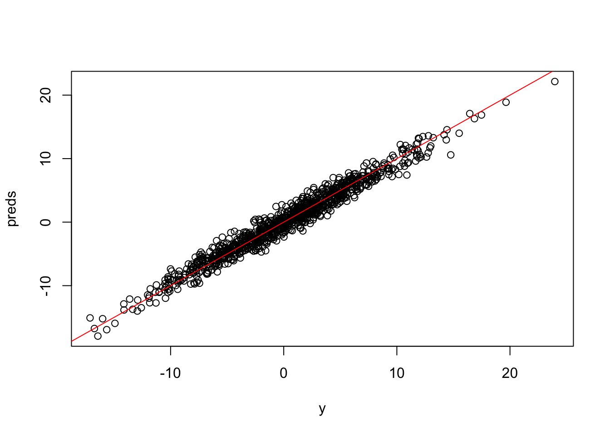

\newcommand*\Laplace{\mathop{}\!\mathbin\bigtriangleup}

# Day 24 -- Scaling GPs for large data


```r
library(tidyverse)
```

```
## ── Attaching packages ─────────────────────────────────────── tidyverse 1.3.1 ──
```

```
## ✔ ggplot2 3.3.5     ✔ purrr   0.3.4
## ✔ tibble  3.1.5     ✔ dplyr   1.0.7
## ✔ tidyr   1.1.4     ✔ stringr 1.4.0
## ✔ readr   2.0.2     ✔ forcats 0.5.1
```

```
## ── Conflicts ────────────────────────────────────────── tidyverse_conflicts() ──
## ✖ dplyr::filter() masks stats::filter()
## ✖ dplyr::lag()    masks stats::lag()
```

```r
library(mvnfast)
library(fields)
```

```
## Loading required package: spam
```

```
## Loading required package: dotCall64
```

```
## Loading required package: grid
```

```
## Spam version 2.7-0 (2021-06-25) is loaded.
## Type 'help( Spam)' or 'demo( spam)' for a short introduction 
## and overview of this package.
## Help for individual functions is also obtained by adding the
## suffix '.spam' to the function name, e.g. 'help( chol.spam)'.
```

```
## 
## Attaching package: 'spam'
```

```
## The following objects are masked from 'package:base':
## 
##     backsolve, forwardsolve
```

```
## Loading required package: viridis
```

```
## Loading required package: viridisLite
```

```
## 
## Try help(fields) to get started.
```

```r
library(spBayes)
library(spNNGP)
```

```
## Loading required package: coda
```

```
## Loading required package: Formula
```

```
## Loading required package: RANN
```

```
## 
## Attaching package: 'spNNGP'
```

```
## The following object is masked from 'package:spBayes':
## 
##     spDiag
```

```r
library(LatticeKrig)
```

## Announcements

- review EOF example from previous lecture


- spatial data can often be large -- thousands to even millions of sites

- the likelihood has $n \times n$ covariance matrices which have to be evaluated -- impossible to do directly

- Prediction isn't too bad -- can use local prediction using $k$ nearest locations

## Local analysis

- goal: make prediction at a location $\mathbf{s}_0$

- only use data within a distance $d_0$ to make predictions

- slide the window across the domain

**draw picture**

- Advantages
    - local inference results in many small matrices
    - parallelization/GPUs
    - nonstationary model by construction
    
- Disadvantages
    - inefficient estimation -- especially if process is stationary
    - boundary effects -- need to resolve predictions along the boundaries
    - how to choose the distance $d_0$
    
## Low rank approimxations

- In general, approximate the true process using $M <  < n$  basis functions

\begin{align*}
y(\mathbf{s}) & = \mathbf{X}(\mathbf{s}) \boldsymbol{\beta} + \sum_{m=1}^M B_m(\mathbf{s}) \alpha_m + \varepsilon(\mathbf{s})
\end{align*}

where $\mathbf{x}(\mathbf{s})$ are covariates with fixed effect coefficients $\boldsymbol{\beta}$, B_m(\mathbf{s}) are basis functions evaluated at $\mathbf{s}$, $\boldsymbol{\alpha} = (\alpha_1, \ldots, \alpha_M)' \sim N(\mathbf{0}, \boldsymbol{\Sigma}_\alpha)$ are random coefficients, and $\varepsilon(\mathbf{s}) \stackrel{iid}{\sim} N(0, \sigma^2)$ is the nugget (observation error).

- There are many choices of basis functions where as $M \rightarrow \infty$ can approximate any stationary process

## Spectral basis functions

\begin{align*}
y(\mathbf{s}) & = \mathbf{X}(\mathbf{s}) \boldsymbol{\beta} + \sum_{m=1}^{M/2} sin(\boldsymbol{\omega}_m' \mathbf{s}) \alpha_{1m} + \sum_{m=1}^{M/2} cos(\boldsymbol{\omega}_m' \mathbf{s}) \alpha_{2m} + \varepsilon(\mathbf{s})
\end{align*}

where 

$\alpha_{jm} \stackrel{independent}{\sim} N(0, \tau^2 g(\boldsymbol{\omega}_m))$.

## Kernel convolutions

\begin{align*}
y(\mathbf{s}) & = \mathbf{X}(\mathbf{s}) \boldsymbol{\beta} + \sum_{m=1}^M K(\mathbf{s}, \boldsymbol{\kappa}_m) \alpha_m + \varepsilon(\mathbf{s})
\end{align*}

where $\boldsymbol{\alpha} = (\alpha_1, \ldots, \alpha_M)' \sim N(\mathbf{0}, \boldsymbol{\Sigma}_\alpha)$ -- typically $\boldsymbol{\Sigma}_\alpha = \tau^2 \mathbf{I}$

**draw picture**

- Multi-resolution extensions 

\begin{align*}
y(\mathbf{s}) & = \mathbf{X}(\mathbf{s}) \boldsymbol{\beta} + \sum_{\ell=1}^L \sum_{m=1}^M K(\mathbf{s}, \boldsymbol{\kappa}_{\ell m}) \alpha_{\ell m} + \varepsilon(\mathbf{s})
\end{align*}

- [Multiresolution Gaussian Process Model for the Analysis of Large Spatial Datasets](https://www.tandfonline.com/doi/pdf/10.1080/10618600.2014.914946)


```r
## Make some data
set.seed(1)
n <- 1000
coords <- cbind(runif(n, 0, 1), runif(n, 0, 1))

X <- cbind(1, rnorm(n))

beta <- as.matrix(c(1, 5))

sigma.sq <- 5
tau.sq <- 1
phi <- 3 / 0.5

D <- as.matrix(rdist(coords))
R <- exp(-phi * D)
w <- c(rmvn(1, rep(0,n), sigma.sq * R))
y <- rnorm(n, X %*% beta + w, sqrt(tau.sq))

## x are the spatial locations, y is the response variable, Z are the fixed effects
## note that X has an intercept term that needs to be removed
fit <- LatticeKrig(x = coords, y = y, Z = X[, 2])
summary(fit)
```

```
## $call
## LatticeKrig(x = coords, y = y, Z = X[, 2])
## 
## $inverseModel
## [1] FALSE
## 
## $parameters
##                                                             
## 1                      Number of Observations:   1000.000000
## 2  Number of parameters in the fixed component      4.000000
## 3                         Number of covariates      1.000000
## 4           Effective degrees of freedom (EDF)    146.400000
## 5             Standard Error of EDF estimate:       4.436000
## 6                 Smoothing parameter (lambda)      0.002184
## 7                                   MLE sigma       1.201000
## 8                                      MLE rho    660.700000
## 9              Total number of basis functions   1968.000000
## 10                      Multiresolution levels      3.000000
## 11                      log Profile Likelihood  -1811.977799
## 12             log  Likelihood (if applicable)            NA
## 13  Nonzero entries in Ridge regression matrix 371033.000000
## 
## $timingLKrig
##          user.self sys.self elapsed
## timewX       1.563    0.008   1.573
## timeQ        0.008    0.001   0.008
## timeM        0.044    0.004   0.048
## timeChol     0.049    0.005   0.055
## timeCoef     0.018    0.001   0.018
## timeLike     0.005    0.000   0.005
## timeTrA      0.057    0.002   0.059
##              1.744    0.021   1.766
## 
## $LKinfo
## Classes for this object are:  LKinfo LKRectangle
## The second class usually will indicate the geometry
##      e.g.  2-d rectangle is  LKRectangle
##  
## Some details on spatial autoregression flags:
## stationary:  TRUE TRUE TRUE
## first order (by level):  TRUE TRUE TRUE
## isotropic:  TRUE TRUE TRUE
##  
## Ranges of locations in raw scale:
##             [,1]         [,2]
## [1,] 0.001314657 0.0006052661
## [2,] 0.999930594 0.9988774753
##  
## Logical (collapseFixedEffect) if fixed effects will be pooled: FALSE
##  
## Number of levels: 3
## delta scalings: 0.166436 0.08321799 0.041609
## with an overlap parameter of  2.5
## alpha:  0.7619048 0.1904762 0.04761905
## based on smoothness nu =  1
##  
## a.wght:  4.01 4.01 4.01
##  
## Basis  type: Radial using  WendlandFunction  and Euclidean  distance.
## Basis functions will be normalized
##  
## Total number of basis functions  1968
##  Level Basis size      
##      1        272 17 16
##      2        506 23 22
##      3       1190 35 34
##  
## Lambda value:  0.002183888
## 
## $MLE
## $MLE$summary
##         EffDf    lnProfLike           GCV     sigma.MLE       rho.MLE 
##  1.407858e+02 -1.811978e+03  1.676447e+00  1.201168e+00  6.606589e+02 
##    lambda.MLE   llambda.MLE        lnLike  counts value          grad 
##  2.183888e-03 -6.126648e+00            NA  1.100000e+01            NA 
## 
## $MLE$LKinfo
## Classes for this object are:  LKinfo LKRectangle
## The second class usually will indicate the geometry
##      e.g.  2-d rectangle is  LKRectangle
##  
## Some details on spatial autoregression flags:
## stationary:  TRUE TRUE TRUE
## first order (by level):  TRUE TRUE TRUE
## isotropic:  TRUE TRUE TRUE
##  
## Ranges of locations in raw scale:
##             [,1]         [,2]
## [1,] 0.001314657 0.0006052661
## [2,] 0.999930594 0.9988774753
##  
## Logical (collapseFixedEffect) if fixed effects will be pooled: FALSE
##  
## Number of levels: 3
## delta scalings: 0.166436 0.08321799 0.041609
## with an overlap parameter of  2.5
## alpha:  0.7619048 0.1904762 0.04761905
## based on smoothness nu =  1
##  
## a.wght:  4.01 4.01 4.01
##  
## Basis  type: Radial using  WendlandFunction  and Euclidean  distance.
## Basis functions will be normalized
##  
## Total number of basis functions  1968
##  Level Basis size      
##      1        272 17 16
##      2        506 23 22
##      3       1190 35 34
##  
## Lambda value:  NA
## 
## $MLE$llambda.start
## [1] -1
## 
## $MLE$lambda.MLE
## [1] 0.002183888
## 
## $MLE$lnLike.eval
##                    lambda   rho.MLE sigma.MLE lnProfileLike.FULL
##               0.367879441   8.36341  1.754060          -2011.625
## rowForCapture 0.017695554 109.21031  1.390157          -1848.435
## rowForCapture 0.380770615   8.12541  1.758954          -2013.977
## rowForCapture 0.002655516 558.56977  1.217904          -1812.307
## rowForCapture 0.001767644 791.91761  1.183143          -1812.372
## rowForCapture 0.002187531 659.71501  1.201311          -1811.978
## rowForCapture 0.002183888 660.65892  1.201168          -1811.978
## rowForCapture 0.002180251 661.60416  1.201026          -1811.978
## rowForCapture 0.002183888 660.65892  1.201168          -1811.978
```

```r
preds <- predict(fit)
plot(y, preds)
abline(0, 1, col = "red")
```



