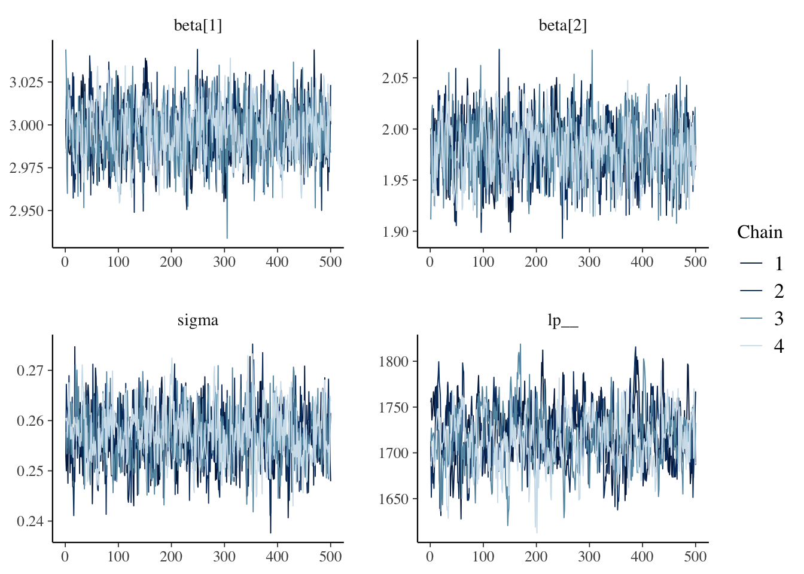
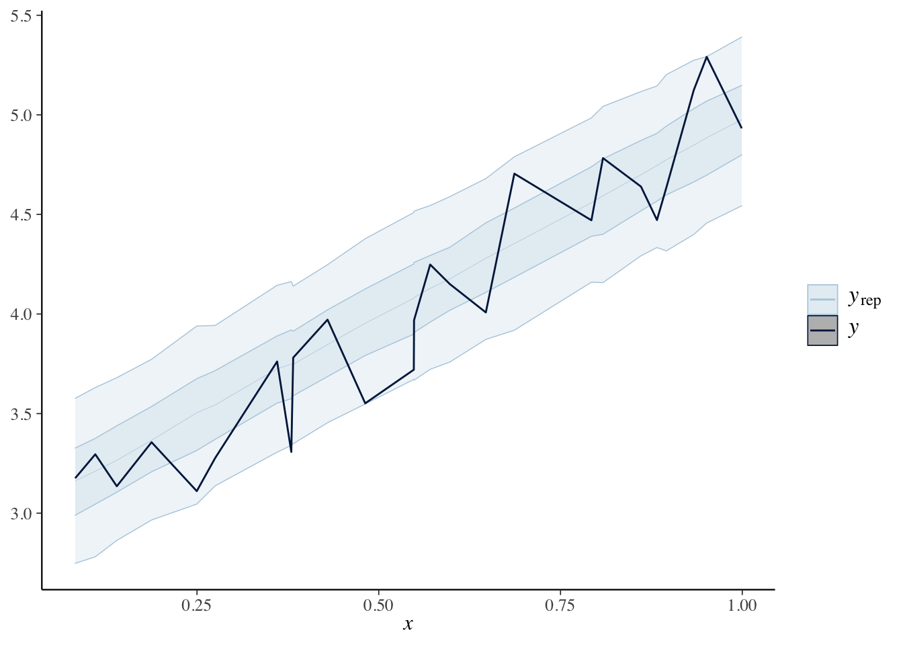
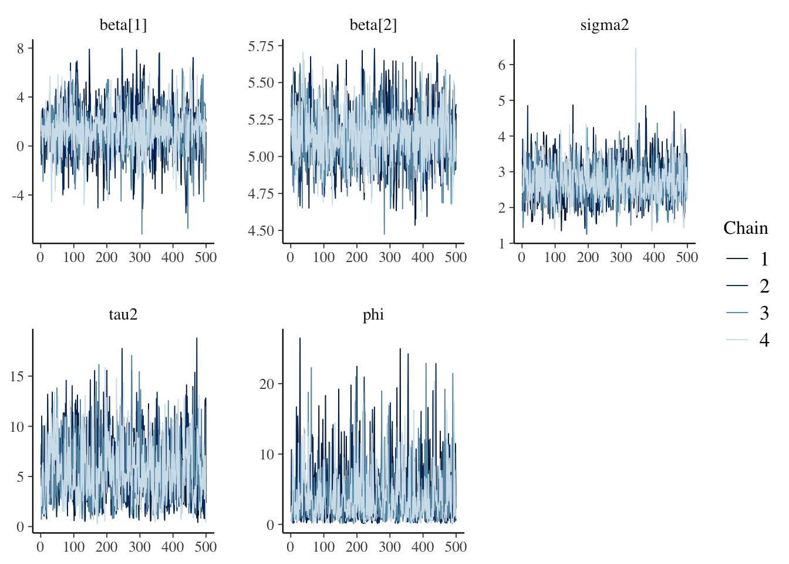
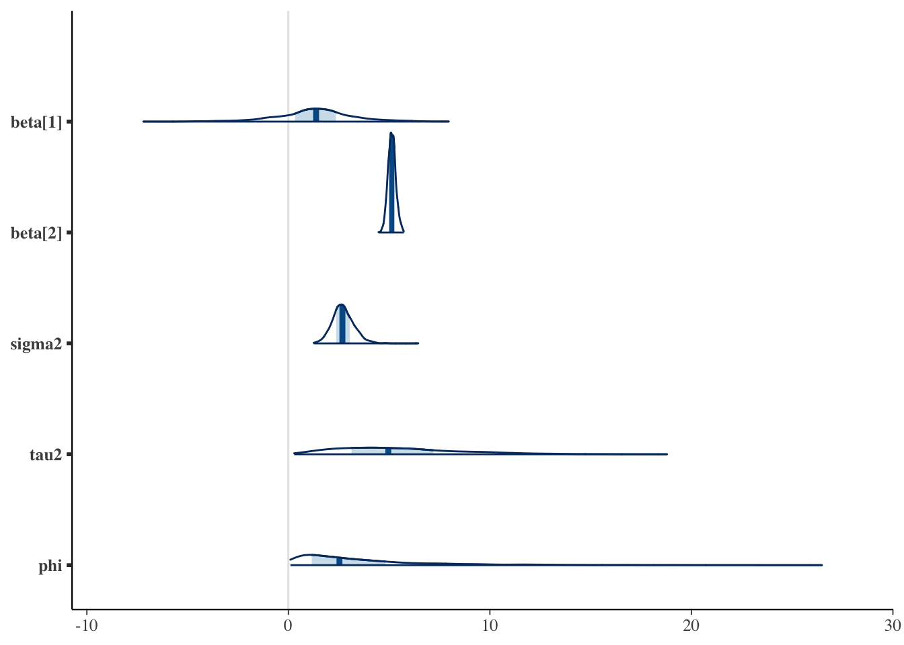
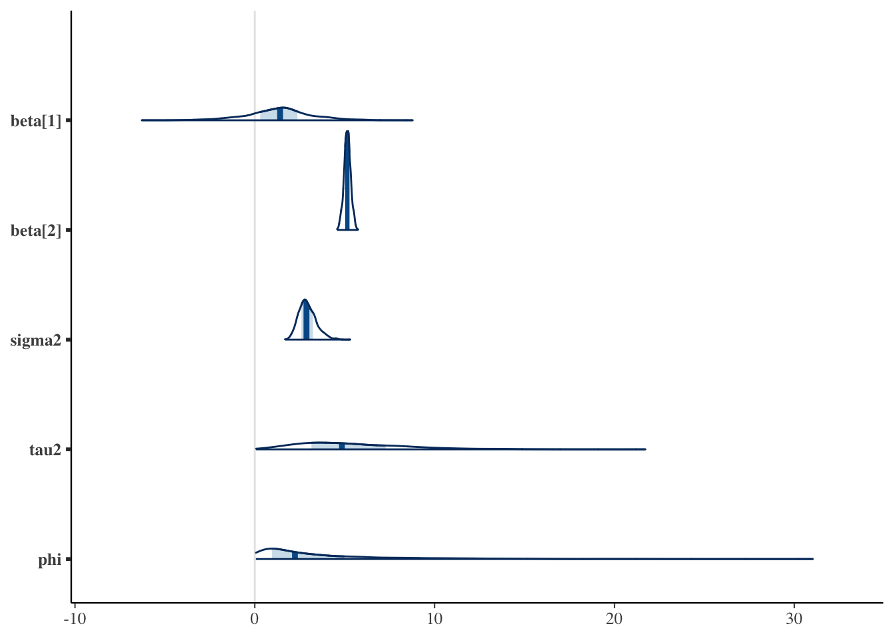
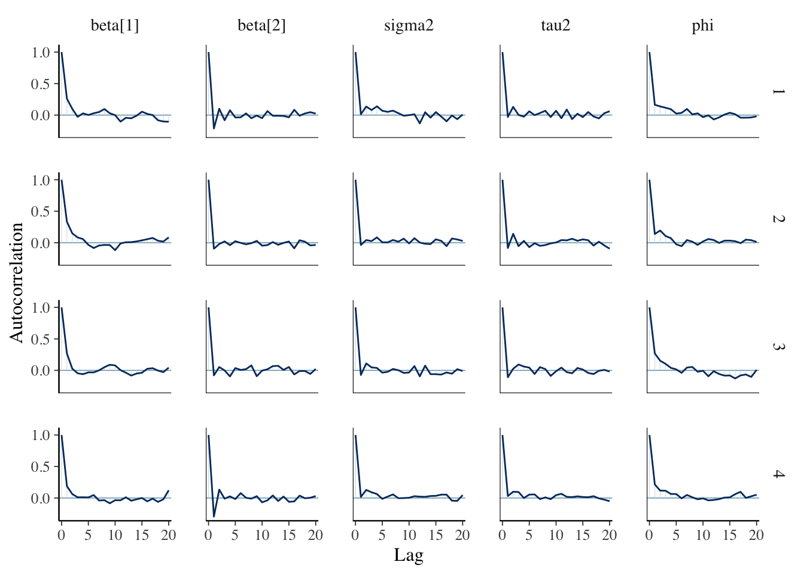

# Day 28


```r
library(tidyverse)
library(fields)
library(mvnfast)
library(patchwork)
library(rstan)
## use recommended rstan settings
options(mc.cores = parallel::detectCores())
rstan_options(auto_write = TRUE)
library(bayesplot)
```

## Announcements

## Intro to stan

- See [example here](https://avehtari.github.io/casestudies/Motorcycle/motorcycle_gpcourse.html)

- Needs a c++ compiler toolchain. [See here](https://github.com/stan-dev/rstan/wiki/RStan-Getting-Started) for instructions on how to install the `rstan` library
    - instructions for your OS (Windows, MacOC, Linux, and support for different languages, etc. on the bar to the right)
    
- probabilistic programming

- allows you to focus on modelling rather than algorithms for fitting

- Many alternatives ([NIMBLE](https://r-nimble.org/), [JAGS](http://mcmc-jags.sourceforge.net/), [PyMC3](https://pypi.org/project/pymc3/), [PyMC4 - experimental](https://pypi.org/project/pymc4/))

### Example: Linear regression


```r
set.seed(444)
n <- 1000
X <- cbind(1, runif(n))
beta <- c(3, 2)
sigma <- 0.25
y <- as.vector(X %*% beta + rnorm(n, 0, sigma))

data.frame(y = y, x = X[, 2], mu = X %*% beta) %>%
    ggplot(aes(x = x, y = y)) +
    geom_point() +
    geom_line(aes(x = x, y = mu), color = "red")
```


- we need to define a stan model

- create a stan model in a folder named `stan_models` in the Rstudio project folder

- print the output of the model `linear-regression.stan`


```r
cat(read_lines(here::here("stan_models", "linear-regression.stan")), sep = "\n")
```

```
//
// This Stan program defines a simple model, with a
// vector of values 'y' modeled as normally distributed
// with mean 'mu' = 'X beta` and standard deviation 'sigma'.
//
// Learn more about model development with Stan at:
//
//    http://mc-stan.org/users/interfaces/rstan.html
//    https://github.com/stan-dev/rstan/wiki/RStan-Getting-Started
//

// The input data is a vector 'y' of length 'n' and an 
// 'n' times 'p' matrix of covariates (including the intercept)
data {
  int<lower=0> n;
  int<lower=0> p;
  vector[n] y;
  matrix[n, p] X;
  
}

// The parameters accepted by the model. Our model
// accepts two parameters 'beta' and 'sigma'.
parameters {
  vector[p] beta;
  real<lower=0> sigma;
  vector[n] y_rep;
}

// The transformed parameters X %*% beta for the model. 
transformed parameters {
  vector[n] mu;
  mu = X * beta;
}
// The model to be estimated. We model the output
// 'y' to be normally distributed with mean 'mu'
// and standard deviation 'sigma'.

model {
  y ~ normal(mu, sigma);
  // Note that this is vectorized and equivalent to
  // for (i in 1:n) {
  //   y[i] ~ normal(mu[i], sigma);
  // }
  
  // posterior predictive distribution
  y_rep ~ normal(mu, sigma);
}
// Note: the stan file must end in a blank (new) line
```

- What are the priors implied by this model on $\boldsymbol{\beta}$ and $\sigma$?


- Fitting the model


```r
fit <- stan(
    file = here::here("stan_models", "linear-regression.stan"),
    data = list(y = y, n = n, X = X, p = ncol(X)),
    iter = 1000
)
```

- with priors 


```r
cat(read_lines(here::here("stan_models", "linear-regression-priors.stan")), sep = "\n")
```

```
//
// This Stan program defines a simple model, with a
// vector of values 'y' modeled as normally distributed
// with mean 'mu' = 'X beta` and standard deviation 'sigma'.
//
// Learn more about model development with Stan at:
//
//    http://mc-stan.org/users/interfaces/rstan.html
//    https://github.com/stan-dev/rstan/wiki/RStan-Getting-Started
//

// The input data is a vector 'y' of length 'n' and an 
// 'n' times 'p' matrix of covariates (including the intercept)
data {
  int<lower=0> n;
  int<lower=0> p;
  vector[n] y;
  matrix[n, p] X;
  
}

// The parameters accepted by the model. Our model
// accepts two parameters 'beta' and 'sigma'.
parameters {
  vector[p] beta;
  real<lower=0> sigma;
  vector[n] y_rep;
}

// The transformed parameters X %*% beta for the model. 
transformed parameters {
  vector[n] mu;
  mu = X * beta;
}
// The model to be estimated. We model the output
// 'y' to be normally distributed with mean 'mu'
// and standard deviation 'sigma'.

model {
  y ~ normal(mu, sigma);
  beta ~ normal(0, 5);
  sigma ~ cauchy(0, 5);
  // Note that this is vectorized and equivalent to
  // for (i in 1:n) {
  //   y[i] ~ normal(mu[i], sigma);
  // }
  
  // posterior predictive distribution
  y_rep ~ normal(mu, sigma);
}
// Note: the stan file must end in a blank (new) line
```


```r
fit_prior <- stan(
    file = here::here("stan_models", "linear-regression-priors.stan"),
    data = list(y = y, n = n, X = X, p = ncol(X)),
    iter = 1000
)
```

- examine the output from the MCMC fit


```r
## only plot the regression parameters
print(fit, probs = c(0.1, 0.9), pars = c("beta", "sigma", "lp__"))
```

```
## Inference for Stan model: linear-regression.
## 4 chains, each with iter=1000; warmup=500; thin=1; 
## post-warmup draws per chain=500, total post-warmup draws=2000.
## 
##            mean se_mean    sd     10%     90% n_eff Rhat
## beta[1]    3.00    0.00  0.02    2.98    3.02  1141 1.00
## beta[2]    1.98    0.00  0.03    1.94    2.02  1165 1.00
## sigma      0.26    0.00  0.01    0.25    0.26   901 1.00
## lp__    1717.79    1.44 30.48 1679.23 1756.59   447 1.01
## 
## Samples were drawn using NUTS(diag_e) at Sat Nov  6 21:53:45 2021.
## For each parameter, n_eff is a crude measure of effective sample size,
## and Rhat is the potential scale reduction factor on split chains (at 
## convergence, Rhat=1).
```

```r
## trace plots
mcmc_trace(fit, regex_pars = c("beta", "sigma", "lp__"))
```



```r
## area plots of posterior
mcmc_areas(fit, regex_pars = c("beta", "sigma"))
```


```r
## acf plots
mcmc_acf(fit, regex_pars = c("beta", "sigma"))
```


```r
## violin plots of posterior
mcmc_violin(fit, regex_pars = c("beta", "sigma"))
```


- compare these estimates to the `lm` estimtes


```r
summary(lm(y ~ X - 1))
```

```
## 
## Call:
## lm(formula = y ~ X - 1)
## 
## Residuals:
##      Min       1Q   Median       3Q      Max 
## -0.66960 -0.17329  0.00161  0.17050  0.89120 
## 
## Coefficients:
##    Estimate Std. Error t value Pr(>|t|)    
## X1  2.99624    0.01652  181.36   <2e-16 ***
## X2  1.98018    0.02854   69.38   <2e-16 ***
## ---
## Signif. codes:  0 '***' 0.001 '**' 0.01 '*' 0.05 '.' 0.1 ' ' 1
## 
## Residual standard error: 0.2563 on 998 degrees of freedom
## Multiple R-squared:  0.996,	Adjusted R-squared:  0.996 
## F-statistic: 1.239e+05 on 2 and 998 DF,  p-value: < 2.2e-16
```

#### Posterior predictive checks

- How do we know if the model is fitting the data well?

- posterior predictive checks examples [here](https://mc-stan.org/bayesplot/reference/PPC-distributions.html) and [here](https://cran.r-project.org/web/packages/bayesplot/vignettes/graphical-ppcs.html#defining-y-and-yrep)

\begin{align*}
[\tilde{\mathbf{y}} | \mathbf{y}] & = \int [\tilde{\mathbf{y}} | \boldsymbol{\theta} ] [\boldsymbol{\theta} | \mathbf{y}] \,d\boldsymbol{\theta}
\end{align*}

where the integral over $\boldsymbol{\theta}$ is performed using MCMC sampling.

- Using the `bayesplot` package, we can explre the posterior predictive checks (ppcs) using a variety of functions


```r
## extract the posterior predictive samples
y_rep <- rstan::extract(fit, pars = "y_rep")$y_rep

## only plot for 25 randomly selected samples
plot_idx <- sample(1:n, 25)

ppc_data(y, y_rep)
```

```
## # A tibble: 2,001,000 × 6
##     y_id rep_id rep_label             is_y  is_y_label     value
##    <int>  <int> <fct>                 <lgl> <fct>          <dbl>
##  1     1      1 italic(y)[rep] ( 1 )  FALSE italic(y)[rep]  3.37
##  2     1      2 italic(y)[rep] ( 2 )  FALSE italic(y)[rep]  3.36
##  3     1      3 italic(y)[rep] ( 3 )  FALSE italic(y)[rep]  3.69
##  4     1      4 italic(y)[rep] ( 4 )  FALSE italic(y)[rep]  3.67
##  5     1      5 italic(y)[rep] ( 5 )  FALSE italic(y)[rep]  3.46
##  6     1      6 italic(y)[rep] ( 6 )  FALSE italic(y)[rep]  3.71
##  7     1      7 italic(y)[rep] ( 7 )  FALSE italic(y)[rep]  3.53
##  8     1      8 italic(y)[rep] ( 8 )  FALSE italic(y)[rep]  2.93
##  9     1      9 italic(y)[rep] ( 9 )  FALSE italic(y)[rep]  3.40
## 10     1     10 italic(y)[rep] ( 10 ) FALSE italic(y)[rep]  3.62
## # … with 2,000,990 more rows
```


```r
ppc_hist(y, y_rep[1:5, ]) ## only use a subset of rows
```

```
## `stat_bin()` using `bins = 30`. Pick better value with `binwidth`.
```


```r
ppc_intervals(y[plot_idx], y_rep[, plot_idx], x = X[, 2][plot_idx])
```


```r
ppc_ribbon(y[plot_idx], y_rep[, plot_idx], x = X[, 2][plot_idx])
```




```r
ppc_dens_overlay(y, y_rep)
```


```r
ppc_ecdf_overlay(y, y_rep)
```


#### Optimization in stan

- We can also fit the model using optimization:
    - max posterior mode, also known as max a posteriori (*MAP*).
    - max penalized likelihood (*MLE*).


```r
model <- stan_model(
    file = here::here("stan_models", "linear-regression-priors.stan")
)
# currently this is crashing
# not sure why
mle <- optimizing(model, data = list(y = y, n = n, X = X, p = ncol(X)))

print(mle$par[1:3], digits = 4)
```

### Example: Spatial model in stan


```r
cat(read_lines(here::here("stan_models", "spatial-regression.stan")), sep = "\n")
```

```
//
// This Stan program defines a simple model, with a
// vector of values 'y' modeled as normally distributed
// with mean 'mu' = 'X beta` and standard deviation 'sigma'.
//
// Learn more about model development with Stan at:
//
//    http://mc-stan.org/users/interfaces/rstan.html
//    https://github.com/stan-dev/rstan/wiki/RStan-Getting-Started
//

// The input data is a vector 'y' of length 'n', an 
// 'n' times 'p' matrix of covariates (including the intercept),
// and 'coords' is an 'n' times '2' matrix of spatial locations
data {
  int<lower=0> n;
  int<lower=0> p;
  vector[n] y;
  matrix[n, p] X;
  matrix[n, 2] coords;
}

// calculate the Euclidean distance between observed locations
transformed data {
  matrix[n, n] D;
  for (i in 1:n) {
    for (j in 1:(i-1)) {
      D[i, j] = sqrt(sum(square(coords[i, ] - coords[j, ])));
      D[j, i] = D[i, j];
    }
    D[i, i] = 0.0;
  }
}

// The parameters accepted by the model. Our model
// accepts the parameters 'beta', 'sigma2', 'tau2' and 'phi'.
parameters {
  vector[p] beta;
  real<lower=0> sigma2;
  real<lower=0> tau2;
  real<lower=0> phi;
}

// The transformed parameters X %*% beta for the model, 
// Sigma for the covariance matrix, and L_Sigma for the
// Cholesky decomposition of the covariance matrix
transformed parameters {
  vector[n] mu;
  cov_matrix[n] Sigma;
  matrix[n, n] L_Sigma;
  
  mu = X * beta;
  for (i in 1:(n-1)) {
    for (j in (i+1):n) {
      Sigma[i, j] = tau2 * exp(- D[i, j] / phi);
      Sigma[j, i] = Sigma[i, j];
    }
  }
  // equivalent to
  // Sigma = exp( - D / phi)
  for (i in 1:n) {
    Sigma[i, i] = sigma2 + tau2;
  }
  L_Sigma = cholesky_decompose(Sigma);
}

// The model to be estimated. We model the output
// 'y' to be normally distributed with mean 'mu'
// and Cholesky of covariance matrix L_Sigma.
model {
  // priors
  phi ~ normal(0, 10);
  tau2 ~ normal(0, 5);
  sigma2 ~ normal(0, 5);
  beta ~ normal(0, 5);
  // likelihood
  y ~ multi_normal_cholesky(mu, L_Sigma);
}
// Note: the stan file must end in a blank (new) line
```


```r
## Make some data
set.seed(1)
n <- 100
coords <- cbind(runif(n, 0, 1), runif(n, 0, 1))

X <- cbind(1, rnorm(n))

beta <- as.matrix(c(1, 5))

sigma2 <- 1
tau2 <- 5
phi <- 3 / 0.5

D <- as.matrix(rdist(coords))
R <- exp(- phi * D)
eta <- c(rmvn(1, rep(0,n), tau2 * R))
y <- rnorm(n, X %*% beta + eta, sqrt(sigma2))
```

- Fit the stan model
    - this can be a little slow for fitting relatively small data
    - however, stan uses Hamiltonian Monte Carlo (HMC) which is highly efficient
    - often can get by with much shorter MCMC chains (500-1000 samples -- monitor the effective sample size)
    


```r
fit <- stan(
    file = here::here("stan_models", "spatial-regression.stan"),
    data = list(y = y, n = n, X = X, p = ncol(X), coords = coords),
    iter = 1000
) 
```

```
## Warning: There were 17 divergent transitions after warmup. See
## http://mc-stan.org/misc/warnings.html#divergent-transitions-after-warmup
## to find out why this is a problem and how to eliminate them.
```

```
## Warning: Examine the pairs() plot to diagnose sampling problems
```

- examine the output from the MCMC fit


```r
## only plot the regression parameters
print(fit, probs = c(0.1, 0.9), pars = c("beta", "sigma2", "tau2", "phi"))
```

```
## Inference for Stan model: spatial-regression.
## 4 chains, each with iter=1000; warmup=500; thin=1; 
## post-warmup draws per chain=500, total post-warmup draws=2000.
## 
##         mean se_mean   sd   10%  90% n_eff Rhat
## beta[1] 1.34    0.06 1.92 -1.04 3.61  1113    1
## beta[2] 5.14    0.01 0.19  4.89 5.39  1342    1
## sigma2  2.72    0.01 0.54  2.08 3.41  1313    1
## tau2    5.43    0.10 3.02  1.92 9.78   953    1
## phi     3.71    0.10 3.71  0.57 8.49  1427    1
## 
## Samples were drawn using NUTS(diag_e) at Sat Nov  6 21:57:21 2021.
## For each parameter, n_eff is a crude measure of effective sample size,
## and Rhat is the potential scale reduction factor on split chains (at 
## convergence, Rhat=1).
```

```r
## trace plots
mcmc_trace(fit, regex_pars = c("beta", "sigma2", "tau2", "phi"))
```



```r
## area plots of posterior
mcmc_areas(fit, regex_pars = c("beta", "sigma2", "tau2", "phi"))
```



```r
## acf plots
mcmc_acf(fit, regex_pars = c("beta", "sigma2", "tau2", "phi"))
```


### Example: Predictive process model in stan

- use the same data from the previous example


```r
cat(read_lines(here::here("stan_models", "predictive-process-regression.stan")), sep = "\n")
```

```
//
// This Stan program defines a simple model, with a
// vector of values 'y' modeled as normally distributed
// with mean 'mu' = 'X beta` and standard deviation 'sigma'.
//
// Learn more about model development with Stan at:
//
//    http://mc-stan.org/users/interfaces/rstan.html
//    https://github.com/stan-dev/rstan/wiki/RStan-Getting-Started
//

// The input data is a vector 'y' of length 'n', an 
// 'n' times 'p' matrix of covariates (including the intercept),
// an 'n' times '2' matrix 'coords' of spatial locations, and 
// an 'n_knots' times '2' matrix of 'knots' for the predictive process
data {
  int<lower=0> n;
  int<lower=0> p;
  int<lower=0> n_knots;
  vector[n] y;
  matrix[n, p] X;
  matrix[n, 2] coords;
  matrix[n_knots, 2] knots;
}

transformed data {
  matrix[n, n_knots] D;
  matrix[n_knots, n_knots] D_star;
  for (i in 1:n) {
    for (j in 1:n_knots) {
      D[i, j] = sqrt(sum(square(coords[i, ] - knots[j, ])));
    }
  }
  for (i in 1:n_knots) {
    for (j in 1:(i-1)) {
      D_star[i, j] = sqrt(sum(square(knots[i, ] - knots[j, ])));
      D_star[j, i] = D_star[i, j];
    }
    D_star[i, i] = 0.0;
  }
}

// The parameters accepted by the model. Our model
// accepts two parameters 'beta' and 'sigma'.
parameters {
  vector[p] beta;
  real<lower=0> sigma2;
  real<lower=0> tau2;
  real<lower=0> phi;
  vector[n_knots] eta_centered;
}

// The transformed parameters X %*% beta for the model, 
// Sigma for the covariance matrix, and L_Sigma for the
// Cholesky decomposition of the covariance matrix
transformed parameters {
  vector[n] mu;
  vector[n_knots] eta_star;
  vector[n] eta;
  cov_matrix[n_knots] Sigma_star;
  cov_matrix[n_knots] Sigma_star_inv;
  matrix[n, n_knots] c;
  
  // fixed effects
  mu = X * beta;
  
  // latent GP covariance matrix at the knots
  Sigma_star = tau2 * exp(-D_star / phi);
  Sigma_star_inv = inverse(Sigma_star);

  // predictive process interpolation matrix
  c = tau2 * exp(- D / phi);
  // eta_centered is N(0, 1)
  // eta_star = L * eta_centered ~ N(0, LL')
  eta_star = cholesky_decompose(Sigma_star) * eta_centered;
  // predictive process interpolator
  eta = c * Sigma_star_inv * eta_star;
}


model {
    // priors
  phi ~ normal(0, 10);
  tau2 ~ normal(0, 5);
  sigma2 ~ normal(0, 5);
  beta ~ normal(0, 5);
  eta_centered ~ normal(0, 1);
  y ~ normal(mu + eta, sqrt(sigma2));
  // Note that this is vectorized and equivalent to
  // for (i in 1:n) {
  //   y[i] ~ normal(mu[i] + eta[i], sqrt(sigma2));
  // }
}
// Note: the stan file must end in a blank (new) line
```

- Fit the stan model
    - this can be a little slow for fitting relatively small data
    - however, stan uses Hamiltonian Monte Carlo (HMC) which is highly efficient
    - often can get by with much shorter MCMC chains (500-1000 samples -- monitor the effective sample size)
    

```r
n_knots <- 5^2
knots <- expand.grid(
    seq(min(coords[, 1]), max(coords[, 1]), length.out = sqrt(n_knots)),
    seq(min(coords[, 2]), max(coords[, 2]), length.out = sqrt(n_knots))
)
```


```r
fit <- stan(
    file = here::here("stan_models", "predictive-process-regression.stan"),
    data = list(y = y, n = n, X = X, p = ncol(X), 
                coords = coords, n_knots = n_knots, knots = knots),
    iter = 1000
)
```

- examine the output from the MCMC fit


```r
## only plot the regression parameters
print(fit, probs = c(0.1, 0.9), pars = c("beta", "sigma2", "tau2", "phi"))
```

```
## Inference for Stan model: predictive-process-regression.
## 4 chains, each with iter=1000; warmup=500; thin=1; 
## post-warmup draws per chain=500, total post-warmup draws=2000.
## 
##         mean se_mean   sd   10%  90% n_eff Rhat
## beta[1] 1.36    0.05 1.82 -0.95 3.66  1128    1
## beta[2] 5.15    0.00 0.19  4.92 5.39  2655    1
## sigma2  2.93    0.01 0.49  2.35 3.58  1195    1
## tau2    5.41    0.08 3.07  2.00 9.49  1604    1
## phi     3.64    0.13 3.91  0.42 9.03   918    1
## 
## Samples were drawn using NUTS(diag_e) at Sat Nov  6 22:01:48 2021.
## For each parameter, n_eff is a crude measure of effective sample size,
## and Rhat is the potential scale reduction factor on split chains (at 
## convergence, Rhat=1).
```

```r
## trace plots
mcmc_trace(fit, regex_pars = c("beta", "sigma2", "tau2", "phi"))
```


```r
## area plots of posterior
mcmc_areas(fit, regex_pars = c("beta", "sigma2", "tau2", "phi"))
```



```r
## acf plots
mcmc_acf(fit, regex_pars = c("beta", "sigma2", "tau2", "phi"))
```




## stan Hints and tips

- if there are issues, run one chain using `chains = 1` option in the `stan()` function
- pay careful attention to the error messages -- once you learn to read these they can be very informative
- if you have multiple chains that have widely different run times, that suggests there are issues with your model
    - explore advanced stan diagnostics
    - examples [here](https://mc-stan.org/bayesplot/articles/visual-mcmc-diagnostics.html), [here](https://mc-stan.org/rstan/reference/stan_plot_diagnostics.html), and [here](https://betanalpha.github.io/assets/case_studies/rstan_workflow.html). 
    
- [General stan best pracitices](https://github.com/stan-dev/stan/wiki/Stan-Best-Practices)
