# Day 30


```r
library(tidyverse)
library(viridis)
library(mvnfast)
library(igraph)
library(Matrix)
library(patchwork)
library(rstan)
## use recommended rstan settings
options(mc.cores = parallel::detectCores())
rstan_options(auto_write = TRUE)
library(bayesplot)

set.seed(101)
```

## Announcements

- s(x) + s(y) vs. s(x, y) in MGCV

## Gaussian Markov random fields (GMRFs)    

- A Markov random field is specified from a set of conditional probability distributions.


- Let $\mathbf{y} = (y_1, \ldots, y_n)'$ be the $n$-dimensional vector for each of the $i$ observations in the spatial doamin $\mathcal{D}$. Let $\mathcal{A} \in \mathcal{D}$ be defined as a subset of regions in the domain, $\mathbf{y}_{\mathcal{A}} = \{ y_i | i \in \mathcal{A}\}$ be the set of observation in the subdomain $\mathcal{A}$, and $\mathbf{y}_{-\mathcal{A}} = \{ y_i | i \notin \mathcal{A}\}$ be the set of observation not in the subdomain $\mathcal{A}$


- A GMRF is a Gaussian distributed random vector $\mathbf{y}$ which obeys some conditional independence properties. For some $i \neq j$, 

\begin{align*}
y_i \perp y_j | \mathbf{y}_{-\{i, j\}},
\end{align*}

where, conditioned on $\mathbf{y}_{-\{i, j\}}$, $y_i$ and $y_j$ are independent.


- Given a graph $\mathcal{G} = (\mathcal{V}, \mathcal{E})$ where $\mathcal{V} = \{1, \ldots, n\}$ is the set of vertices and $\mathcal{E} = \{ \{i, j\} | i, j \in \mathcal{V}\}$, the set of edges of the graph, the goal is to sepcify a GMRF that has conditional independence properties that are consistent with an underlying graph structure (typically one implied by the adjacency structure of the spatial domain)

- This turns out to be quite easy by using the precision matrix $\mathbf{Q} = \boldsymbol{\Sigma}^{-1}$ of the random variable $\mathbf{y}$


- **Definition:** A random vector $\mathbf{y}$ is a GMRF with respect to the labeled graph $\mathcal{G} = (\mathcal{V}, \mathcal{E})$ with mean $\boldsymbol{\mu}$ and symmetric, positive definite precision matrix $\mathbf{Q}$ $\Leftrightarrow$ its density is

\begin{align*}
[\mathbf{y} | \boldsymbol{\mu}, \mathbf{Q}] & = (2 \pi)^{-n / 2} |\mathbf{Q}|^{1/2} \exp\left( -1 / 2 \left( \mathbf{y} - \boldsymbol{\mu} \right) \mathbf{Q} \left(\mathbf{y} - \boldsymbol{\mu} \right) \right)
\end{align*}
and
\begin{align*}
Q_{i, j} \neq 0 \hspace{1em} \Leftrightarrow \hspace{1em} \{i, j\} \in \mathcal{E} \hspace{1em} \forall \hspace{1em} i \neq j
\end{align*}

Note: this implies that $Q_{i, j} = 0 \hspace{1em} \forall \hspace{1em} i \neq j$ where $\{i, j\} \notin \mathcal{E}$

### Example: 

- A stationary autoregressive time series of order 1

\begin{align*}
y_t = \phi y_{t-1} + \varepsilon_t
\end{align*}

where $|\phi| < 1$, $\varepsilon_t \stackrel{iid}{\sim} N(0, 1)$, and $y_1 \sim N(0, 1 / (1 - \phi^2))$.


```r
n <- 500
phi <- 0.9

## autoregression model representation
y <- rep(0, n)
y[1] <- rnorm(1, 0, sqrt(1 / (1 - phi^2)))
for (t in 2:n) {
    y[t] <- rnorm(1, phi * y[t-1], 1)
}
plot(y, type = 'l')
```

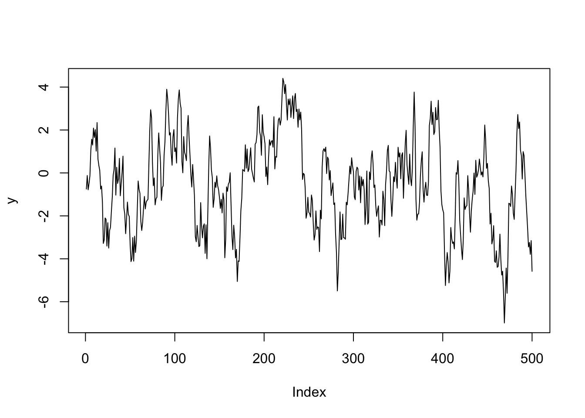

- The set of edges is $\mathcal{E} = \{ \{ 1, 2\}, \{2, 3\}, \ldots, \{n-1, n\} \}$ and the precision matrix $\mathbf{Q}$ has nonzero elements $Q_{i,j} = -\phi$ for $|i-j| = 1$, $Q_{1,1} = Q_{n,n} = 1$ and $Q_{i,i} = 1 + \phi^2$ for $i = 2, \ldots, n-1$.


```r
## GMRF representation
Q <- matrix(0, n, n)
Q <- toeplitz(c(0, -phi, rep(0, n - 2)))
diag(Q) <- c(1, rep(1 + phi^2, n - 2), 1)
Q[1:5, 1:5]
```

```
##      [,1]  [,2]  [,3]  [,4]  [,5]
## [1,]  1.0 -0.90  0.00  0.00  0.00
## [2,] -0.9  1.81 -0.90  0.00  0.00
## [3,]  0.0 -0.90  1.81 -0.90  0.00
## [4,]  0.0  0.00 -0.90  1.81 -0.90
## [5,]  0.0  0.00  0.00 -0.90  1.81
```

```r
y <- as.vector(rmvn(1, rep(0, n), solve(Q)))
plot(y, type = 'l')
```

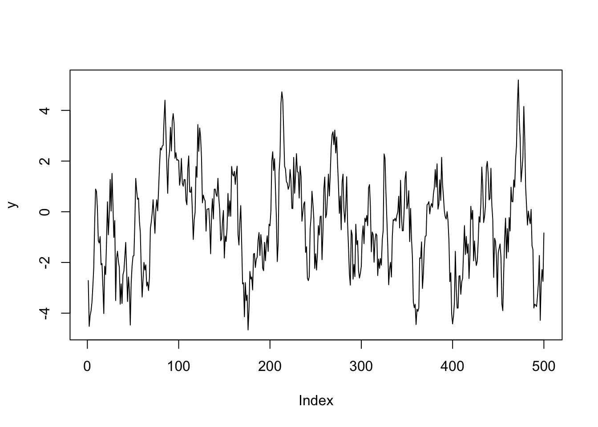

- notice how sparse the matrix $\mathbf{Q}$ is


```r
mean(Q == 0)
```

```
## [1] 0.994008
```

- Recall the autocorrelation function of an AR(1) timeseries at lag $h$:
    - $\gamma(h) = \phi^h$
    

```r
Sigma <- solve(Q)
plot(
    Sigma[1, ] / Sigma[1, 1], 
    type = 'p', 
    main = "GMRF ACF in points, theoretical ACF in red"
)
lines(c(1, phi^(1:(n-1))), col = "red")
```

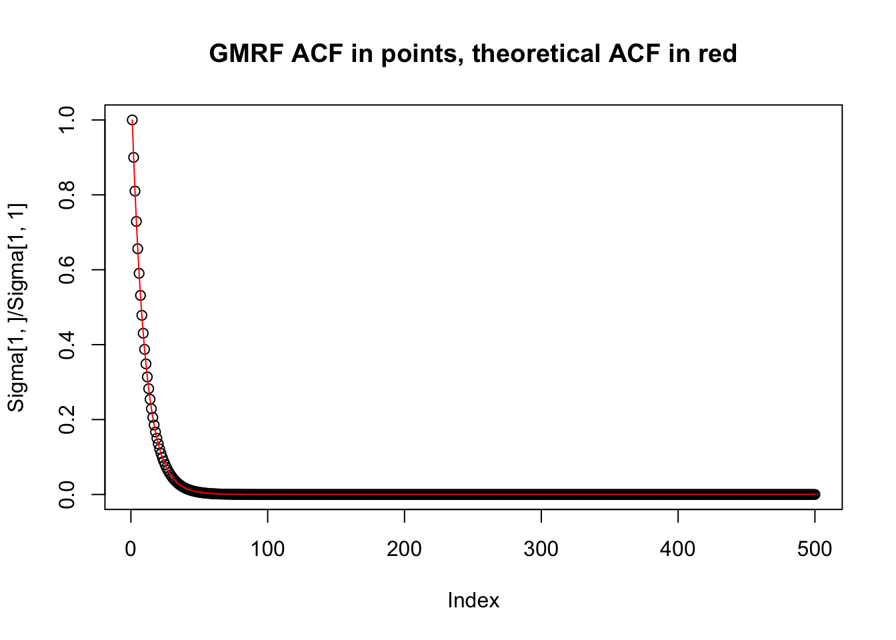

where $\boldsymbol{\Sigma}$ is a dense matrix


```r
mean(Sigma == 0)
```

```
## [1] 0
```

therefore, the GMRF formulation can be evaluated using $\mathcal{O}(n)$ algorithms


## Conditional Autoregressive models (CAR models)

- spatial data have no inherent ordering, but we can still define a set of edges $\mathcal{E}$ based on spatial adjacency

- Many ways to define adjacency -- typically if two regions share a border, they are adjacent

 - $i \sim j$ implies that site $i$ and $j$ are adjacent (equivalent to $\{i, j\} \in \mathcal{E}$)

- $\mathbf{A}$ is an $n \times n$ adjacency matrix

- $A_{ij} = I\{i \sim j\}$ is an indicator of adjacency

- $N_i = \{j | A_{ij} = 1\}$ is the set of neighbors of region $i$

- $d_i = \sum_{j=1}^n A_{ij}$ is the number of neighbors of region $i$

    - $\mathbf{D} = \operatorname{diag}(d_1, \ldots, d_n)$

- $\bar{y}_i = \frac{1}{d_i} \sum_{j=1}^n A_{ij} y_i$ is the mean of region $i$'s neighbors (note the similarity to a nearest neighbors type algorithm)


### Models built based on conditional distributions: $y_i | \mathbf{y}_{-i}$

- CAR model is a GMRF given by

\begin{align*}
y_i | \mathbf{y}_{-i} & \sim N \left( \phi \bar{y}_i, \frac{\sigma^2}{d_i} \right)
\end{align*}

where each region $i$ is conditionally independent from all other regions given its neighbors

- If there is a valid joint distribution that has these full conditional distributions, the conditional distributions are said to be compatible

    - how do we know if these conditional distributions are compatible?
    
Consider the joint distribution

\begin{align*}
\mathbf{y} \sim N \left(0, \sigma^2 \left(\mathbf{D} - \phi \mathbf{A} \right)^{-1} \right)
\end{align*}

- the covariance is positive definite if $\frac{1}{\lambda_n} < \phi < \frac{1}{\lambda_1}$ where $\lambda_n$ is the smallest eigenvalue and $\lambda_1$ is the largest eigenvalue of $\mathbf{D}^{-1/2}\mathbf{A}\mathbf{D}^{-1/2}$

    - First, let $\boldsymbol{\Gamma} \boldsymbol{\Lambda} \boldsymbol{\Gamma}'$ be the eigen-decomposition of $\mathbf{D}^{-1/2}\mathbf{A}\mathbf{D}^{-1/2}$ where $\boldsymbol{\Lambda} = \operatorname{diag}(\lambda_1, \ldots, \lambda_n)$ with $\lambda_1 \geq \lambda_2 \geq \cdots \geq \lambda_n$
    
\begin{align*}
\mathbf{D} - \phi \mathbf{A} & = \mathbf{D}^{1/2} (\mathbf{I} - \phi \mathbf{D}^{-1/2}\mathbf{A}\mathbf{D}^{-1/2}) \mathbf{D}^{1/2} \\
& = \mathbf{D}^{1/2} (\mathbf{I} - \phi \boldsymbol{\Gamma} \boldsymbol{\Lambda} \boldsymbol{\Gamma}') \mathbf{D}^{1/2} \\
& = \mathbf{D}^{1/2} (\boldsymbol{\Gamma} \boldsymbol{\Gamma}' - \phi \boldsymbol{\Gamma} \boldsymbol{\Lambda} \boldsymbol{\Gamma}') \mathbf{D}^{1/2} \\
& = \mathbf{D}^{1/2} \boldsymbol{\Gamma} (\mathbf{I} - \phi \boldsymbol{\Lambda}) \boldsymbol{\Gamma}' \mathbf{D}^{1/2} \\
\end{align*}

which has positive eigenvlaues $\Leftrightarrow$ $\frac{1}{\lambda_n} < \phi < \frac{1}{\lambda_1}$ (if $\phi$ was outside this range, the $\mathbf{I} - \phi \boldsymbol{\Lambda}$ would contain negative values which would violate the positive definite condition)

- To show the above model gives the desired conditional probability distributions

\begin{align*}
\mathbf{y} & \sim N \left(0, \sigma^2 \left(\mathbf{D} - \phi \mathbf{A} \right)^{-1} \right) \\
& \propto \exp \left( -\frac{1}{2 \sigma^2} \mathbf{y}' \left(\mathbf{D} - \phi \mathbf{A} \right) \mathbf{y} \right) \\
& \propto \exp \left( -\frac{1}{2 \sigma^2} \left( \sum_{i=1}^n d_i y_i^2 - 2 \phi \sum_{i \sim j} y_{ij} \right) \right)
\end{align*}

where the conditional probability distribution $[y_i | \mathbf{y}_{-i}]$ is

\begin{align*}
[y_i | \mathbf{y}_{-i}] & \propto \exp \left( -\frac{1}{2 \sigma^2} \left( d_i y_i^2 - 2 \phi d_i \bar{y}_i \right) \right) \\
& \propto \exp \left( -\frac{1}{2 \frac{\sigma^2} {d_i}} \left( y_i^2 - 2 \phi \bar{y}_i \right) \right) \\
& \propto \exp \left( -\frac{1}{2 \frac{\sigma^2} {d_i}} \left( y_i - \phi \bar{y}_i \right)^2 \right) \\
\end{align*}

which is the kernel of the conditional probability distribution we started with

\begin{align*}
y_i | \mathbf{y}_{-i} & \sim N \left( \phi \bar{y}_i, \frac{\sigma^2}{d_i} \right)
\end{align*}

- The multivariate normal likelihood for the CAR model is:

    \begin{align*}
    [\mathbf{y} | \boldsymbol{\mu}, \mathbf{Q}] & = (2 \pi)^{-n / 2} |\mathbf{D} - \phi \mathbf{A}|^{1/2} \exp\left( -1 / 2 \left( \mathbf{y} - \boldsymbol{\mu} \right) \left(\mathbf{D} - \phi \mathbf{A} \right) \left(\mathbf{y} - \boldsymbol{\mu} \right) \right)
    \end{align*}
    
    - The kernel of the likelihood is trivially fast due to sparse matrix operations and due to the precision construction (no matrix inverses!)
    
    - The determinant $|\mathbf{D} - \phi \mathbf{A}|$ is easy to calculate as 
    
    \begin{align*}
    |\mathbf{D} - \phi \mathbf{A}| & = |\mathbf{D}^{1/2} \left( \mathbf{I} - \phi \mathbf{A} \right) \mathbf{D}^{1/2}| \\
    & = |\mathbf{D}^{1/2} \boldsymbol{\Gamma} \left( \mathbf{I} - \phi \boldsymbol{\Lambda} \right) \boldsymbol{\Gamma}' \mathbf{D}^{1/2}| \\
    & = |\mathbf{D}^{1/2} \boldsymbol{\Gamma}| | \mathbf{I} - \phi \boldsymbol{\Lambda}| |\boldsymbol{\Gamma}' \mathbf{D}^{1/2}| \\
    & =  | \mathbf{I} - \phi \boldsymbol{\Lambda}| \\
    & =  \prod_{i=1}^n| (1 - \phi \lambda_i)
    \end{align*}
    
    - sparse routines can be used to calculate these eigenvalues


- if $\phi \in [0, 1)$, this model is called the conditional autoregressive (CAR) model and the covariance is positive definite so that the joint distribution of $\mathbf{y}$ is proper (integrates to 1)

- if $\phi = 1$, this is called an intrinsic CAR (ICAR) model and the covariance is singular so this model is only useful as a prior

    - very efficient model for Bayesian inference and MCMC
    
    - needs an additional assumption that $\sum_{i=1}^n y_i = 0$
    
    <!-- - arose from Physics/statistical mechanics from the [Ising model](https://en.wikipedia.org/wiki/Ising_model) and gave [rise to the Gibbs sampling algorithm](https://ieeexplore.ieee.org/stamp/stamp.jsp?tp=&arnumber=4767596) -->
    
- Note: $\phi$ is not a correlation! However, correlation increases as $\phi$ increases

    - typicallly, we assume $\phi$ will be large [A close look at the spatial structure implied by
the CAR and SAR models](https://www.sciencedirect.com/science/article/abs/pii/S0378375803001113)

- if $\phi = 0$, then the observations are spatially independent


```r
n <- 10^2
phi <- 0.4
## construct a sparse matrix adjacency matrix for a 2-d lattice
A  <- igraph::as_adjacency_matrix(igraph::make_lattice(length = sqrt(n), dim = 2), sparse = TRUE)
A[1:5, 1:5]
```

```
## 5 x 5 sparse Matrix of class "dgCMatrix"
##               
## [1,] . 1 . . .
## [2,] 1 . 1 . .
## [3,] . 1 . 1 .
## [4,] . . 1 . 1
## [5,] . . . 1 .
```

```r
D <- Diagonal(x = colSums(A))
D[1:5, 1:5]
```

```
## 5 x 5 diagonal matrix of class "ddiMatrix"
##      [,1] [,2] [,3] [,4] [,5]
## [1,]    2    .    .    .    .
## [2,]    .    3    .    .    .
## [3,]    .    .    3    .    .
## [4,]    .    .    .    3    .
## [5,]    .    .    .    .    3
```

```r
Q <- D - phi * A
Q[1:5, 1:5]
```

```
## 5 x 5 sparse Matrix of class "dgCMatrix"
##                              
## [1,]  2.0 -0.4  .    .    .  
## [2,] -0.4  3.0 -0.4  .    .  
## [3,]  .   -0.4  3.0 -0.4  .  
## [4,]  .    .   -0.4  3.0 -0.4
## [5,]  .    .    .   -0.4  3.0
```

```r
Sigma <- solve(Q)
## calculate the correlation from a first order CAR
Sigma[5, 6] / Sigma[5, 5]
```

```
## [1] 0.1393298
```

```r
n_phi <- 500
phi <- seq(-1, 1, length.out = n_phi)[-c(1, n_phi)]
rho <- rep(0, n_phi - 2)
## do this as a loop
for (i in 1:(n_phi-2)) {
    A  <- igraph::as_adjacency_matrix(make_lattice(length = sqrt(n), dim = 2), sparse = TRUE)
    D <- Diagonal(x = colSums(A))
    Q <- D - phi[i] * A
    Sigma <- solve(Q)
    ## calculate the correlation from a first order CAR
    rho[i] <- Sigma[5, 6] / Sigma[5, 5]
}
data.frame(phi = phi, rho = rho) %>%
  ggplot(aes(x = phi, y = rho)) +
  geom_line() +
  ylim(c(-1, 1)) +
  ylab("correlation") +
  ggtitle("CAR correlation (lag-1) vs phi parameter") +
  geom_abline(slope = 1, intercept = 0, color = "red") 
```

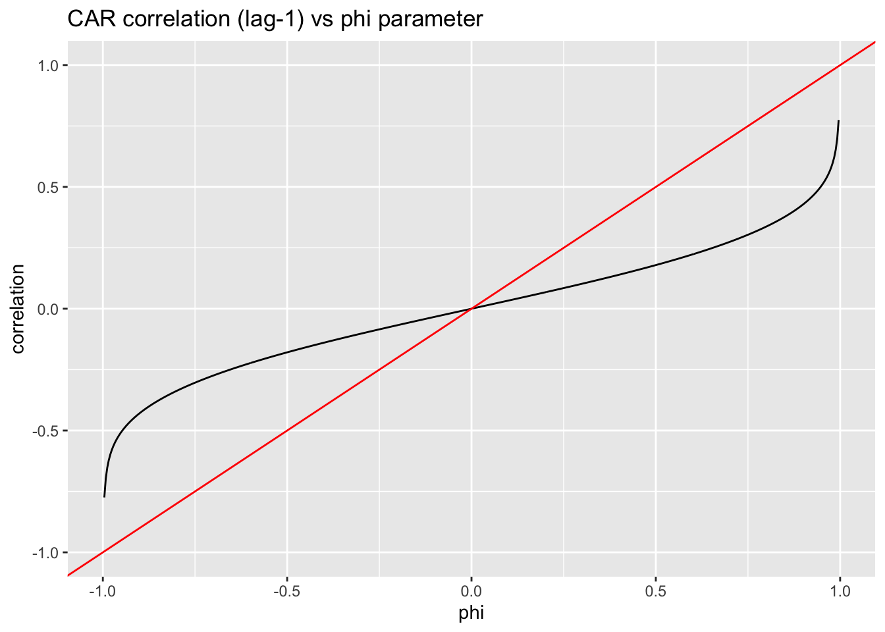

- Plot how the $\phi$ parameter determines the correlation


```r
## simulate some data

simulate_data <- function(n, phi) {
  
  locs <- 
    expand.grid(
      seq(0, 1, length.out = sqrt(n)),
      seq(0, 1, length.out = sqrt(n))
    )
  
  # plot(make_lattice(length = sqrt(n), dim = 2))
  
  A  <- make_lattice(length = sqrt(n), dim = 2) %>%
    as_adjacency_matrix(sparse = TRUE)
  D <- Diagonal(x = colSums(A))
  Q <- D - phi * A
  ## cholesky (this is a sparse matrix that is upper diagonal)
  R <- chol(Q)
  y <- backsolve(R, rnorm(n))
  
  ## generate the plot
  output <- data.frame(x = locs[, 1], y = locs[, 2], z = y) %>%
    ggplot(aes(x = x, y = y, fill = z)) +
    geom_raster() +
    scale_fill_viridis() +
    ggtitle(paste("Phi = ", phi))
  
  return(output)
}  

p1 <- simulate_data(n = 50^2, phi = 0.999)
p2 <- simulate_data(n = 50^2, phi = 0.9)
p3 <- simulate_data(n = 50^2, phi = 0.8)
p4 <- simulate_data(n = 50^2, phi = - 0.8)
p5 <- simulate_data(n = 50^2, phi = -0.9)
p6 <- simulate_data(n = 50^2, phi = - 0.999)

(p1 | p2 | p3) / (p4 | p5 | p6)
```

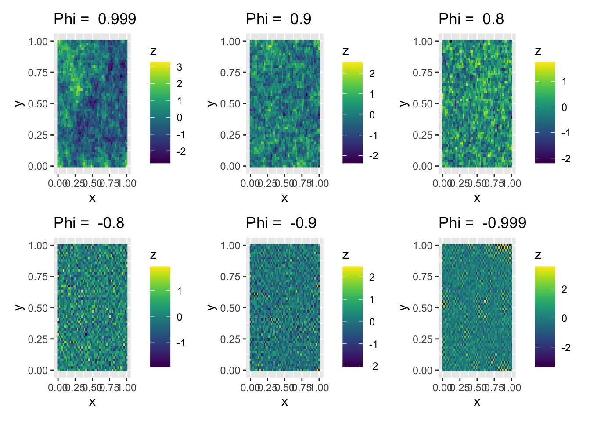


#### Fitting a CAR model in `stan`


```r
## simulate data for fitting the model
n <- 10^2
phi <- 0.999
sigma2 <- 0.5
locs <- 
  expand.grid(
    seq(0, 1, length.out = sqrt(n)),
    seq(0, 1, length.out = sqrt(n))
  )

# plot(make_lattice(length = sqrt(n), dim = 2))

A  <- make_lattice(length = sqrt(n), dim = 2) %>%
  as_adjacency_matrix(sparse = TRUE)
D <- Diagonal(x = colSums(A))
Q <- D - phi * A
## cholesky (this is a sparse matrix that is upper diagonal)
R <- chol(Q)
eta <- backsolve(R, rnorm(n))
y <- eta + rnorm(n, 0, sqrt(sigma2))

p1 <- data.frame(x = locs[, 1], y = locs[, 2], z = eta) %>%
    ggplot(aes(x = x, y = y, fill = z)) +
    geom_raster() +
    scale_fill_viridis() +
    ggtitle("Spatial random effect")
p2 <- data.frame(x = locs[, 1], y = locs[, 2], z = y) %>%
    ggplot(aes(x = x, y = y, fill = z)) +
    geom_raster() +
    scale_fill_viridis() +
    ggtitle("Observed data")
p1 + p2
```

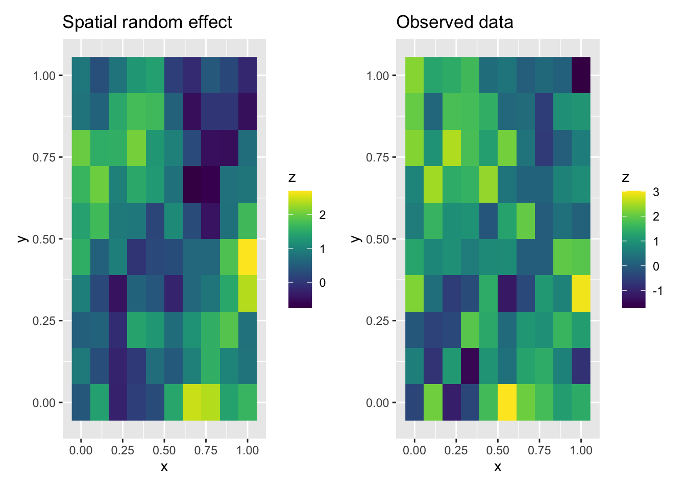


- we need to define a stan model

- create a stan model in a folder named `stan_models` in the Rstudio project folder

- print the output of the model `spatial-car.stan`


```r
cat(read_lines(here::here("stan_models", "spatial-car.stan")), sep = "\n")
```

```
data {
    int<lower=0> N;    // the number of observations
    vector[N] y;       // the obersved values
    matrix[N, N] A;    // the N times N adjacency matrix 
    matrix[N, N] D;    // the N times N diagonal matrix of neighbors
}
parameters {
    vector[N] eta;    //
    real mu;
    real<lower=0> sigma2;
    real<lower=0> tau2;
    real<lower=0, upper=1> phi;
}
// transformed parameters {
//     vector[N] y_pred = mu + w_s;
// }
model {
    matrix[N, N] Sigma_inv = (D - phi * A) / tau2;
    eta ~ multi_normal_prec(rep_vector(0, N), Sigma_inv);
    mu ~ normal(0, 1);
    sigma2 ~ cauchy(0, 5);
    tau2 ~ cauchy(0, 5);
    y ~ normal(mu + eta, sigma2);
}
```


- Fitting the model

    - note: this is very slow for even moderate sized data
    

```r
fit <- stan(
    file = here::here("stan_models", "spatial-car.stan"),
    ## note: convert from a sparse matrix format to regular matrix
    ## for fitting in stan
    data = list(y = y, N = n, D = as.matrix(D), A = as.matrix(A)),
    iter = 5000
)  
```

```
## Warning: There were 18 divergent transitions after warmup. See
## http://mc-stan.org/misc/warnings.html#divergent-transitions-after-warmup
## to find out why this is a problem and how to eliminate them.
```

```
## Warning: There were 4 chains where the estimated Bayesian Fraction of Missing Information was low. See
## http://mc-stan.org/misc/warnings.html#bfmi-low
```

```
## Warning: Examine the pairs() plot to diagnose sampling problems
```

```
## Warning: Bulk Effective Samples Size (ESS) is too low, indicating posterior means and medians may be unreliable.
## Running the chains for more iterations may help. See
## http://mc-stan.org/misc/warnings.html#bulk-ess
```

```
## Warning: Tail Effective Samples Size (ESS) is too low, indicating posterior variances and tail quantiles may be unreliable.
## Running the chains for more iterations may help. See
## http://mc-stan.org/misc/warnings.html#tail-ess
```

- Note: this is giving warinings -- it's best to pay attention to these in stan


```r
print(fit, probs = c(0.1, 0.9), pars = c("mu", "tau2", "sigma2", "phi", "lp__"))
```

```
## Inference for Stan model: spatial-car.
## 4 chains, each with iter=5000; warmup=2500; thin=1; 
## post-warmup draws per chain=2500, total post-warmup draws=10000.
## 
##        mean se_mean    sd    10%   90% n_eff Rhat
## mu     0.80    0.01  0.22   0.57  1.02   379 1.01
## tau2   1.88    0.05  0.76   0.87  2.87   264 1.01
## sigma2 0.50    0.01  0.19   0.24  0.74   180 1.01
## phi    0.74    0.01  0.19   0.47  0.96   628 1.00
## lp__   6.78    2.39 29.17 -21.79 52.05   149 1.01
## 
## Samples were drawn using NUTS(diag_e) at Sun Nov  7 14:26:02 2021.
## For each parameter, n_eff is a crude measure of effective sample size,
## and Rhat is the potential scale reduction factor on split chains (at 
## convergence, Rhat=1).
```

```r
mcmc_trace(fit, regex_pars = c("mu", "tau2", "sigma2", "phi"))
```

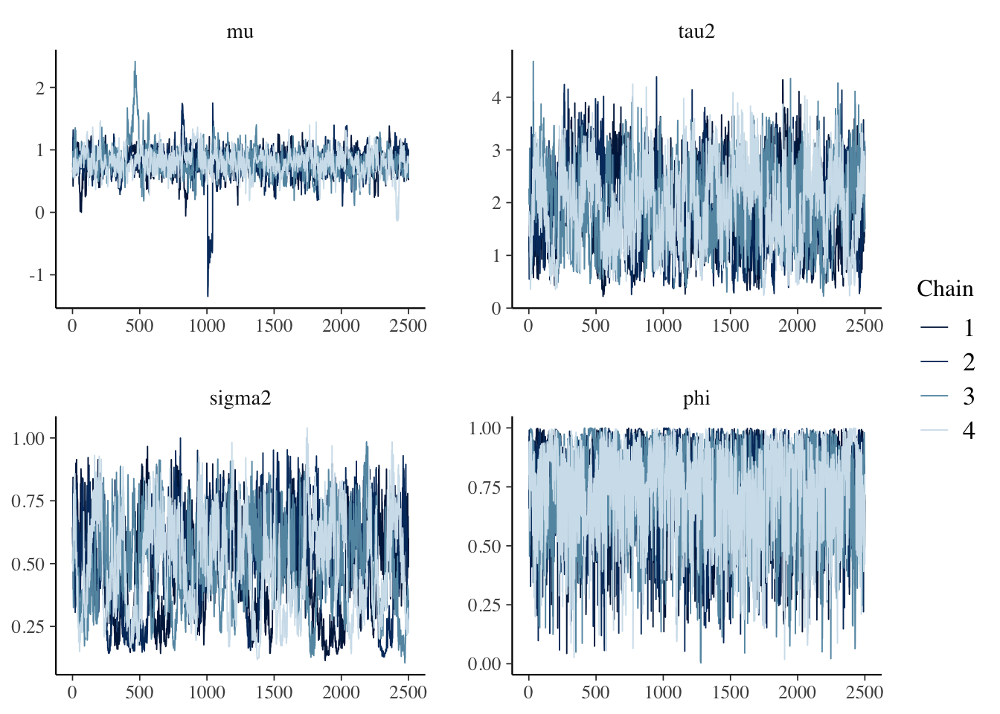

```r
mcmc_areas(fit, regex_pars = c("mu", "tau2", "sigma2", "phi"))
```

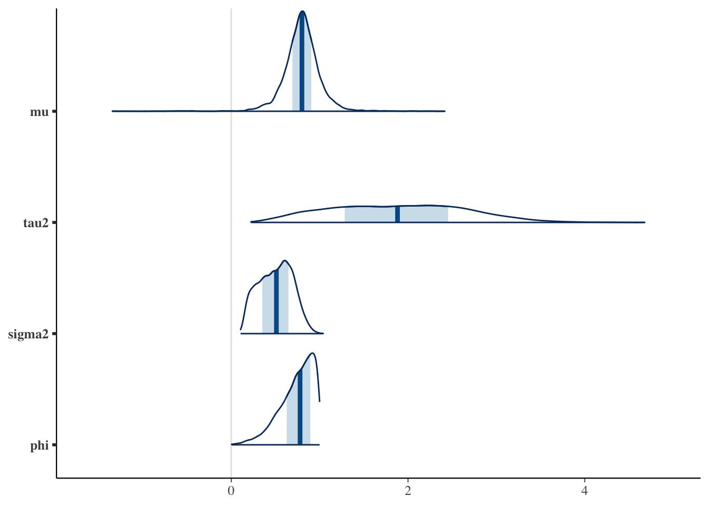

```r
mcmc_acf(fit, regex_pars = c("mu", "tau2", "sigma2", "phi"))
```

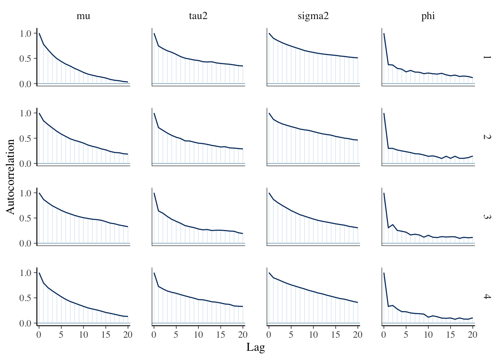

- plot fitted vs. simulated spatial random effect


```r
eta_post <- extract(fit)$eta
plot(apply(eta_post, 2, mean), eta)
abline(0, 1, col = "red")
```

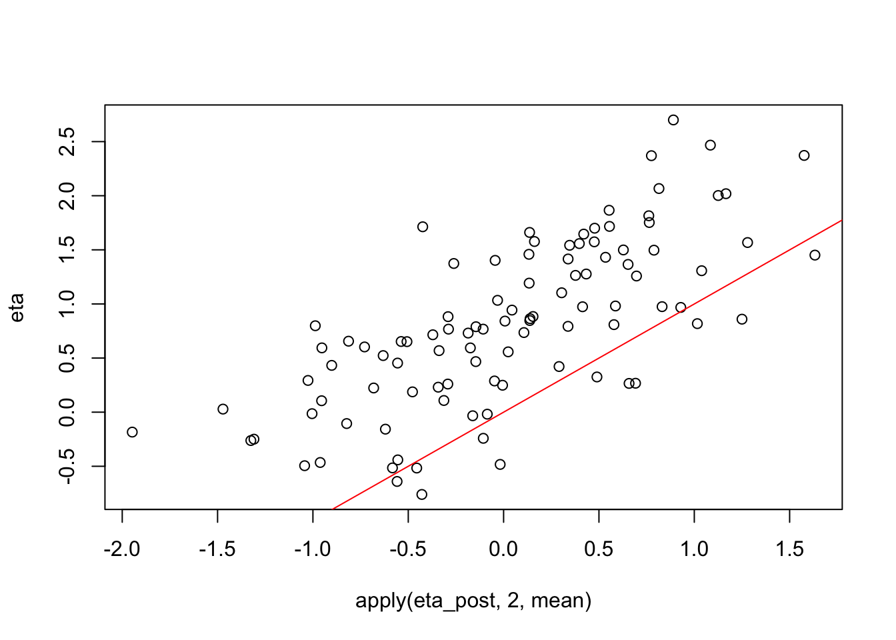


- looks like there might be a mean shift (non-identifiability)


```r
mu_post <- extract(fit)$mu
plot(mean(mu_post) + apply(eta_post, 2, mean), eta)
abline(0, 1, col = "red")
```

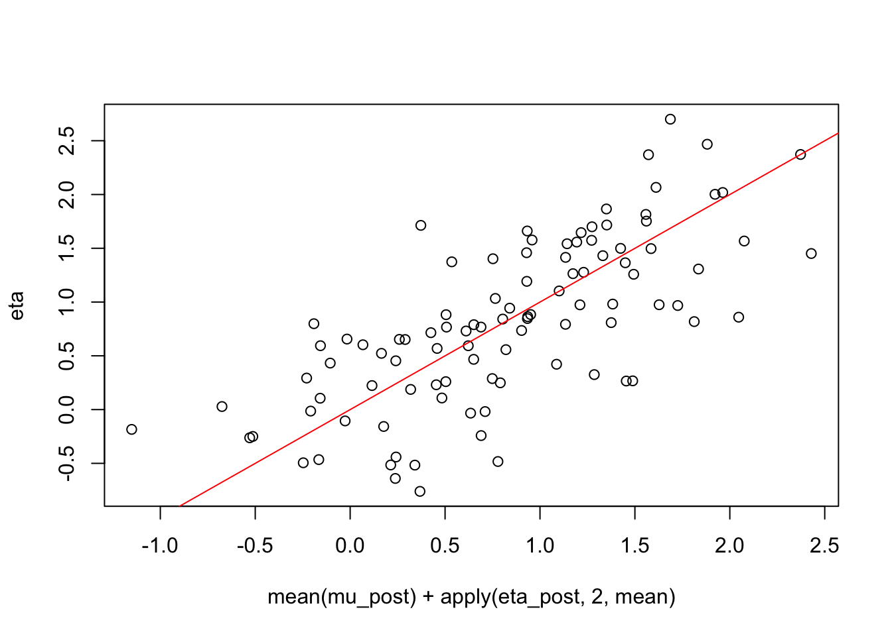


```r
mean(eta)
```

```
## [1] 0.8118206
```


- Note: the above model is inefficient as it doesn't leverage sparse matrix operations. More complicated (and efficient) code is [available here](https://mc-stan.org/users/documentation/case-studies/mbjoseph-CARStan.html)

- Example where the CAR parameter $\phi = 1$ is [available here](https://mc-stan.org/users/documentation/case-studies/icar_stan.html)

### Simultaneous autoregressive (SAR) model

\begin{align*}
y_i & = \phi \frac{1}{d_i} \sum_{j \in N_i} y_j + \varepsilon_i
\end{align*}

where $\varepsilon_i \stackrel{iid}{\sim} N(0, \sigma^2)$

- **Note: this is not a conditional distribution like the CAR model -- this gives the definition of a joint distribution**

- Some algebra gives

\begin{align*}
& \mathbf{y} = \rho \mathbf{A} \mathbf{D}^{-1} \mathbf{y} + \boldsymbol{\varepsilon} \\
\Rightarrow & \left(\mathbf{I} - \rho \mathbf{A} \mathbf{D}^{-1} \right) \mathbf{y}  = \boldsymbol{\varepsilon} \\
\Rightarrow & \mathbf{y} = \left(\mathbf{I} - \rho \mathbf{A} \mathbf{D}^{-1} \right)^{-1} \boldsymbol{\varepsilon} \\
\end{align*}

which implies the joint distribution

\begin{align*}
\mathbf{y} & \sim \operatorname{N} \left(\mathbf{0}, \left(\mathbf{I} - \rho \mathbf{A} \mathbf{D}^{-1} \right)^{-1}\left(\mathbf{I} - \rho \mathbf{A} \mathbf{D}^{-1} \right)^{-1} \right)
\end{align*}

which has a similar form to the SPDE models 


- Note: $\phi$ is not a correlation! However, correlation increases as $\phi$ increases

    - typicallly, we assume $\phi$ will be large [A close look at the spatial structure implied by
the CAR and SAR models](https://www.sciencedirect.com/science/article/abs/pii/S0378375803001113)

- if $\phi = 0$, then the observations are spatially independent


```r
n <- 10^2
phi <- 0.4
## construct a sparse matrix adjacency matrix for a 2-d lattice
A  <- igraph::as_adjacency_matrix(make_lattice(length = sqrt(n), dim = 2), sparse = FALSE)
D  <- diag(rowSums(A))
Sigma <- solve(diag(n) - phi * A %*% solve(D)) %*% t(solve(diag(n) - phi * A %*% solve(D)))

## calculate the correlation from a first order SAR
cov2cor(Sigma)[5, 6]
```

```
## [1] 0.2755259
```

```r
## do this as a loop
n_phi <- 500
phi <- seq(-1, 1, length.out = n_phi)[-c(1, n_phi)]
rho <- rep(0, n_phi - 2)
A  <- igraph::as_adjacency_matrix(make_lattice(length = sqrt(n), dim = 2), sparse = FALSE)
D <- diag(rowSums(A))
for (i in 1:(n_phi-2)) {
  Sigma <- solve(diag(n) - phi[i] * A %*% solve(D)) %*% t(solve(diag(n) - phi[i] * A %*% solve(D)))
  ## calculate the correlation from a first order CAR
  rho[i] <- cov2cor(Sigma)[5, 6] 
}
data.frame(phi = phi, rho = rho) %>%
  ggplot(aes(x = phi, y = rho)) +
  geom_line() +
  ylim(c(-1, 1)) +
  ylab("correlation") +
  ggtitle("SAR correlation (lag-1) vs. phi parameter") +
  geom_abline(slope = 1, intercept = 0, color = "red")
```

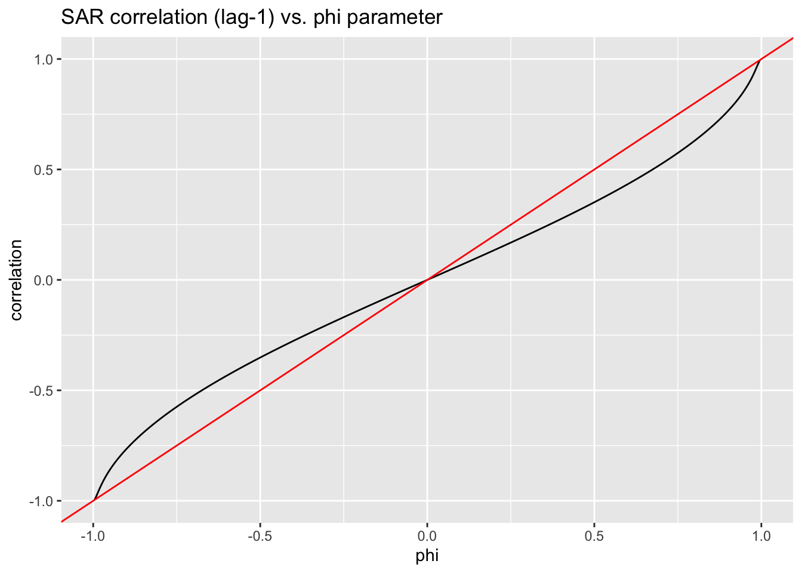

- Plot how the $\phi$ parameter determines the correlation


```r
## simulate some data

simulate_data <- function(n, phi) {
  
  locs <- 
    expand.grid(
      seq(0, 1, length.out = sqrt(n)),
      seq(0, 1, length.out = sqrt(n))
    )
  
  # plot(make_lattice(length = sqrt(n), dim = 2))
  
  A  <- make_lattice(length = sqrt(n), dim = 2) %>%
    as_adjacency_matrix(sparse = TRUE)
  D <- Diagonal(x = colSums(A))
  Q <- (diag(n) - phi * A %*% solve(D)) %*% t(diag(n) - phi * A %*% solve(D))
  ## cholesky (this is a sparse matrix that is upper diagonal)
  R <- chol(Q)
  y <- backsolve(R, rnorm(n))
  
  ## generate the plot
  output <- data.frame(x = locs[, 1], y = locs[, 2], z = y) %>%
    ggplot(aes(x = x, y = y, fill = z)) +
    geom_raster() +
    scale_fill_viridis() +
    ggtitle(paste("Phi = ", phi)) 
  
  return(output)
}  

p1 <- simulate_data(n = 50^2, phi = 0.999)
p2 <- simulate_data(n = 50^2, phi = 0.9)
p3 <- simulate_data(n = 50^2, phi = 0.8)
p4 <- simulate_data(n = 50^2, phi = - 0.8)
p5 <- simulate_data(n = 50^2, phi = -0.9)
p6 <- simulate_data(n = 50^2, phi = - 0.999)

(p1 | p2 | p3) / (p4 | p5 | p6)
```

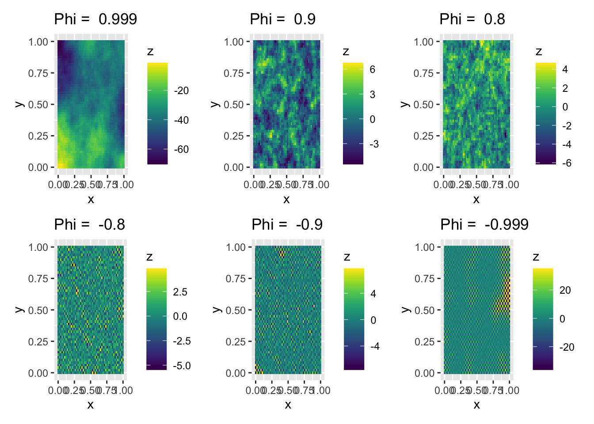


#### Fitting a SAR model in `stan`


```r
## simulate data for fitting the model
n <- 10^2
phi <- 0.9
sigma2 <- 0.5
tau2 <- 2
locs <- 
  expand.grid(
    seq(0, 1, length.out = sqrt(n)),
    seq(0, 1, length.out = sqrt(n))
  )

# plot(make_lattice(length = sqrt(n), dim = 2))

A  <- make_lattice(length = sqrt(n), dim = 2) %>%
  as_adjacency_matrix(sparse = TRUE)
D <- Diagonal(x = colSums(A))
Q <- (diag(n) - phi * A %*% D) %*% t(diag(n) - phi * A %*% D) / tau2
## cholesky (this is a sparse matrix that is upper diagonal)
R <- chol(Q)
eta <- backsolve(R, rnorm(n))
y <- eta + rnorm(n, 0, sqrt(sigma2))

p1 <- data.frame(x = locs[, 1], y = locs[, 2], z = eta) %>%
    ggplot(aes(x = x, y = y, fill = z)) +
    geom_raster() +
    scale_fill_viridis() +
    ggtitle("Spatial random effect")
p2 <- data.frame(x = locs[, 1], y = locs[, 2], z = y) %>%
    ggplot(aes(x = x, y = y, fill = z)) +
    geom_raster() +
    scale_fill_viridis() +
    ggtitle("Observed data")
p1 + p2
```

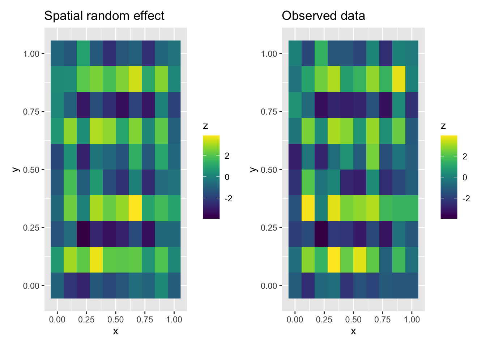


- we need to define a stan model

- print the output of the model `spatial-sar.stan`


```r
cat(read_lines(here::here("stan_models", "spatial-sar.stan")), sep = "\n")
```

```
data {
  int<lower=0> N;
  vector[N] y;
  matrix[N, N] A;
  matrix[N, N] D;
}
transformed data {
  matrix[N, N] I = diag_matrix(rep_vector(1, N));
  matrix[N, N] A_D_inv;
  A_D_inv = A * inverse(D);
}
parameters {
  vector[N] eta;
  real mu;
  real<lower=0> sigma2;
  real<lower=0> tau2;
  real<lower=0,upper=1> phi;
}
transformed parameters {
  vector[N] y_pred = mu + eta;
}
model {
  matrix[N,N] C = I - phi * A_D_inv;
  matrix[N,N] Sigma_inv = C * C' / tau2;
  eta ~ multi_normal_prec(rep_vector(0, N), Sigma_inv);
  mu ~ normal(0, 1);
  sigma2 ~ cauchy(0, 5);
  tau2 ~ cauchy(0, 5);
  y ~ normal(mu + eta, sigma2);
}
```


- Fitting the model

    - note: this is very slow for even moderate sized data
    

```r
fit <- stan(
    file = here::here("stan_models", "spatial-sar.stan"),
    ## note: convert from a sparse matrix format to regular matrix
    ## for fitting in stan
    data = list(y = y, N = n, D = as.matrix(D), A = as.matrix(A)),
    iter = 5000
)  
```

```
## Warning: There were 4 chains where the estimated Bayesian Fraction of Missing Information was low. See
## http://mc-stan.org/misc/warnings.html#bfmi-low
```

```
## Warning: Examine the pairs() plot to diagnose sampling problems
```

```
## Warning: The largest R-hat is 1.06, indicating chains have not mixed.
## Running the chains for more iterations may help. See
## http://mc-stan.org/misc/warnings.html#r-hat
```

```
## Warning: Bulk Effective Samples Size (ESS) is too low, indicating posterior means and medians may be unreliable.
## Running the chains for more iterations may help. See
## http://mc-stan.org/misc/warnings.html#bulk-ess
```

```
## Warning: Tail Effective Samples Size (ESS) is too low, indicating posterior variances and tail quantiles may be unreliable.
## Running the chains for more iterations may help. See
## http://mc-stan.org/misc/warnings.html#tail-ess
```

- Note: this is giving warinings -- it's best to pay attention to these in stan


```r
print(fit, probs = c(0.1, 0.9), pars = c("mu", "tau2", "sigma2", "phi", "lp__"))
```

```
## Inference for Stan model: spatial-sar.
## 4 chains, each with iter=5000; warmup=2500; thin=1; 
## post-warmup draws per chain=2500, total post-warmup draws=10000.
## 
##           mean se_mean    sd     10%    90% n_eff Rhat
## mu       -0.14    0.01  0.25   -0.44   0.17   982 1.00
## tau2      2.66    0.15  1.39    0.50   4.29    81 1.05
## sigma2    1.13    0.07  0.60    0.33   1.94    71 1.05
## phi       0.23    0.00  0.15    0.05   0.43  1299 1.00
## lp__   -129.35    6.44 51.01 -178.23 -49.96    63 1.04
## 
## Samples were drawn using NUTS(diag_e) at Sun Nov  7 14:36:21 2021.
## For each parameter, n_eff is a crude measure of effective sample size,
## and Rhat is the potential scale reduction factor on split chains (at 
## convergence, Rhat=1).
```

```r
mcmc_trace(fit, regex_pars = c("mu", "tau2", "sigma2", "phi"))
```

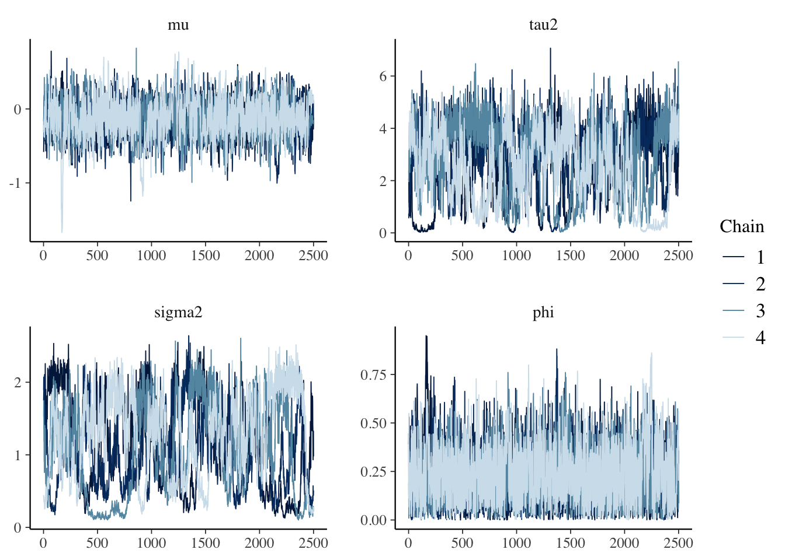

```r
mcmc_areas(fit, regex_pars = c("mu", "tau2", "sigma2", "phi"))
```

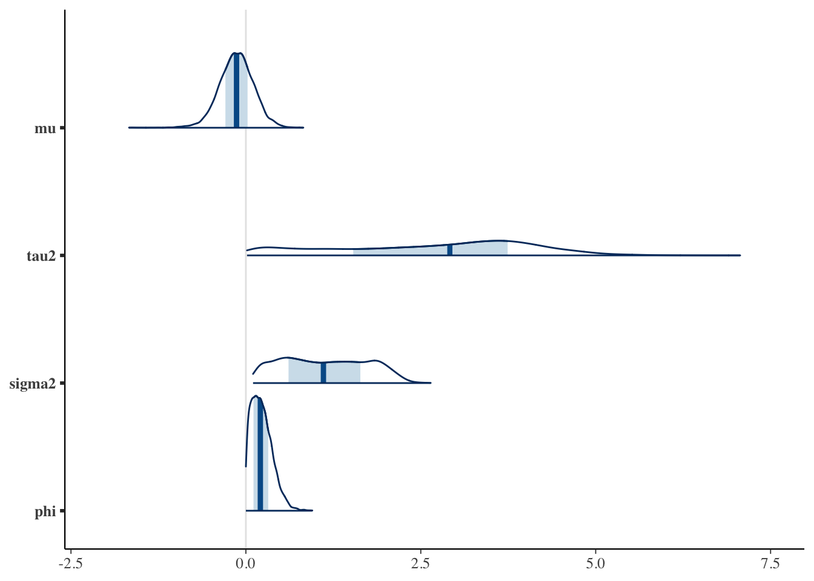

```r
mcmc_acf(fit, regex_pars = c("mu", "tau2", "sigma2", "phi"))
```

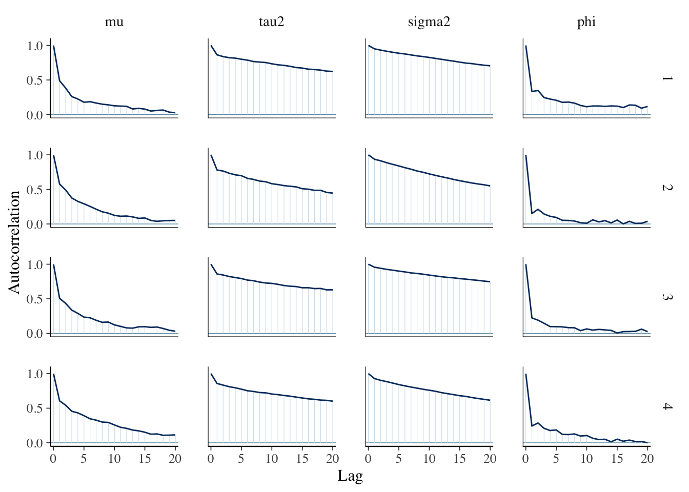

- plot fitted vs. simulated spatial random effect


```r
eta_post <- extract(fit)$eta
plot(apply(eta_post, 2, mean), eta)
abline(0, 1, col = "red")
```

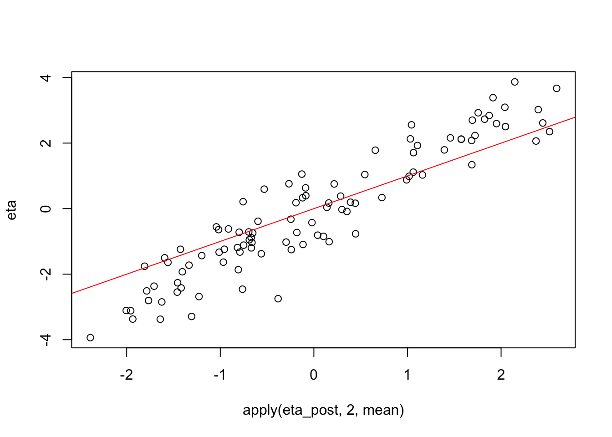


- More on CAR and SAR models is [available here](https://www.stat.colostate.edu/~hooten/papers/pdf/VerHoef_etal_SpatStat_2018.pdf)
### Theoretical Results for more general model classes

- In general, the [Hammersley-Clifford Theorem](https://en.wikipedia.org/wiki/Hammersley%E2%80%93Clifford_theorem) can be used to show that a set of conditional probability distributions specifies a compatible joint probability distribution
    
- If you start with compatible conditional probability distributions, **Brooks' Lemma** is a formula for computing the joint distribution
  
<!-- - **Brooks' Lemma**:     -->
<!-- For sets of observations $\mathbf{x}$ and $\mathbf{y}$ where $[x] > 0~~\forall ~ x\in\mathbf{x}$ and $[y] > 0~~\forall ~ y\in\mathbf{y}$ then -->

<!-- \begin{align*} -->
<!-- \frac{p(\mathbf{y})}{p(\mathbf{x})}  -->
<!--   &= \prod_{i=1}^n \frac{p(y_i ~|~ y_1,\ldots,y_{i-1},x_{i+1},\ldots,x_n)}{p(x_i ~|~ x_1,\ldots,x_{i-1},y_{i+1},\ldots,y_n)} \\ -->
<!--   &= \prod_{i=1}^n \frac{p(y_i ~|~ x_1,\ldots,x_{i-1},y_{i+1},\ldots,y_n)}{p(x_i ~|~ y_1,\ldots,y_{i-1},x_{i+1},\ldots,x_n)} \\ -->
<!-- \end{align*} -->

<!-- - A simplified example -->
<!-- Let $\mathbf{y} = (y_1,y_2)$ and $\mathbf{x} = (x_1,x_2)$ then we can derive Brook's Lemma for this case, -->

<!-- \begin{align*} -->
<!-- [y_1,y_2]  -->
<!--   &= [y_1 | y_2] [y_2] \\ -->
<!--   &= [y_1 | y_2] \frac{[y_2|x_1] \, [x_1]}{[x_1|y_2]} = \frac{[y_1 | y_2]}{[x_1 | y_2]} [y_2|x_1] \, [x_1] \\ -->
<!--   & = \frac{[y_1 | y_2]}{[x_1 | y_2]} [y_2|x_1] \, [x_1] \left(\frac{[x_2|x_1]}{[x_2|x_1]}\right) \\ -->
<!--   & = \frac{[y_1 | y_2]}{[x_1 | y_2]} \frac{[y_2|x_1]}{[x_2|x_1]} \, [x_1,x_2] \\ -->
<!-- \\ -->
<!-- \frac{[y_1,y_2] }{[x_1,x_2]}  -->
<!--   & = \frac{[y_1 | y_2]}{[x_1 | y_2]} \frac{[y_2|x_1]}{[x_2|x_1]} -->
<!-- \end{align*}  -->


random variables $\mathcal{X} = \{ X_v \}_{v \in \mathcal{V}}$ form a Markov random field with respect to $\mathcal{G}$ if they satisfy 
    - **Pairwise Markov property:** 
