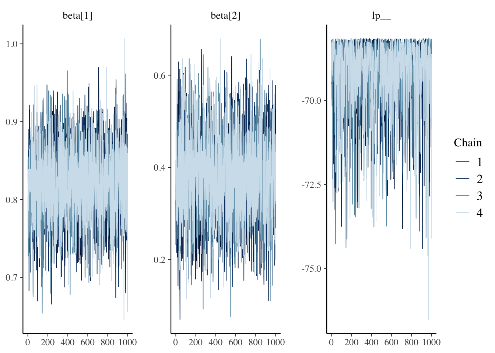
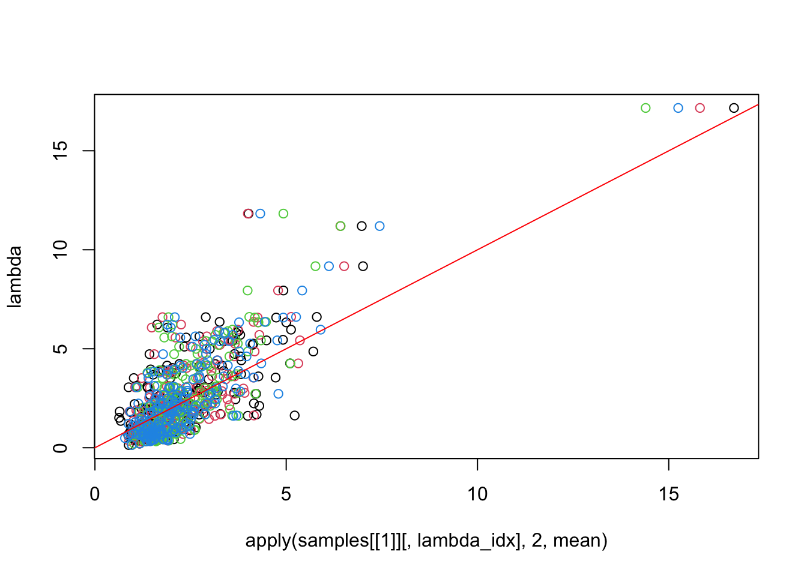

# Day 32


```r
library(tidyverse)
library(fields)
library(viridis)
library(mvnfast)
library(igraph)
library(Matrix)
library(patchwork)
library(mgcv)
library(rstan)
library(nimble)
## use recommended rstan settings
options(mc.cores = parallel::detectCores())
rstan_options(auto_write = TRUE)
library(bayesplot)

set.seed(101)
```


## Announcements


## Generalized (non-Gaussian) spatial models

- Many interesting datasets are non-Gaussian

- Examples:

- environmental monitoring through presence/absence data (binary data)

- a researcher visits a site $\mathbf{s}$ and records if the species of interest is present $y(\mathbf{s}) = 1$ or absent $y(\mathbf{s}) = 0$

- crowd size estimation (count data)

- a researcher wants to determine the total crowd size so she divides the spatial domain into regions $\mathcal{A} = \{ A_1, \ldots, A_n\}$, samples a few of the regions, and counts the number of people $\mathbf{y}_i = \{0, 1, 2, \ldots \}$ in each area. Then, she predicts the counts at unobserved locations to estimate total crowd size.

- For multivariate normal data, the spatial correlation is easy to incorporate

- More challenging for non-Gaussian data

- Recall the Gaussian model:

\begin{align*}
y(\mathbf{s}) | \eta(\mathbf{s}) & \stackrel{iid}{\sim} N(\mathbf{X}(\mathbf{s}) \boldsymbol{\beta} + \eta(\mathbf{s}), \sigma^2) \\
\boldsymbol{\eta} = (\eta(\mathbf{s}_1), \ldots, \eta(\mathbf{s}_n))' & \sim N(\mathbf{0}, \boldsymbol{\Sigma}),
\end{align*}

where $\boldsymbol{\Sigma}$ is the covariance matrix for the covariance function $\tau^2 \mathbf{C}(\| \mathbf{s} - \mathbf{s}' \|)$. 

- If we integrate out the random effect $\boldsymbol{\eta}$ we have:

- $y(\mathbf{s})$ is a GP
- $E\left( y \left( \mathbf{s} \right) \right) = \mathbf{X}(\mathbf{s}) \boldsymbol{\beta}$
- $Cov(y(\mathbf{s}), y(\mathbf{s}')) = \begin{cases} \sigma^2 + \tau^2 & h = 0 \\ \tau^2 C (h) & h > 0 \end{cases}$

- Therefore, given the random effects, the observations are independent, but marginally, the observations are dependent.    


- Instead, for spatial GLMs we add latent Gaussian random effects to the generalized linear model


## Generalized linear models (GLMs) for non-spatial data

- Primary idea: model

\begin{align*}
g \left( E \left( y_i \right) \right) & = \mathbf{X}_i \boldsymbol{\beta}
\end{align*}

for some link function $g(\cdot)$

- What about a nugget?

- It is possible to include a nugget. If you include a nugget, you end up with an over-dispersed (higher variance) marginal model because there is already variance due to the distribution tied to the link function.


### Example: binary (logistic) regression

- $y_i = \{0, 1\}$

- $E \left( y_i \right) = p_i$

- the link function is $p_i = logit \left( E \left( y_i \right) \right) = logit \left( \operatorname{Prob} \left( y_i = 1 \right) \right) = \mathbf{X}_i \boldsymbol{\beta}$

- the logit function is $logit(z) = \frac{e^z}{1 + e^z}$

- sometimes a probit link function is used $p_i = probit \left( E \left( y_i \right) \right) = probit \left( \operatorname{Prob} \left( y_i = 1 \right) \right) = \mathbf{X}_i \boldsymbol{\beta}$    
- the probit function is $probit(z) = \Phi(z)$ where $\Phi()$ is the standard normal CDF

<!-- - Marginal distriubtion of $y(\mathbf{s})$ for binary data -->

<!--     -For Poisson: $[y(\mathbf{s})] = \int \operatorname{Bernoulli}\left( y(\mathbf{s}) | \boldsymbol{\beta}, \boldsymbol{\eta} \right) \operatorname{N} \left( \mathbf{0}, \boldsymbol{\Sigma} \right) d\, \boldsymbol{\eta}$ = ??? -->

<!--     - $E\left( y(\mathbf{s}) \right) = E \left( E\left( y(\mathbf{s}) \right) \middle| \boldsymbol{\eta} \right) = E \left( e^{\mathbf{X}\(\mathbf{s}) \boldsymbol{\beta} + \boldsymbol{\eta}(\mathbf{s}) \right) = e^{\mathbf{X}\(\mathbf{s}) \boldsymbol{\beta}} E \left( e^{\boldsymbol{\eta}(\mathbf{s}) \right) = e^{\mathbf{X}\(\mathbf{s}) \boldsymbol{\beta}} e^{\tau^2 / } \right)$ -->


```r
n <- 500
X <- cbind(1, rnorm(n))
beta <- c(2, 4)
logit <- function(x) exp(x) / (1 + exp(x))
p <- logit(X %*% beta)
y <- rbinom(n, 1, p)
data.frame(x = X[, 2], y = y, p = p) %>%
  ggplot(aes(x = x, y = y)) + 
  geom_point() +
  geom_line(aes(x = x, y = p), col = "red")
```


```r
## fit logistic regression using mgcv
mod <- gam(y ~ X - 1, family = binomial(link = "logit"))
summary(mod)
```

```
## 
## Family: binomial 
## Link function: logit 
## 
## Formula:
## y ~ X - 1
## 
## Parametric coefficients:
##    Estimate Std. Error z value Pr(>|z|)    
## X1   2.4540     0.2764   8.877   <2e-16 ***
## X2   4.7980     0.4861   9.871   <2e-16 ***
## ---
## Signif. codes:  0 '***' 0.001 '**' 0.01 '*' 0.05 '.' 0.1 ' ' 1
## 
## 
## R-sq.(adj) =   0.67   Deviance explained = 62.8%
## UBRE = -0.51829  Scale est. = 1         n = 500
```

####  Binary logistic regression in stan

- we need to define a stan model

- create a stan model in a folder named `stan_models` in the Rstudio project folder

- print the output of the model `logistic-regression.stan`


```r
cat(read_lines("./stan_models/logistic-regression.stan"), sep = "\n")
```

```
data {
  int<lower=0> n;
  int<lower=0> p;
  int<lower=0,upper=1> y[n];
  matrix[n, p] X;
}

parameters {
  vector[p] beta;
}

model {
  y ~ bernoulli_logit(X * beta);
  beta ~ normal(0, 1);
}

generated quantities {
  int y_rep[n];
  y_rep = bernoulli_logit_rng(X * beta);
}
// Note: the stan file must end in a blank (new) line
```

- Fitting the model


```r
if (file.exists("./results/logistic-regression.RData")) {
  load("./results/logistic-regression.RData")
} else {
  fit <- stan(
    file = "./stan_models/logistic-regression.stan",
    data = list(y = y, n = n, X = X, p = ncol(X)),
    iter = 2000)
  save(fit, file = "./results/logistic-regression.RData")
}
```


```r
## only plot the regression parameters
print(fit, probs = c(0.1, 0.9), pars = c("beta", "lp__"))
```

```
## Inference for Stan model: logistic-regression.
## 4 chains, each with iter=2000; warmup=1000; thin=1; 
## post-warmup draws per chain=1000, total post-warmup draws=4000.
## 
##            mean se_mean   sd     10%     90% n_eff Rhat
## beta[1]    2.04    0.01 0.21    1.77    2.31  1348    1
## beta[2]    3.98    0.01 0.35    3.54    4.44  1323    1
## lp__    -131.11    0.03 1.03 -132.41 -130.21  1433    1
## 
## Samples were drawn using NUTS(diag_e) at Sun Nov  7 14:37:26 2021.
## For each parameter, n_eff is a crude measure of effective sample size,
## and Rhat is the potential scale reduction factor on split chains (at 
## convergence, Rhat=1).
```

```r
## trace plots
mcmc_trace(fit, regex_pars = c("beta", "lp__"))
```


Posterior predictive checks


```r
## extract the posterior predictive samples
y_rep <- rstan::extract(fit, pars = "y_rep")$y_rep
```


```r
p1 <- ppc_intervals(y, y_rep, x = X[, 2])
p2 <- ppc_dens_overlay(y, y_rep) 
p3 <- ppc_ecdf_overlay(y, y_rep)   
p1 / p2 / p3
```


####  Binary logistic regression in NIMBLE

- we need to define a nimble model


```r
logistic_code <- nimbleCode({
  ## prior for regression parameters beta
  for (j in 1:q) {
    beta[j] ~ dnorm(0, sd = 10)
  }
  
  for (i in 1:n) {
    ## note that you have to be explicit about the variable
    ## dimensions for each statement
    logit(p[i]) <- X[i, 1:q] %*% beta[1:q]
    y[i] ~ dbin(p[i], m[i])
  }
})

## define the constants, data, and MCMC initial conditions
constants <- list(n = n)
data <- list(
  y = y, 
  m = rep(1, n), 
  X = X,
  q = ncol(X)
)
inits <- list(beta = rnorm(ncol(X)), p = rbeta(n, 1, 1))

## create the NIMBLE model
logistic_model <- nimbleModel(
  code      = logistic_code, 
  constants = constants,
  data      = data,
  inits     = inits
)
```

```
## Defining model
```

```
## Error in getSymbolicParentNodesRecurse(x, constNames, indexNames, nimbleFunctionNames, : Dynamic indexing found in a vector of indices, 1:q. Only scalar indices, such as 'idx' in 'x[idx]', can be dynamic. One can instead use dynamic indexing in a vector of indices inside a nimbleFunction.
```

Note the above error -- it's saying that `q` needs to be specified as a `constant` rather than `data`.


```r
## define the constants, data, and MCMC initial conditions
constants <- list(n = n, q = ncol(X))
data <- list(
  y = y, 
  m = rep(1, n), 
  X = X
)
inits <- list(beta = rnorm(ncol(X)), p = rbeta(n, 1, 1))

## create the NIMBLE model
logistic_model <- nimbleModel(
  code      = logistic_code, 
  constants = constants,
  data      = data,
  inits     = inits
)
```

```
## Defining model
```

```
## Building model
```

```
## Setting data and initial values
```

```
## Running calculate on model
##   [Note] Any error reports that follow may simply reflect missing values in model variables.
```

```
## Checking model sizes and dimensions
```

- Next, we build a default MCMC algorithm 


```r
logistic_mcmc <- buildMCMC(logistic_model)
```

```
## ===== Monitors =====
## thin = 1: beta
## ===== Samplers =====
## RW sampler (2)
##   - beta[]  (2 elements)
```

We can run the algorithm in R code using


```r
runMCMC(logistic_mcmc, niter = 10)
```

```
## Warning: running an uncompiled MCMC algorithm, use compileNimble() for faster execution.
```

```
## running chain 1...
```

```
##         beta[1]  beta[2]
##  [1,] 0.7073565 2.115559
##  [2,] 1.5108923 2.354097
##  [3,] 1.5108923 3.317967
##  [4,] 1.5108923 3.317967
##  [5,] 1.5108923 3.317967
##  [6,] 1.5108923 3.317967
##  [7,] 1.5070121 3.317967
##  [8,] 1.4636310 3.317967
##  [9,] 2.0753124 3.317967
## [10,] 2.0753124 3.317967
```

but this is slow. Instead, we compile the model to c++ for faster runtimes


```r
## compile the model to c++
logistic_model_c <- compileNimble(logistic_model)
```

```
## Compiling
##   [Note] This may take a minute.
##   [Note] Use 'showCompilerOutput = TRUE' to see C++ compilation details.
```

```
## Warning, in eigenizing model_p[getNodeFunctionIndexedInfo(ARG1_INDEXEDNODEINFO__,1)] the [ is still there but nDim is not 0 (not a scalar).
```

```
## Error: Failed to create the shared library. Run 'printErrors()' to see the compilation errors.
```

```r
logistic_mcmc_c  <- compileNimble(logistic_mcmc, project = logistic_model) 
```

```
## Compiling
##   [Note] This may take a minute.
##   [Note] Use 'showCompilerOutput = TRUE' to see C++ compilation details.
```

```
## Error: Compiled C++ model not available; please include the model in your compilation call (or compile it in advance).
```

but we get some errors. A quick Google search [nimble Warning, in eigenizing model_p[getNodeFunctionIndexedInfo(ARG1_INDEXEDNODEINFO__,1)] the [ is still there but nDim is not 0 (not a scalar).](https://github.com/nimble-dev/nimble/issues/755) led me to this site that suggests the problem is that the output of `X[i, 1:q] %*% beta[1:q]` is a matrix but the logit link function needs a scalar. This is some of the "immaturity" I talk about with NIMBLE that makes it sometimes challenging to get started with. Instead, we replace the `X[i, 1:q] %*% beta[1:q]` with the inner product `inprod(X[i, 1:q], beta[1:q])` in the model statement


```r
logistic_code <- nimbleCode({
  ## prior for regression parameters beta
  for (j in 1:q) {
    beta[j] ~ dnorm(0, sd = 10)
  }
  
  for (i in 1:n) {
    ## note that you have to be explicit about the variable
    ## dimensions for each statement
    logit(p[i]) <- inprod(X[i, 1:q], beta[1:q])
    y[i] ~ dbin(p[i], m[i])
  }
})
## define the constants, data, and MCMC initial conditions
constants <- list(n = n, q = ncol(X))
data <- list(
  y = y, 
  m = rep(1, n), 
  X = X
)
inits <- list(beta = rnorm(ncol(X)), p = rbeta(n, 1, 1))

## create the NIMBLE model
logistic_model <- nimbleModel(
  code      = logistic_code, 
  constants = constants,
  data      = data,
  inits     = inits
)
```

```
## Defining model
```

```
## Building model
```

```
## Setting data and initial values
```

```
## Running calculate on model
##   [Note] Any error reports that follow may simply reflect missing values in model variables.
```

```
## Checking model sizes and dimensions
```

```r
## I need the additional option to change my c++ compiler flags when both stan and nimble are loaded
Sys.unsetenv("PKG_CXXFLAGS")
logistic_mcmc    <- buildMCMC(logistic_model)
```

```
## ===== Monitors =====
## thin = 1: beta
## ===== Samplers =====
## RW sampler (2)
##   - beta[]  (2 elements)
```

```r
## compile the model to c++
logistic_model_c <- compileNimble(logistic_model)
```

```
## Compiling
##   [Note] This may take a minute.
##   [Note] Use 'showCompilerOutput = TRUE' to see C++ compilation details.
```

```r
logistic_mcmc_c  <- compileNimble(logistic_mcmc, project = logistic_model) 
```

```
## Compiling
##   [Note] This may take a minute.
##   [Note] Use 'showCompilerOutput = TRUE' to see C++ compilation details.
```

- once the model is compiled, we fit this using `runMCMC`


```r
if (file.exists("./results/logistic-regression-nimble.RData")) {
  load("./results/logistic-regression-nimble.RData")
} else {
  samples <- runMCMC(logistic_mcmc_c, niter = 1000, nchains = 4)
  save(samples, file = "./results/logistic-regression-nimble.RData")
}
```

```
## running chain 1...
```

```
## |-------------|-------------|-------------|-------------|
## |-------------------------------------------------------|
```

```
## running chain 2...
```

```
## |-------------|-------------|-------------|-------------|
## |-------------------------------------------------------|
```

```
## running chain 3...
```

```
## |-------------|-------------|-------------|-------------|
## |-------------------------------------------------------|
```

```
## running chain 4...
```

```
## |-------------|-------------|-------------|-------------|
## |-------------------------------------------------------|
```

and examine the traceplots with 


```r
layout(matrix(1:2, 2, 1))
plot(samples[[1]][, "beta[1]"], col = 1, type = 'l', main = "beta_0")
for (i in 2:4) {
  lines(samples[[i]][, "beta[1]"], col = i, type = 'l')
}
plot(samples[[1]][, "beta[2]"], col = 1, type = 'l', main = "beta_1")
for (i in 2:4) {
  lines(samples[[i]][, "beta[2]"], col = i, type = 'l')
}
```


### Example: Poisson (count) regression

- $y_i = \{0, 1, 2, \ldots \}$

- $E \left( y_i \right) = \lambda_i$

- the link function is $\log( \lambda_i) = log \left( E \left( y_i \right) \right) = \mathbf{X}_i \boldsymbol{\beta}$

- Marginal distriubtion of $y(\mathbf{s})$ for Poisson data

- $[y(\mathbf{s})] = \int \operatorname{Poisson}\left( y(\mathbf{s}) | \boldsymbol{\beta}, \boldsymbol{\eta} \right) \operatorname{N} \left( \mathbf{0}, \boldsymbol{\Sigma} \right) d\, \boldsymbol{\eta}$ = ???

- $E\left( y(\mathbf{s}) \right) = E \left( E\left( y(\mathbf{s}) \right) \middle| \boldsymbol{\eta} \right) = E \left( e^{\mathbf{X}(\mathbf{s}) \boldsymbol{\beta} + \boldsymbol{\eta}(\mathbf{s}) } \right) = e^{\mathbf{X}(\mathbf{s}) \boldsymbol{\beta}} E \left( e^{\boldsymbol{\eta}(\mathbf{s})} \right) = e^{\mathbf{X}(\mathbf{s}) \boldsymbol{\beta}} e^{\tau^2}$

- $Var \left( y(\mathbf{s}) \right) = Var \left( E \left( y(\mathbf{s}) \right) \middle| \boldsymbol{\eta} \right) + E \left( Var \left( y(\mathbf{s}) \right) \middle| \boldsymbol{\eta} \right) = Var \left(  e^{\mathbf{X}(\mathbf{s}) \boldsymbol{\beta} + \boldsymbol{\eta}(\mathbf{s}) } \right) + E \left(  e^{\mathbf{X}(\mathbf{s}) \boldsymbol{\beta} + \boldsymbol{\eta}(\mathbf{s}) } \right) = Var \left(  e^{\mathbf{X}(\mathbf{s}) \boldsymbol{\beta} + \boldsymbol{\eta}(\mathbf{s}) } \right) + e^{\mathbf{X}(\mathbf{s}) \boldsymbol{\beta} + \tau^2 / 2} > e^{\mathbf{X}(\mathbf{s}) \boldsymbol{\beta} }$

- overdispersed relative to the non-spatial Poisson

- $Cov(y(\mathbf{s}), y(\mathbf{s}'))$ is more complicated


```r
n <- 500
X <- cbind(1, rnorm(n))
beta <- c(-2, 1.5)
## log(lambda) <- X %*% beta
lambda <- exp(X %*% beta)
y <- rpois(n, lambda)
data.frame(x = X[, 2], y = y, lambda = lambda) %>%
  ggplot(aes(x = x, y = y, lambda = lambda)) + 
  geom_point() +
  geom_line(aes(x = x, y = lambda), col = "red")
```


```r
## fit logistic regression using mgcv
mod <- gam(y ~ X - 1, family = poisson(link = "log"))
summary(mod)
```

```
## 
## Family: poisson 
## Link function: log 
## 
## Formula:
## y ~ X - 1
## 
## Parametric coefficients:
##    Estimate Std. Error z value Pr(>|z|)    
## X1 -2.02571    0.13840  -14.64   <2e-16 ***
## X2  1.54908    0.09273   16.70   <2e-16 ***
## ---
## Signif. codes:  0 '***' 0.001 '**' 0.01 '*' 0.05 '.' 0.1 ' ' 1
## 
## 
## R-sq.(adj) =  0.543   Deviance explained = 52.3%
## UBRE = -0.36475  Scale est. = 1         n = 500
```

#### Poisson regression in stan

- we need to define a stan model

- create a stan model in a folder named `stan_models` in the Rstudio project folder

- print the output of the model `poisson-regression.stan`


```r
cat(read_lines("./stan_models/poisson-regression.stan"), sep = "\n")
```

```
data {
  int<lower=0> n;
  int<lower=0> p;
  int<lower=0> y[n];
  matrix[n, p] X;
}

// The parameters accepted by the model. 
parameters {
  vector[p] beta;
}

model {
  y ~ poisson_log(X * beta);
  beta ~ normal(0, 5);
}

generated quantities {
  int y_rep[n];
  y_rep = poisson_log_rng(X * beta);  
}
// Note: the stan file must end in a blank (new) line
```

- Fitting the model


```r
if (file.exists("./results/poisson-regression.RData")) {
  load("./results/poisson-regression.RData")
} else {
  fit <- stan(
    file = "./stan_models/poisson-regression.stan",
    data = list(y = y, n = n, X = X, p = ncol(X)),
    iter = 2000
  )
  save(fit, file = "./results/poisson-regression.RData")
}
```


```r
## only plot the regression parameters
print(fit, probs = c(0.1, 0.9), pars = c("beta", "lp__"))
```

```
## Inference for Stan model: poisson-regression.
## 4 chains, each with iter=2000; warmup=1000; thin=1; 
## post-warmup draws per chain=1000, total post-warmup draws=4000.
## 
##            mean se_mean   sd     10%     90% n_eff Rhat
## beta[1]   -2.03    0.00 0.14   -2.21   -1.85  1263    1
## beta[2]    1.55    0.00 0.09    1.43    1.66  1256    1
## lp__    -199.88    0.03 1.00 -201.22 -198.96  1195    1
## 
## Samples were drawn using NUTS(diag_e) at Sun Nov  7 16:34:50 2021.
## For each parameter, n_eff is a crude measure of effective sample size,
## and Rhat is the potential scale reduction factor on split chains (at 
## convergence, Rhat=1).
```

```r
## trace plots
mcmc_trace(fit, regex_pars = c("beta", "lp__"))
```


Posterior predictive checks


```r
## extract the posterior predictive samples
y_rep <- rstan::extract(fit, pars = "y_rep")$y_rep
```


```r
p1 <- ppc_intervals(y, y_rep, x = X[, 2])
p2 <- ppc_dens_overlay(y, y_rep)  
p3 <- ppc_ecdf_overlay(y, y_rep)  
p1 / p2 / p3 
```


####  Poisson regression in NIMBLE

- we need to define a nimble model


```r
poisson_code <- nimbleCode({
  ## prior for regression parameters beta
  for (j in 1:q) {
    beta[j] ~ dnorm(0, sd = 10)
  }
  
  for (i in 1:n) {
    ## note that you have to be explicit about the variable
    ## dimensions for each statement
    log(lambda[i]) <- inprod(X[i, 1:q], beta[1:q])
    y[i] ~ dpois(lambda[i])
  }
})
## define the constants, data, and MCMC initial conditions
constants <- list(n = n, q = ncol(X))
data <- list(
  y = y, 
  X = X
)
inits <- list(beta = rnorm(ncol(X)), lambda = rexp(n, 1))

## create the NIMBLE model
poisson_model <- nimbleModel(
  code      = poisson_code, 
  constants = constants,
  data      = data,
  inits     = inits
)
```

```
## Defining model
```

```
## Building model
```

```
## Setting data and initial values
```

```
## Running calculate on model
##   [Note] Any error reports that follow may simply reflect missing values in model variables.
```

```
## Checking model sizes and dimensions
```

```r
## I need the additional option to change my c++ compiler flags when both stan and nimble are loaded
Sys.unsetenv("PKG_CXXFLAGS")
poisson_mcmc    <- buildMCMC(poisson_model)
```

```
## ===== Monitors =====
## thin = 1: beta
## ===== Samplers =====
## RW sampler (2)
##   - beta[]  (2 elements)
```

```r
## compile the model to c++
poisson_model_c <- compileNimble(poisson_model)
```

```
## Compiling
##   [Note] This may take a minute.
##   [Note] Use 'showCompilerOutput = TRUE' to see C++ compilation details.
```

```r
poisson_mcmc_c  <- compileNimble(poisson_mcmc, project = poisson_model) 
```

```
## Compiling
##   [Note] This may take a minute.
##   [Note] Use 'showCompilerOutput = TRUE' to see C++ compilation details.
```

- once the model is compiled, we fit this using `runMCMC`


```r
if (file.exists("./results/poisson-regression-nimble.RData")) {
  load("./results/poisson-regression-nimble.RData")
} else {
  samples <- runMCMC(poisson_mcmc_c, niter = 1000, nchains = 4)
  save(samples, file = "./results/poisson-regression-nimble.RData")
}
```

```
## running chain 1...
```

```
## |-------------|-------------|-------------|-------------|
## |-------------------------------------------------------|
```

```
## running chain 2...
```

```
## |-------------|-------------|-------------|-------------|
## |-------------------------------------------------------|
```

```
## running chain 3...
```

```
## |-------------|-------------|-------------|-------------|
## |-------------------------------------------------------|
```

```
## running chain 4...
```

```
## |-------------|-------------|-------------|-------------|
## |-------------------------------------------------------|
```

and examine the traceplots with 


```r
layout(matrix(1:2, 2, 1))
plot(samples[[1]][, "beta[1]"], col = 1, type = 'l', main = "beta_0")
for (i in 2:4) {
  lines(samples[[i]][, "beta[1]"], col = i, type = 'l')
}
plot(samples[[1]][, "beta[2]"], col = 1, type = 'l', main = "beta_1")
for (i in 2:4) {
  lines(samples[[i]][, "beta[2]"], col = i, type = 'l')
}
```


- Many other models are possible including
- negative binomial (overdispersed count data)
- gamma regression
- beta regression (model a latent proportion)
- multinomial regression (many different categories)
- zero-inflated models (binary and glm model together)
- many, many others


## Generalized linear models (GLMs) for spatial data

- Define $\boldsymbol{\eta} \sim GP$ with mean 0 and covariance $\tau^2 C(h)$

- Given $\eta(\mathbf{s})$, the $y(\mathbf{s})$ are independent with $g \left( E \left( y(\mathbf{s}) \right) \right) = \mathbf{X}(\mathbf{s}) \boldsymbol{\beta} + \eta(\mathbf{s})$

- Marginally over the random effect $\boldsymbol{\eta}$ (integrating $\boldsymbol{\eta}$ out of the model), the $\mathbf{y}$ are dependent.

- However, the analytic form of the marginal distribution is typically hard to derive.

### Example: spatial binary (logistic) regression

- $y(\mathbf{s}) = \{0, 1\}$

- $E \left( y(\mathbf{s}) \right) = p(\mathbf{s})$

- the link function is $p(\mathbf{s}) = logit \left( E \left( y(\mathbf{s}) \right) \right) = logit \left( \operatorname{Prob} \left( y(\mathbf{s}) = 1 \right) \right) = \mathbf{X}(\mathbf{s}) \boldsymbol{\beta} + \eta(\mathbf{s})$


```r
N <- 30^2
locs_full <- expand.grid(
  seq(0, 1, length.out = sqrt(N)),
  seq(0, 1, length.out = sqrt(N))
)
colnames(locs_full) <- c("lon", "lat")

## fixed effects
X_full <- cbind(1, rnorm(N, 0, 0.5))
beta <- c(2, 0.5)
Xbeta <- X_full %*% beta
## random effects
D <- fields::rdist(locs_full)
tau2 <- 1.25
phi <- 1
Sigma <- tau2 * exp( - D / phi)
eta <- rmvn(1, rep(0, N), Sigma)

## GLM link function
## logit(p_i) <- X %*% beta + eta
logit <- function(x) exp(x) / (1 + exp(x))
p_i <- logit(Xbeta + eta)
y_full <- rbinom(N, 1, p_i)

dat <- data.frame(
  x      = locs_full[, 1], 
  y      = locs_full[, 2], 
  z      = y_full, 
  p_i    = p_i, 
  Xbeta  = Xbeta, 
  eta    = eta
)
## using patchwork plots
p1 <- ggplot(dat, aes(x = x, y = y, fill = z)) + 
  geom_raster() +
  ggtitle("data") +
  scale_fill_viridis()
p2 <- ggplot(dat, aes(x = x, y = y, fill = p_i)) + 
  geom_raster() +
  ggtitle("latent value p") +
  scale_fill_viridis()
p3 <- ggplot(dat, aes(x = x, y = y, fill = Xbeta)) + 
  geom_raster() +
  ggtitle("latent fixed effects") +
  scale_fill_viridis()
p4 <- ggplot(dat, aes(x = x, y = y, fill = eta)) + 
  geom_raster() +
  ggtitle("latent spatial random effect") +
  scale_fill_viridis()

(p1 + p2) / (p3 + p4)
```


subset the data to represent an observation process


```r
## using 
n <- 200
idx <- sample(N, n)
y <- y_full[idx]
X <- X_full[idx, ]
locs <- locs_full[idx, ]
dat_obs <- data.frame(
  x      = locs[, 1], 
  y      = locs[, 2], 
  z      = y
)

ggplot(dat_obs, aes(x = x, y = y, fill = z)) +
  geom_tile() +
  ggtitle("Observed presence/absence")
```


```r
dat_fit <- data.frame(y = y, covariate = X[, 2], lon = locs$lon, lat = locs$lat)
## fit logistic regression using mgcv
mod <- gam(y ~ covariate + s(lon, lat), family = binomial(link = "logit"), data = dat_fit)
summary(mod)
```

```
## 
## Family: binomial 
## Link function: logit 
## 
## Formula:
## y ~ covariate + s(lon, lat)
## 
## Parametric coefficients:
##             Estimate Std. Error z value Pr(>|z|)    
## (Intercept)   3.5439     0.4933   7.184 6.75e-13 ***
## covariate     0.3628     0.6985   0.519    0.604    
## ---
## Signif. codes:  0 '***' 0.001 '**' 0.01 '*' 0.05 '.' 0.1 ' ' 1
## 
## Approximate significance of smooth terms:
##              edf Ref.df Chi.sq p-value  
## s(lon,lat) 6.307  8.787  18.84  0.0233 *
## ---
## Signif. codes:  0 '***' 0.001 '**' 0.01 '*' 0.05 '.' 0.1 ' ' 1
## 
## R-sq.(adj) =  0.169   Deviance explained = 30.6%
## UBRE = -0.62145  Scale est. = 1         n = 200
```


```r
preds <- predict(mod, newdata = data.frame(covariate = X_full[, 2], lon = locs_full$lon, lat = locs_full$lat), se.fit = TRUE, type = "response")
dat_plot <- data.frame(
  lon     = locs_full$lon, 
  lat     = locs_full$lat,
  p       = c(p_i),
  y       = y_full,
  y_pred  = preds$fit,
  sd_pred = preds$se.fit
)
zlims <- range(range(p_i), range(preds$fit))
p1 <- ggplot(data = dat_plot, aes(x = lon, y = lat, fill = p)) +
  geom_raster() +
  scale_fill_viridis(limits = zlims) +
  ggtitle("simulated latent intensity")
p2 <- ggplot(data = dat_plot, aes(x = lon, y = lat, fill = y)) +
  geom_raster() +
  scale_fill_viridis() +
  ggtitle("observed data")
p3 <- ggplot(data = dat_plot, aes(x = lon, y = lat, fill = y_pred)) +
  geom_raster() +
  scale_fill_viridis(limits = zlims) +
  ggtitle("predicted intensity")
p4 <- ggplot(data = dat_plot, aes(x = lon, y = lat, fill = sd_pred)) +
  geom_raster() +
  scale_fill_viridis() +
  ggtitle("predicted sd")
(p1 + p2) / (p3 + p4)
```


#### Spatial Logistic regression in stan

- print the output of the model `spatial-logistic-regression.stan`


```r
cat(read_lines("./stan_models/spatial-logistic-regression.stan"), sep = "\n")
```

```
data {
  int<lower=0> n;
  int<lower=0> p;
  int<lower=0,upper=1> y[n];
  matrix[n, p] X;
  matrix[n, 2] locs;
}

transformed data {
  matrix[n, n] D;
  for (i in 1:n) {
    for (j in 1:(i-1)) {
      D[i, j] = sqrt(sum(square(locs[i, ] - locs[j, ])));
      D[j, i] = D[i, j];
    }
    D[i, i] = 0.0;
  }
}

parameters {
  vector[p] beta;
  real<lower=0> tau2;
  real<lower=0> phi;
  vector[n] eta_center;
}

transformed parameters {
  cov_matrix[n] Sigma;
  matrix[n, n] L_Sigma;
  Sigma = tau2 * exp( - D / phi);
  L_Sigma = cholesky_decompose(Sigma);
}

model {
  tau2 ~ student_t(3, 0, 1);  // student t prior with df 3, mean 0, sd 1
  phi ~ student_t(3, 0, 1);   // student t prior with df 3, mean 0, sd 1
  to_vector(eta_center) ~ std_normal();
  y ~ bernoulli_logit(X * beta + L_Sigma * eta_center);  
  beta ~ normal(0, 1);
}

generated quantities {
  int y_rep[n];
  y_rep = bernoulli_logit_rng(X * beta + L_Sigma * eta_center);  
}
// Note: the stan file must end in a blank (new) line
```

- Fitting the model


```r
if (file.exists("./results/spatial-logistic-regression.RData")) {
  load("./results/spatial-logistic-regression.RData")
} else {
  fit <- stan(
    file = "./stan_models/spatial-logistic-regression.stan",
    data = list(y = y, n = n, X = X, p = ncol(X), locs = locs),
    iter = 2000)
save(fit, file = "./results/spatial-logistic-regression.RData")
}
```


```r
## only plot the regression parameters
print(fit, probs = c(0.1, 0.9), pars = c("beta", "tau2", "phi", "lp__"))  
```

```
## Inference for Stan model: spatial-logistic-regression.
## 4 chains, each with iter=2000; warmup=1000; thin=1; 
## post-warmup draws per chain=1000, total post-warmup draws=4000.
## 
##            mean se_mean    sd     10%     90% n_eff Rhat
## beta[1]    1.21    0.02  0.88    0.05    2.32  3208    1
## beta[2]    0.23    0.01  0.53   -0.45    0.92  5848    1
## tau2       3.07    0.05  2.47    0.97    5.94  2479    1
## phi        1.20    0.01  0.88    0.47    2.16  3726    1
## lp__    -140.46    0.25 10.43 -153.69 -127.59  1698    1
## 
## Samples were drawn using NUTS(diag_e) at Mon Nov  8 01:25:26 2021.
## For each parameter, n_eff is a crude measure of effective sample size,
## and Rhat is the potential scale reduction factor on split chains (at 
## convergence, Rhat=1).
```

```r
## trace plots
mcmc_trace(fit, regex_pars = c("beta", "tau2", "phi", "lp__"))
```


Posterior predictive checks


```r
## extract the posterior predictive samples
y_rep <- rstan::extract(fit, pars = "y_rep")$y_rep
```


```r
p1 <- ppc_intervals(y, y_rep, x = X[, 2])
p2 <- ppc_dens_overlay(y, y_rep)
p3 <- ppc_ecdf_overlay(y, y_rep)
p1 / p2 / p3 
```


#### What if we fit a non-spatial regression?

Fit a non-spatial regression to the spatially correlated data


```r
if (file.exists("./results/logistic-nonspatial-regression.RData")) {
  load("./results/logistic-nonspatial-regression.RData")
} else {
  fit <- stan(
    file = "./stan_models/logistic-regression.stan",
    data = list(y = y, n = n, X = X, p = ncol(X)),
    iter = 2000)
  save(fit, file = "./results/logistic-nonspatial-regression.RData")
}
```


```r
## only plot the regression parameters
print(fit, probs = c(0.1, 0.9), pars = c("beta", "lp__"))
```

```
## Inference for Stan model: logistic-regression.
## 4 chains, each with iter=2000; warmup=1000; thin=1; 
## post-warmup draws per chain=1000, total post-warmup draws=4000.
## 
##           mean se_mean   sd    10%    90% n_eff Rhat
## beta[1]   2.66    0.00 0.27   2.32   3.01  3638    1
## beta[2]   0.16    0.01 0.47  -0.44   0.77  3665    1
## lp__    -47.23    0.02 0.97 -48.48 -46.36  1910    1
## 
## Samples were drawn using NUTS(diag_e) at Mon Nov  8 01:47:12 2021.
## For each parameter, n_eff is a crude measure of effective sample size,
## and Rhat is the potential scale reduction factor on split chains (at 
## convergence, Rhat=1).
```

```r
## trace plots
mcmc_trace(fit, regex_pars = c("beta", "lp__"))
```


Posterior predictive checks


```r
## extract the posterior predictive samples
y_rep <- rstan::extract(fit, pars = "y_rep")$y_rep
```

Poor coverage when not accounting for the spatial process

Evidence of model mis-fit


```r
p1 <- ppc_intervals(y, y_rep, x = X[, 2])  
p2 <- ppc_dens_overlay(y, y_rep)  
p3 <- ppc_ecdf_overlay(y, y_rep)  
p1 / p2 / p3
```


<!-- #### Spatial logistic regression in INLA -->

<!-- - Integrated Nested Laplace Approximation -->

<!--     - uses a stochastic PDE approximation to the Matern -->

<!--     -  -->

<!-- ```{r} -->
<!-- ## generate a mesh for fitting the INLA SPDE approximation -->
<!-- ## note: be careful to make the mesh too small as this can become very time consuming -->
<!-- fine_mesh   <- inla.mesh.2d(locs_full, max.edge = c(0.05, 0.1), offset = c(0.1, 0.2)) -->
<!-- coarse_mesh <- inla.mesh.2d(locs_full, max.edge = c(10, 100), offset = c(0.05, 0.1)) -->
<!-- layout(matrix(1:2, 1, 2)) -->
<!-- plot(fine_mesh) -->
<!-- points(locs, col = "red", pch = 16) -->
<!-- plot(coarse_mesh) -->
<!-- points(locs, col = "red", pch = 16) -->
<!-- ``` -->

<!-- ## start with a coarse mesh -->

<!-- ```{r, cache = TRUE} -->
<!-- ## generate the SPDE model for the coarse mesh -->
<!-- coarse_spde   <- inla.spde2.matern(mesh = coarse_mesh, alpha = 2) -->
<!-- A_coarse      <- inla.spde.make.A(mesh = coarse_mesh, loc = as.matrix(locs)) -->
<!-- s_coarse      <- inla.spde.make.index(name = "spatial.field", -->
<!--   n.spde = coarse_spde$n.spde) -->

<!-- ## create the data stack for the coarse mesh -->
<!-- coarse_stack <- inla.stack( -->
<!--   data    = list(y = y),  -->
<!--   A       = list(A_coarse, 1), -->
<!--   effects = list(c(s_coarse, list(Intercept = 1)), list(covariate = X[, 2])), -->
<!--   tag     = "coarse_mesh" -->
<!-- ) -->

<!-- ## create the prediction stack for the coarse mesh predictions -->
<!-- A_pred <- inla.spde.make.A(mesh = coarse_mesh, loc = as.matrix(locs_full)) -->

<!-- coarse_stack_pred <- inla.stack( -->
<!--   data    = list(y = NA), -->
<!--   A       = list(A_pred, 1), -->
<!--   effects = list(c(s_coarse, list (Intercept = 1)), list(covariate = X_full[, 2])), -->
<!--   tag     = "coarse_pred") -->


<!-- ## fit the INLA model on the coarse mesh -->
<!-- join_stack_coarse <- inla.stack(coarse_stack, coarse_stack_pred) -->
<!-- form              <- y ~ -1 + Intercept + covariate + f(spatial.field, model = spde) -->

<!-- fit_coarse <- inla( -->
<!--   formula           = form, -->
<!--   family            = "binomial",  -->
<!--   Ntrials           = rep(1, n+N),  -->
<!--   data              = inla.stack.data(join_stack_coarse, spde = coarse_spde), -->
<!--   control.family    = list(link = "logit"), -->
<!--   control.predictor = list(link = 1, A = inla.stack.A(join_stack_coarse), compute = TRUE), -->
<!--   control.compute = list(cpo = TRUE, dic = TRUE) -->
<!-- ) -->
<!-- summary(fit_coarse) -->
<!-- ``` -->


<!-- ```{r} -->
<!-- ## extract predicted values -->
<!-- #Get predicted data on grid -->
<!-- idx_pred <- inla.stack.index(join_stack_coarse, "coarse_pred")$data -->

<!-- y_pred_mean_coarse <- fit_coarse$summary.fitted.values[idx_pred, "mean"] -->
<!-- y_pred_sd_coarse   <- fit_coarse$summary.fitted.values[idx_pred, "sd"] -->
<!-- dat_plot <- data.frame( -->
<!--   x             = locs_full[, 1], -->
<!--   y             = locs_full[, 2], -->
<!--   p             = logit(p_i),  -->
<!--   p_pred_coarse = y_pred_mean_coarse, -->
<!--   p_sd_coarse   = y_pred_sd_coarse -->
<!-- ) -->
<!-- p1 <- ggplot(data = dat_plot, aes(x = x, y = y, fill = p)) + -->
<!--   geom_raster() + -->
<!--   scale_fill_viridis() + -->
<!--   ggtitle("simulated latent probability") -->
<!-- p2 <- ggplot(data = dat_plot, aes(x = x, y = y, fill = p_pred_coarse)) + -->
<!--   geom_raster() + -->
<!--   scale_fill_viridis() + -->
<!--   ggtitle("estimated latent probability") -->
<!-- p3 <- ggplot(data = dat_plot, aes(x = x, y = y, fill = p_sd_coarse)) + -->
<!--   geom_raster() + -->
<!--   scale_fill_viridis() + -->
<!--   ggtitle("posterior predictive sd") -->
<!-- p1 + p2 + p3 -->
<!-- ``` -->

<!-- ## fit the INLA model to the fine mesh -->

<!-- ```{r, cache = TRUE} -->
<!-- ## generate the SPDE model for the fine mesh -->
<!-- fine_spde   <- inla.spde2.matern(mesh = fine_mesh, alpha = 2) -->
<!-- A_fine      <- inla.spde.make.A(mesh = fine_mesh, loc = as.matrix(locs)) -->
<!-- s_fine      <- inla.spde.make.index(name = "spatial.field", -->
<!--   n.spde = fine_spde$n.spde) -->

<!-- ## create the data stack for the fine mesh -->
<!-- fine_stack <- inla.stack( -->
<!--   data    = list(y = y),  -->
<!--   A       = list(A_fine, 1), -->
<!--   effects = list(c(s_fine, list(Intercept = 1)), list(covariate = X[, 2])), -->
<!--   tag     = "fine_mesh" -->
<!-- ) -->

<!-- ## create the prediction stack for the fine mesh predictions -->
<!-- A_pred <- inla.spde.make.A(mesh = fine_mesh, loc = as.matrix(locs_full)) -->

<!-- fine_stack_pred <- inla.stack( -->
<!--   data    = list(y = NA), -->
<!--   A       = list(A_pred, 1), -->
<!--   effects = list(c(s_fine, list (Intercept = 1)), list(covariate = X_full[, 2])), -->
<!--   tag     = "fine_pred") -->


<!-- ## fit the INLA model on the fine mesh -->
<!-- join_stack_fine <- inla.stack(fine_stack, fine_stack_pred) -->
<!-- form            <- y ~ -1 + Intercept + covariate + f(spatial.field, model = spde) -->

<!-- fit_fine <- inla( -->
<!--   formula           = form, -->
<!--   family            = "binomial",  -->
<!--   Ntrials           = rep(1, n+N),  -->
<!--   data              = inla.stack.data(join_stack_fine, spde = fine_spde), -->
<!--   control.family    = list(link = "logit"), -->
<!--   control.predictor = list(link = 1, A = inla.stack.A(join_stack_fine), compute = TRUE), -->
<!--   control.compute = list(cpo = TRUE, dic = TRUE) -->
<!-- ) -->
<!-- summary(fit_fine) -->
<!-- ``` -->


<!-- ```{r} -->
<!-- ## extract predicted values -->
<!-- #Get predicted data on grid -->
<!-- idx_pred <- inla.stack.index(join_stack_fine, "fine_pred")$data -->

<!-- y_pred_mean_fine <- fit_fine$summary.fitted.values[idx_pred, "mean"] -->
<!-- y_pred_sd_fine   <- fit_fine$summary.fitted.values[idx_pred, "sd"] -->
<!-- dat_plot <- data.frame( -->
<!--   x = locs_full[, 1], -->
<!--   y = locs_full[, 2], -->
<!--   p = logit(p_i),  -->
<!--   p_pred_fine = y_pred_mean_fine, -->
<!--   p_sd_fine   = y_pred_sd_fine -->
<!-- ) -->
<!-- p1 <- ggplot(data = dat_plot, aes(x = x, y = y, fill = p)) + -->
<!--   geom_raster() + -->
<!--   scale_fill_viridis() + -->
<!--   ggtitle("simulated latent probability") -->
<!-- p2 <- ggplot(data = dat_plot, aes(x = x, y = y, fill = p_pred_fine)) + -->
<!--   geom_raster() + -->
<!--   scale_fill_viridis() + -->
<!--   ggtitle("estimated latent probability") -->
<!-- p3 <- ggplot(data = dat_plot, aes(x = x, y = y, fill = p_sd_fine)) + -->
<!--   geom_raster() + -->
<!--   scale_fill_viridis() + -->
<!--   ggtitle("posterior predictive sd") -->
<!-- p1 + p2 + p3 -->
<!-- ``` -->


<!-- #### Spatial logistic regression by hand MCMC -->

<!-- ```{r, comment = ""} -->
<!-- read_lines(here::here("R", "mcmc-bernoulli.R")) -->
<!-- source(here::here("R", "mcmc-bernoulli.R")) -->
<!-- ``` -->

<!-- ```{r} -->
<!-- out <- mcmc_bernoulli(y, X, locs, n_adapt = 2000, n_mcmc = 5000, n_message = 10) -->
<!-- ``` -->


### Example: spatial Poisson (count) regression

- $y_i = \{0, 1, 2, \ldots \}$

- $E \left( y_i \right) = \lambda_i$

- the link function is $\log( \lambda_i) = log \left( E \left( y_i \right) \right) = \mathbf{X}_i \boldsymbol{\beta}$


```r
set.seed(100)
N <- 30^2
locs_full <- expand.grid(
  seq(0, 1, length.out = sqrt(N)),
  seq(0, 1, length.out = sqrt(N)))
colnames(locs_full) <- c("lon", "lat")

## fixed effects
X_full <- cbind(1, rnorm(N, 0, 0.5))
beta <- c(2, 0.5)
Xbeta <- X_full %*% beta
## random effects
D <- fields::rdist(locs_full)
tau2 <- 3.25
phi <- 1
Sigma <- tau2 * exp( - D / phi)
eta_full <- as.vector(mvnfast::rmvn(1, rep(0, N), Sigma))

## GLM link function
## log(lambda) <- X %*% beta
lambda_full <- exp(Xbeta + eta_full)
y_full <- rpois(N, lambda_full)
dat <- data.frame(
  x      = locs_full[, 1], 
  y      = locs_full[, 2], 
  z      = y_full, 
  lambda = lambda_full, 
  Xbeta  = Xbeta, 
  eta    = eta_full)
## using patchwork plots
p1 <- ggplot(dat, aes(x = x, y = y, fill = z)) + 
  geom_raster() +
  ggtitle("data") +
  scale_fill_viridis()
p2 <- ggplot(dat, aes(x = x, y = y, fill = lambda)) + 
  geom_raster() +
  ggtitle("latent value lambda") +
  scale_fill_viridis()
p3 <- ggplot(dat, aes(x = x, y = y, fill = Xbeta)) + 
  geom_raster() +
  ggtitle("latent fixed effects") +
  scale_fill_viridis()
p4 <- ggplot(dat, aes(x = x, y = y, fill = eta)) + 
  geom_raster() +
  ggtitle("latent spatial random effect") +
  scale_fill_viridis()

(p1 + p2) / (p3 + p4)
```


subset the data to represent an observation process


```r
## using 
n <- 200
idx <- sample(N, n)
y <- y_full[idx]
X <- X_full[idx, ]
locs <- locs_full[idx, ]
lambda <- lambda_full[idx]
eta <- eta_full[idx]
dat_obs <- data.frame(
  x      = locs[, 1], 
  y      = locs[, 2], 
  z      = y)

ggplot(dat_obs, aes(x = x, y = y, fill = z)) +
  geom_tile() +
  ggtitle("Observed counts")
```


```r
dat_fit <- data.frame(y = y, covariate = X[, 2], lon = locs$lon, lat = locs$lat)
## fit spatial poisson regression using mgcv
mod <- gam(y ~ covariate + s(lon, lat), family = poisson(link = "log"), data = dat_fit)
summary(mod)
```

```
## 
## Family: poisson 
## Link function: log 
## 
## Formula:
## y ~ covariate + s(lon, lat)
## 
## Parametric coefficients:
##             Estimate Std. Error z value Pr(>|z|)    
## (Intercept)   0.6085     0.0567  10.732  < 2e-16 ***
## covariate     0.4815     0.1047   4.598 4.26e-06 ***
## ---
## Signif. codes:  0 '***' 0.001 '**' 0.01 '*' 0.05 '.' 0.1 ' ' 1
## 
## Approximate significance of smooth terms:
##              edf Ref.df Chi.sq p-value    
## s(lon,lat) 26.93  28.71  192.5  <2e-16 ***
## ---
## Signif. codes:  0 '***' 0.001 '**' 0.01 '*' 0.05 '.' 0.1 ' ' 1
## 
## R-sq.(adj) =  0.421   Deviance explained = 45.8%
## UBRE = 0.63464  Scale est. = 1         n = 200
```


```r
preds <- predict(mod, newdata = data.frame(covariate = X_full[, 2], lon = locs_full$lon, lat = locs_full$lat), se.fit = TRUE, type = "response")
dat_plot <- data.frame(
  lon     = locs_full$lon, 
  lat     = locs_full$lat,
  lambda  = c(lambda_full),
  y       = y_full,
  y_pred  = preds$fit,
  sd_pred = preds$se.fit)
zlims <- range(range(lambda), range(preds$fit))
p1 <- ggplot(data = dat_plot, aes(x = lon, y = lat, fill = lambda)) +
  geom_raster() +
  scale_fill_viridis(limits = zlims) +
  ggtitle("simulated latent intensity")
p2 <- ggplot(data = dat_plot, aes(x = lon, y = lat, fill = y)) +
  geom_raster() +
  scale_fill_viridis() +
  ggtitle("observed data")
p3 <- ggplot(data = dat_plot, aes(x = lon, y = lat, fill = y_pred)) +
  geom_raster() +
  scale_fill_viridis(limits = zlims) +
  ggtitle("predicted intensity")
p4 <- ggplot(data = dat_plot, aes(x = lon, y = lat, fill = sd_pred)) +
  geom_raster() +
  scale_fill_viridis() +
  ggtitle("predicted sd")
(p1 + p2) / (p3 + p4)
```


We can fit spatial the Poisson regression in stan

- print the output of the model `spatial-poisson-regression.stan`


```r
cat(read_lines("./stan_models/spatial-poisson-regression.stan"), sep = "\n")
```

```
data {
  int<lower=0> n;
  int<lower=0> p;
  int<lower=0> y[n];
  matrix[n, p] X;
  matrix[n, 2] locs;
}

transformed data {
  matrix[n, n] D;
  for (i in 1:n) {
    for (j in 1:(i-1)) {
      D[i, j] = sqrt(sum(square(locs[i, ] - locs[j, ])));
      D[j, i] = D[i, j];
    }
    D[i, i] = 0.0;
  }
}

parameters {
  vector[p] beta;
  real<lower=0> tau2;
  real<lower=0> phi;
  vector[n] eta_center;
}

transformed parameters {
  cov_matrix[n] Sigma;
  matrix[n, n] L_Sigma;
  Sigma = tau2 * exp( - D / phi);
  L_Sigma = cholesky_decompose(Sigma);
}

model {
  tau2 ~ student_t(3, 0, 1);  // student t prior with df 3, mean 0, sd 1
  phi ~ student_t(3, 0, 1);   // student t prior with df 3, mean 0, sd 1
  to_vector(eta_center) ~ std_normal();
  y ~ poisson_log(X * beta + L_Sigma * eta_center);  
  beta ~ normal(0, 5);
}

generated quantities {
  int y_rep[n];
  y_rep = poisson_log_rng(X * beta + L_Sigma * eta_center);  
}
// Note: the stan file must end in a blank (new) line
```

- Fitting the model


```r
# for some reason nimble is causing problems with here
if (file.exists("./results/spatial-poisson-regression.RData")) {
  load("./results/spatial-poisson-regression.RData")
} else {
  fit <- stan(
    file = "./stan_models/spatial-poisson-regression.stan",
    data = list(y = y, n = n, X = X, p = ncol(X), locs = locs),
    iter = 2000)
  save(fit, file = "./results/spatial-poisson-regression.RData")
}
```

```
## Warning: There were 5 divergent transitions after warmup. See
## http://mc-stan.org/misc/warnings.html#divergent-transitions-after-warmup
## to find out why this is a problem and how to eliminate them.
```

```
## Warning: Examine the pairs() plot to diagnose sampling problems
```


```r
## only plot the regression parameters
print(fit, probs = c(0.1, 0.9), pars = c("beta", "tau2", "phi", "lp__"))
```

```
## Inference for Stan model: spatial-poisson-regression.
## 4 chains, each with iter=2000; warmup=1000; thin=1; 
## post-warmup draws per chain=1000, total post-warmup draws=4000.
## 
##           mean se_mean    sd    10%    90% n_eff Rhat
## beta[1]   0.76    0.02  0.55   0.23   1.34  1074 1.00
## beta[2]   0.47    0.00  0.12   0.31   0.62  4654 1.00
## tau2      1.16    0.02  0.69   0.57   2.06  1014 1.01
## phi       0.34    0.01  0.26   0.13   0.68   891 1.01
## lp__    -43.56    0.45 13.08 -60.23 -26.60   863 1.01
## 
## Samples were drawn using NUTS(diag_e) at Mon Nov  8 02:15:47 2021.
## For each parameter, n_eff is a crude measure of effective sample size,
## and Rhat is the potential scale reduction factor on split chains (at 
## convergence, Rhat=1).
```

```r
## trace plots
mcmc_trace(fit, regex_pars = c("beta", "tau2", "phi", "lp__"))
```


Posterior predictive checks


```r
## extract the posterior predictive samples
y_rep <- rstan::extract(fit, pars = "y_rep")$y_rep
```


```r
p1 <- ppc_intervals(y, y_rep, x = X[, 2])
p2 <- ppc_dens_overlay(y, y_rep)
p3 <- ppc_ecdf_overlay(y, y_rep)  
p1 / p2 / p3  
```


#### What if we fit a non-spatial regression?

Fit a non-spatial regression to the spatially correlated data


```r
if (file.exists("./results/nonspatial-poisson-regression.RData")) {
  load("./results/nonspatial-poisson-regression.RData")
} else {
fit <- stan(
  file = here::here("stan_models", "poisson-regression.stan"),
  data = list(y = y, n = n, X = X, p = ncol(X)),
  iter = 2000)

  save(fit, file = "./results/nonspatial-poisson-regression.RData")
}
```


```r
## only plot the regression parameters
print(fit, probs = c(0.1, 0.9), pars = c("beta", "lp__"))
```

```
## Inference for Stan model: poisson-regression.
## 4 chains, each with iter=2000; warmup=1000; thin=1; 
## post-warmup draws per chain=1000, total post-warmup draws=4000.
## 
##           mean se_mean   sd    10%    90% n_eff Rhat
## beta[1]   0.82    0.00 0.05   0.76   0.88  3142    1
## beta[2]   0.38    0.00 0.09   0.26   0.49  3068    1
## lp__    -69.16    0.02 1.00 -70.48 -68.27  1747    1
## 
## Samples were drawn using NUTS(diag_e) at Mon Nov  8 02:36:26 2021.
## For each parameter, n_eff is a crude measure of effective sample size,
## and Rhat is the potential scale reduction factor on split chains (at 
## convergence, Rhat=1).
```

```r
## trace plots  
mcmc_trace(fit, regex_pars = c("beta", "lp__"))
```



Posterior predictive checks


```r
## extract the posterior predictive samples
y_rep <- rstan::extract(fit, pars = "y_rep")$y_rep
```

- Poor coverage when not accounting for the spatial process

- Evidence of model mis-fit


```r
p1 <- ppc_intervals(y, y_rep, x = X[, 2])
p2 <- ppc_dens_overlay(y, y_rep)
p3 <- ppc_ecdf_overlay(y, y_rep)   
p1 / p2 / p3   
```


#### Spatial Poisson regression in NIMBLE

- we need to define a nimble model


```r
poisson_code <- nimbleCode({
  ## prior for regression parameters beta
  for (j in 1:q) {
    beta[j] ~ dnorm(0, sd = 10)
  }
  tau ~ dgamma(1, 1)
  phi ~ dgamma(1, 1)
  
  ## note that you have to be explicit about the variable
  ## dimensions for each statement
  Sigma[1:n, 1:n] <- tau^2 * exp( - D[1:n, 1:n] / phi)
  # Sigma_chol[1:n, 1:n] <- chol(Sigma[1:n, 1:n])
  
  eta[1:n] ~ dmnorm(zeros[1:n], Sigma[1:n, 1:n])
  
  
  for (i in 1:n) {
    ## note that you have to be explicit about the variable
    ## dimensions for each statement
    log(lambda[i]) <- inprod(X[i, 1:q], beta[1:q]) + eta[i]
    y[i] ~ dpois(lambda[i])
  }
})
## define the constants, data, and MCMC initial conditions
constants <- list(n = n, q = ncol(X))
data <- list(
  y = y, 
  X = X,
  D = fields::rdist(locs),
  zeros = rep(0, n)
)
inits <- list(
  beta = rnorm(ncol(X)),
  lambda = rexp(n, 1), 
  tau = rgamma(1, 1, 1), 
  phi = rgamma(1, 1, 1),
  eta = rnorm(n)
)

## create the NIMBLE model
poisson_model <- nimbleModel(
  code      = poisson_code, 
  constants = constants,
  data      = data,
  inits     = inits
)
```

```
## Defining model
```

```
## Building model
```

```
## Setting data and initial values
```

```
## Running calculate on model
##   [Note] Any error reports that follow may simply reflect missing values in model variables.
```

```
## Checking model sizes and dimensions
```

```r
## I need the additional option to change my c++ compiler flags when both stan and nimble are loaded
Sys.unsetenv("PKG_CXXFLAGS")
```

Next, we make sure the model is configured 


```r
poisson_model_config <- configureMCMC(poisson_model)
```

```
## ===== Monitors =====
## thin = 1: beta, phi, tau
## ===== Samplers =====
## RW_block sampler (1)
##   - eta[1:200] 
## RW sampler (4)
##   - beta[]  (2 elements)
##   - tau
##   - phi
```

```r
poisson_model_config$getMonitors()
```

```
## [1] "beta" "phi"  "tau"
```

```r
## we are not getting samples of eta by default, add those in as well as the random effect lambda
poisson_model_config$addMonitors("eta", "lambda")
```

```
## thin = 1: beta, eta, lambda, phi, tau
```

```r
## we can also check the samplers 
## now we build the model
poisson_mcmc    <- buildMCMC(poisson_model_config)

## compile the model to c++
poisson_model_c <- compileNimble(poisson_model)
```

```
## Compiling
##   [Note] This may take a minute.
##   [Note] Use 'showCompilerOutput = TRUE' to see C++ compilation details.
```

```r
poisson_mcmc_c  <- compileNimble(poisson_mcmc, project = poisson_model) 
```

```
## Compiling
##   [Note] This may take a minute.
##   [Note] Use 'showCompilerOutput = TRUE' to see C++ compilation details.
```

- once the model is compiled, we fit this using `runMCMC`


```r
# ## note: nimble was causing issues with the here function
# if (file.exists("./results/spatial-poisson-nimble.RData")) {
#   load("./results/spatial-poisson-nimble.RData")
# } else {
  samples <- runMCMC(poisson_mcmc_c, niter = 10000, nchains = 4)
```

```
## running chain 1...
```

```
## |-------------|-------------|-------------|-------------|
## |-------------------------------------------------------|
```

```
## running chain 2...
```

```
## |-------------|-------------|-------------|-------------|
## |-------------------------------------------------------|
```

```
## running chain 3...
```

```
## |-------------|-------------|-------------|-------------|
## |-------------------------------------------------------|
```

```
## running chain 4...
```

```
## |-------------|-------------|-------------|-------------|
## |-------------------------------------------------------|
```

```r
#   save(samples, file = "./results/spatial-poisson-nimble.RData")
# }
```

and examine the traceplots with 


```r
layout(matrix(1:4, 2, 2))
plot(samples[[1]][, "beta[1]"], col = 1, type = 'l', main = "beta_0")
for (i in 2:4) {
  lines(samples[[i]][, "beta[1]"], col = i, type = 'l')
}
plot(samples[[1]][, "beta[2]"], col = 1, type = 'l', main = "beta_1")
for (i in 2:4) {
  lines(samples[[i]][, "beta[2]"], col = i, type = 'l')
}
plot(samples[[1]][, "tau"], col = 1, type = 'l', main = "tau")
for (i in 2:4) {
  lines(samples[[i]][, "tau"], col = i, type = 'l')
}
plot(samples[[1]][, "phi"], col = 1, type = 'l', main = "phi")
for (i in 2:4) {
  lines(samples[[i]][, "phi"], col = i, type = 'l')
}
```


- plot the estimated vs. fitted values of eta


```r
eta_idx <- grepl("^eta", colnames(samples[[1]]))
plot(apply(samples[[1]][, eta_idx], 2, mean), eta)
for (i in 2:4) {
  points(apply(samples[[i]][, eta_idx], 2, mean), eta, col = i)
}
abline(0, 1, col = "red")
```


- plot the estimated vs. fitted values of lambda


```r
lambda_idx <- grepl("lambda", colnames(samples[[1]]))
plot(apply(samples[[1]][, lambda_idx], 2, mean), lambda)
for (i in 2:4) {
  points(apply(samples[[i]][, lambda_idx], 2, mean), lambda, col = i)
}
abline(0, 1, col = "red")
```



#### Configure and change the mcmc samplers (NIMBLE)

- the default sampler for $\boldsymbol{\eta}$ is a block-Metropolis algorithm which is inefficient for high-dimensional parameters.


```r
poisson_model_config <- configureMCMC(poisson_model)
```

```
## ===== Monitors =====
## thin = 1: beta, phi, tau
## ===== Samplers =====
## RW_block sampler (1)
##   - eta[1:200] 
## RW sampler (4)
##   - beta[]  (2 elements)
##   - tau
##   - phi
```

```r
poisson_model_config$printSamplers()
```

```
## [1] RW sampler: beta[1]
## [2] RW sampler: beta[2]
## [3] RW sampler: tau
## [4] RW sampler: phi
## [5] RW_block sampler: eta[1:200]
```

Change the sampler for the latent random effect $\boldsymbol{\eta}$ to an elliptical slice sampler


```r
## We can block the parameters into small groups
poisson_model_config$removeSamplers("eta")
## Note: the ess algorithm can produce lots of warning outputs. 
## The settings below limit these outputs
poisson_model_config$addSampler(target = paste0("eta[1:", n, "]"), type = "ess", control = list(maxContractions = 5000, maxContractionsWarning = FALSE))

poisson_model_config$printSamplers()
```

```
## [1] RW sampler: beta[1]
## [2] RW sampler: beta[2]
## [3] RW sampler: tau
## [4] RW sampler: phi
## [5] ess sampler: eta[1:200],  maxContractions: 5000,  maxContractionsWarning: FALSE
```

```r
## monitor the chain for eta and lambda
poisson_model_config$addMonitors("eta", "lambda")
```

```
## thin = 1: beta, eta, lambda, phi, tau
```

<!-- Change the sampler for the latent random effect $\boldsymbol{\eta}$ -->


<!-- ```{r} -->
<!-- ## We can block the parameters into small groups -->
<!-- poisson_model_config$removeSamplers("eta") -->
<!-- sampling_idx <- cbind( -->
<!--   seq(1, n, by = 5), -->
<!--   seq(5, n, by = 5) -->
<!-- ) -->
<!-- head(sampling_idx) -->
<!-- for (i in 1:nrow(sampling_idx)) { -->
<!--   poisson_model_config$addSampler(target = paste0("eta[", sampling_idx[i, 1], ":", sampling_idx[i, 2], "]"), type = "RW_block") -->
<!-- } -->

<!-- poisson_model_config$printSamplers() -->
<!-- ## monitor the chain for eta and lambda -->
<!-- poisson_model_config$addMonitors("eta", "lambda") -->
<!-- ``` -->

Now we can try fitting the MCMC with the new sampler


```r
## I need the additional option to change my c++ compiler flags when both stan and nimble are loaded
Sys.unsetenv("PKG_CXXFLAGS")
poisson_mcmc    <- buildMCMC(poisson_model_config)
## compile the model to c++
poisson_model_c <- compileNimble(poisson_mcmc)
```

```
## Compiling
##   [Note] This may take a minute.
##   [Note] Use 'showCompilerOutput = TRUE' to see C++ compilation details.
```

```r
poisson_mcmc_c  <- compileNimble(poisson_mcmc, project = poisson_mcmc)
```

```
## Compiling
##   [Note] This may take a minute.
##   [Note] Use 'showCompilerOutput = TRUE' to see C++ compilation details.
```


```r
# if (file.exists("./results/spatial-poisson-nimble-config.RData")) {
#   load("./results/spatial-poisson-nimble-config.RData")
# } else {
  samples <- runMCMC(poisson_mcmc_c, niter = 5000, nchains = 4)
```

```
## running chain 1...
```

```
## |-------------|-------------|-------------|-------------|
## |-------------------------------------------------------|
```

```
## running chain 2...
```

```
## |-------------|-------------|-------------|-------------|
## |-------------------------------------------------------|
```

```
## running chain 3...
```

```
## |-------------|-------------|-------------|-------------|
## |-------------------------------------------------------|
```

```
## running chain 4...
```

```
## |-------------|-------------|-------------|-------------|
## |-------------------------------------------------------|
```

```r
#   save(samples, file = "./results/spatial-poisson-nimble-config.RData")
# }
```

and examine the traceplots with


```r
layout(matrix(1:4, 2, 2))
plot(samples[[1]][, "beta[1]"], col = 1, type = 'l', main = "beta_0")
for (i in 2:4) {
  lines(samples[[i]][, "beta[1]"], col = i, type = 'l')
}
plot(samples[[1]][, "beta[2]"], col = 1, type = 'l', main = "beta_1")
for (i in 2:4) {
  lines(samples[[i]][, "beta[2]"], col = i, type = 'l')
}
plot(samples[[1]][, "tau"], col = 1, type = 'l', main = "tau")
for (i in 2:4) {
  lines(samples[[i]][, "tau"], col = i, type = 'l')
}
plot(samples[[1]][, "phi"], col = 1, type = 'l', main = "phi")
for (i in 2:4) {
  lines(samples[[i]][, "phi"], col = i, type = 'l')
}
```


```r
layout(matrix(1:2, 2, 1))
lambda_idx <- grepl("lambda", colnames(samples[[1]]))

matplot(samples[[1]][, lambda_idx], type = 'l')
plot(apply(samples[[1]][, lambda_idx], 2, mean), lambda)
abline(0, 1, col = "red")
for (i in 2:4) {
  points(apply(samples[[i]][, lambda_idx], 2, mean), lambda, col = i)
}
  abline(0, 1, col = "red")  
```


```r
layout(matrix(1:2, 2, 1))
eta_idx <- grepl("^eta", colnames(samples[[1]]))

matplot(samples[[1]][, eta_idx], type = 'l')

plot(apply(samples[[1]][, eta_idx], 2, mean), eta)
abline(0, 1, col = "red")
for (i in 2:4) {
  points(apply(samples[[i]][, eta_idx], 2, mean), eta, col = i)
}
```


## How to improve computation in spatial GLMs

- Notice how much faster the spline spatial model using the `mgcv` package fit the data? 

    - splines are reduced rank (fewer parameters to estimate)
    
    - other reduced rank models
        - fixed rank kriging
        - predictive process models
        - 


